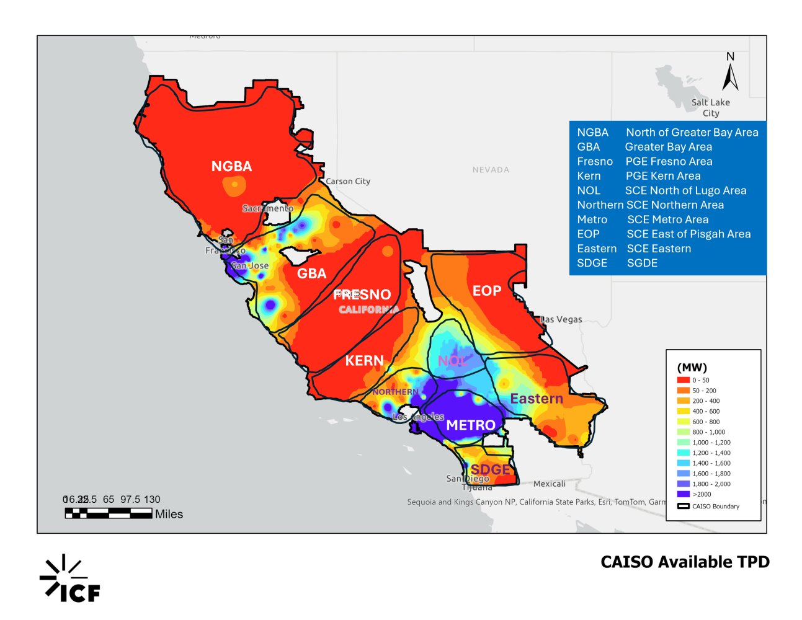
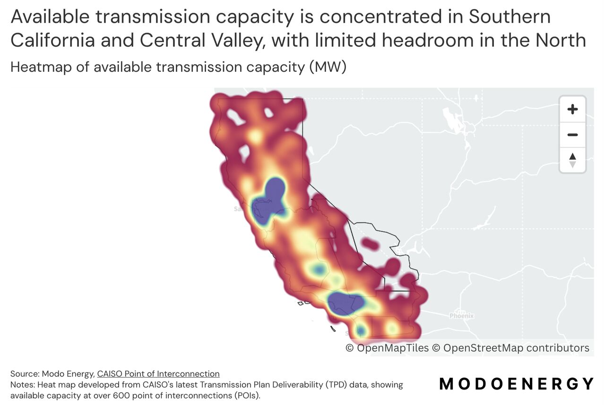
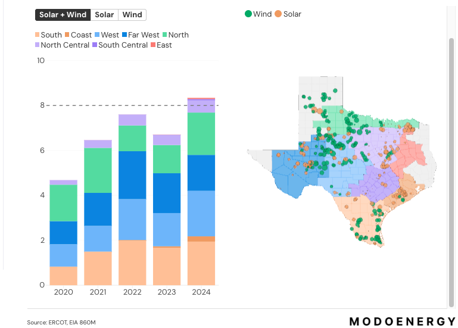
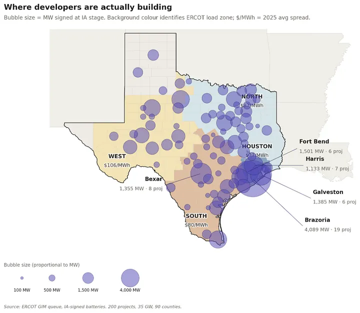

::: {.callout-note}
## Key takeaways
- Curtailment is growing in every major grid, even as storage expands
- Most of California's curtailment is a transmission problem, additional batteries likely won't improve the situation
- Sites where large loads co-locate with intermittent generators (wind, solar) are facing regulatory challenges since regulators want the ability to curtail the entire site capacity
- Targeted transmission investment (Texas CREZ, Germany's SuedLink) is the only solution proven to work at scale
:::

My interest in analyzing curtailment data came from my [analysis of battery storage](https://ashreeta.github.io/watts-on-my-mind/articles/caiso-ercot-storage/). Since higher curtailment means a bigger opportunity for batteries, I wanted to understand whether higher deployment of battery storage has had any measurable impact on curtailment. The short answer is yes, but it is not yet clearly visible in the data.

Curtailment occurs due to two distinct reasons. *Local curtailment* (also called congestion or reliability curtailment) occurs when a specific transmission line or substation is at its physical limit and interconnected generation cannot be exported regardless of conditions elsewhere on the grid. *System curtailment* (also called economic curtailment) occurs when total supply across the region exceeds consumer demand, driving wholesale prices to zero or below. System curtailment can be absorbed by batteries anywhere on the grid, while local curtailment needs solutions in the specific constrained area — co-located storage, substation upgrades, or more transmission capacity. Batteries respond primarily to price signals, but local curtailment is not necessarily price-driven. This is why the location where storage is sited and how markets price congestion determine whether storage can actually reduce curtailment.

## How much energy is being lost
Curtailment rates across major grids currently range from 3% to 8% of potential renewable output — modest percentages, but in absolute terms are in the scale of terawatt-hours. Figure 1 shows the scale and rates of curtailment across each region — both in absolute volume (GWh) and as a curtailment rate. ERCOT's 2025 curtailment of 9,800 GWh could power four large hyperscale data center campuses; California's 2025 curtailment — extrapolated from January–May actuals — would cover six.[^dc_scale]

```{=html}
<div data-widget style="font-family:'Inter',system-ui,sans-serif;font-size:0.82rem;line-height:1.5;margin:1.8rem 0;color:#222">
  <div style="margin-bottom:0.3rem;font-size:0.95rem;font-weight:600;color:#111">Figure 1: Wind + Solar Generation and Curtailment Rate</div>
  <div style="display:flex;gap:2px;margin-bottom:0.5rem;border-bottom:1px solid #e5e7eb">
    <button id="f1-btn-a" onclick="_wtab('f1','a')" style="padding:0.25rem 0.8rem;border:none;background:#1f78b4;color:white;font-size:0.78rem;cursor:pointer;border-radius:3px 3px 0 0;font-family:inherit">Volume (GWh)</button>
    <button id="f1-btn-b" onclick="_wtab('f1','b')" style="padding:0.25rem 0.8rem;border:none;background:#e8edf2;color:#555;font-size:0.78rem;cursor:pointer;border-radius:3px 3px 0 0;font-family:inherit">Rate (%)</button>
  </div>
  <div id="f1-tab-a"><svg class="main-svg" xmlns="http://www.w3.org/2000/svg" xmlns:xlink="http://www.w3.org/1999/xlink" width="1100" height="420" style="width:100%;height:auto;display:block" viewBox="0 0 1100 420"><rect x="0" y="0" width="1100" height="420" style="fill: rgb(255, 255, 255); fill-opacity: 1;"/><defs id="defs-c5a70e"><g class="clips"><clipPath id="clipc5a70exyplot" class="plotclip"><rect width="195.7225" height="296"/></clipPath><clipPath id="clipc5a70ex2y2plot" class="plotclip"><rect width="195.7225" height="296"/></clipPath><clipPath id="clipc5a70ex3y3plot" class="plotclip"><rect width="195.7225" height="296"/></clipPath><clipPath id="clipc5a70ex4y4plot" class="plotclip"><rect width="195.7225" height="296"/></clipPath><clipPath class="axesclip" id="clipc5a70ex"><rect x="88" y="0" width="195.7225" height="420"/></clipPath><clipPath class="axesclip" id="clipc5a70ey"><rect x="0" y="30" width="1100" height="296"/></clipPath><clipPath class="axesclip" id="clipc5a70exy"><rect x="88" y="30" width="195.7225" height="296"/></clipPath><clipPath class="axesclip" id="clipc5a70ey2"><rect x="0" y="30" width="1100" height="296"/></clipPath><clipPath class="axesclip" id="clipc5a70exy2"><rect x="88" y="30" width="195.7225" height="296"/></clipPath><clipPath class="axesclip" id="clipc5a70ey3"><rect x="0" y="30" width="1100" height="296"/></clipPath><clipPath class="axesclip" id="clipc5a70exy3"><rect x="88" y="30" width="195.7225" height="296"/></clipPath><clipPath class="axesclip" id="clipc5a70ey4"><rect x="0" y="30" width="1100" height="296"/></clipPath><clipPath class="axesclip" id="clipc5a70exy4"><rect x="88" y="30" width="195.7225" height="296"/></clipPath><clipPath class="axesclip" id="clipc5a70ex2"><rect x="353.09250000000003" y="0" width="195.7225" height="420"/></clipPath><clipPath class="axesclip" id="clipc5a70ex2y"><rect x="353.09250000000003" y="30" width="195.7225" height="296"/></clipPath><clipPath class="axesclip" id="clipc5a70ex2y2"><rect x="353.09250000000003" y="30" width="195.7225" height="296"/></clipPath><clipPath class="axesclip" id="clipc5a70ex2y3"><rect x="353.09250000000003" y="30" width="195.7225" height="296"/></clipPath><clipPath class="axesclip" id="clipc5a70ex2y4"><rect x="353.09250000000003" y="30" width="195.7225" height="296"/></clipPath><clipPath class="axesclip" id="clipc5a70ex3"><rect x="618.1850000000001" y="0" width="195.7225" height="420"/></clipPath><clipPath class="axesclip" id="clipc5a70ex3y"><rect x="618.1850000000001" y="30" width="195.7225" height="296"/></clipPath><clipPath class="axesclip" id="clipc5a70ex3y2"><rect x="618.1850000000001" y="30" width="195.7225" height="296"/></clipPath><clipPath class="axesclip" id="clipc5a70ex3y3"><rect x="618.1850000000001" y="30" width="195.7225" height="296"/></clipPath><clipPath class="axesclip" id="clipc5a70ex3y4"><rect x="618.1850000000001" y="30" width="195.7225" height="296"/></clipPath><clipPath class="axesclip" id="clipc5a70ex4"><rect x="883.2775" y="0" width="195.7225" height="420"/></clipPath><clipPath class="axesclip" id="clipc5a70ex4y"><rect x="883.2775" y="30" width="195.7225" height="296"/></clipPath><clipPath class="axesclip" id="clipc5a70ex4y2"><rect x="883.2775" y="30" width="195.7225" height="296"/></clipPath><clipPath class="axesclip" id="clipc5a70ex4y3"><rect x="883.2775" y="30" width="195.7225" height="296"/></clipPath><clipPath class="axesclip" id="clipc5a70ex4y4"><rect x="883.2775" y="30" width="195.7225" height="296"/></clipPath></g><g class="gradients"/><g class="patterns"/></defs><g class="bglayer"/><g class="layer-below"><g class="imagelayer"/><g class="shapelayer"/></g><g class="cartesianlayer"><g class="subplot xy"><g class="layer-subplot"><g class="shapelayer"/><g class="imagelayer"/></g><g class="minor-gridlayer"><g class="x"/><g class="y"/></g><g class="gridlayer"><g class="x"/><g class="y"><path class="ygrid crisp" transform="translate(0,261.98)" d="M88,0h195.7225" style="stroke: rgb(235, 240, 248); stroke-opacity: 1; stroke-width: 1px;"/><path class="ygrid crisp" transform="translate(0,197.96)" d="M88,0h195.7225" style="stroke: rgb(235, 240, 248); stroke-opacity: 1; stroke-width: 1px;"/><path class="ygrid crisp" transform="translate(0,133.93)" d="M88,0h195.7225" style="stroke: rgb(235, 240, 248); stroke-opacity: 1; stroke-width: 1px;"/><path class="ygrid crisp" transform="translate(0,69.91)" d="M88,0h195.7225" style="stroke: rgb(235, 240, 248); stroke-opacity: 1; stroke-width: 1px;"/></g></g><g class="zerolinelayer"><path class="yzl zl crisp" transform="translate(0,326)" d="M88,0h195.7225" style="stroke: rgb(235, 240, 248); stroke-opacity: 1; stroke-width: 2px;"/></g><g class="layer-between"><g class="shapelayer"/><g class="imagelayer"/></g><path class="xlines-below"/><path class="ylines-below"/><g class="overlines-below"/><g class="xaxislayer-below"/><g class="yaxislayer-below"/><g class="overaxes-below"/><g class="overplot"><g class="xy" transform="translate(88,30)" clip-path="url(#clipc5a70exyplot)"><g class="barlayer mlayer"><g class="trace bars" shape-rendering="crispEdges" style="opacity: 0.22;"><g class="points"><g class="point"><path d="M3.26,296V235.91H29.36V296Z" style="vector-effect: none; opacity: 1; stroke-width: 0.5px; fill: rgb(31, 120, 180); fill-opacity: 1; stroke: rgb(255, 255, 255); stroke-opacity: 1;"/></g><g class="point"><path d="M35.88,296V226.19H61.98V296Z" style="vector-effect: none; opacity: 1; stroke-width: 0.5px; fill: rgb(31, 120, 180); fill-opacity: 1; stroke: rgb(255, 255, 255); stroke-opacity: 1;"/></g><g class="point"><path d="M68.5,296V220.2H94.6V296Z" style="vector-effect: none; opacity: 1; stroke-width: 0.5px; fill: rgb(31, 120, 180); fill-opacity: 1; stroke: rgb(255, 255, 255); stroke-opacity: 1;"/></g><g class="point"><path d="M101.12,296V216.51H127.22V296Z" style="vector-effect: none; opacity: 1; stroke-width: 0.5px; fill: rgb(31, 120, 180); fill-opacity: 1; stroke: rgb(255, 255, 255); stroke-opacity: 1;"/></g><g class="point"><path d="M133.74,296V202.54H159.84V296Z" style="vector-effect: none; opacity: 1; stroke-width: 0.5px; fill: rgb(31, 120, 180); fill-opacity: 1; stroke: rgb(255, 255, 255); stroke-opacity: 1;"/></g><g class="point"><path d="M166.36,296V200.75H192.46V296Z" style="vector-effect: none; opacity: 1; stroke-width: 0.5px; fill: rgb(31, 120, 180); fill-opacity: 1; stroke: rgb(255, 255, 255); stroke-opacity: 1;"/></g></g></g><g class="trace bars" shape-rendering="crispEdges" style="opacity: 0.88;"><g class="points"><g class="point"><path d="M3.26,235.91V233.88H29.36V235.91Z" style="vector-effect: none; opacity: 1; stroke-width: 0.5px; fill: rgb(31, 120, 180); fill-opacity: 1; stroke: rgb(255, 255, 255); stroke-opacity: 1;"/></g><g class="point"><path d="M35.88,226.19V224.26H61.98V226.19Z" style="vector-effect: none; opacity: 1; stroke-width: 0.5px; fill: rgb(31, 120, 180); fill-opacity: 1; stroke: rgb(255, 255, 255); stroke-opacity: 1;"/></g><g class="point"><path d="M68.5,220.2V217.07H94.6V220.2Z" style="vector-effect: none; opacity: 1; stroke-width: 0.5px; fill: rgb(31, 120, 180); fill-opacity: 1; stroke: rgb(255, 255, 255); stroke-opacity: 1;"/></g><g class="point"><path d="M101.12,216.51V213.11H127.22V216.51Z" style="vector-effect: none; opacity: 1; stroke-width: 0.5px; fill: rgb(31, 120, 180); fill-opacity: 1; stroke: rgb(255, 255, 255); stroke-opacity: 1;"/></g><g class="point"><path d="M133.74,202.54V198.16H159.84V202.54Z" style="vector-effect: none; opacity: 1; stroke-width: 0.5px; fill: rgb(31, 120, 180); fill-opacity: 1; stroke: rgb(255, 255, 255); stroke-opacity: 1;"/></g><g class="point"><path d="M166.36,200.75V192.42H192.46V200.75Z" style="vector-effect: none; opacity: 1; stroke-width: 0.5px; fill: rgb(31, 120, 180); fill-opacity: 1; stroke: rgb(255, 255, 255); stroke-opacity: 1;"/></g></g></g></g></g></g><g class="zerolinelayer-above"/><path class="xlines-above crisp" d="M0,0" style="fill: none;"/><path class="ylines-above crisp" d="M0,0" style="fill: none;"/><g class="overlines-above"/><g class="xaxislayer-above"><g class="xtick"><text text-anchor="start" x="0" y="339" transform="translate(104.31,0) rotate(45,0,333)" style="font-family: 'Open Sans', verdana, arial, sans-serif; font-size: 12px; fill: rgb(42, 63, 95); fill-opacity: 1; white-space: pre;">2020</text></g><g class="xtick"><text text-anchor="start" x="0" y="339" style="font-family: 'Open Sans', verdana, arial, sans-serif; font-size: 12px; fill: rgb(42, 63, 95); fill-opacity: 1; white-space: pre;" transform="translate(136.93,0) rotate(45,0,333)">2021</text></g><g class="xtick"><text text-anchor="start" x="0" y="339" style="font-family: 'Open Sans', verdana, arial, sans-serif; font-size: 12px; fill: rgb(42, 63, 95); fill-opacity: 1; white-space: pre;" transform="translate(169.55,0) rotate(45,0,333)">2022</text></g><g class="xtick"><text text-anchor="start" x="0" y="339" style="font-family: 'Open Sans', verdana, arial, sans-serif; font-size: 12px; fill: rgb(42, 63, 95); fill-opacity: 1; white-space: pre;" transform="translate(202.17000000000002,0) rotate(45,0,333)">2023</text></g><g class="xtick"><text text-anchor="start" x="0" y="339" style="font-family: 'Open Sans', verdana, arial, sans-serif; font-size: 12px; fill: rgb(42, 63, 95); fill-opacity: 1; white-space: pre;" transform="translate(234.79,0) rotate(45,0,333)">2024</text></g><g class="xtick"><text text-anchor="start" x="0" y="339" style="font-family: 'Open Sans', verdana, arial, sans-serif; font-size: 12px; fill: rgb(42, 63, 95); fill-opacity: 1; white-space: pre;" transform="translate(267.40999999999997,0) rotate(45,0,333)">2025</text></g></g><g class="yaxislayer-above"><g class="ytick"><text text-anchor="end" x="87" y="4.199999999999999" transform="translate(0,326)" style="font-family: 'Open Sans', verdana, arial, sans-serif; font-size: 12px; fill: rgb(42, 63, 95); fill-opacity: 1; white-space: pre;">0</text></g><g class="ytick"><text text-anchor="end" x="87" y="4.199999999999999" style="font-family: 'Open Sans', verdana, arial, sans-serif; font-size: 12px; fill: rgb(42, 63, 95); fill-opacity: 1; white-space: pre;" transform="translate(0,261.98)">50,000</text></g><g class="ytick"><text text-anchor="end" x="87" y="4.199999999999999" style="font-family: 'Open Sans', verdana, arial, sans-serif; font-size: 12px; fill: rgb(42, 63, 95); fill-opacity: 1; white-space: pre;" transform="translate(0,197.96)">100,000</text></g><g class="ytick"><text text-anchor="end" x="87" y="4.199999999999999" style="font-family: 'Open Sans', verdana, arial, sans-serif; font-size: 12px; fill: rgb(42, 63, 95); fill-opacity: 1; white-space: pre;" transform="translate(0,133.93)">150,000</text></g><g class="ytick"><text text-anchor="end" x="87" y="4.199999999999999" style="font-family: 'Open Sans', verdana, arial, sans-serif; font-size: 12px; fill: rgb(42, 63, 95); fill-opacity: 1; white-space: pre;" transform="translate(0,69.91)">200,000</text></g></g><g class="overaxes-above"/></g><g class="subplot x2y2"><g class="layer-subplot"><g class="shapelayer"/><g class="imagelayer"/></g><g class="minor-gridlayer"><g class="x2"/><g class="y2"/></g><g class="gridlayer"><g class="x2"/><g class="y2"/></g><g class="zerolinelayer"><path class="y2zl zl crisp" transform="translate(0,326)" d="M353.09250000000003,0h195.7225" style="stroke: rgb(235, 240, 248); stroke-opacity: 1; stroke-width: 2px;"/></g><g class="layer-between"><g class="shapelayer"/><g class="imagelayer"/></g><path class="xlines-below"/><path class="ylines-below"/><g class="overlines-below"/><g class="xaxislayer-below"/><g class="yaxislayer-below"/><g class="overaxes-below"/><g class="overplot"><g class="x2y2" transform="translate(353.09250000000003,30)" clip-path="url(#clipc5a70ex2y2plot)"><g class="barlayer mlayer"><g class="trace bars" shape-rendering="crispEdges" style="opacity: 0.22;"><g class="points"><g class="point"><path d="M3.26,296V214.05H29.36V296Z" style="vector-effect: none; opacity: 1; stroke-width: 0.5px; fill: rgb(227, 26, 28); fill-opacity: 1; stroke: rgb(255, 255, 255); stroke-opacity: 1;"/></g><g class="point"><path d="M35.88,296V208.93H61.98V296Z" style="vector-effect: none; opacity: 1; stroke-width: 0.5px; fill: rgb(227, 26, 28); fill-opacity: 1; stroke: rgb(255, 255, 255); stroke-opacity: 1;"/></g><g class="point"><path d="M68.5,296V183.32H94.6V296Z" style="vector-effect: none; opacity: 1; stroke-width: 0.5px; fill: rgb(227, 26, 28); fill-opacity: 1; stroke: rgb(255, 255, 255); stroke-opacity: 1;"/></g><g class="point"><path d="M101.12,296V158.99H127.22V296Z" style="vector-effect: none; opacity: 1; stroke-width: 0.5px; fill: rgb(227, 26, 28); fill-opacity: 1; stroke: rgb(255, 255, 255); stroke-opacity: 1;"/></g><g class="point"><path d="M133.74,296V128.26H159.84V296Z" style="vector-effect: none; opacity: 1; stroke-width: 0.5px; fill: rgb(227, 26, 28); fill-opacity: 1; stroke: rgb(255, 255, 255); stroke-opacity: 1;"/></g><g class="point"><path d="M166.36,296V61.68H192.46V296Z" style="vector-effect: none; opacity: 1; stroke-width: 0.5px; fill: rgb(227, 26, 28); fill-opacity: 1; stroke: rgb(255, 255, 255); stroke-opacity: 1;"/></g></g></g><g class="trace bars" shape-rendering="crispEdges" style="opacity: 0.88;"><g class="points"><g class="point"><path d="M3.26,214.05V208.29H29.36V214.05Z" style="vector-effect: none; opacity: 1; stroke-width: 0.5px; fill: rgb(227, 26, 28); fill-opacity: 1; stroke: rgb(255, 255, 255); stroke-opacity: 1;"/></g><g class="point"><path d="M35.88,208.93V200.86H61.98V208.93Z" style="vector-effect: none; opacity: 1; stroke-width: 0.5px; fill: rgb(227, 26, 28); fill-opacity: 1; stroke: rgb(255, 255, 255); stroke-opacity: 1;"/></g><g class="point"><path d="M68.5,183.32V173.46H94.6V183.32Z" style="vector-effect: none; opacity: 1; stroke-width: 0.5px; fill: rgb(227, 26, 28); fill-opacity: 1; stroke: rgb(255, 255, 255); stroke-opacity: 1;"/></g><g class="point"><path d="M101.12,158.99V150.93H127.22V158.99Z" style="vector-effect: none; opacity: 1; stroke-width: 0.5px; fill: rgb(227, 26, 28); fill-opacity: 1; stroke: rgb(255, 255, 255); stroke-opacity: 1;"/></g><g class="point"><path d="M133.74,128.26V117.76H159.84V128.26Z" style="vector-effect: none; opacity: 1; stroke-width: 0.5px; fill: rgb(227, 26, 28); fill-opacity: 1; stroke: rgb(255, 255, 255); stroke-opacity: 1;"/></g><g class="point"><path d="M166.36,61.68V49.13H192.46V61.68Z" style="vector-effect: none; opacity: 1; stroke-width: 0.5px; fill: rgb(227, 26, 28); fill-opacity: 1; stroke: rgb(255, 255, 255); stroke-opacity: 1;"/></g></g></g></g></g></g><g class="zerolinelayer-above"/><path class="xlines-above crisp" d="M0,0" style="fill: none;"/><path class="ylines-above crisp" d="M0,0" style="fill: none;"/><g class="overlines-above"/><g class="xaxislayer-above"><g class="x2tick"><text text-anchor="start" x="0" y="339" transform="translate(369.40250000000003,0) rotate(45,0,333)" style="font-family: 'Open Sans', verdana, arial, sans-serif; font-size: 12px; fill: rgb(42, 63, 95); fill-opacity: 1; white-space: pre;">2020</text></g><g class="x2tick"><text text-anchor="start" x="0" y="339" style="font-family: 'Open Sans', verdana, arial, sans-serif; font-size: 12px; fill: rgb(42, 63, 95); fill-opacity: 1; white-space: pre;" transform="translate(402.02250000000004,0) rotate(45,0,333)">2021</text></g><g class="x2tick"><text text-anchor="start" x="0" y="339" style="font-family: 'Open Sans', verdana, arial, sans-serif; font-size: 12px; fill: rgb(42, 63, 95); fill-opacity: 1; white-space: pre;" transform="translate(434.64250000000004,0) rotate(45,0,333)">2022</text></g><g class="x2tick"><text text-anchor="start" x="0" y="339" style="font-family: 'Open Sans', verdana, arial, sans-serif; font-size: 12px; fill: rgb(42, 63, 95); fill-opacity: 1; white-space: pre;" transform="translate(467.26250000000005,0) rotate(45,0,333)">2023</text></g><g class="x2tick"><text text-anchor="start" x="0" y="339" style="font-family: 'Open Sans', verdana, arial, sans-serif; font-size: 12px; fill: rgb(42, 63, 95); fill-opacity: 1; white-space: pre;" transform="translate(499.88250000000005,0) rotate(45,0,333)">2024</text></g><g class="x2tick"><text text-anchor="start" x="0" y="339" style="font-family: 'Open Sans', verdana, arial, sans-serif; font-size: 12px; fill: rgb(42, 63, 95); fill-opacity: 1; white-space: pre;" transform="translate(532.5025,0) rotate(45,0,333)">2025</text></g></g><g class="yaxislayer-above"/><g class="overaxes-above"/></g><g class="subplot x3y3"><g class="layer-subplot"><g class="shapelayer"/><g class="imagelayer"/></g><g class="minor-gridlayer"><g class="x3"/><g class="y3"/></g><g class="gridlayer"><g class="x3"/><g class="y3"/></g><g class="zerolinelayer"><path class="y3zl zl crisp" transform="translate(0,326)" d="M618.1850000000001,0h195.7225" style="stroke: rgb(235, 240, 248); stroke-opacity: 1; stroke-width: 2px;"/></g><g class="layer-between"><g class="shapelayer"/><g class="imagelayer"/></g><path class="xlines-below"/><path class="ylines-below"/><g class="overlines-below"/><g class="xaxislayer-below"/><g class="yaxislayer-below"/><g class="overaxes-below"/><g class="overplot"><g class="x3y3" transform="translate(618.1850000000001,30)" clip-path="url(#clipc5a70ex3y3plot)"><g class="barlayer mlayer"><g class="trace bars" shape-rendering="crispEdges" style="opacity: 0.22;"><g class="points"><g class="point"><path d="M3.26,296V70.96H29.36V296Z" style="vector-effect: none; opacity: 1; stroke-width: 0.5px; fill: rgb(106, 61, 154); fill-opacity: 1; stroke: rgb(255, 255, 255); stroke-opacity: 1;"/></g><g class="point"><path d="M35.88,296V91.38H61.98V296Z" style="vector-effect: none; opacity: 1; stroke-width: 0.5px; fill: rgb(106, 61, 154); fill-opacity: 1; stroke: rgb(255, 255, 255); stroke-opacity: 1;"/></g><g class="point"><path d="M68.5,296V63.65H94.6V296Z" style="vector-effect: none; opacity: 1; stroke-width: 0.5px; fill: rgb(106, 61, 154); fill-opacity: 1; stroke: rgb(255, 255, 255); stroke-opacity: 1;"/></g><g class="point"><path d="M101.12,296V42.38H127.22V296Z" style="vector-effect: none; opacity: 1; stroke-width: 0.5px; fill: rgb(106, 61, 154); fill-opacity: 1; stroke: rgb(255, 255, 255); stroke-opacity: 1;"/></g><g class="point"><path d="M133.74,296V38.15H159.84V296Z" style="vector-effect: none; opacity: 1; stroke-width: 0.5px; fill: rgb(106, 61, 154); fill-opacity: 1; stroke: rgb(255, 255, 255); stroke-opacity: 1;"/></g><g class="point"><path d="M166.36,296V31.27H192.46V296Z" style="vector-effect: none; opacity: 1; stroke-width: 0.5px; fill: rgb(106, 61, 154); fill-opacity: 1; stroke: rgb(255, 255, 255); stroke-opacity: 1;"/></g></g></g><g class="trace bars" shape-rendering="crispEdges" style="opacity: 0.88;"><g class="points"><g class="point"><path d="M3.26,70.96V62.32H29.36V70.96Z" style="vector-effect: none; opacity: 1; stroke-width: 0.5px; fill: rgb(106, 61, 154); fill-opacity: 1; stroke: rgb(255, 255, 255); stroke-opacity: 1;"/></g><g class="point"><path d="M35.88,91.38V85.28H61.98V91.38Z" style="vector-effect: none; opacity: 1; stroke-width: 0.5px; fill: rgb(106, 61, 154); fill-opacity: 1; stroke: rgb(255, 255, 255); stroke-opacity: 1;"/></g><g class="point"><path d="M68.5,63.65V53.41H94.6V63.65Z" style="vector-effect: none; opacity: 1; stroke-width: 0.5px; fill: rgb(106, 61, 154); fill-opacity: 1; stroke: rgb(255, 255, 255); stroke-opacity: 1;"/></g><g class="point"><path d="M101.12,42.38V29.06H127.22V42.38Z" style="vector-effect: none; opacity: 1; stroke-width: 0.5px; fill: rgb(106, 61, 154); fill-opacity: 1; stroke: rgb(255, 255, 255); stroke-opacity: 1;"/></g><g class="point"><path d="M133.74,38.15V26.2H159.84V38.15Z" style="vector-effect: none; opacity: 1; stroke-width: 0.5px; fill: rgb(106, 61, 154); fill-opacity: 1; stroke: rgb(255, 255, 255); stroke-opacity: 1;"/></g><g class="point"><path d="M166.36,31.27V21.93H192.46V31.27Z" style="vector-effect: none; opacity: 1; stroke-width: 0.5px; fill: rgb(106, 61, 154); fill-opacity: 1; stroke: rgb(255, 255, 255); stroke-opacity: 1;"/></g></g></g></g></g></g><g class="zerolinelayer-above"/><path class="xlines-above crisp" d="M0,0" style="fill: none;"/><path class="ylines-above crisp" d="M0,0" style="fill: none;"/><g class="overlines-above"/><g class="xaxislayer-above"><g class="x3tick"><text text-anchor="start" x="0" y="339" transform="translate(634.495,0) rotate(45,0,333)" style="font-family: 'Open Sans', verdana, arial, sans-serif; font-size: 12px; fill: rgb(42, 63, 95); fill-opacity: 1; white-space: pre;">2020</text></g><g class="x3tick"><text text-anchor="start" x="0" y="339" style="font-family: 'Open Sans', verdana, arial, sans-serif; font-size: 12px; fill: rgb(42, 63, 95); fill-opacity: 1; white-space: pre;" transform="translate(667.115,0) rotate(45,0,333)">2021</text></g><g class="x3tick"><text text-anchor="start" x="0" y="339" style="font-family: 'Open Sans', verdana, arial, sans-serif; font-size: 12px; fill: rgb(42, 63, 95); fill-opacity: 1; white-space: pre;" transform="translate(699.735,0) rotate(45,0,333)">2022</text></g><g class="x3tick"><text text-anchor="start" x="0" y="339" style="font-family: 'Open Sans', verdana, arial, sans-serif; font-size: 12px; fill: rgb(42, 63, 95); fill-opacity: 1; white-space: pre;" transform="translate(732.355,0) rotate(45,0,333)">2023</text></g><g class="x3tick"><text text-anchor="start" x="0" y="339" style="font-family: 'Open Sans', verdana, arial, sans-serif; font-size: 12px; fill: rgb(42, 63, 95); fill-opacity: 1; white-space: pre;" transform="translate(764.975,0) rotate(45,0,333)">2024</text></g><g class="x3tick"><text text-anchor="start" x="0" y="339" style="font-family: 'Open Sans', verdana, arial, sans-serif; font-size: 12px; fill: rgb(42, 63, 95); fill-opacity: 1; white-space: pre;" transform="translate(797.595,0) rotate(45,0,333)">2025</text></g></g><g class="yaxislayer-above"/><g class="overaxes-above"/></g><g class="subplot x4y4"><g class="layer-subplot"><g class="shapelayer"/><g class="imagelayer"/></g><g class="minor-gridlayer"><g class="x4"/><g class="y4"/></g><g class="gridlayer"><g class="x4"/><g class="y4"/></g><g class="zerolinelayer"><path class="y4zl zl crisp" transform="translate(0,326)" d="M883.2775,0h195.7225" style="stroke: rgb(235, 240, 248); stroke-opacity: 1; stroke-width: 2px;"/></g><g class="layer-between"><g class="shapelayer"/><g class="imagelayer"/></g><path class="xlines-below"/><path class="ylines-below"/><g class="overlines-below"/><g class="xaxislayer-below"/><g class="yaxislayer-below"/><g class="overaxes-below"/><g class="overplot"><g class="x4y4" transform="translate(883.2775,30)" clip-path="url(#clipc5a70ex4y4plot)"><g class="barlayer mlayer"><g class="trace bars" shape-rendering="crispEdges" style="opacity: 0.22;"><g class="points"><g class="point"><path d="M3.26,296V267.83H29.36V296Z" style="vector-effect: none; opacity: 1; stroke-width: 0.5px; fill: rgb(255, 127, 0); fill-opacity: 1; stroke: rgb(255, 255, 255); stroke-opacity: 1;"/></g><g class="point"><path d="M35.88,296V260.15H61.98V296Z" style="vector-effect: none; opacity: 1; stroke-width: 0.5px; fill: rgb(255, 127, 0); fill-opacity: 1; stroke: rgb(255, 255, 255); stroke-opacity: 1;"/></g><g class="point"><path d="M68.5,296V248.62H94.6V296Z" style="vector-effect: none; opacity: 1; stroke-width: 0.5px; fill: rgb(255, 127, 0); fill-opacity: 1; stroke: rgb(255, 255, 255); stroke-opacity: 1;"/></g><g class="point"><path d="M101.12,296V233.26H127.22V296Z" style="vector-effect: none; opacity: 1; stroke-width: 0.5px; fill: rgb(255, 127, 0); fill-opacity: 1; stroke: rgb(255, 255, 255); stroke-opacity: 1;"/></g><g class="point"><path d="M133.74,296V221.73H159.84V296Z" style="vector-effect: none; opacity: 1; stroke-width: 0.5px; fill: rgb(255, 127, 0); fill-opacity: 1; stroke: rgb(255, 255, 255); stroke-opacity: 1;"/></g><g class="point"><path d="M166.36,296V205.09H192.46V296Z" style="vector-effect: none; opacity: 1; stroke-width: 0.5px; fill: rgb(255, 127, 0); fill-opacity: 1; stroke: rgb(255, 255, 255); stroke-opacity: 1;"/></g></g></g><g class="trace bars" shape-rendering="crispEdges" style="opacity: 0.88;"><g class="points"><g class="point"><path d="M3.26,267.83V266.81H29.36V267.83Z" style="vector-effect: none; opacity: 1; stroke-width: 0.5px; fill: rgb(255, 127, 0); fill-opacity: 1; stroke: rgb(255, 255, 255); stroke-opacity: 1;"/></g><g class="point"><path d="M35.88,260.15V258.61H61.98V260.15Z" style="vector-effect: none; opacity: 1; stroke-width: 0.5px; fill: rgb(255, 127, 0); fill-opacity: 1; stroke: rgb(255, 255, 255); stroke-opacity: 1;"/></g><g class="point"><path d="M68.5,248.62V246.45H94.6V248.62Z" style="vector-effect: none; opacity: 1; stroke-width: 0.5px; fill: rgb(255, 127, 0); fill-opacity: 1; stroke: rgb(255, 255, 255); stroke-opacity: 1;"/></g><g class="point"><path d="M101.12,233.26V230.44H127.22V233.26Z" style="vector-effect: none; opacity: 1; stroke-width: 0.5px; fill: rgb(255, 127, 0); fill-opacity: 1; stroke: rgb(255, 255, 255); stroke-opacity: 1;"/></g><g class="point"><path d="M133.74,221.73V217.76H159.84V221.73Z" style="vector-effect: none; opacity: 1; stroke-width: 0.5px; fill: rgb(255, 127, 0); fill-opacity: 1; stroke: rgb(255, 255, 255); stroke-opacity: 1;"/></g><g class="point"><path d="M166.36,205.09V196.51H192.46V205.09Z" style="vector-effect: none; opacity: 1; stroke-width: 0.5px; fill: rgb(255, 127, 0); fill-opacity: 1; stroke: rgb(255, 255, 255); stroke-opacity: 1;"/></g></g></g></g></g></g><g class="zerolinelayer-above"/><path class="xlines-above crisp" d="M0,0" style="fill: none;"/><path class="ylines-above crisp" d="M0,0" style="fill: none;"/><g class="overlines-above"/><g class="xaxislayer-above"><g class="x4tick"><text text-anchor="start" x="0" y="339" transform="translate(899.5875,0) rotate(45,0,333)" style="font-family: 'Open Sans', verdana, arial, sans-serif; font-size: 12px; fill: rgb(42, 63, 95); fill-opacity: 1; white-space: pre;">2020</text></g><g class="x4tick"><text text-anchor="start" x="0" y="339" style="font-family: 'Open Sans', verdana, arial, sans-serif; font-size: 12px; fill: rgb(42, 63, 95); fill-opacity: 1; white-space: pre;" transform="translate(932.2075,0) rotate(45,0,333)">2021</text></g><g class="x4tick"><text text-anchor="start" x="0" y="339" style="font-family: 'Open Sans', verdana, arial, sans-serif; font-size: 12px; fill: rgb(42, 63, 95); fill-opacity: 1; white-space: pre;" transform="translate(964.8275,0) rotate(45,0,333)">2022</text></g><g class="x4tick"><text text-anchor="start" x="0" y="339" style="font-family: 'Open Sans', verdana, arial, sans-serif; font-size: 12px; fill: rgb(42, 63, 95); fill-opacity: 1; white-space: pre;" transform="translate(997.4475,0) rotate(45,0,333)">2023</text></g><g class="x4tick"><text text-anchor="start" x="0" y="339" style="font-family: 'Open Sans', verdana, arial, sans-serif; font-size: 12px; fill: rgb(42, 63, 95); fill-opacity: 1; white-space: pre;" transform="translate(1030.0675,0) rotate(45,0,333)">2024</text></g><g class="x4tick"><text text-anchor="start" x="0" y="339" style="font-family: 'Open Sans', verdana, arial, sans-serif; font-size: 12px; fill: rgb(42, 63, 95); fill-opacity: 1; white-space: pre;" transform="translate(1062.6875,0) rotate(45,0,333)">2025</text></g></g><g class="yaxislayer-above"/><g class="overaxes-above"/></g></g><g class="polarlayer"/><g class="smithlayer"/><g class="ternarylayer"/><g class="geolayer"/><g class="funnelarealayer"/><g class="pielayer"/><g class="iciclelayer"/><g class="treemaplayer"/><g class="sunburstlayer"/><g class="glimages"/><defs id="topdefs-c5a70e"><g class="clips"/><clipPath id="legendc5a70e"><rect width="202" height="29" x="0" y="0"/></clipPath></defs><g class="layer-above"><g class="imagelayer"/><g class="shapelayer"/></g><g class="infolayer"><g class="legend" pointer-events="all" transform="translate(482.5,379.28)"><rect class="bg" shape-rendering="crispEdges" style="stroke: rgb(68, 68, 68); stroke-opacity: 1; fill: rgb(255, 255, 255); fill-opacity: 1; stroke-width: 0px;" width="202" height="29" x="0" y="0"/><g class="scrollbox" transform="" clip-path="url(#legendc5a70e)"><g class="groups" transform=""><g class="traces" transform="translate(0,14.5)" style="opacity: 1;"><text class="legendtext" text-anchor="start" x="40" y="4.680000000000001" style="font-family: 'Open Sans', verdana, arial, sans-serif; font-size: 12px; fill: rgb(42, 63, 95); fill-opacity: 1; white-space: pre;">Delivered</text><g class="layers" style="opacity: 0.22;"><g class="legendfill"/><g class="legendlines"/><g class="legendsymbols"><g class="legendpoints"><path class="legendundefined" d="M6,6H-6V-6H6Z" transform="translate(20,0)" style="stroke-width: 0.5px; fill: rgb(31, 120, 180); fill-opacity: 1; stroke: rgb(255, 255, 255); stroke-opacity: 1;"/></g></g></g><rect class="legendtoggle" x="0" y="-9.5" width="99.375" height="19" style="fill: rgb(0, 0, 0); fill-opacity: 0;"/></g></g><g class="groups" transform="translate(101.875,0)"><g class="traces" transform="translate(0,14.5)" style="opacity: 1;"><text class="legendtext" text-anchor="start" x="40" y="4.680000000000001" style="font-family: 'Open Sans', verdana, arial, sans-serif; font-size: 12px; fill: rgb(42, 63, 95); fill-opacity: 1; white-space: pre;">Curtailed</text><g class="layers" style="opacity: 0.88;"><g class="legendfill"/><g class="legendlines"/><g class="legendsymbols"><g class="legendpoints"><path class="legendundefined" d="M6,6H-6V-6H6Z" transform="translate(20,0)" style="stroke-width: 0.5px; fill: rgb(31, 120, 180); fill-opacity: 1; stroke: rgb(255, 255, 255); stroke-opacity: 1;"/></g></g></g><rect class="legendtoggle" x="0" y="-9.5" width="96.75" height="19" style="fill: rgb(0, 0, 0); fill-opacity: 0;"/></g></g></g><rect class="scrollbar" rx="20" ry="3" width="0" height="0" style="fill: rgb(128, 139, 164); fill-opacity: 1;" x="0" y="0"/></g><g class="g-gtitle"/><g class="g-xtitle"/><g class="g-x2title"/><g class="g-x3title"/><g class="g-x4title"/><g class="g-ytitle"><text class="ytitle" transform="rotate(-90,17.459374999999994,178)" x="17.459374999999994" y="178" text-anchor="middle" style="opacity: 1; font-family: 'Open Sans', verdana, arial, sans-serif; font-size: 14px; fill: rgb(42, 63, 95); fill-opacity: 1; white-space: pre;">GWh</text></g><g class="g-y2title"/><g class="g-y3title"/><g class="g-y4title"/><g class="annotation" data-index="0" style="opacity: 1;"><g class="annotation-text-g" transform="rotate(0,185.86124999999998,18.5)"><g class="cursor-pointer" transform="translate(158,7)"><rect class="bg" x="0.5" y="0.5" width="55" height="22" style="stroke-width: 1px; stroke: rgb(0, 0, 0); stroke-opacity: 0; fill: rgb(0, 0, 0); fill-opacity: 0;"/><text class="annotation-text" text-anchor="middle" x="28.1875" y="18" style="font-family: 'Open Sans', verdana, arial, sans-serif; font-size: 16px; fill: rgb(42, 63, 95); fill-opacity: 1; white-space: pre;">CAISO</text></g></g></g><g class="annotation" data-index="1" style="opacity: 1;"><g class="annotation-text-g" transform="rotate(0,450.95375,18.5)"><g class="cursor-pointer" transform="translate(414,7)"><rect class="bg" x="0.5" y="0.5" width="73" height="22" style="stroke-width: 1px; stroke: rgb(0, 0, 0); stroke-opacity: 0; fill: rgb(0, 0, 0); fill-opacity: 0;"/><text class="annotation-text" text-anchor="middle" x="37.140625" y="18" style="font-family: 'Open Sans', verdana, arial, sans-serif; font-size: 16px; fill: rgb(42, 63, 95); fill-opacity: 1; white-space: pre;">ERCOT ‡</text></g></g></g><g class="annotation" data-index="2" style="opacity: 1;"><g class="annotation-text-g" transform="rotate(0,716.04625,18.499999999999996)"><g class="cursor-pointer" transform="translate(670,7)"><rect class="bg" x="0.5" y="0.5" width="92" height="22" style="stroke-width: 1px; stroke: rgb(0, 0, 0); stroke-opacity: 0; fill: rgb(0, 0, 0); fill-opacity: 0;"/><text class="annotation-text" text-anchor="middle" x="46.5859375" y="18" style="font-family: 'Open Sans', verdana, arial, sans-serif; font-size: 16px; fill: rgb(42, 63, 95); fill-opacity: 1; white-space: pre;">Germany ‡</text></g></g></g><g class="annotation" data-index="3" style="opacity: 1;"><g class="annotation-text-g" transform="rotate(0,981.13875,18.5)"><g class="cursor-pointer" transform="translate(957,7)"><rect class="bg" x="0.5" y="0.5" width="48" height="22" style="stroke-width: 1px; stroke: rgb(0, 0, 0); stroke-opacity: 0; fill: rgb(0, 0, 0); fill-opacity: 0;"/><text class="annotation-text" text-anchor="middle" x="24.5625" y="18" style="font-family: 'Open Sans', verdana, arial, sans-serif; font-size: 16px; fill: rgb(42, 63, 95); fill-opacity: 1; white-space: pre;">Aus ‡</text></g></g></g></g></svg></div>
  <div id="f1-tab-b" style="display:none"><svg class="main-svg" xmlns="http://www.w3.org/2000/svg" xmlns:xlink="http://www.w3.org/1999/xlink" width="820" height="400" style="width:100%;height:auto;display:block" viewBox="0 0 820 400"><rect x="0" y="0" width="820" height="400" style="fill: rgb(255, 255, 255); fill-opacity: 1;"/><defs id="defs-268c0e"><g class="clips"><clipPath id="clip268c0exyplot" class="plotclip"><rect width="590" height="287"/></clipPath><clipPath class="axesclip" id="clip268c0ex"><rect x="70" y="0" width="590" height="400"/></clipPath><clipPath class="axesclip" id="clip268c0ey"><rect x="0" y="20" width="820" height="287"/></clipPath><clipPath class="axesclip" id="clip268c0exy"><rect x="70" y="20" width="590" height="287"/></clipPath></g><g class="gradients"/><g class="patterns"/></defs><g class="bglayer"/><g class="layer-below"><g class="imagelayer"/><g class="shapelayer"/></g><g class="cartesianlayer"><g class="subplot xy"><g class="layer-subplot"><g class="shapelayer"/><g class="imagelayer"/></g><g class="minor-gridlayer"><g class="x"/><g class="y"/></g><g class="gridlayer"><g class="x"><path class="xgrid crisp" transform="translate(104.5,0)" d="M0,20v287" style="stroke: rgb(235, 240, 248); stroke-opacity: 1; stroke-width: 1px;"/><path class="xgrid crisp" transform="translate(197.4,0)" d="M0,20v287" style="stroke: rgb(235, 240, 248); stroke-opacity: 1; stroke-width: 1px;"/><path class="xgrid crisp" transform="translate(290.3,0)" d="M0,20v287" style="stroke: rgb(235, 240, 248); stroke-opacity: 1; stroke-width: 1px;"/><path class="xgrid crisp" transform="translate(383.2,0)" d="M0,20v287" style="stroke: rgb(235, 240, 248); stroke-opacity: 1; stroke-width: 1px;"/><path class="xgrid crisp" transform="translate(476.1,0)" d="M0,20v287" style="stroke: rgb(235, 240, 248); stroke-opacity: 1; stroke-width: 1px;"/><path class="xgrid crisp" transform="translate(569,0)" d="M0,20v287" style="stroke: rgb(235, 240, 248); stroke-opacity: 1; stroke-width: 1px;"/></g><g class="y"><path class="ygrid crisp" transform="translate(0,244.92)" d="M70,0h590" style="stroke: rgb(235, 240, 248); stroke-opacity: 1; stroke-width: 1px;"/><path class="ygrid crisp" transform="translate(0,182.84)" d="M70,0h590" style="stroke: rgb(235, 240, 248); stroke-opacity: 1; stroke-width: 1px;"/><path class="ygrid crisp" transform="translate(0,120.76)" d="M70,0h590" style="stroke: rgb(235, 240, 248); stroke-opacity: 1; stroke-width: 1px;"/><path class="ygrid crisp" transform="translate(0,58.68)" d="M70,0h590" style="stroke: rgb(235, 240, 248); stroke-opacity: 1; stroke-width: 1px;"/></g></g><g class="zerolinelayer"><path class="yzl zl crisp" transform="translate(0,307)" d="M70,0h590" style="stroke: rgb(235, 240, 248); stroke-opacity: 1; stroke-width: 2px;"/></g><g class="layer-between"><g class="shapelayer"/><g class="imagelayer"/></g><path class="xlines-below"/><path class="ylines-below"/><g class="overlines-below"/><g class="xaxislayer-below"/><g class="yaxislayer-below"/><g class="overaxes-below"/><g class="overplot"><g class="xy" transform="translate(70,20)" clip-path="url(#clip268c0exyplot)"><g class="scatterlayer mlayer"><g class="trace scatter trace17d8a8" style="stroke-miterlimit: 2; opacity: 1;"><g class="fills"/><g class="errorbars"/><g class="lines"><path class="js-line" d="M34.5,185.43L127.4,203.63L220.3,163.68L313.2,159.48L406.1,147.94L499,37.31" style="vector-effect: none; fill: none; stroke: rgb(31, 120, 180); stroke-opacity: 1; stroke-width: 2.5px; opacity: 1;"/></g><g class="points"><path class="point" transform="translate(34.5,185.43)" d="M4,0A4,4 0 1,1 0,-4A4,4 0 0,1 4,0Z" style="opacity: 1; stroke-width: 1.5px; fill: rgb(31, 120, 180); fill-opacity: 1; stroke: rgb(255, 255, 255); stroke-opacity: 1;"/><path class="point" transform="translate(127.4,203.63)" d="M4,0A4,4 0 1,1 0,-4A4,4 0 0,1 4,0Z" style="opacity: 1; stroke-width: 1.5px; fill: rgb(31, 120, 180); fill-opacity: 1; stroke: rgb(255, 255, 255); stroke-opacity: 1;"/><path class="point" transform="translate(220.3,163.68)" d="M4,0A4,4 0 1,1 0,-4A4,4 0 0,1 4,0Z" style="opacity: 1; stroke-width: 1.5px; fill: rgb(31, 120, 180); fill-opacity: 1; stroke: rgb(255, 255, 255); stroke-opacity: 1;"/><path class="point" transform="translate(313.2,159.48)" d="M4,0A4,4 0 1,1 0,-4A4,4 0 0,1 4,0Z" style="opacity: 1; stroke-width: 1.5px; fill: rgb(31, 120, 180); fill-opacity: 1; stroke: rgb(255, 255, 255); stroke-opacity: 1;"/><path class="point" transform="translate(406.1,147.94)" d="M4,0A4,4 0 1,1 0,-4A4,4 0 0,1 4,0Z" style="opacity: 1; stroke-width: 1.5px; fill: rgb(31, 120, 180); fill-opacity: 1; stroke: rgb(255, 255, 255); stroke-opacity: 1;"/><path class="point" transform="translate(499,37.31)" d="M4,0A4,4 0 1,1 0,-4A4,4 0 0,1 4,0Z" style="opacity: 1; stroke-width: 1.5px; fill: rgb(31, 120, 180); fill-opacity: 1; stroke: rgb(255, 255, 255); stroke-opacity: 1;"/></g><g class="text"/></g><g class="trace scatter trace92b222" style="stroke-miterlimit: 2; opacity: 0.65;"><g class="fills"/><g class="errorbars"/><g class="lines"><path class="js-line" d="M34.5,83.09L127.4,23.81L220.3,37.26L313.2,114.41L406.1,104.15L499,129.23" style="vector-effect: none; fill: none; stroke: rgb(227, 26, 28); stroke-opacity: 1; stroke-dasharray: 3px, 3px; stroke-width: 2.5px; opacity: 1;"/></g><g class="points"><path class="point" transform="translate(34.5,83.09)" d="M4,0A4,4 0 1,1 0,-4A4,4 0 0,1 4,0Z" style="opacity: 1; stroke-width: 1.5px; fill: rgb(227, 26, 28); fill-opacity: 1; stroke: rgb(255, 255, 255); stroke-opacity: 1;"/><path class="point" transform="translate(127.4,23.81)" d="M4,0A4,4 0 1,1 0,-4A4,4 0 0,1 4,0Z" style="opacity: 1; stroke-width: 1.5px; fill: rgb(227, 26, 28); fill-opacity: 1; stroke: rgb(255, 255, 255); stroke-opacity: 1;"/><path class="point" transform="translate(220.3,37.26)" d="M4,0A4,4 0 1,1 0,-4A4,4 0 0,1 4,0Z" style="opacity: 1; stroke-width: 1.5px; fill: rgb(227, 26, 28); fill-opacity: 1; stroke: rgb(255, 255, 255); stroke-opacity: 1;"/><path class="point" transform="translate(313.2,114.41)" d="M4,0A4,4 0 1,1 0,-4A4,4 0 0,1 4,0Z" style="opacity: 1; stroke-width: 1.5px; fill: rgb(227, 26, 28); fill-opacity: 1; stroke: rgb(255, 255, 255); stroke-opacity: 1;"/><path class="point" transform="translate(406.1,104.15)" d="M4,0A4,4 0 1,1 0,-4A4,4 0 0,1 4,0Z" style="opacity: 1; stroke-width: 1.5px; fill: rgb(227, 26, 28); fill-opacity: 1; stroke: rgb(255, 255, 255); stroke-opacity: 1;"/><path class="point" transform="translate(499,129.23)" d="M4,0A4,4 0 1,1 0,-4A4,4 0 0,1 4,0Z" style="opacity: 1; stroke-width: 1.5px; fill: rgb(227, 26, 28); fill-opacity: 1; stroke: rgb(255, 255, 255); stroke-opacity: 1;"/></g><g class="text"/></g><g class="trace scatter traceb1fb6d" style="stroke-miterlimit: 2; opacity: 0.65;"><g class="fills"/><g class="errorbars"/><g class="lines"><path class="js-line" d="M34.5,172.28L127.4,197.15L220.3,155.94L313.2,132.15L406.1,149.49L499,181.14" style="vector-effect: none; fill: none; stroke: rgb(106, 61, 154); stroke-opacity: 1; stroke-dasharray: 3px, 3px; stroke-width: 2.5px; opacity: 1;"/></g><g class="points"><path class="point" transform="translate(34.5,172.28)" d="M4,0A4,4 0 1,1 0,-4A4,4 0 0,1 4,0Z" style="opacity: 1; stroke-width: 1.5px; fill: rgb(106, 61, 154); fill-opacity: 1; stroke: rgb(255, 255, 255); stroke-opacity: 1;"/><path class="point" transform="translate(127.4,197.15)" d="M4,0A4,4 0 1,1 0,-4A4,4 0 0,1 4,0Z" style="opacity: 1; stroke-width: 1.5px; fill: rgb(106, 61, 154); fill-opacity: 1; stroke: rgb(255, 255, 255); stroke-opacity: 1;"/><path class="point" transform="translate(220.3,155.94)" d="M4,0A4,4 0 1,1 0,-4A4,4 0 0,1 4,0Z" style="opacity: 1; stroke-width: 1.5px; fill: rgb(106, 61, 154); fill-opacity: 1; stroke: rgb(255, 255, 255); stroke-opacity: 1;"/><path class="point" transform="translate(313.2,132.15)" d="M4,0A4,4 0 1,1 0,-4A4,4 0 0,1 4,0Z" style="opacity: 1; stroke-width: 1.5px; fill: rgb(106, 61, 154); fill-opacity: 1; stroke: rgb(255, 255, 255); stroke-opacity: 1;"/><path class="point" transform="translate(406.1,149.49)" d="M4,0A4,4 0 1,1 0,-4A4,4 0 0,1 4,0Z" style="opacity: 1; stroke-width: 1.5px; fill: rgb(106, 61, 154); fill-opacity: 1; stroke: rgb(255, 255, 255); stroke-opacity: 1;"/><path class="point" transform="translate(499,181.14)" d="M4,0A4,4 0 1,1 0,-4A4,4 0 0,1 4,0Z" style="opacity: 1; stroke-width: 1.5px; fill: rgb(106, 61, 154); fill-opacity: 1; stroke: rgb(255, 255, 255); stroke-opacity: 1;"/></g><g class="text"/></g><g class="trace scatter trace65daba" style="stroke-miterlimit: 2; opacity: 0.65;"><g class="fills"/><g class="errorbars"/><g class="lines"><path class="js-line" d="M34.5,178.09L127.4,159.44L220.3,150.65L313.2,153.63L406.1,129.52L499,19.35" style="vector-effect: none; fill: none; stroke: rgb(255, 127, 0); stroke-opacity: 1; stroke-dasharray: 3px, 3px; stroke-width: 2.5px; opacity: 1;"/></g><g class="points"><path class="point" transform="translate(34.5,178.09)" d="M4,0A4,4 0 1,1 0,-4A4,4 0 0,1 4,0Z" style="opacity: 1; stroke-width: 1.5px; fill: rgb(255, 127, 0); fill-opacity: 1; stroke: rgb(255, 255, 255); stroke-opacity: 1;"/><path class="point" transform="translate(127.4,159.44)" d="M4,0A4,4 0 1,1 0,-4A4,4 0 0,1 4,0Z" style="opacity: 1; stroke-width: 1.5px; fill: rgb(255, 127, 0); fill-opacity: 1; stroke: rgb(255, 255, 255); stroke-opacity: 1;"/><path class="point" transform="translate(220.3,150.65)" d="M4,0A4,4 0 1,1 0,-4A4,4 0 0,1 4,0Z" style="opacity: 1; stroke-width: 1.5px; fill: rgb(255, 127, 0); fill-opacity: 1; stroke: rgb(255, 255, 255); stroke-opacity: 1;"/><path class="point" transform="translate(313.2,153.63)" d="M4,0A4,4 0 1,1 0,-4A4,4 0 0,1 4,0Z" style="opacity: 1; stroke-width: 1.5px; fill: rgb(255, 127, 0); fill-opacity: 1; stroke: rgb(255, 255, 255); stroke-opacity: 1;"/><path class="point" transform="translate(406.1,129.52)" d="M4,0A4,4 0 1,1 0,-4A4,4 0 0,1 4,0Z" style="opacity: 1; stroke-width: 1.5px; fill: rgb(255, 127, 0); fill-opacity: 1; stroke: rgb(255, 255, 255); stroke-opacity: 1;"/><path class="point" transform="translate(499,19.35)" d="M4,0A4,4 0 1,1 0,-4A4,4 0 0,1 4,0Z" style="opacity: 1; stroke-width: 1.5px; fill: rgb(255, 127, 0); fill-opacity: 1; stroke: rgb(255, 255, 255); stroke-opacity: 1;"/></g><g class="text"/></g></g></g></g><g class="zerolinelayer-above"/><path class="xlines-above crisp" d="M0,0" style="fill: none;"/><path class="ylines-above crisp" d="M0,0" style="fill: none;"/><g class="overlines-above"/><g class="xaxislayer-above"><g class="xtick"><text text-anchor="middle" x="0" y="320" transform="translate(104.5,0)" style="font-family: 'Open Sans', verdana, arial, sans-serif; font-size: 12px; fill: rgb(42, 63, 95); fill-opacity: 1; white-space: pre;">2020</text></g><g class="xtick"><text text-anchor="middle" x="0" y="320" style="font-family: 'Open Sans', verdana, arial, sans-serif; font-size: 12px; fill: rgb(42, 63, 95); fill-opacity: 1; white-space: pre;" transform="translate(197.4,0)">2021</text></g><g class="xtick"><text text-anchor="middle" x="0" y="320" style="font-family: 'Open Sans', verdana, arial, sans-serif; font-size: 12px; fill: rgb(42, 63, 95); fill-opacity: 1; white-space: pre;" transform="translate(290.3,0)">2022</text></g><g class="xtick"><text text-anchor="middle" x="0" y="320" style="font-family: 'Open Sans', verdana, arial, sans-serif; font-size: 12px; fill: rgb(42, 63, 95); fill-opacity: 1; white-space: pre;" transform="translate(383.2,0)">2023</text></g><g class="xtick"><text text-anchor="middle" x="0" y="320" style="font-family: 'Open Sans', verdana, arial, sans-serif; font-size: 12px; fill: rgb(42, 63, 95); fill-opacity: 1; white-space: pre;" transform="translate(476.1,0)">2024</text></g><g class="xtick"><text text-anchor="middle" x="0" y="320" style="font-family: 'Open Sans', verdana, arial, sans-serif; font-size: 12px; fill: rgb(42, 63, 95); fill-opacity: 1; white-space: pre;" transform="translate(569,0)">2025</text></g></g><g class="yaxislayer-above"><g class="ytick"><text text-anchor="end" x="69" y="4.199999999999999" transform="translate(0,307)" style="font-family: 'Open Sans', verdana, arial, sans-serif; font-size: 12px; fill: rgb(42, 63, 95); fill-opacity: 1; white-space: pre;">0%</text></g><g class="ytick"><text text-anchor="end" x="69" y="4.199999999999999" style="font-family: 'Open Sans', verdana, arial, sans-serif; font-size: 12px; fill: rgb(42, 63, 95); fill-opacity: 1; white-space: pre;" transform="translate(0,244.92)">2%</text></g><g class="ytick"><text text-anchor="end" x="69" y="4.199999999999999" style="font-family: 'Open Sans', verdana, arial, sans-serif; font-size: 12px; fill: rgb(42, 63, 95); fill-opacity: 1; white-space: pre;" transform="translate(0,182.84)">4%</text></g><g class="ytick"><text text-anchor="end" x="69" y="4.199999999999999" style="font-family: 'Open Sans', verdana, arial, sans-serif; font-size: 12px; fill: rgb(42, 63, 95); fill-opacity: 1; white-space: pre;" transform="translate(0,120.76)">6%</text></g><g class="ytick"><text text-anchor="end" x="69" y="4.199999999999999" style="font-family: 'Open Sans', verdana, arial, sans-serif; font-size: 12px; fill: rgb(42, 63, 95); fill-opacity: 1; white-space: pre;" transform="translate(0,58.68)">8%</text></g></g><g class="overaxes-above"/></g></g><g class="polarlayer"/><g class="smithlayer"/><g class="ternarylayer"/><g class="geolayer"/><g class="funnelarealayer"/><g class="pielayer"/><g class="iciclelayer"/><g class="treemaplayer"/><g class="sunburstlayer"/><g class="glimages"/><defs id="topdefs-268c0e"><g class="clips"/><clipPath id="legend268c0e"><rect width="373" height="29" x="0" y="0"/></clipPath></defs><g class="layer-above"><g class="imagelayer"/><g class="shapelayer"/></g><g class="infolayer"><g class="legend" pointer-events="all" transform="translate(178.5,358.65999999999997)"><rect class="bg" shape-rendering="crispEdges" style="stroke: rgb(68, 68, 68); stroke-opacity: 1; fill: rgb(255, 255, 255); fill-opacity: 1; stroke-width: 0px;" width="373" height="29" x="0" y="0"/><g class="scrollbox" transform="" clip-path="url(#legend268c0e)"><g class="groups"><g class="traces" transform="translate(0,14.5)" style="opacity: 1;"><text class="legendtext" text-anchor="start" x="40" y="4.680000000000001" style="font-family: 'Open Sans', verdana, arial, sans-serif; font-size: 12px; fill: rgb(42, 63, 95); fill-opacity: 1; white-space: pre;">CAISO</text><g class="layers" style="opacity: 1;"><g class="legendfill"/><g class="legendlines"><path class="js-line" d="M5,0h30" style="fill: none; stroke: rgb(31, 120, 180); stroke-opacity: 1; stroke-width: 2.5px;"/></g><g class="legendsymbols"><g class="legendpoints"><path class="scatterpts" transform="translate(20,0)" d="M4,0A4,4 0 1,1 0,-4A4,4 0 0,1 4,0Z" style="opacity: 1; stroke-width: 1.5px; fill: rgb(31, 120, 180); fill-opacity: 1; stroke: rgb(255, 255, 255); stroke-opacity: 1;"/></g></g></g><rect class="legendtoggle" x="0" y="-9.5" width="81.78125" height="19" style="fill: rgb(0, 0, 0); fill-opacity: 0;"/></g><g class="traces" transform="translate(84.28125,14.5)" style="opacity: 1;"><text class="legendtext" text-anchor="start" x="40" y="4.680000000000001" style="font-family: 'Open Sans', verdana, arial, sans-serif; font-size: 12px; fill: rgb(42, 63, 95); fill-opacity: 1; white-space: pre;">ERCOT ‡</text><g class="layers" style="opacity: 0.65;"><g class="legendfill"/><g class="legendlines"><path class="js-line" d="M5,0h30" style="fill: none; stroke: rgb(227, 26, 28); stroke-opacity: 1; stroke-dasharray: 3px, 3px; stroke-width: 2.5px;"/></g><g class="legendsymbols"><g class="legendpoints"><path class="scatterpts" transform="translate(20,0)" d="M4,0A4,4 0 1,1 0,-4A4,4 0 0,1 4,0Z" style="opacity: 1; stroke-width: 1.5px; fill: rgb(227, 26, 28); fill-opacity: 1; stroke: rgb(255, 255, 255); stroke-opacity: 1;"/></g></g></g><rect class="legendtoggle" x="0" y="-9.5" width="95.21875" height="19" style="fill: rgb(0, 0, 0); fill-opacity: 0;"/></g><g class="traces" transform="translate(182,14.5)" style="opacity: 1;"><text class="legendtext" text-anchor="start" x="40" y="4.680000000000001" style="font-family: 'Open Sans', verdana, arial, sans-serif; font-size: 12px; fill: rgb(42, 63, 95); fill-opacity: 1; white-space: pre;">Germany ‡</text><g class="layers" style="opacity: 0.65;"><g class="legendfill"/><g class="legendlines"><path class="js-line" d="M5,0h30" style="fill: none; stroke: rgb(106, 61, 154); stroke-opacity: 1; stroke-dasharray: 3px, 3px; stroke-width: 2.5px;"/></g><g class="legendsymbols"><g class="legendpoints"><path class="scatterpts" transform="translate(20,0)" d="M4,0A4,4 0 1,1 0,-4A4,4 0 0,1 4,0Z" style="opacity: 1; stroke-width: 1.5px; fill: rgb(106, 61, 154); fill-opacity: 1; stroke: rgb(255, 255, 255); stroke-opacity: 1;"/></g></g></g><rect class="legendtoggle" x="0" y="-9.5" width="109.390625" height="19" style="fill: rgb(0, 0, 0); fill-opacity: 0;"/></g><g class="traces" transform="translate(293.890625,14.5)" style="opacity: 1;"><text class="legendtext" text-anchor="start" x="40" y="4.680000000000001" style="font-family: 'Open Sans', verdana, arial, sans-serif; font-size: 12px; fill: rgb(42, 63, 95); fill-opacity: 1; white-space: pre;">Aus ‡</text><g class="layers" style="opacity: 0.65;"><g class="legendfill"/><g class="legendlines"><path class="js-line" d="M5,0h30" style="fill: none; stroke: rgb(255, 127, 0); stroke-opacity: 1; stroke-dasharray: 3px, 3px; stroke-width: 2.5px;"/></g><g class="legendsymbols"><g class="legendpoints"><path class="scatterpts" transform="translate(20,0)" d="M4,0A4,4 0 1,1 0,-4A4,4 0 0,1 4,0Z" style="opacity: 1; stroke-width: 1.5px; fill: rgb(255, 127, 0); fill-opacity: 1; stroke: rgb(255, 255, 255); stroke-opacity: 1;"/></g></g></g><rect class="legendtoggle" x="0" y="-9.5" width="76.34375" height="19" style="fill: rgb(0, 0, 0); fill-opacity: 0;"/></g></g></g><rect class="scrollbar" rx="20" ry="3" width="0" height="0" style="fill: rgb(128, 139, 164); fill-opacity: 1;" x="0" y="0"/></g><g class="g-gtitle"/><g class="g-xtitle"><text class="xtitle" x="365" y="347.3" text-anchor="middle" style="opacity: 1; font-family: 'Open Sans', verdana, arial, sans-serif; font-size: 14px; fill: rgb(42, 63, 95); fill-opacity: 1; white-space: pre;">Year</text></g><g class="g-ytitle"><text class="ytitle" transform="rotate(-90,29.053125,163.5)" x="29.053125" y="163.5" text-anchor="middle" style="opacity: 1; font-family: 'Open Sans', verdana, arial, sans-serif; font-size: 14px; fill: rgb(42, 63, 95); fill-opacity: 1; white-space: pre;">Curtailment rate (%)</text></g><g class="annotation" data-index="0" style="opacity: 1;"><g class="annotation-text-g" transform="rotate(0,608,57.31)"><g class="cursor-pointer" transform="translate(569,49)"><rect class="bg" x="0.5" y="0.5" width="77" height="15" style="stroke-width: 1px; stroke: rgb(0, 0, 0); stroke-opacity: 0; fill: rgb(0, 0, 0); fill-opacity: 0;"/><text class="annotation-text" text-anchor="middle" x="38.9609375" y="12" style="font-family: 'Open Sans', verdana, arial, sans-serif; font-size: 10px; fill: rgb(31, 120, 180); fill-opacity: 1; white-space: pre;">  CAISO  8.0%</text></g></g></g><g class="annotation" data-index="1" style="opacity: 1;"><g class="annotation-text-g" transform="rotate(0,608.5,149.23)"><g class="cursor-pointer" transform="translate(569,141)"><rect class="bg" x="0.5" y="0.5" width="78" height="15" style="stroke-width: 1px; stroke: rgb(0, 0, 0); stroke-opacity: 0; fill: rgb(0, 0, 0); fill-opacity: 0;"/><text class="annotation-text" text-anchor="middle" x="39.6171875" y="12" style="font-family: 'Open Sans', verdana, arial, sans-serif; font-size: 10px; fill: rgb(227, 26, 28); fill-opacity: 1; white-space: pre;">  ERCOT  5.1%</text></g></g></g><g class="annotation" data-index="2" style="opacity: 1;"><g class="annotation-text-g" transform="rotate(0,614.5,201.14)"><g class="cursor-pointer" transform="translate(569,193)"><rect class="bg" x="0.5" y="0.5" width="90" height="15" style="stroke-width: 1px; stroke: rgb(0, 0, 0); stroke-opacity: 0; fill: rgb(0, 0, 0); fill-opacity: 0;"/><text class="annotation-text" text-anchor="middle" x="45.5234375" y="12" style="font-family: 'Open Sans', verdana, arial, sans-serif; font-size: 10px; fill: rgb(106, 61, 154); fill-opacity: 1; white-space: pre;">  Germany  3.4%</text></g></g></g><g class="annotation" data-index="3" style="opacity: 1;"><g class="annotation-text-g" transform="rotate(0,613.5,39.35)"><g class="cursor-pointer" transform="translate(569,31)"><rect class="bg" x="0.5" y="0.5" width="88" height="15" style="stroke-width: 1px; stroke: rgb(0, 0, 0); stroke-opacity: 0; fill: rgb(0, 0, 0); fill-opacity: 0;"/><text class="annotation-text" text-anchor="middle" x="44.5234375" y="12" style="font-family: 'Open Sans', verdana, arial, sans-serif; font-size: 10px; fill: rgb(255, 127, 0); fill-opacity: 1; white-space: pre;">  Australia  8.6%</text></g></g></g></g></svg></div>
  <div id="f1-cap-a" style="font-size:0.78rem;color:#777;margin-top:0.3rem">Annual wind+solar generation (GWh), stacked: lighter shade = delivered, darker = curtailed. ‡ ERCOT / Germany / Australia approximate or different methodology. Australia: semi-scheduled wind + utility solar only, excludes rooftop. Source: CAISO OASIS, S&P Global, BNetzA Redispatch 2.0, AEMO QED.</div>
  <div id="f1-cap-b" style="font-size:0.78rem;color:#777;margin-top:0.3rem" style="font-size:0.78rem;color:#777;margin-top:0.3rem;display:none">Curtailed ÷ (delivered + curtailed) by region, 2020–2025. CAISO solid line; ‡ dotted = approximate or different methodology. Source: CAISO OASIS, S&P Global, BNetzA Redispatch 2.0, AEMO QED.</div>
</div>
<script>
if (!window._wtab) {
  window._wtab = function(w, t) {
    ['a','b'].forEach(function(s) {
      var el = document.getElementById(w+'-tab-'+s);
      var bt = document.getElementById(w+'-btn-'+s);
      var cp = document.getElementById(w+'-cap-'+s);
      if (el) el.style.display = (s===t) ? '' : 'none';
      if (cp) cp.style.display = (s===t) ? '' : 'none';
      if (bt) {
        bt.style.background = (s===t) ? '#1f78b4' : '#e8edf2';
        bt.style.color      = (s===t) ? 'white'   : '#555';
      }
    });
  };
}
</script>
```

Figures 2 and 3 show where battery charging aligns with curtailment hours — and where gaps in capacity and duration remain.
```{=html}
<div data-widget style="font-family:'Inter',system-ui,sans-serif;font-size:0.82rem;line-height:1.5;margin:1.8rem 0;color:#222">
  <div style="margin-bottom:0.3rem;font-size:0.95rem;font-weight:600;color:#111">Figure 2: Battery Charging vs. Curtailment by Hour and Season — 2024</div>
  <div style="display:flex;gap:2px;margin-bottom:0.5rem;border-bottom:1px solid #e5e7eb">
    <button id="f2-btn-a" onclick="_wtab('f2','a')" style="padding:0.25rem 0.8rem;border:none;background:#1f78b4;color:white;font-size:0.78rem;cursor:pointer;border-radius:3px 3px 0 0;font-family:inherit">CAISO (California)</button>
    <button id="f2-btn-b" onclick="_wtab('f2','b')" style="padding:0.25rem 0.8rem;border:none;background:#e8edf2;color:#555;font-size:0.78rem;cursor:pointer;border-radius:3px 3px 0 0;font-family:inherit">ERCOT (Texas)</button>
  </div>
  <div id="f2-tab-a"><svg class="main-svg" xmlns="http://www.w3.org/2000/svg" xmlns:xlink="http://www.w3.org/1999/xlink" width="1000" height="660" style="width:100%;height:auto;display:block" viewBox="0 0 1000 660"><rect x="0" y="0" width="1000" height="660" style="fill: rgb(255, 255, 255); fill-opacity: 1;"/><defs id="defs-575205"><g class="clips"><clipPath id="clip575205xyplot" class="plotclip"><rect width="374.96999999999997" height="240.69499999999996"/></clipPath><clipPath id="clip575205xy2plot" class="plotclip"><rect width="374.96999999999997" height="240.69499999999996"/></clipPath><clipPath id="clip575205x2y3plot" class="plotclip"><rect width="374.96999999999997" height="240.69499999999996"/></clipPath><clipPath id="clip575205x2y4plot" class="plotclip"><rect width="374.96999999999997" height="240.69499999999996"/></clipPath><clipPath id="clip575205x3y5plot" class="plotclip"><rect width="374.96999999999997" height="240.69500000000002"/></clipPath><clipPath id="clip575205x3y6plot" class="plotclip"><rect width="374.96999999999997" height="240.69500000000002"/></clipPath><clipPath id="clip575205x4y7plot" class="plotclip"><rect width="374.96999999999997" height="240.69500000000002"/></clipPath><clipPath id="clip575205x4y8plot" class="plotclip"><rect width="374.96999999999997" height="240.69500000000002"/></clipPath><clipPath class="axesclip" id="clip575205x"><rect x="73" y="0" width="374.96999999999997" height="660"/></clipPath><clipPath class="axesclip" id="clip575205y"><rect x="0" y="25" width="1000" height="240.69499999999996"/></clipPath><clipPath class="axesclip" id="clip575205xy"><rect x="73" y="25" width="374.96999999999997" height="240.69499999999996"/></clipPath><clipPath class="axesclip" id="clip575205y2"><rect x="0" y="25" width="1000" height="240.69499999999996"/></clipPath><clipPath class="axesclip" id="clip575205xy2"><rect x="73" y="25" width="374.96999999999997" height="240.69499999999996"/></clipPath><clipPath class="axesclip" id="clip575205y3"><rect x="0" y="25" width="1000" height="240.69499999999996"/></clipPath><clipPath class="axesclip" id="clip575205xy3"><rect x="73" y="25" width="374.96999999999997" height="240.69499999999996"/></clipPath><clipPath class="axesclip" id="clip575205y4"><rect x="0" y="25" width="1000" height="240.69499999999996"/></clipPath><clipPath class="axesclip" id="clip575205xy4"><rect x="73" y="25" width="374.96999999999997" height="240.69499999999996"/></clipPath><clipPath class="axesclip" id="clip575205y5"><rect x="0" y="313.30499999999995" width="1000" height="240.69500000000002"/></clipPath><clipPath class="axesclip" id="clip575205xy5"><rect x="73" y="313.30499999999995" width="374.96999999999997" height="240.69500000000002"/></clipPath><clipPath class="axesclip" id="clip575205y6"><rect x="0" y="313.30499999999995" width="1000" height="240.69500000000002"/></clipPath><clipPath class="axesclip" id="clip575205xy6"><rect x="73" y="313.30499999999995" width="374.96999999999997" height="240.69500000000002"/></clipPath><clipPath class="axesclip" id="clip575205y7"><rect x="0" y="313.30499999999995" width="1000" height="240.69500000000002"/></clipPath><clipPath class="axesclip" id="clip575205xy7"><rect x="73" y="313.30499999999995" width="374.96999999999997" height="240.69500000000002"/></clipPath><clipPath class="axesclip" id="clip575205y8"><rect x="0" y="313.30499999999995" width="1000" height="240.69500000000002"/></clipPath><clipPath class="axesclip" id="clip575205xy8"><rect x="73" y="313.30499999999995" width="374.96999999999997" height="240.69500000000002"/></clipPath><clipPath class="axesclip" id="clip575205x2"><rect x="508.3099999999999" y="0" width="374.96999999999997" height="660"/></clipPath><clipPath class="axesclip" id="clip575205x2y"><rect x="508.3099999999999" y="25" width="374.96999999999997" height="240.69499999999996"/></clipPath><clipPath class="axesclip" id="clip575205x2y2"><rect x="508.3099999999999" y="25" width="374.96999999999997" height="240.69499999999996"/></clipPath><clipPath class="axesclip" id="clip575205x2y3"><rect x="508.3099999999999" y="25" width="374.96999999999997" height="240.69499999999996"/></clipPath><clipPath class="axesclip" id="clip575205x2y4"><rect x="508.3099999999999" y="25" width="374.96999999999997" height="240.69499999999996"/></clipPath><clipPath class="axesclip" id="clip575205x2y5"><rect x="508.3099999999999" y="313.30499999999995" width="374.96999999999997" height="240.69500000000002"/></clipPath><clipPath class="axesclip" id="clip575205x2y6"><rect x="508.3099999999999" y="313.30499999999995" width="374.96999999999997" height="240.69500000000002"/></clipPath><clipPath class="axesclip" id="clip575205x2y7"><rect x="508.3099999999999" y="313.30499999999995" width="374.96999999999997" height="240.69500000000002"/></clipPath><clipPath class="axesclip" id="clip575205x2y8"><rect x="508.3099999999999" y="313.30499999999995" width="374.96999999999997" height="240.69500000000002"/></clipPath><clipPath class="axesclip" id="clip575205x3"><rect x="73" y="0" width="374.96999999999997" height="660"/></clipPath><clipPath class="axesclip" id="clip575205x3y"><rect x="73" y="25" width="374.96999999999997" height="240.69499999999996"/></clipPath><clipPath class="axesclip" id="clip575205x3y2"><rect x="73" y="25" width="374.96999999999997" height="240.69499999999996"/></clipPath><clipPath class="axesclip" id="clip575205x3y3"><rect x="73" y="25" width="374.96999999999997" height="240.69499999999996"/></clipPath><clipPath class="axesclip" id="clip575205x3y4"><rect x="73" y="25" width="374.96999999999997" height="240.69499999999996"/></clipPath><clipPath class="axesclip" id="clip575205x3y5"><rect x="73" y="313.30499999999995" width="374.96999999999997" height="240.69500000000002"/></clipPath><clipPath class="axesclip" id="clip575205x3y6"><rect x="73" y="313.30499999999995" width="374.96999999999997" height="240.69500000000002"/></clipPath><clipPath class="axesclip" id="clip575205x3y7"><rect x="73" y="313.30499999999995" width="374.96999999999997" height="240.69500000000002"/></clipPath><clipPath class="axesclip" id="clip575205x3y8"><rect x="73" y="313.30499999999995" width="374.96999999999997" height="240.69500000000002"/></clipPath><clipPath class="axesclip" id="clip575205x4"><rect x="508.3099999999999" y="0" width="374.96999999999997" height="660"/></clipPath><clipPath class="axesclip" id="clip575205x4y"><rect x="508.3099999999999" y="25" width="374.96999999999997" height="240.69499999999996"/></clipPath><clipPath class="axesclip" id="clip575205x4y2"><rect x="508.3099999999999" y="25" width="374.96999999999997" height="240.69499999999996"/></clipPath><clipPath class="axesclip" id="clip575205x4y3"><rect x="508.3099999999999" y="25" width="374.96999999999997" height="240.69499999999996"/></clipPath><clipPath class="axesclip" id="clip575205x4y4"><rect x="508.3099999999999" y="25" width="374.96999999999997" height="240.69499999999996"/></clipPath><clipPath class="axesclip" id="clip575205x4y5"><rect x="508.3099999999999" y="313.30499999999995" width="374.96999999999997" height="240.69500000000002"/></clipPath><clipPath class="axesclip" id="clip575205x4y6"><rect x="508.3099999999999" y="313.30499999999995" width="374.96999999999997" height="240.69500000000002"/></clipPath><clipPath class="axesclip" id="clip575205x4y7"><rect x="508.3099999999999" y="313.30499999999995" width="374.96999999999997" height="240.69500000000002"/></clipPath><clipPath class="axesclip" id="clip575205x4y8"><rect x="508.3099999999999" y="313.30499999999995" width="374.96999999999997" height="240.69500000000002"/></clipPath></g><g class="gradients"/><g class="patterns"/></defs><g class="bglayer"/><g class="layer-below"><g class="imagelayer"/><g class="shapelayer"/></g><g class="cartesianlayer"><g class="subplot xy"><g class="layer-subplot"><g class="shapelayer"/><g class="imagelayer"/></g><g class="minor-gridlayer"><g class="x"/><g class="y"/><g class="y2"/></g><g class="gridlayer"><g class="x"/><g class="y"><path class="ygrid crisp" transform="translate(0,250.65)" d="M73,0h374.96999999999997" style="stroke: rgb(232, 232, 232); stroke-opacity: 1; stroke-width: 1px;"/><path class="ygrid crisp" transform="translate(0,220.56)" d="M73,0h374.96999999999997" style="stroke: rgb(232, 232, 232); stroke-opacity: 1; stroke-width: 1px;"/><path class="ygrid crisp" transform="translate(0,160.39)" d="M73,0h374.96999999999997" style="stroke: rgb(232, 232, 232); stroke-opacity: 1; stroke-width: 1px;"/><path class="ygrid crisp" transform="translate(0,130.3)" d="M73,0h374.96999999999997" style="stroke: rgb(232, 232, 232); stroke-opacity: 1; stroke-width: 1px;"/><path class="ygrid crisp" transform="translate(0,100.22)" d="M73,0h374.96999999999997" style="stroke: rgb(232, 232, 232); stroke-opacity: 1; stroke-width: 1px;"/><path class="ygrid crisp" transform="translate(0,70.13)" d="M73,0h374.96999999999997" style="stroke: rgb(232, 232, 232); stroke-opacity: 1; stroke-width: 1px;"/><path class="ygrid crisp" transform="translate(0,40.04)" d="M73,0h374.96999999999997" style="stroke: rgb(232, 232, 232); stroke-opacity: 1; stroke-width: 1px;"/></g><g class="y2"/></g><g class="zerolinelayer"><path class="yzl zl crisp" transform="translate(0,190.48)" d="M73,0h374.96999999999997" style="stroke: rgb(204, 204, 204); stroke-opacity: 1; stroke-width: 1px;"/></g><g class="layer-between"><g class="shapelayer"/><g class="imagelayer"/></g><path class="xlines-below"/><path class="ylines-below"/><g class="overlines-below"><path class="xy2-x"/><path class="xy2-y"/></g><g class="xaxislayer-below"/><g class="yaxislayer-below"/><g class="overaxes-below"><g class="xy2-x"/><g class="xy2-y"/></g><g class="overplot"><g class="xy" transform="translate(73,25)" clip-path="url(#clip575205xyplot)"><g class="scatterlayer mlayer"><g class="trace scatter trace2740b0" style="stroke-miterlimit: 2; opacity: 1;"><g class="fills"/><g class="errorbars"/><g class="lines"><path class="js-line" d="M10.9,86.43L26.26,89.01L41.61,90.12L56.97,90.37L72.32,88.18L103.03,72.04L118.39,81.13L133.74,110.33L149.1,126.64L164.45,132.09L179.81,135.4L195.16,138.59L210.52,140.08L225.87,135.42L241.23,111.95L256.58,76.97L271.94,68.67L333.36,72.02L348.71,77.56L364.07,82.27" style="vector-effect: none; fill: none; stroke: rgb(30, 41, 59); stroke-opacity: 1; stroke-width: 2.5px; opacity: 1;"/></g><g class="points"/><g class="text"/></g></g></g><g class="xy2" transform="translate(73,25)" clip-path="url(#clip575205xy2plot)"><g class="barlayer mlayer"><g class="trace bars" style="opacity: 0.85;"><g class="points"><g class="point"><path d="M4.61,165.48V158.59H10.75V165.48Z" style="vector-effect: none; opacity: 1; stroke-width: 0.5px; fill: rgb(8, 145, 178); fill-opacity: 1; stroke: rgb(255, 255, 255); stroke-opacity: 1;"/></g><g class="point"><path d="M19.96,165.48V154.86H26.1V165.48Z" style="vector-effect: none; opacity: 1; stroke-width: 0.5px; fill: rgb(8, 145, 178); fill-opacity: 1; stroke: rgb(255, 255, 255); stroke-opacity: 1;"/></g><g class="point"><path d="M35.32,165.48V150.35H41.46V165.48Z" style="vector-effect: none; opacity: 1; stroke-width: 0.5px; fill: rgb(8, 145, 178); fill-opacity: 1; stroke: rgb(255, 255, 255); stroke-opacity: 1;"/></g><g class="point"><path d="M50.67,165.48V151.96H56.81V165.48Z" style="vector-effect: none; opacity: 1; stroke-width: 0.5px; fill: rgb(8, 145, 178); fill-opacity: 1; stroke: rgb(255, 255, 255); stroke-opacity: 1;"/></g><g class="point"><path d="M66.03,165.48V159.25H72.17V165.48Z" style="vector-effect: none; opacity: 1; stroke-width: 0.5px; fill: rgb(8, 145, 178); fill-opacity: 1; stroke: rgb(255, 255, 255); stroke-opacity: 1;"/></g><g class="point"><path d="M81.38,165.48V164.55H87.52V165.48Z" style="vector-effect: none; opacity: 1; stroke-width: 0.5px; fill: rgb(8, 145, 178); fill-opacity: 1; stroke: rgb(255, 255, 255); stroke-opacity: 1;"/></g><g class="point"><path d="M96.74,165.48V165.31H102.88V165.48Z" style="vector-effect: none; opacity: 1; stroke-width: 0.5px; fill: rgb(8, 145, 178); fill-opacity: 1; stroke: rgb(255, 255, 255); stroke-opacity: 1;"/></g><g class="point"><path d="M112.09,165.48V162.09H118.23V165.48Z" style="vector-effect: none; opacity: 1; stroke-width: 0.5px; fill: rgb(8, 145, 178); fill-opacity: 1; stroke: rgb(255, 255, 255); stroke-opacity: 1;"/></g><g class="point"><path d="M127.45,165.48V132.2H133.59V165.48Z" style="vector-effect: none; opacity: 1; stroke-width: 0.5px; fill: rgb(8, 145, 178); fill-opacity: 1; stroke: rgb(255, 255, 255); stroke-opacity: 1;"/></g><g class="point"><path d="M142.8,165.48V102.08H148.94V165.48Z" style="vector-effect: none; opacity: 1; stroke-width: 0.5px; fill: rgb(8, 145, 178); fill-opacity: 1; stroke: rgb(255, 255, 255); stroke-opacity: 1;"/></g><g class="point"><path d="M158.16,165.48V76.03H164.3V165.48Z" style="vector-effect: none; opacity: 1; stroke-width: 0.5px; fill: rgb(8, 145, 178); fill-opacity: 1; stroke: rgb(255, 255, 255); stroke-opacity: 1;"/></g><g class="point"><path d="M173.51,165.48V57.86H179.65V165.48Z" style="vector-effect: none; opacity: 1; stroke-width: 0.5px; fill: rgb(8, 145, 178); fill-opacity: 1; stroke: rgb(255, 255, 255); stroke-opacity: 1;"/></g><g class="point"><path d="M188.87,165.48V51.96H195.01V165.48Z" style="vector-effect: none; opacity: 1; stroke-width: 0.5px; fill: rgb(8, 145, 178); fill-opacity: 1; stroke: rgb(255, 255, 255); stroke-opacity: 1;"/></g><g class="point"><path d="M204.22,165.48V62.34H210.36V165.48Z" style="vector-effect: none; opacity: 1; stroke-width: 0.5px; fill: rgb(8, 145, 178); fill-opacity: 1; stroke: rgb(255, 255, 255); stroke-opacity: 1;"/></g><g class="point"><path d="M219.58,165.48V89.98H225.72V165.48Z" style="vector-effect: none; opacity: 1; stroke-width: 0.5px; fill: rgb(8, 145, 178); fill-opacity: 1; stroke: rgb(255, 255, 255); stroke-opacity: 1;"/></g><g class="point"><path d="M234.93,165.48V143.72H241.07V165.48Z" style="vector-effect: none; opacity: 1; stroke-width: 0.5px; fill: rgb(8, 145, 178); fill-opacity: 1; stroke: rgb(255, 255, 255); stroke-opacity: 1;"/></g><g class="point"><path d="M250.29,165.48V164.01H256.43V165.48Z" style="vector-effect: none; opacity: 1; stroke-width: 0.5px; fill: rgb(8, 145, 178); fill-opacity: 1; stroke: rgb(255, 255, 255); stroke-opacity: 1;"/></g><g class="point"><path d="M265.64,165.48V165.48H271.78V165.48Z" style="vector-effect: none; opacity: 1; stroke-width: 0.5px; fill: rgb(8, 145, 178); fill-opacity: 1; stroke: rgb(255, 255, 255); stroke-opacity: 1;"/></g><g class="point"><path d="M281,165.48V165.48H287.14V165.48Z" style="vector-effect: none; opacity: 1; stroke-width: 0.5px; fill: rgb(8, 145, 178); fill-opacity: 1; stroke: rgb(255, 255, 255); stroke-opacity: 1;"/></g><g class="point"><path d="M296.35,165.48V165.48H302.49V165.48Z" style="vector-effect: none; opacity: 1; stroke-width: 0.5px; fill: rgb(8, 145, 178); fill-opacity: 1; stroke: rgb(255, 255, 255); stroke-opacity: 1;"/></g><g class="point"><path d="M311.71,165.48V165.47H317.85V165.48Z" style="vector-effect: none; opacity: 1; stroke-width: 0.5px; fill: rgb(8, 145, 178); fill-opacity: 1; stroke: rgb(255, 255, 255); stroke-opacity: 1;"/></g><g class="point"><path d="M327.06,165.48V165.34H333.2V165.48Z" style="vector-effect: none; opacity: 1; stroke-width: 0.5px; fill: rgb(8, 145, 178); fill-opacity: 1; stroke: rgb(255, 255, 255); stroke-opacity: 1;"/></g><g class="point"><path d="M342.42,165.48V164.07H348.56V165.48Z" style="vector-effect: none; opacity: 1; stroke-width: 0.5px; fill: rgb(8, 145, 178); fill-opacity: 1; stroke: rgb(255, 255, 255); stroke-opacity: 1;"/></g><g class="point"><path d="M357.77,165.48V159.06H363.91V165.48Z" style="vector-effect: none; opacity: 1; stroke-width: 0.5px; fill: rgb(8, 145, 178); fill-opacity: 1; stroke: rgb(255, 255, 255); stroke-opacity: 1;"/></g></g></g><g class="trace bars" style="opacity: 0.85;"><g class="points"><g class="point"><path d="M11.06,165.48V165.09H17.2V165.48Z" style="vector-effect: none; opacity: 1; stroke-width: 0.5px; fill: rgb(225, 29, 72); fill-opacity: 1; stroke: rgb(255, 255, 255); stroke-opacity: 1;"/></g><g class="point"><path d="M26.41,165.48V155.99H32.55V165.48Z" style="vector-effect: none; opacity: 1; stroke-width: 0.5px; fill: rgb(225, 29, 72); fill-opacity: 1; stroke: rgb(255, 255, 255); stroke-opacity: 1;"/></g><g class="point"><path d="M41.77,165.48V157.45H47.91V165.48Z" style="vector-effect: none; opacity: 1; stroke-width: 0.5px; fill: rgb(225, 29, 72); fill-opacity: 1; stroke: rgb(255, 255, 255); stroke-opacity: 1;"/></g><g class="point"><path d="M57.12,165.48V157.45H63.26V165.48Z" style="vector-effect: none; opacity: 1; stroke-width: 0.5px; fill: rgb(225, 29, 72); fill-opacity: 1; stroke: rgb(255, 255, 255); stroke-opacity: 1;"/></g><g class="point"><path d="M72.48,165.48V154.93H78.62V165.48Z" style="vector-effect: none; opacity: 1; stroke-width: 0.5px; fill: rgb(225, 29, 72); fill-opacity: 1; stroke: rgb(255, 255, 255); stroke-opacity: 1;"/></g><g class="point"><path d="M87.83,165.48V160.48H93.97V165.48Z" style="vector-effect: none; opacity: 1; stroke-width: 0.5px; fill: rgb(225, 29, 72); fill-opacity: 1; stroke: rgb(255, 255, 255); stroke-opacity: 1;"/></g><g class="point"><path d="M103.19,165.48V161.66H109.33V165.48Z" style="vector-effect: none; opacity: 1; stroke-width: 0.5px; fill: rgb(225, 29, 72); fill-opacity: 1; stroke: rgb(255, 255, 255); stroke-opacity: 1;"/></g><g class="point"><path d="M118.54,165.48V159.83H124.68V165.48Z" style="vector-effect: none; opacity: 1; stroke-width: 0.5px; fill: rgb(225, 29, 72); fill-opacity: 1; stroke: rgb(255, 255, 255); stroke-opacity: 1;"/></g><g class="point"><path d="M133.9,165.48V153.94H140.04V165.48Z" style="vector-effect: none; opacity: 1; stroke-width: 0.5px; fill: rgb(225, 29, 72); fill-opacity: 1; stroke: rgb(255, 255, 255); stroke-opacity: 1;"/></g><g class="point"><path d="M149.25,165.48V150.21H155.39V165.48Z" style="vector-effect: none; opacity: 1; stroke-width: 0.5px; fill: rgb(225, 29, 72); fill-opacity: 1; stroke: rgb(255, 255, 255); stroke-opacity: 1;"/></g><g class="point"><path d="M164.61,165.48V145.86H170.75V165.48Z" style="vector-effect: none; opacity: 1; stroke-width: 0.5px; fill: rgb(225, 29, 72); fill-opacity: 1; stroke: rgb(255, 255, 255); stroke-opacity: 1;"/></g><g class="point"><path d="M179.96,165.48V144.18H186.1V165.48Z" style="vector-effect: none; opacity: 1; stroke-width: 0.5px; fill: rgb(225, 29, 72); fill-opacity: 1; stroke: rgb(255, 255, 255); stroke-opacity: 1;"/></g><g class="point"><path d="M195.32,165.48V143.86H201.46V165.48Z" style="vector-effect: none; opacity: 1; stroke-width: 0.5px; fill: rgb(225, 29, 72); fill-opacity: 1; stroke: rgb(255, 255, 255); stroke-opacity: 1;"/></g><g class="point"><path d="M210.67,165.48V137.75H216.81V165.48Z" style="vector-effect: none; opacity: 1; stroke-width: 0.5px; fill: rgb(225, 29, 72); fill-opacity: 1; stroke: rgb(255, 255, 255); stroke-opacity: 1;"/></g><g class="point"><path d="M226.03,165.48V137.36H232.17V165.48Z" style="vector-effect: none; opacity: 1; stroke-width: 0.5px; fill: rgb(225, 29, 72); fill-opacity: 1; stroke: rgb(255, 255, 255); stroke-opacity: 1;"/></g><g class="point"><path d="M241.38,165.48V144.99H247.52V165.48Z" style="vector-effect: none; opacity: 1; stroke-width: 0.5px; fill: rgb(225, 29, 72); fill-opacity: 1; stroke: rgb(255, 255, 255); stroke-opacity: 1;"/></g><g class="point"><path d="M256.74,165.48V159.75H262.88V165.48Z" style="vector-effect: none; opacity: 1; stroke-width: 0.5px; fill: rgb(225, 29, 72); fill-opacity: 1; stroke: rgb(255, 255, 255); stroke-opacity: 1;"/></g><g class="point"><path d="M272.09,165.48V165.13H278.23V165.48Z" style="vector-effect: none; opacity: 1; stroke-width: 0.5px; fill: rgb(225, 29, 72); fill-opacity: 1; stroke: rgb(255, 255, 255); stroke-opacity: 1;"/></g><g class="point"><path d="M287.45,165.48V164.77H293.59V165.48Z" style="vector-effect: none; opacity: 1; stroke-width: 0.5px; fill: rgb(225, 29, 72); fill-opacity: 1; stroke: rgb(255, 255, 255); stroke-opacity: 1;"/></g><g class="point"><path d="M302.8,165.48V162.74H308.94V165.48Z" style="vector-effect: none; opacity: 1; stroke-width: 0.5px; fill: rgb(225, 29, 72); fill-opacity: 1; stroke: rgb(255, 255, 255); stroke-opacity: 1;"/></g><g class="point"><path d="M318.16,165.48V162.44H324.3V165.48Z" style="vector-effect: none; opacity: 1; stroke-width: 0.5px; fill: rgb(225, 29, 72); fill-opacity: 1; stroke: rgb(255, 255, 255); stroke-opacity: 1;"/></g><g class="point"><path d="M333.51,165.48V163.87H339.65V165.48Z" style="vector-effect: none; opacity: 1; stroke-width: 0.5px; fill: rgb(225, 29, 72); fill-opacity: 1; stroke: rgb(255, 255, 255); stroke-opacity: 1;"/></g><g class="point"><path d="M348.87,165.48V164.6H355.01V165.48Z" style="vector-effect: none; opacity: 1; stroke-width: 0.5px; fill: rgb(225, 29, 72); fill-opacity: 1; stroke: rgb(255, 255, 255); stroke-opacity: 1;"/></g><g class="point"><path d="M364.22,165.48V162.67H370.36V165.48Z" style="vector-effect: none; opacity: 1; stroke-width: 0.5px; fill: rgb(225, 29, 72); fill-opacity: 1; stroke: rgb(255, 255, 255); stroke-opacity: 1;"/></g></g></g></g></g></g><g class="zerolinelayer-above"/><path class="xlines-above crisp" d="M0,0" style="fill: none;"/><path class="ylines-above crisp" d="M0,0" style="fill: none;"/><g class="overlines-above"><path class="xy2-x crisp" d="M0,0" style="fill: none;"/><path class="xy2-y crisp" d="M0,0" style="fill: none;"/></g><g class="xaxislayer-above"><g class="xtick"><text text-anchor="middle" x="0" y="279.69499999999994" transform="translate(83.9,0)" style="font-family: 'Open Sans', verdana, arial, sans-serif; font-size: 13px; fill: rgb(42, 63, 95); fill-opacity: 1; white-space: pre;">0</text></g><g class="xtick"><text text-anchor="middle" x="0" y="279.69499999999994" style="font-family: 'Open Sans', verdana, arial, sans-serif; font-size: 13px; fill: rgb(42, 63, 95); fill-opacity: 1; white-space: pre;" transform="translate(145.32,0)">4</text></g><g class="xtick"><text text-anchor="middle" x="0" y="279.69499999999994" style="font-family: 'Open Sans', verdana, arial, sans-serif; font-size: 13px; fill: rgb(42, 63, 95); fill-opacity: 1; white-space: pre;" transform="translate(206.74,0)">8</text></g><g class="xtick"><text text-anchor="middle" x="0" y="279.69499999999994" style="font-family: 'Open Sans', verdana, arial, sans-serif; font-size: 13px; fill: rgb(42, 63, 95); fill-opacity: 1; white-space: pre;" transform="translate(268.15999999999997,0)">12</text></g><g class="xtick"><text text-anchor="middle" x="0" y="279.69499999999994" style="font-family: 'Open Sans', verdana, arial, sans-serif; font-size: 13px; fill: rgb(42, 63, 95); fill-opacity: 1; white-space: pre;" transform="translate(329.58,0)">16</text></g><g class="xtick"><text text-anchor="middle" x="0" y="279.69499999999994" style="font-family: 'Open Sans', verdana, arial, sans-serif; font-size: 13px; fill: rgb(42, 63, 95); fill-opacity: 1; white-space: pre;" transform="translate(391,0)">20</text></g></g><g class="yaxislayer-above"><g class="ytick"><text text-anchor="end" x="72" y="4.55" transform="translate(0,250.65)" style="font-family: 'Open Sans', verdana, arial, sans-serif; font-size: 13px; fill: rgb(30, 41, 59); fill-opacity: 1; white-space: pre;">−$40</text></g><g class="ytick"><text text-anchor="end" x="72" y="4.55" style="font-family: 'Open Sans', verdana, arial, sans-serif; font-size: 13px; fill: rgb(30, 41, 59); fill-opacity: 1; white-space: pre;" transform="translate(0,220.56)">−$20</text></g><g class="ytick"><text text-anchor="end" x="72" y="4.55" style="font-family: 'Open Sans', verdana, arial, sans-serif; font-size: 13px; fill: rgb(30, 41, 59); fill-opacity: 1; white-space: pre;" transform="translate(0,190.48)">$0</text></g><g class="ytick"><text text-anchor="end" x="72" y="4.55" style="font-family: 'Open Sans', verdana, arial, sans-serif; font-size: 13px; fill: rgb(30, 41, 59); fill-opacity: 1; white-space: pre;" transform="translate(0,160.39)">$20</text></g><g class="ytick"><text text-anchor="end" x="72" y="4.55" style="font-family: 'Open Sans', verdana, arial, sans-serif; font-size: 13px; fill: rgb(30, 41, 59); fill-opacity: 1; white-space: pre;" transform="translate(0,130.3)">$40</text></g><g class="ytick"><text text-anchor="end" x="72" y="4.55" style="font-family: 'Open Sans', verdana, arial, sans-serif; font-size: 13px; fill: rgb(30, 41, 59); fill-opacity: 1; white-space: pre;" transform="translate(0,100.22)">$60</text></g><g class="ytick"><text text-anchor="end" x="72" y="4.55" style="font-family: 'Open Sans', verdana, arial, sans-serif; font-size: 13px; fill: rgb(30, 41, 59); fill-opacity: 1; white-space: pre;" transform="translate(0,70.13)">$80</text></g><g class="ytick"><text text-anchor="end" x="72" y="4.55" style="font-family: 'Open Sans', verdana, arial, sans-serif; font-size: 13px; fill: rgb(30, 41, 59); fill-opacity: 1; white-space: pre;" transform="translate(0,40.04)">$100</text></g></g><g class="overaxes-above"><g class="xy2-x"/><g class="xy2-y"/></g></g><g class="subplot x2y3"><g class="layer-subplot"><g class="shapelayer"/><g class="imagelayer"/></g><g class="minor-gridlayer"><g class="x2"/><g class="y3"/><g class="y4"/></g><g class="gridlayer"><g class="x2"/><g class="y3"><path class="y3grid crisp" transform="translate(0,250.65)" d="M508.3099999999999,0h374.96999999999997" style="stroke: rgb(232, 232, 232); stroke-opacity: 1; stroke-width: 1px;"/><path class="y3grid crisp" transform="translate(0,220.56)" d="M508.3099999999999,0h374.96999999999997" style="stroke: rgb(232, 232, 232); stroke-opacity: 1; stroke-width: 1px;"/><path class="y3grid crisp" transform="translate(0,160.39)" d="M508.3099999999999,0h374.96999999999997" style="stroke: rgb(232, 232, 232); stroke-opacity: 1; stroke-width: 1px;"/><path class="y3grid crisp" transform="translate(0,130.3)" d="M508.3099999999999,0h374.96999999999997" style="stroke: rgb(232, 232, 232); stroke-opacity: 1; stroke-width: 1px;"/><path class="y3grid crisp" transform="translate(0,100.22)" d="M508.3099999999999,0h374.96999999999997" style="stroke: rgb(232, 232, 232); stroke-opacity: 1; stroke-width: 1px;"/><path class="y3grid crisp" transform="translate(0,70.13)" d="M508.3099999999999,0h374.96999999999997" style="stroke: rgb(232, 232, 232); stroke-opacity: 1; stroke-width: 1px;"/><path class="y3grid crisp" transform="translate(0,40.04)" d="M508.3099999999999,0h374.96999999999997" style="stroke: rgb(232, 232, 232); stroke-opacity: 1; stroke-width: 1px;"/></g><g class="y4"/></g><g class="zerolinelayer"><path class="y3zl zl crisp" transform="translate(0,190.48)" d="M508.3099999999999,0h374.96999999999997" style="stroke: rgb(204, 204, 204); stroke-opacity: 1; stroke-width: 1px;"/></g><g class="layer-between"><g class="shapelayer"/><g class="imagelayer"/></g><path class="xlines-below"/><path class="ylines-below"/><g class="overlines-below"><path class="x2y4-x"/><path class="x2y4-y"/></g><g class="xaxislayer-below"/><g class="yaxislayer-below"/><g class="overaxes-below"><g class="x2y4-x"/><g class="x2y4-y"/></g><g class="overplot"><g class="x2y3" transform="translate(508.3099999999999,25)" clip-path="url(#clip575205x2y3plot)"><g class="scatterlayer mlayer"><g class="trace scatter trace533e0c" style="stroke-miterlimit: 2; opacity: 1;"><g class="fills"/><g class="errorbars"/><g class="lines"><path class="js-line" d="M10.9,117.53L26.26,119.79L41.61,121.29L56.97,121.24L72.32,118.89L87.68,111.74L103.03,108.25L118.39,138.56L133.74,176.3L149.1,194.29L164.45,199.75L195.16,203.98L210.52,204.43L225.87,203.52L241.23,199.81L256.58,186.81L271.94,154.43L287.29,112.83L302.65,101.01L318,101.27L333.36,105.54L348.71,112.11L364.07,115.8" style="vector-effect: none; fill: none; stroke: rgb(30, 41, 59); stroke-opacity: 1; stroke-width: 2.5px; opacity: 1;"/></g><g class="points"/><g class="text"/></g></g></g><g class="x2y4" transform="translate(508.3099999999999,25)" clip-path="url(#clip575205x2y4plot)"><g class="barlayer mlayer"><g class="trace bars" style="opacity: 0.85;"><g class="points"><g class="point"><path d="M4.61,165.48V163.38H10.75V165.48Z" style="vector-effect: none; opacity: 1; stroke-width: 0.5px; fill: rgb(8, 145, 178); fill-opacity: 1; stroke: rgb(255, 255, 255); stroke-opacity: 1;"/></g><g class="point"><path d="M19.96,165.48V161.49H26.1V165.48Z" style="vector-effect: none; opacity: 1; stroke-width: 0.5px; fill: rgb(8, 145, 178); fill-opacity: 1; stroke: rgb(255, 255, 255); stroke-opacity: 1;"/></g><g class="point"><path d="M35.32,165.48V157.9H41.46V165.48Z" style="vector-effect: none; opacity: 1; stroke-width: 0.5px; fill: rgb(8, 145, 178); fill-opacity: 1; stroke: rgb(255, 255, 255); stroke-opacity: 1;"/></g><g class="point"><path d="M50.67,165.48V157.36H56.81V165.48Z" style="vector-effect: none; opacity: 1; stroke-width: 0.5px; fill: rgb(8, 145, 178); fill-opacity: 1; stroke: rgb(255, 255, 255); stroke-opacity: 1;"/></g><g class="point"><path d="M66.03,165.48V161.73H72.17V165.48Z" style="vector-effect: none; opacity: 1; stroke-width: 0.5px; fill: rgb(8, 145, 178); fill-opacity: 1; stroke: rgb(255, 255, 255); stroke-opacity: 1;"/></g><g class="point"><path d="M81.38,165.48V165.07H87.52V165.48Z" style="vector-effect: none; opacity: 1; stroke-width: 0.5px; fill: rgb(8, 145, 178); fill-opacity: 1; stroke: rgb(255, 255, 255); stroke-opacity: 1;"/></g><g class="point"><path d="M96.74,165.48V164.6H102.88V165.48Z" style="vector-effect: none; opacity: 1; stroke-width: 0.5px; fill: rgb(8, 145, 178); fill-opacity: 1; stroke: rgb(255, 255, 255); stroke-opacity: 1;"/></g><g class="point"><path d="M112.09,165.48V152.3H118.23V165.48Z" style="vector-effect: none; opacity: 1; stroke-width: 0.5px; fill: rgb(8, 145, 178); fill-opacity: 1; stroke: rgb(255, 255, 255); stroke-opacity: 1;"/></g><g class="point"><path d="M127.45,165.48V128.64H133.59V165.48Z" style="vector-effect: none; opacity: 1; stroke-width: 0.5px; fill: rgb(8, 145, 178); fill-opacity: 1; stroke: rgb(255, 255, 255); stroke-opacity: 1;"/></g><g class="point"><path d="M142.8,165.48V112.02H148.94V165.48Z" style="vector-effect: none; opacity: 1; stroke-width: 0.5px; fill: rgb(8, 145, 178); fill-opacity: 1; stroke: rgb(255, 255, 255); stroke-opacity: 1;"/></g><g class="point"><path d="M158.16,165.48V81.96H164.3V165.48Z" style="vector-effect: none; opacity: 1; stroke-width: 0.5px; fill: rgb(8, 145, 178); fill-opacity: 1; stroke: rgb(255, 255, 255); stroke-opacity: 1;"/></g><g class="point"><path d="M173.51,165.48V61.5H179.65V165.48Z" style="vector-effect: none; opacity: 1; stroke-width: 0.5px; fill: rgb(8, 145, 178); fill-opacity: 1; stroke: rgb(255, 255, 255); stroke-opacity: 1;"/></g><g class="point"><path d="M188.87,165.48V55.59H195.01V165.48Z" style="vector-effect: none; opacity: 1; stroke-width: 0.5px; fill: rgb(8, 145, 178); fill-opacity: 1; stroke: rgb(255, 255, 255); stroke-opacity: 1;"/></g><g class="point"><path d="M204.22,165.48V61.39H210.36V165.48Z" style="vector-effect: none; opacity: 1; stroke-width: 0.5px; fill: rgb(8, 145, 178); fill-opacity: 1; stroke: rgb(255, 255, 255); stroke-opacity: 1;"/></g><g class="point"><path d="M219.58,165.48V82.11H225.72V165.48Z" style="vector-effect: none; opacity: 1; stroke-width: 0.5px; fill: rgb(8, 145, 178); fill-opacity: 1; stroke: rgb(255, 255, 255); stroke-opacity: 1;"/></g><g class="point"><path d="M234.93,165.48V113.56H241.07V165.48Z" style="vector-effect: none; opacity: 1; stroke-width: 0.5px; fill: rgb(8, 145, 178); fill-opacity: 1; stroke: rgb(255, 255, 255); stroke-opacity: 1;"/></g><g class="point"><path d="M250.29,165.48V139.17H256.43V165.48Z" style="vector-effect: none; opacity: 1; stroke-width: 0.5px; fill: rgb(8, 145, 178); fill-opacity: 1; stroke: rgb(255, 255, 255); stroke-opacity: 1;"/></g><g class="point"><path d="M265.64,165.48V154.07H271.78V165.48Z" style="vector-effect: none; opacity: 1; stroke-width: 0.5px; fill: rgb(8, 145, 178); fill-opacity: 1; stroke: rgb(255, 255, 255); stroke-opacity: 1;"/></g><g class="point"><path d="M281,165.48V164.86H287.14V165.48Z" style="vector-effect: none; opacity: 1; stroke-width: 0.5px; fill: rgb(8, 145, 178); fill-opacity: 1; stroke: rgb(255, 255, 255); stroke-opacity: 1;"/></g><g class="point"><path d="M296.35,165.48V165.48H302.49V165.48Z" style="vector-effect: none; opacity: 1; stroke-width: 0.5px; fill: rgb(8, 145, 178); fill-opacity: 1; stroke: rgb(255, 255, 255); stroke-opacity: 1;"/></g><g class="point"><path d="M311.71,165.48V165.48H317.85V165.48Z" style="vector-effect: none; opacity: 1; stroke-width: 0.5px; fill: rgb(8, 145, 178); fill-opacity: 1; stroke: rgb(255, 255, 255); stroke-opacity: 1;"/></g><g class="point"><path d="M327.06,165.48V165.48H333.2V165.48Z" style="vector-effect: none; opacity: 1; stroke-width: 0.5px; fill: rgb(8, 145, 178); fill-opacity: 1; stroke: rgb(255, 255, 255); stroke-opacity: 1;"/></g><g class="point"><path d="M342.42,165.48V165.38H348.56V165.48Z" style="vector-effect: none; opacity: 1; stroke-width: 0.5px; fill: rgb(8, 145, 178); fill-opacity: 1; stroke: rgb(255, 255, 255); stroke-opacity: 1;"/></g><g class="point"><path d="M357.77,165.48V163.73H363.91V165.48Z" style="vector-effect: none; opacity: 1; stroke-width: 0.5px; fill: rgb(8, 145, 178); fill-opacity: 1; stroke: rgb(255, 255, 255); stroke-opacity: 1;"/></g></g></g><g class="trace bars" style="opacity: 0.85;"><g class="points"><g class="point"><path d="M11.06,165.48V164.08H17.2V165.48Z" style="vector-effect: none; opacity: 1; stroke-width: 0.5px; fill: rgb(225, 29, 72); fill-opacity: 1; stroke: rgb(255, 255, 255); stroke-opacity: 1;"/></g><g class="point"><path d="M26.41,165.48V164.1H32.55V165.48Z" style="vector-effect: none; opacity: 1; stroke-width: 0.5px; fill: rgb(225, 29, 72); fill-opacity: 1; stroke: rgb(255, 255, 255); stroke-opacity: 1;"/></g><g class="point"><path d="M41.77,165.48V164.12H47.91V165.48Z" style="vector-effect: none; opacity: 1; stroke-width: 0.5px; fill: rgb(225, 29, 72); fill-opacity: 1; stroke: rgb(255, 255, 255); stroke-opacity: 1;"/></g><g class="point"><path d="M57.12,165.48V164.31H63.26V165.48Z" style="vector-effect: none; opacity: 1; stroke-width: 0.5px; fill: rgb(225, 29, 72); fill-opacity: 1; stroke: rgb(255, 255, 255); stroke-opacity: 1;"/></g><g class="point"><path d="M72.48,165.48V164.39H78.62V165.48Z" style="vector-effect: none; opacity: 1; stroke-width: 0.5px; fill: rgb(225, 29, 72); fill-opacity: 1; stroke: rgb(255, 255, 255); stroke-opacity: 1;"/></g><g class="point"><path d="M87.83,165.48V164.57H93.97V165.48Z" style="vector-effect: none; opacity: 1; stroke-width: 0.5px; fill: rgb(225, 29, 72); fill-opacity: 1; stroke: rgb(255, 255, 255); stroke-opacity: 1;"/></g><g class="point"><path d="M103.19,165.48V161.87H109.33V165.48Z" style="vector-effect: none; opacity: 1; stroke-width: 0.5px; fill: rgb(225, 29, 72); fill-opacity: 1; stroke: rgb(255, 255, 255); stroke-opacity: 1;"/></g><g class="point"><path d="M118.54,165.48V146.6H124.68V165.48Z" style="vector-effect: none; opacity: 1; stroke-width: 0.5px; fill: rgb(225, 29, 72); fill-opacity: 1; stroke: rgb(255, 255, 255); stroke-opacity: 1;"/></g><g class="point"><path d="M133.9,165.48V126.91H140.04V165.48Z" style="vector-effect: none; opacity: 1; stroke-width: 0.5px; fill: rgb(225, 29, 72); fill-opacity: 1; stroke: rgb(255, 255, 255); stroke-opacity: 1;"/></g><g class="point"><path d="M149.25,165.48V112.33H155.39V165.48Z" style="vector-effect: none; opacity: 1; stroke-width: 0.5px; fill: rgb(225, 29, 72); fill-opacity: 1; stroke: rgb(255, 255, 255); stroke-opacity: 1;"/></g><g class="point"><path d="M164.61,165.48V106.28H170.75V165.48Z" style="vector-effect: none; opacity: 1; stroke-width: 0.5px; fill: rgb(225, 29, 72); fill-opacity: 1; stroke: rgb(255, 255, 255); stroke-opacity: 1;"/></g><g class="point"><path d="M179.96,165.48V105.35H186.1V165.48Z" style="vector-effect: none; opacity: 1; stroke-width: 0.5px; fill: rgb(225, 29, 72); fill-opacity: 1; stroke: rgb(255, 255, 255); stroke-opacity: 1;"/></g><g class="point"><path d="M195.32,165.48V100.7H201.46V165.48Z" style="vector-effect: none; opacity: 1; stroke-width: 0.5px; fill: rgb(225, 29, 72); fill-opacity: 1; stroke: rgb(255, 255, 255); stroke-opacity: 1;"/></g><g class="point"><path d="M210.67,165.48V100.65H216.81V165.48Z" style="vector-effect: none; opacity: 1; stroke-width: 0.5px; fill: rgb(225, 29, 72); fill-opacity: 1; stroke: rgb(255, 255, 255); stroke-opacity: 1;"/></g><g class="point"><path d="M226.03,165.48V97.41H232.17V165.48Z" style="vector-effect: none; opacity: 1; stroke-width: 0.5px; fill: rgb(225, 29, 72); fill-opacity: 1; stroke: rgb(255, 255, 255); stroke-opacity: 1;"/></g><g class="point"><path d="M241.38,165.48V99.68H247.52V165.48Z" style="vector-effect: none; opacity: 1; stroke-width: 0.5px; fill: rgb(225, 29, 72); fill-opacity: 1; stroke: rgb(255, 255, 255); stroke-opacity: 1;"/></g><g class="point"><path d="M256.74,165.48V109.54H262.88V165.48Z" style="vector-effect: none; opacity: 1; stroke-width: 0.5px; fill: rgb(225, 29, 72); fill-opacity: 1; stroke: rgb(255, 255, 255); stroke-opacity: 1;"/></g><g class="point"><path d="M272.09,165.48V136.98H278.23V165.48Z" style="vector-effect: none; opacity: 1; stroke-width: 0.5px; fill: rgb(225, 29, 72); fill-opacity: 1; stroke: rgb(255, 255, 255); stroke-opacity: 1;"/></g><g class="point"><path d="M287.45,165.48V162.23H293.59V165.48Z" style="vector-effect: none; opacity: 1; stroke-width: 0.5px; fill: rgb(225, 29, 72); fill-opacity: 1; stroke: rgb(255, 255, 255); stroke-opacity: 1;"/></g><g class="point"><path d="M302.8,165.48V163.92H308.94V165.48Z" style="vector-effect: none; opacity: 1; stroke-width: 0.5px; fill: rgb(225, 29, 72); fill-opacity: 1; stroke: rgb(255, 255, 255); stroke-opacity: 1;"/></g><g class="point"><path d="M318.16,165.48V163.62H324.3V165.48Z" style="vector-effect: none; opacity: 1; stroke-width: 0.5px; fill: rgb(225, 29, 72); fill-opacity: 1; stroke: rgb(255, 255, 255); stroke-opacity: 1;"/></g><g class="point"><path d="M333.51,165.48V165.09H339.65V165.48Z" style="vector-effect: none; opacity: 1; stroke-width: 0.5px; fill: rgb(225, 29, 72); fill-opacity: 1; stroke: rgb(255, 255, 255); stroke-opacity: 1;"/></g><g class="point"><path d="M348.87,165.48V164.98H355.01V165.48Z" style="vector-effect: none; opacity: 1; stroke-width: 0.5px; fill: rgb(225, 29, 72); fill-opacity: 1; stroke: rgb(255, 255, 255); stroke-opacity: 1;"/></g><g class="point"><path d="M364.22,165.48V164.87H370.36V165.48Z" style="vector-effect: none; opacity: 1; stroke-width: 0.5px; fill: rgb(225, 29, 72); fill-opacity: 1; stroke: rgb(255, 255, 255); stroke-opacity: 1;"/></g></g></g></g></g></g><g class="zerolinelayer-above"/><path class="xlines-above crisp" d="M0,0" style="fill: none;"/><path class="ylines-above crisp" d="M0,0" style="fill: none;"/><g class="overlines-above"><path class="x2y4-x crisp" d="M0,0" style="fill: none;"/><path class="x2y4-y crisp" d="M0,0" style="fill: none;"/></g><g class="xaxislayer-above"><g class="x2tick"><text text-anchor="middle" x="0" y="279.69499999999994" transform="translate(519.2099999999999,0)" style="font-family: 'Open Sans', verdana, arial, sans-serif; font-size: 13px; fill: rgb(42, 63, 95); fill-opacity: 1; white-space: pre;">0</text></g><g class="x2tick"><text text-anchor="middle" x="0" y="279.69499999999994" style="font-family: 'Open Sans', verdana, arial, sans-serif; font-size: 13px; fill: rgb(42, 63, 95); fill-opacity: 1; white-space: pre;" transform="translate(580.6299999999999,0)">4</text></g><g class="x2tick"><text text-anchor="middle" x="0" y="279.69499999999994" style="font-family: 'Open Sans', verdana, arial, sans-serif; font-size: 13px; fill: rgb(42, 63, 95); fill-opacity: 1; white-space: pre;" transform="translate(642.05,0)">8</text></g><g class="x2tick"><text text-anchor="middle" x="0" y="279.69499999999994" style="font-family: 'Open Sans', verdana, arial, sans-serif; font-size: 13px; fill: rgb(42, 63, 95); fill-opacity: 1; white-space: pre;" transform="translate(703.4699999999999,0)">12</text></g><g class="x2tick"><text text-anchor="middle" x="0" y="279.69499999999994" style="font-family: 'Open Sans', verdana, arial, sans-serif; font-size: 13px; fill: rgb(42, 63, 95); fill-opacity: 1; white-space: pre;" transform="translate(764.8899999999999,0)">16</text></g><g class="x2tick"><text text-anchor="middle" x="0" y="279.69499999999994" style="font-family: 'Open Sans', verdana, arial, sans-serif; font-size: 13px; fill: rgb(42, 63, 95); fill-opacity: 1; white-space: pre;" transform="translate(826.31,0)">20</text></g></g><g class="yaxislayer-above"/><g class="overaxes-above"><g class="x2y4-x"/><g class="x2y4-y"><g class="y4tick"><text text-anchor="start" x="884.2799999999999" y="4.55" transform="translate(0,250.65)" style="font-family: 'Open Sans', verdana, arial, sans-serif; font-size: 13px; fill: rgb(42, 63, 95); fill-opacity: 1; white-space: pre;">−2,000</text></g><g class="y4tick"><text text-anchor="start" x="884.2799999999999" y="4.55" style="font-family: 'Open Sans', verdana, arial, sans-serif; font-size: 13px; fill: rgb(42, 63, 95); fill-opacity: 1; white-space: pre;" transform="translate(0,220.56)">−1,000</text></g><g class="y4tick"><text text-anchor="start" x="884.2799999999999" y="4.55" style="font-family: 'Open Sans', verdana, arial, sans-serif; font-size: 13px; fill: rgb(42, 63, 95); fill-opacity: 1; white-space: pre;" transform="translate(0,190.48)">0</text></g><g class="y4tick"><text text-anchor="start" x="884.2799999999999" y="4.55" style="font-family: 'Open Sans', verdana, arial, sans-serif; font-size: 13px; fill: rgb(42, 63, 95); fill-opacity: 1; white-space: pre;" transform="translate(0,160.39)">1,000</text></g><g class="y4tick"><text text-anchor="start" x="884.2799999999999" y="4.55" style="font-family: 'Open Sans', verdana, arial, sans-serif; font-size: 13px; fill: rgb(42, 63, 95); fill-opacity: 1; white-space: pre;" transform="translate(0,130.3)">2,000</text></g><g class="y4tick"><text text-anchor="start" x="884.2799999999999" y="4.55" style="font-family: 'Open Sans', verdana, arial, sans-serif; font-size: 13px; fill: rgb(42, 63, 95); fill-opacity: 1; white-space: pre;" transform="translate(0,100.22)">3,000</text></g><g class="y4tick"><text text-anchor="start" x="884.2799999999999" y="4.55" style="font-family: 'Open Sans', verdana, arial, sans-serif; font-size: 13px; fill: rgb(42, 63, 95); fill-opacity: 1; white-space: pre;" transform="translate(0,70.13)">4,000</text></g><g class="y4tick"><text text-anchor="start" x="884.2799999999999" y="4.55" style="font-family: 'Open Sans', verdana, arial, sans-serif; font-size: 13px; fill: rgb(42, 63, 95); fill-opacity: 1; white-space: pre;" transform="translate(0,40.04)">5,000</text></g></g></g></g><g class="subplot x3y5"><g class="layer-subplot"><g class="shapelayer"/><g class="imagelayer"/></g><g class="minor-gridlayer"><g class="x3"/><g class="y5"/><g class="y6"/></g><g class="gridlayer"><g class="x3"/><g class="y5"><path class="y5grid crisp" transform="translate(0,538.9549999999999)" d="M73,0h374.96999999999997" style="stroke: rgb(232, 232, 232); stroke-opacity: 1; stroke-width: 1px;"/><path class="y5grid crisp" transform="translate(0,508.86499999999995)" d="M73,0h374.96999999999997" style="stroke: rgb(232, 232, 232); stroke-opacity: 1; stroke-width: 1px;"/><path class="y5grid crisp" transform="translate(0,448.69499999999994)" d="M73,0h374.96999999999997" style="stroke: rgb(232, 232, 232); stroke-opacity: 1; stroke-width: 1px;"/><path class="y5grid crisp" transform="translate(0,418.60499999999996)" d="M73,0h374.96999999999997" style="stroke: rgb(232, 232, 232); stroke-opacity: 1; stroke-width: 1px;"/><path class="y5grid crisp" transform="translate(0,388.525)" d="M73,0h374.96999999999997" style="stroke: rgb(232, 232, 232); stroke-opacity: 1; stroke-width: 1px;"/><path class="y5grid crisp" transform="translate(0,358.43499999999995)" d="M73,0h374.96999999999997" style="stroke: rgb(232, 232, 232); stroke-opacity: 1; stroke-width: 1px;"/><path class="y5grid crisp" transform="translate(0,328.34499999999997)" d="M73,0h374.96999999999997" style="stroke: rgb(232, 232, 232); stroke-opacity: 1; stroke-width: 1px;"/></g><g class="y6"/></g><g class="zerolinelayer"><path class="y5zl zl crisp" transform="translate(0,478.78499999999997)" d="M73,0h374.96999999999997" style="stroke: rgb(204, 204, 204); stroke-opacity: 1; stroke-width: 1px;"/></g><g class="layer-between"><g class="shapelayer"/><g class="imagelayer"/></g><path class="xlines-below"/><path class="ylines-below"/><g class="overlines-below"><path class="x3y6-x"/><path class="x3y6-y"/></g><g class="xaxislayer-below"/><g class="yaxislayer-below"/><g class="overaxes-below"><g class="x3y6-x"/><g class="x3y6-y"/></g><g class="overplot"><g class="x3y5" transform="translate(73,313.30499999999995)" clip-path="url(#clip575205x3y5plot)"><g class="scatterlayer mlayer"><g class="trace scatter trace4ac5fc" style="stroke-miterlimit: 2; opacity: 1;"><g class="fills"/><g class="errorbars"/><g class="lines"><path class="js-line" d="M10.9,108.09L41.61,112.93L56.97,113.68L72.32,112.88L87.68,109.42L103.03,112.47L118.39,128.97L133.74,137.26L149.1,139.07L195.16,136.96L210.52,134.91L225.87,130L241.23,124.09L256.58,118.95L271.94,106.41L287.29,76.49L302.65,22.35L318,63.67L333.36,84.99L348.71,96.96L364.07,104.06" style="vector-effect: none; fill: none; stroke: rgb(30, 41, 59); stroke-opacity: 1; stroke-width: 2.5px; opacity: 1;"/></g><g class="points"/><g class="text"/></g></g></g><g class="x3y6" transform="translate(73,313.30499999999995)" clip-path="url(#clip575205x3y6plot)"><g class="barlayer mlayer"><g class="trace bars" style="opacity: 0.85;"><g class="points"><g class="point"><path d="M4.61,165.48V161.69H10.75V165.48Z" style="vector-effect: none; opacity: 1; stroke-width: 0.5px; fill: rgb(8, 145, 178); fill-opacity: 1; stroke: rgb(255, 255, 255); stroke-opacity: 1;"/></g><g class="point"><path d="M19.96,165.48V157.54H26.1V165.48Z" style="vector-effect: none; opacity: 1; stroke-width: 0.5px; fill: rgb(8, 145, 178); fill-opacity: 1; stroke: rgb(255, 255, 255); stroke-opacity: 1;"/></g><g class="point"><path d="M35.32,165.48V153.83H41.46V165.48Z" style="vector-effect: none; opacity: 1; stroke-width: 0.5px; fill: rgb(8, 145, 178); fill-opacity: 1; stroke: rgb(255, 255, 255); stroke-opacity: 1;"/></g><g class="point"><path d="M50.67,165.48V151.18H56.81V165.48Z" style="vector-effect: none; opacity: 1; stroke-width: 0.5px; fill: rgb(8, 145, 178); fill-opacity: 1; stroke: rgb(255, 255, 255); stroke-opacity: 1;"/></g><g class="point"><path d="M66.03,165.48V154.82H72.17V165.48Z" style="vector-effect: none; opacity: 1; stroke-width: 0.5px; fill: rgb(8, 145, 178); fill-opacity: 1; stroke: rgb(255, 255, 255); stroke-opacity: 1;"/></g><g class="point"><path d="M81.38,165.48V162.74H87.52V165.48Z" style="vector-effect: none; opacity: 1; stroke-width: 0.5px; fill: rgb(8, 145, 178); fill-opacity: 1; stroke: rgb(255, 255, 255); stroke-opacity: 1;"/></g><g class="point"><path d="M96.74,165.48V157.66H102.88V165.48Z" style="vector-effect: none; opacity: 1; stroke-width: 0.5px; fill: rgb(8, 145, 178); fill-opacity: 1; stroke: rgb(255, 255, 255); stroke-opacity: 1;"/></g><g class="point"><path d="M112.09,165.48V108.56H118.23V165.48Z" style="vector-effect: none; opacity: 1; stroke-width: 0.5px; fill: rgb(8, 145, 178); fill-opacity: 1; stroke: rgb(255, 255, 255); stroke-opacity: 1;"/></g><g class="point"><path d="M127.45,165.48V44.19H133.59V165.48Z" style="vector-effect: none; opacity: 1; stroke-width: 0.5px; fill: rgb(8, 145, 178); fill-opacity: 1; stroke: rgb(255, 255, 255); stroke-opacity: 1;"/></g><g class="point"><path d="M142.8,165.48V25.07H148.94V165.48Z" style="vector-effect: none; opacity: 1; stroke-width: 0.5px; fill: rgb(8, 145, 178); fill-opacity: 1; stroke: rgb(255, 255, 255); stroke-opacity: 1;"/></g><g class="point"><path d="M158.16,165.48V24.11H164.3V165.48Z" style="vector-effect: none; opacity: 1; stroke-width: 0.5px; fill: rgb(8, 145, 178); fill-opacity: 1; stroke: rgb(255, 255, 255); stroke-opacity: 1;"/></g><g class="point"><path d="M173.51,165.48V43.4H179.65V165.48Z" style="vector-effect: none; opacity: 1; stroke-width: 0.5px; fill: rgb(8, 145, 178); fill-opacity: 1; stroke: rgb(255, 255, 255); stroke-opacity: 1;"/></g><g class="point"><path d="M188.87,165.48V75.01H195.01V165.48Z" style="vector-effect: none; opacity: 1; stroke-width: 0.5px; fill: rgb(8, 145, 178); fill-opacity: 1; stroke: rgb(255, 255, 255); stroke-opacity: 1;"/></g><g class="point"><path d="M204.22,165.48V113.57H210.36V165.48Z" style="vector-effect: none; opacity: 1; stroke-width: 0.5px; fill: rgb(8, 145, 178); fill-opacity: 1; stroke: rgb(255, 255, 255); stroke-opacity: 1;"/></g><g class="point"><path d="M219.58,165.48V140.81H225.72V165.48Z" style="vector-effect: none; opacity: 1; stroke-width: 0.5px; fill: rgb(8, 145, 178); fill-opacity: 1; stroke: rgb(255, 255, 255); stroke-opacity: 1;"/></g><g class="point"><path d="M234.93,165.48V151.65H241.07V165.48Z" style="vector-effect: none; opacity: 1; stroke-width: 0.5px; fill: rgb(8, 145, 178); fill-opacity: 1; stroke: rgb(255, 255, 255); stroke-opacity: 1;"/></g><g class="point"><path d="M250.29,165.48V155.28H256.43V165.48Z" style="vector-effect: none; opacity: 1; stroke-width: 0.5px; fill: rgb(8, 145, 178); fill-opacity: 1; stroke: rgb(255, 255, 255); stroke-opacity: 1;"/></g><g class="point"><path d="M265.64,165.48V161.71H271.78V165.48Z" style="vector-effect: none; opacity: 1; stroke-width: 0.5px; fill: rgb(8, 145, 178); fill-opacity: 1; stroke: rgb(255, 255, 255); stroke-opacity: 1;"/></g><g class="point"><path d="M281,165.48V165.22H287.14V165.48Z" style="vector-effect: none; opacity: 1; stroke-width: 0.5px; fill: rgb(8, 145, 178); fill-opacity: 1; stroke: rgb(255, 255, 255); stroke-opacity: 1;"/></g><g class="point"><path d="M296.35,165.48V165.48H302.49V165.48Z" style="vector-effect: none; opacity: 1; stroke-width: 0.5px; fill: rgb(8, 145, 178); fill-opacity: 1; stroke: rgb(255, 255, 255); stroke-opacity: 1;"/></g><g class="point"><path d="M311.71,165.48V165.48H317.85V165.48Z" style="vector-effect: none; opacity: 1; stroke-width: 0.5px; fill: rgb(8, 145, 178); fill-opacity: 1; stroke: rgb(255, 255, 255); stroke-opacity: 1;"/></g><g class="point"><path d="M327.06,165.48V165.48H333.2V165.48Z" style="vector-effect: none; opacity: 1; stroke-width: 0.5px; fill: rgb(8, 145, 178); fill-opacity: 1; stroke: rgb(255, 255, 255); stroke-opacity: 1;"/></g><g class="point"><path d="M342.42,165.48V165.44H348.56V165.48Z" style="vector-effect: none; opacity: 1; stroke-width: 0.5px; fill: rgb(8, 145, 178); fill-opacity: 1; stroke: rgb(255, 255, 255); stroke-opacity: 1;"/></g><g class="point"><path d="M357.77,165.48V162.31H363.91V165.48Z" style="vector-effect: none; opacity: 1; stroke-width: 0.5px; fill: rgb(8, 145, 178); fill-opacity: 1; stroke: rgb(255, 255, 255); stroke-opacity: 1;"/></g></g></g><g class="trace bars" style="opacity: 0.85;"><g class="points"><g class="point"><path d="M11.06,165.48V160.25H17.2V165.48Z" style="vector-effect: none; opacity: 1; stroke-width: 0.5px; fill: rgb(225, 29, 72); fill-opacity: 1; stroke: rgb(255, 255, 255); stroke-opacity: 1;"/></g><g class="point"><path d="M26.41,165.48V162.27H32.55V165.48Z" style="vector-effect: none; opacity: 1; stroke-width: 0.5px; fill: rgb(225, 29, 72); fill-opacity: 1; stroke: rgb(255, 255, 255); stroke-opacity: 1;"/></g><g class="point"><path d="M41.77,165.48V165.48H47.91V165.48Z" style="vector-effect: none; opacity: 1; stroke-width: 0.5px; fill: rgb(225, 29, 72); fill-opacity: 1; stroke: rgb(255, 255, 255); stroke-opacity: 1;"/></g><g class="point"><path d="M57.12,165.48V165.14H63.26V165.48Z" style="vector-effect: none; opacity: 1; stroke-width: 0.5px; fill: rgb(225, 29, 72); fill-opacity: 1; stroke: rgb(255, 255, 255); stroke-opacity: 1;"/></g><g class="point"><path d="M72.48,165.48V164.81H78.62V165.48Z" style="vector-effect: none; opacity: 1; stroke-width: 0.5px; fill: rgb(225, 29, 72); fill-opacity: 1; stroke: rgb(255, 255, 255); stroke-opacity: 1;"/></g><g class="point"><path d="M87.83,165.48V165.11H93.97V165.48Z" style="vector-effect: none; opacity: 1; stroke-width: 0.5px; fill: rgb(225, 29, 72); fill-opacity: 1; stroke: rgb(255, 255, 255); stroke-opacity: 1;"/></g><g class="point"><path d="M103.19,165.48V162.4H109.33V165.48Z" style="vector-effect: none; opacity: 1; stroke-width: 0.5px; fill: rgb(225, 29, 72); fill-opacity: 1; stroke: rgb(255, 255, 255); stroke-opacity: 1;"/></g><g class="point"><path d="M118.54,165.48V160.51H124.68V165.48Z" style="vector-effect: none; opacity: 1; stroke-width: 0.5px; fill: rgb(225, 29, 72); fill-opacity: 1; stroke: rgb(255, 255, 255); stroke-opacity: 1;"/></g><g class="point"><path d="M133.9,165.48V156.54H140.04V165.48Z" style="vector-effect: none; opacity: 1; stroke-width: 0.5px; fill: rgb(225, 29, 72); fill-opacity: 1; stroke: rgb(255, 255, 255); stroke-opacity: 1;"/></g><g class="point"><path d="M149.25,165.48V154.86H155.39V165.48Z" style="vector-effect: none; opacity: 1; stroke-width: 0.5px; fill: rgb(225, 29, 72); fill-opacity: 1; stroke: rgb(255, 255, 255); stroke-opacity: 1;"/></g><g class="point"><path d="M164.61,165.48V154.45H170.75V165.48Z" style="vector-effect: none; opacity: 1; stroke-width: 0.5px; fill: rgb(225, 29, 72); fill-opacity: 1; stroke: rgb(255, 255, 255); stroke-opacity: 1;"/></g><g class="point"><path d="M179.96,165.48V154.93H186.1V165.48Z" style="vector-effect: none; opacity: 1; stroke-width: 0.5px; fill: rgb(225, 29, 72); fill-opacity: 1; stroke: rgb(255, 255, 255); stroke-opacity: 1;"/></g><g class="point"><path d="M195.32,165.48V157.26H201.46V165.48Z" style="vector-effect: none; opacity: 1; stroke-width: 0.5px; fill: rgb(225, 29, 72); fill-opacity: 1; stroke: rgb(255, 255, 255); stroke-opacity: 1;"/></g><g class="point"><path d="M210.67,165.48V157.07H216.81V165.48Z" style="vector-effect: none; opacity: 1; stroke-width: 0.5px; fill: rgb(225, 29, 72); fill-opacity: 1; stroke: rgb(255, 255, 255); stroke-opacity: 1;"/></g><g class="point"><path d="M226.03,165.48V156.04H232.17V165.48Z" style="vector-effect: none; opacity: 1; stroke-width: 0.5px; fill: rgb(225, 29, 72); fill-opacity: 1; stroke: rgb(255, 255, 255); stroke-opacity: 1;"/></g><g class="point"><path d="M241.38,165.48V157.24H247.52V165.48Z" style="vector-effect: none; opacity: 1; stroke-width: 0.5px; fill: rgb(225, 29, 72); fill-opacity: 1; stroke: rgb(255, 255, 255); stroke-opacity: 1;"/></g><g class="point"><path d="M256.74,165.48V158.96H262.88V165.48Z" style="vector-effect: none; opacity: 1; stroke-width: 0.5px; fill: rgb(225, 29, 72); fill-opacity: 1; stroke: rgb(255, 255, 255); stroke-opacity: 1;"/></g><g class="point"><path d="M272.09,165.48V161.16H278.23V165.48Z" style="vector-effect: none; opacity: 1; stroke-width: 0.5px; fill: rgb(225, 29, 72); fill-opacity: 1; stroke: rgb(255, 255, 255); stroke-opacity: 1;"/></g><g class="point"><path d="M287.45,165.48V162.9H293.59V165.48Z" style="vector-effect: none; opacity: 1; stroke-width: 0.5px; fill: rgb(225, 29, 72); fill-opacity: 1; stroke: rgb(255, 255, 255); stroke-opacity: 1;"/></g><g class="point"><path d="M302.8,165.48V164.56H308.94V165.48Z" style="vector-effect: none; opacity: 1; stroke-width: 0.5px; fill: rgb(225, 29, 72); fill-opacity: 1; stroke: rgb(255, 255, 255); stroke-opacity: 1;"/></g><g class="point"><path d="M318.16,165.48V163.86H324.3V165.48Z" style="vector-effect: none; opacity: 1; stroke-width: 0.5px; fill: rgb(225, 29, 72); fill-opacity: 1; stroke: rgb(255, 255, 255); stroke-opacity: 1;"/></g><g class="point"><path d="M333.51,165.48V163.18H339.65V165.48Z" style="vector-effect: none; opacity: 1; stroke-width: 0.5px; fill: rgb(225, 29, 72); fill-opacity: 1; stroke: rgb(255, 255, 255); stroke-opacity: 1;"/></g><g class="point"><path d="M348.87,165.48V163.14H355.01V165.48Z" style="vector-effect: none; opacity: 1; stroke-width: 0.5px; fill: rgb(225, 29, 72); fill-opacity: 1; stroke: rgb(255, 255, 255); stroke-opacity: 1;"/></g><g class="point"><path d="M364.22,165.48V165.42H370.36V165.48Z" style="vector-effect: none; opacity: 1; stroke-width: 0.5px; fill: rgb(225, 29, 72); fill-opacity: 1; stroke: rgb(255, 255, 255); stroke-opacity: 1;"/></g></g></g></g></g></g><g class="zerolinelayer-above"/><path class="xlines-above crisp" d="M0,0" style="fill: none;"/><path class="ylines-above crisp" d="M0,0" style="fill: none;"/><g class="overlines-above"><path class="x3y6-x crisp" d="M0,0" style="fill: none;"/><path class="x3y6-y crisp" d="M0,0" style="fill: none;"/></g><g class="xaxislayer-above"><g class="x3tick"><text text-anchor="middle" x="0" y="568" transform="translate(83.9,0)" style="font-family: 'Open Sans', verdana, arial, sans-serif; font-size: 13px; fill: rgb(42, 63, 95); fill-opacity: 1; white-space: pre;">0</text></g><g class="x3tick"><text text-anchor="middle" x="0" y="568" style="font-family: 'Open Sans', verdana, arial, sans-serif; font-size: 13px; fill: rgb(42, 63, 95); fill-opacity: 1; white-space: pre;" transform="translate(145.32,0)">4</text></g><g class="x3tick"><text text-anchor="middle" x="0" y="568" style="font-family: 'Open Sans', verdana, arial, sans-serif; font-size: 13px; fill: rgb(42, 63, 95); fill-opacity: 1; white-space: pre;" transform="translate(206.74,0)">8</text></g><g class="x3tick"><text text-anchor="middle" x="0" y="568" style="font-family: 'Open Sans', verdana, arial, sans-serif; font-size: 13px; fill: rgb(42, 63, 95); fill-opacity: 1; white-space: pre;" transform="translate(268.15999999999997,0)">12</text></g><g class="x3tick"><text text-anchor="middle" x="0" y="568" style="font-family: 'Open Sans', verdana, arial, sans-serif; font-size: 13px; fill: rgb(42, 63, 95); fill-opacity: 1; white-space: pre;" transform="translate(329.58,0)">16</text></g><g class="x3tick"><text text-anchor="middle" x="0" y="568" style="font-family: 'Open Sans', verdana, arial, sans-serif; font-size: 13px; fill: rgb(42, 63, 95); fill-opacity: 1; white-space: pre;" transform="translate(391,0)">20</text></g></g><g class="yaxislayer-above"><g class="y5tick"><text text-anchor="end" x="72" y="4.55" transform="translate(0,538.9549999999999)" style="font-family: 'Open Sans', verdana, arial, sans-serif; font-size: 13px; fill: rgb(30, 41, 59); fill-opacity: 1; white-space: pre;">−$40</text></g><g class="y5tick"><text text-anchor="end" x="72" y="4.55" style="font-family: 'Open Sans', verdana, arial, sans-serif; font-size: 13px; fill: rgb(30, 41, 59); fill-opacity: 1; white-space: pre;" transform="translate(0,508.86499999999995)">−$20</text></g><g class="y5tick"><text text-anchor="end" x="72" y="4.55" style="font-family: 'Open Sans', verdana, arial, sans-serif; font-size: 13px; fill: rgb(30, 41, 59); fill-opacity: 1; white-space: pre;" transform="translate(0,478.78499999999997)">$0</text></g><g class="y5tick"><text text-anchor="end" x="72" y="4.55" style="font-family: 'Open Sans', verdana, arial, sans-serif; font-size: 13px; fill: rgb(30, 41, 59); fill-opacity: 1; white-space: pre;" transform="translate(0,448.69499999999994)">$20</text></g><g class="y5tick"><text text-anchor="end" x="72" y="4.55" style="font-family: 'Open Sans', verdana, arial, sans-serif; font-size: 13px; fill: rgb(30, 41, 59); fill-opacity: 1; white-space: pre;" transform="translate(0,418.60499999999996)">$40</text></g><g class="y5tick"><text text-anchor="end" x="72" y="4.55" style="font-family: 'Open Sans', verdana, arial, sans-serif; font-size: 13px; fill: rgb(30, 41, 59); fill-opacity: 1; white-space: pre;" transform="translate(0,388.525)">$60</text></g><g class="y5tick"><text text-anchor="end" x="72" y="4.55" style="font-family: 'Open Sans', verdana, arial, sans-serif; font-size: 13px; fill: rgb(30, 41, 59); fill-opacity: 1; white-space: pre;" transform="translate(0,358.43499999999995)">$80</text></g><g class="y5tick"><text text-anchor="end" x="72" y="4.55" style="font-family: 'Open Sans', verdana, arial, sans-serif; font-size: 13px; fill: rgb(30, 41, 59); fill-opacity: 1; white-space: pre;" transform="translate(0,328.34499999999997)">$100</text></g></g><g class="overaxes-above"><g class="x3y6-x"/><g class="x3y6-y"/></g></g><g class="subplot x4y7"><g class="layer-subplot"><g class="shapelayer"/><g class="imagelayer"/></g><g class="minor-gridlayer"><g class="x4"/><g class="y7"/><g class="y8"/></g><g class="gridlayer"><g class="x4"/><g class="y7"><path class="y7grid crisp" transform="translate(0,538.9549999999999)" d="M508.3099999999999,0h374.96999999999997" style="stroke: rgb(232, 232, 232); stroke-opacity: 1; stroke-width: 1px;"/><path class="y7grid crisp" transform="translate(0,508.86499999999995)" d="M508.3099999999999,0h374.96999999999997" style="stroke: rgb(232, 232, 232); stroke-opacity: 1; stroke-width: 1px;"/><path class="y7grid crisp" transform="translate(0,448.69499999999994)" d="M508.3099999999999,0h374.96999999999997" style="stroke: rgb(232, 232, 232); stroke-opacity: 1; stroke-width: 1px;"/><path class="y7grid crisp" transform="translate(0,418.60499999999996)" d="M508.3099999999999,0h374.96999999999997" style="stroke: rgb(232, 232, 232); stroke-opacity: 1; stroke-width: 1px;"/><path class="y7grid crisp" transform="translate(0,388.525)" d="M508.3099999999999,0h374.96999999999997" style="stroke: rgb(232, 232, 232); stroke-opacity: 1; stroke-width: 1px;"/><path class="y7grid crisp" transform="translate(0,358.43499999999995)" d="M508.3099999999999,0h374.96999999999997" style="stroke: rgb(232, 232, 232); stroke-opacity: 1; stroke-width: 1px;"/><path class="y7grid crisp" transform="translate(0,328.34499999999997)" d="M508.3099999999999,0h374.96999999999997" style="stroke: rgb(232, 232, 232); stroke-opacity: 1; stroke-width: 1px;"/></g><g class="y8"/></g><g class="zerolinelayer"><path class="y7zl zl crisp" transform="translate(0,478.78499999999997)" d="M508.3099999999999,0h374.96999999999997" style="stroke: rgb(204, 204, 204); stroke-opacity: 1; stroke-width: 1px;"/></g><g class="layer-between"><g class="shapelayer"/><g class="imagelayer"/></g><path class="xlines-below"/><path class="ylines-below"/><g class="overlines-below"><path class="x4y8-x"/><path class="x4y8-y"/></g><g class="xaxislayer-below"/><g class="yaxislayer-below"/><g class="overaxes-below"><g class="x4y8-x"/><g class="x4y8-y"/></g><g class="overplot"><g class="x4y7" transform="translate(508.3099999999999,313.30499999999995)" clip-path="url(#clip575205x4y7plot)"><g class="scatterlayer mlayer"><g class="trace scatter trace202883" style="stroke-miterlimit: 2; opacity: 1;"><g class="fills"/><g class="errorbars"/><g class="lines"><path class="js-line" d="M10.9,103.02L41.61,106.2L56.97,106.83L72.32,105.52L87.68,100.84L103.03,97.28L118.39,109.05L133.74,138.06L149.1,145.55L164.45,146.71L179.81,146.87L210.52,146.08L225.87,143.59L256.58,108.68L271.94,85.35L287.29,62.45L302.65,69.55L318,86.02L333.36,90.48L364.07,99.87" style="vector-effect: none; fill: none; stroke: rgb(30, 41, 59); stroke-opacity: 1; stroke-width: 2.5px; opacity: 1;"/></g><g class="points"/><g class="text"/></g></g></g><g class="x4y8" transform="translate(508.3099999999999,313.30499999999995)" clip-path="url(#clip575205x4y8plot)"><g class="barlayer mlayer"><g class="trace bars" style="opacity: 0.85;"><g class="points"><g class="point"><path d="M4.61,165.48V160.16H10.75V165.48Z" style="vector-effect: none; opacity: 1; stroke-width: 0.5px; fill: rgb(8, 145, 178); fill-opacity: 1; stroke: rgb(255, 255, 255); stroke-opacity: 1;"/></g><g class="point"><path d="M19.96,165.48V155.53H26.1V165.48Z" style="vector-effect: none; opacity: 1; stroke-width: 0.5px; fill: rgb(8, 145, 178); fill-opacity: 1; stroke: rgb(255, 255, 255); stroke-opacity: 1;"/></g><g class="point"><path d="M35.32,165.48V149.38H41.46V165.48Z" style="vector-effect: none; opacity: 1; stroke-width: 0.5px; fill: rgb(8, 145, 178); fill-opacity: 1; stroke: rgb(255, 255, 255); stroke-opacity: 1;"/></g><g class="point"><path d="M50.67,165.48V149.34H56.81V165.48Z" style="vector-effect: none; opacity: 1; stroke-width: 0.5px; fill: rgb(8, 145, 178); fill-opacity: 1; stroke: rgb(255, 255, 255); stroke-opacity: 1;"/></g><g class="point"><path d="M66.03,165.48V155.03H72.17V165.48Z" style="vector-effect: none; opacity: 1; stroke-width: 0.5px; fill: rgb(8, 145, 178); fill-opacity: 1; stroke: rgb(255, 255, 255); stroke-opacity: 1;"/></g><g class="point"><path d="M81.38,165.48V163.09H87.52V165.48Z" style="vector-effect: none; opacity: 1; stroke-width: 0.5px; fill: rgb(8, 145, 178); fill-opacity: 1; stroke: rgb(255, 255, 255); stroke-opacity: 1;"/></g><g class="point"><path d="M96.74,165.48V165.03H102.88V165.48Z" style="vector-effect: none; opacity: 1; stroke-width: 0.5px; fill: rgb(8, 145, 178); fill-opacity: 1; stroke: rgb(255, 255, 255); stroke-opacity: 1;"/></g><g class="point"><path d="M112.09,165.48V147.07H118.23V165.48Z" style="vector-effect: none; opacity: 1; stroke-width: 0.5px; fill: rgb(8, 145, 178); fill-opacity: 1; stroke: rgb(255, 255, 255); stroke-opacity: 1;"/></g><g class="point"><path d="M127.45,165.48V78.7H133.59V165.48Z" style="vector-effect: none; opacity: 1; stroke-width: 0.5px; fill: rgb(8, 145, 178); fill-opacity: 1; stroke: rgb(255, 255, 255); stroke-opacity: 1;"/></g><g class="point"><path d="M142.8,165.48V32.43H148.94V165.48Z" style="vector-effect: none; opacity: 1; stroke-width: 0.5px; fill: rgb(8, 145, 178); fill-opacity: 1; stroke: rgb(255, 255, 255); stroke-opacity: 1;"/></g><g class="point"><path d="M158.16,165.48V15.23H164.3V165.48Z" style="vector-effect: none; opacity: 1; stroke-width: 0.5px; fill: rgb(8, 145, 178); fill-opacity: 1; stroke: rgb(255, 255, 255); stroke-opacity: 1;"/></g><g class="point"><path d="M173.51,165.48V13.72H179.65V165.48Z" style="vector-effect: none; opacity: 1; stroke-width: 0.5px; fill: rgb(8, 145, 178); fill-opacity: 1; stroke: rgb(255, 255, 255); stroke-opacity: 1;"/></g><g class="point"><path d="M188.87,165.48V30.97H195.01V165.48Z" style="vector-effect: none; opacity: 1; stroke-width: 0.5px; fill: rgb(8, 145, 178); fill-opacity: 1; stroke: rgb(255, 255, 255); stroke-opacity: 1;"/></g><g class="point"><path d="M204.22,165.48V61.82H210.36V165.48Z" style="vector-effect: none; opacity: 1; stroke-width: 0.5px; fill: rgb(8, 145, 178); fill-opacity: 1; stroke: rgb(255, 255, 255); stroke-opacity: 1;"/></g><g class="point"><path d="M219.58,165.48V99.07H225.72V165.48Z" style="vector-effect: none; opacity: 1; stroke-width: 0.5px; fill: rgb(8, 145, 178); fill-opacity: 1; stroke: rgb(255, 255, 255); stroke-opacity: 1;"/></g><g class="point"><path d="M234.93,165.48V140.58H241.07V165.48Z" style="vector-effect: none; opacity: 1; stroke-width: 0.5px; fill: rgb(8, 145, 178); fill-opacity: 1; stroke: rgb(255, 255, 255); stroke-opacity: 1;"/></g><g class="point"><path d="M250.29,165.48V155.22H256.43V165.48Z" style="vector-effect: none; opacity: 1; stroke-width: 0.5px; fill: rgb(8, 145, 178); fill-opacity: 1; stroke: rgb(255, 255, 255); stroke-opacity: 1;"/></g><g class="point"><path d="M265.64,165.48V164.85H271.78V165.48Z" style="vector-effect: none; opacity: 1; stroke-width: 0.5px; fill: rgb(8, 145, 178); fill-opacity: 1; stroke: rgb(255, 255, 255); stroke-opacity: 1;"/></g><g class="point"><path d="M281,165.48V165.48H287.14V165.48Z" style="vector-effect: none; opacity: 1; stroke-width: 0.5px; fill: rgb(8, 145, 178); fill-opacity: 1; stroke: rgb(255, 255, 255); stroke-opacity: 1;"/></g><g class="point"><path d="M296.35,165.48V165.48H302.49V165.48Z" style="vector-effect: none; opacity: 1; stroke-width: 0.5px; fill: rgb(8, 145, 178); fill-opacity: 1; stroke: rgb(255, 255, 255); stroke-opacity: 1;"/></g><g class="point"><path d="M311.71,165.48V165.48H317.85V165.48Z" style="vector-effect: none; opacity: 1; stroke-width: 0.5px; fill: rgb(8, 145, 178); fill-opacity: 1; stroke: rgb(255, 255, 255); stroke-opacity: 1;"/></g><g class="point"><path d="M327.06,165.48V165.48H333.2V165.48Z" style="vector-effect: none; opacity: 1; stroke-width: 0.5px; fill: rgb(8, 145, 178); fill-opacity: 1; stroke: rgb(255, 255, 255); stroke-opacity: 1;"/></g><g class="point"><path d="M342.42,165.48V165.34H348.56V165.48Z" style="vector-effect: none; opacity: 1; stroke-width: 0.5px; fill: rgb(8, 145, 178); fill-opacity: 1; stroke: rgb(255, 255, 255); stroke-opacity: 1;"/></g><g class="point"><path d="M357.77,165.48V160.97H363.91V165.48Z" style="vector-effect: none; opacity: 1; stroke-width: 0.5px; fill: rgb(8, 145, 178); fill-opacity: 1; stroke: rgb(255, 255, 255); stroke-opacity: 1;"/></g></g></g><g class="trace bars" style="opacity: 0.85;"><g class="points"><g class="point"><path d="M11.06,165.48V162.42H17.2V165.48Z" style="vector-effect: none; opacity: 1; stroke-width: 0.5px; fill: rgb(225, 29, 72); fill-opacity: 1; stroke: rgb(255, 255, 255); stroke-opacity: 1;"/></g><g class="point"><path d="M26.41,165.48V161.62H32.55V165.48Z" style="vector-effect: none; opacity: 1; stroke-width: 0.5px; fill: rgb(225, 29, 72); fill-opacity: 1; stroke: rgb(255, 255, 255); stroke-opacity: 1;"/></g><g class="point"><path d="M41.77,165.48V160.81H47.91V165.48Z" style="vector-effect: none; opacity: 1; stroke-width: 0.5px; fill: rgb(225, 29, 72); fill-opacity: 1; stroke: rgb(255, 255, 255); stroke-opacity: 1;"/></g><g class="point"><path d="M57.12,165.48V161.99H63.26V165.48Z" style="vector-effect: none; opacity: 1; stroke-width: 0.5px; fill: rgb(225, 29, 72); fill-opacity: 1; stroke: rgb(255, 255, 255); stroke-opacity: 1;"/></g><g class="point"><path d="M72.48,165.48V162.18H78.62V165.48Z" style="vector-effect: none; opacity: 1; stroke-width: 0.5px; fill: rgb(225, 29, 72); fill-opacity: 1; stroke: rgb(255, 255, 255); stroke-opacity: 1;"/></g><g class="point"><path d="M87.83,165.48V161.91H93.97V165.48Z" style="vector-effect: none; opacity: 1; stroke-width: 0.5px; fill: rgb(225, 29, 72); fill-opacity: 1; stroke: rgb(255, 255, 255); stroke-opacity: 1;"/></g><g class="point"><path d="M103.19,165.48V161.45H109.33V165.48Z" style="vector-effect: none; opacity: 1; stroke-width: 0.5px; fill: rgb(225, 29, 72); fill-opacity: 1; stroke: rgb(255, 255, 255); stroke-opacity: 1;"/></g><g class="point"><path d="M118.54,165.48V160.81H124.68V165.48Z" style="vector-effect: none; opacity: 1; stroke-width: 0.5px; fill: rgb(225, 29, 72); fill-opacity: 1; stroke: rgb(255, 255, 255); stroke-opacity: 1;"/></g><g class="point"><path d="M133.9,165.48V155.96H140.04V165.48Z" style="vector-effect: none; opacity: 1; stroke-width: 0.5px; fill: rgb(225, 29, 72); fill-opacity: 1; stroke: rgb(255, 255, 255); stroke-opacity: 1;"/></g><g class="point"><path d="M149.25,165.48V151.78H155.39V165.48Z" style="vector-effect: none; opacity: 1; stroke-width: 0.5px; fill: rgb(225, 29, 72); fill-opacity: 1; stroke: rgb(255, 255, 255); stroke-opacity: 1;"/></g><g class="point"><path d="M164.61,165.48V151.67H170.75V165.48Z" style="vector-effect: none; opacity: 1; stroke-width: 0.5px; fill: rgb(225, 29, 72); fill-opacity: 1; stroke: rgb(255, 255, 255); stroke-opacity: 1;"/></g><g class="point"><path d="M179.96,165.48V152.52H186.1V165.48Z" style="vector-effect: none; opacity: 1; stroke-width: 0.5px; fill: rgb(225, 29, 72); fill-opacity: 1; stroke: rgb(255, 255, 255); stroke-opacity: 1;"/></g><g class="point"><path d="M195.32,165.48V150.04H201.46V165.48Z" style="vector-effect: none; opacity: 1; stroke-width: 0.5px; fill: rgb(225, 29, 72); fill-opacity: 1; stroke: rgb(255, 255, 255); stroke-opacity: 1;"/></g><g class="point"><path d="M210.67,165.48V144.1H216.81V165.48Z" style="vector-effect: none; opacity: 1; stroke-width: 0.5px; fill: rgb(225, 29, 72); fill-opacity: 1; stroke: rgb(255, 255, 255); stroke-opacity: 1;"/></g><g class="point"><path d="M226.03,165.48V142.2H232.17V165.48Z" style="vector-effect: none; opacity: 1; stroke-width: 0.5px; fill: rgb(225, 29, 72); fill-opacity: 1; stroke: rgb(255, 255, 255); stroke-opacity: 1;"/></g><g class="point"><path d="M241.38,165.48V145.9H247.52V165.48Z" style="vector-effect: none; opacity: 1; stroke-width: 0.5px; fill: rgb(225, 29, 72); fill-opacity: 1; stroke: rgb(255, 255, 255); stroke-opacity: 1;"/></g><g class="point"><path d="M256.74,165.48V153.18H262.88V165.48Z" style="vector-effect: none; opacity: 1; stroke-width: 0.5px; fill: rgb(225, 29, 72); fill-opacity: 1; stroke: rgb(255, 255, 255); stroke-opacity: 1;"/></g><g class="point"><path d="M272.09,165.48V163.43H278.23V165.48Z" style="vector-effect: none; opacity: 1; stroke-width: 0.5px; fill: rgb(225, 29, 72); fill-opacity: 1; stroke: rgb(255, 255, 255); stroke-opacity: 1;"/></g><g class="point"><path d="M287.45,165.48V164.95H293.59V165.48Z" style="vector-effect: none; opacity: 1; stroke-width: 0.5px; fill: rgb(225, 29, 72); fill-opacity: 1; stroke: rgb(255, 255, 255); stroke-opacity: 1;"/></g><g class="point"><path d="M302.8,165.48V164.77H308.94V165.48Z" style="vector-effect: none; opacity: 1; stroke-width: 0.5px; fill: rgb(225, 29, 72); fill-opacity: 1; stroke: rgb(255, 255, 255); stroke-opacity: 1;"/></g><g class="point"><path d="M318.16,165.48V163.39H324.3V165.48Z" style="vector-effect: none; opacity: 1; stroke-width: 0.5px; fill: rgb(225, 29, 72); fill-opacity: 1; stroke: rgb(255, 255, 255); stroke-opacity: 1;"/></g><g class="point"><path d="M333.51,165.48V163.08H339.65V165.48Z" style="vector-effect: none; opacity: 1; stroke-width: 0.5px; fill: rgb(225, 29, 72); fill-opacity: 1; stroke: rgb(255, 255, 255); stroke-opacity: 1;"/></g><g class="point"><path d="M348.87,165.48V161.7H355.01V165.48Z" style="vector-effect: none; opacity: 1; stroke-width: 0.5px; fill: rgb(225, 29, 72); fill-opacity: 1; stroke: rgb(255, 255, 255); stroke-opacity: 1;"/></g><g class="point"><path d="M364.22,165.48V162.4H370.36V165.48Z" style="vector-effect: none; opacity: 1; stroke-width: 0.5px; fill: rgb(225, 29, 72); fill-opacity: 1; stroke: rgb(255, 255, 255); stroke-opacity: 1;"/></g></g></g></g></g></g><g class="zerolinelayer-above"/><path class="xlines-above crisp" d="M0,0" style="fill: none;"/><path class="ylines-above crisp" d="M0,0" style="fill: none;"/><g class="overlines-above"><path class="x4y8-x crisp" d="M0,0" style="fill: none;"/><path class="x4y8-y crisp" d="M0,0" style="fill: none;"/></g><g class="xaxislayer-above"><g class="x4tick"><text text-anchor="middle" x="0" y="568" transform="translate(519.2099999999999,0)" style="font-family: 'Open Sans', verdana, arial, sans-serif; font-size: 13px; fill: rgb(42, 63, 95); fill-opacity: 1; white-space: pre;">0</text></g><g class="x4tick"><text text-anchor="middle" x="0" y="568" style="font-family: 'Open Sans', verdana, arial, sans-serif; font-size: 13px; fill: rgb(42, 63, 95); fill-opacity: 1; white-space: pre;" transform="translate(580.6299999999999,0)">4</text></g><g class="x4tick"><text text-anchor="middle" x="0" y="568" style="font-family: 'Open Sans', verdana, arial, sans-serif; font-size: 13px; fill: rgb(42, 63, 95); fill-opacity: 1; white-space: pre;" transform="translate(642.05,0)">8</text></g><g class="x4tick"><text text-anchor="middle" x="0" y="568" style="font-family: 'Open Sans', verdana, arial, sans-serif; font-size: 13px; fill: rgb(42, 63, 95); fill-opacity: 1; white-space: pre;" transform="translate(703.4699999999999,0)">12</text></g><g class="x4tick"><text text-anchor="middle" x="0" y="568" style="font-family: 'Open Sans', verdana, arial, sans-serif; font-size: 13px; fill: rgb(42, 63, 95); fill-opacity: 1; white-space: pre;" transform="translate(764.8899999999999,0)">16</text></g><g class="x4tick"><text text-anchor="middle" x="0" y="568" style="font-family: 'Open Sans', verdana, arial, sans-serif; font-size: 13px; fill: rgb(42, 63, 95); fill-opacity: 1; white-space: pre;" transform="translate(826.31,0)">20</text></g></g><g class="yaxislayer-above"/><g class="overaxes-above"><g class="x4y8-x"/><g class="x4y8-y"><g class="y8tick"><text text-anchor="start" x="884.2799999999999" y="4.55" transform="translate(0,538.9549999999999)" style="font-family: 'Open Sans', verdana, arial, sans-serif; font-size: 13px; fill: rgb(42, 63, 95); fill-opacity: 1; white-space: pre;">−2,000</text></g><g class="y8tick"><text text-anchor="start" x="884.2799999999999" y="4.55" style="font-family: 'Open Sans', verdana, arial, sans-serif; font-size: 13px; fill: rgb(42, 63, 95); fill-opacity: 1; white-space: pre;" transform="translate(0,508.86499999999995)">−1,000</text></g><g class="y8tick"><text text-anchor="start" x="884.2799999999999" y="4.55" style="font-family: 'Open Sans', verdana, arial, sans-serif; font-size: 13px; fill: rgb(42, 63, 95); fill-opacity: 1; white-space: pre;" transform="translate(0,478.78499999999997)">0</text></g><g class="y8tick"><text text-anchor="start" x="884.2799999999999" y="4.55" style="font-family: 'Open Sans', verdana, arial, sans-serif; font-size: 13px; fill: rgb(42, 63, 95); fill-opacity: 1; white-space: pre;" transform="translate(0,448.69499999999994)">1,000</text></g><g class="y8tick"><text text-anchor="start" x="884.2799999999999" y="4.55" style="font-family: 'Open Sans', verdana, arial, sans-serif; font-size: 13px; fill: rgb(42, 63, 95); fill-opacity: 1; white-space: pre;" transform="translate(0,418.60499999999996)">2,000</text></g><g class="y8tick"><text text-anchor="start" x="884.2799999999999" y="4.55" style="font-family: 'Open Sans', verdana, arial, sans-serif; font-size: 13px; fill: rgb(42, 63, 95); fill-opacity: 1; white-space: pre;" transform="translate(0,388.525)">3,000</text></g><g class="y8tick"><text text-anchor="start" x="884.2799999999999" y="4.55" style="font-family: 'Open Sans', verdana, arial, sans-serif; font-size: 13px; fill: rgb(42, 63, 95); fill-opacity: 1; white-space: pre;" transform="translate(0,358.43499999999995)">4,000</text></g><g class="y8tick"><text text-anchor="start" x="884.2799999999999" y="4.55" style="font-family: 'Open Sans', verdana, arial, sans-serif; font-size: 13px; fill: rgb(42, 63, 95); fill-opacity: 1; white-space: pre;" transform="translate(0,328.34499999999997)">5,000</text></g></g></g></g><g class="subplot xy2"/><g class="subplot x2y4"/><g class="subplot x3y6"/><g class="subplot x4y8"/></g><g class="polarlayer"/><g class="smithlayer"/><g class="ternarylayer"/><g class="geolayer"/><g class="funnelarealayer"/><g class="pielayer"/><g class="iciclelayer"/><g class="treemaplayer"/><g class="sunburstlayer"/><g class="glimages"/><defs id="topdefs-575205"><g class="clips"/><clipPath id="legend575205"><rect width="386" height="30" x="0" y="0"/></clipPath></defs><g class="layer-above"><g class="imagelayer"/><g class="shapelayer"/></g><g class="infolayer"><g class="legend" pointer-events="all" transform="translate(311,617.48)"><rect class="bg" shape-rendering="crispEdges" style="stroke: rgb(68, 68, 68); stroke-opacity: 1; fill: rgb(255, 255, 255); fill-opacity: 1; stroke-width: 0px;" width="386" height="30" x="0" y="0"/><g class="scrollbox" transform="" clip-path="url(#legend575205)"><g class="groups" transform=""><g class="traces" transform="translate(0,14.950000000000001)" style="opacity: 1;"><text class="legendtext" text-anchor="start" x="40" y="5.07" style="font-family: 'Open Sans', verdana, arial, sans-serif; font-size: 13px; fill: rgb(42, 63, 95); fill-opacity: 1; white-space: pre;">Mean LMP</text><g class="layers" style="opacity: 1;"><g class="legendfill"/><g class="legendlines"><path class="js-line" d="M5,0h30" style="fill: none; stroke: rgb(30, 41, 59); stroke-opacity: 1; stroke-width: 2.5px;"/></g><g class="legendsymbols"><g class="legendpoints"/></g></g><rect class="legendtoggle" x="0" y="-9.950000000000001" width="107.84375" height="19.900000000000002" style="fill: rgb(0, 0, 0); fill-opacity: 0;"/></g></g><g class="groups" transform="translate(110.34375,0)"><g class="traces" transform="translate(0,14.950000000000001)" style="opacity: 1;"><text class="legendtext" text-anchor="start" x="40" y="5.07" style="font-family: 'Open Sans', verdana, arial, sans-serif; font-size: 13px; fill: rgb(42, 63, 95); fill-opacity: 1; white-space: pre;">Battery charging</text><g class="layers" style="opacity: 0.85;"><g class="legendfill"/><g class="legendlines"/><g class="legendsymbols"><g class="legendpoints"><path class="legendundefined" d="M6,6H-6V-6H6Z" transform="translate(20,0)" style="stroke-width: 0.5px; fill: rgb(8, 145, 178); fill-opacity: 1; stroke: rgb(255, 255, 255); stroke-opacity: 1;"/></g></g></g><rect class="legendtoggle" x="0" y="-9.950000000000001" width="151.375" height="19.900000000000002" style="fill: rgb(0, 0, 0); fill-opacity: 0;"/></g></g><g class="groups" transform="translate(264.21875,0)"><g class="traces" transform="translate(0,14.950000000000001)" style="opacity: 1;"><text class="legendtext" text-anchor="start" x="40" y="5.07" style="font-family: 'Open Sans', verdana, arial, sans-serif; font-size: 13px; fill: rgb(42, 63, 95); fill-opacity: 1; white-space: pre;">Curtailment</text><g class="layers" style="opacity: 0.85;"><g class="legendfill"/><g class="legendlines"/><g class="legendsymbols"><g class="legendpoints"><path class="legendundefined" d="M6,6H-6V-6H6Z" transform="translate(20,0)" style="stroke-width: 0.5px; fill: rgb(225, 29, 72); fill-opacity: 1; stroke: rgb(255, 255, 255); stroke-opacity: 1;"/></g></g></g><rect class="legendtoggle" x="0" y="-9.950000000000001" width="119.15625" height="19.900000000000002" style="fill: rgb(0, 0, 0); fill-opacity: 0;"/></g></g></g><rect class="scrollbar" rx="20" ry="3" width="0" height="0" style="fill: rgb(128, 139, 164); fill-opacity: 1;" x="0" y="0"/></g><g class="g-gtitle"/><g class="g-xtitle"/><g class="g-x2title"/><g class="g-x3title"><text class="x3title" x="260.485" y="595.3" text-anchor="middle" style="opacity: 1; font-family: 'Open Sans', verdana, arial, sans-serif; font-size: 14px; fill: rgb(42, 63, 95); fill-opacity: 1; white-space: pre;">Hour of day</text></g><g class="g-x4title"><text class="x4title" x="695.7949999999998" y="595.3" text-anchor="middle" style="opacity: 1; font-family: 'Open Sans', verdana, arial, sans-serif; font-size: 14px; fill: rgb(42, 63, 95); fill-opacity: 1; white-space: pre;">Hour of day</text></g><g class="g-ytitle"><text class="ytitle" transform="rotate(-90,17.1625,145.34749999999997)" x="17.1625" y="145.34749999999997" text-anchor="middle" style="opacity: 1; font-family: 'Open Sans', verdana, arial, sans-serif; font-size: 14px; fill: rgb(30, 41, 59); fill-opacity: 1; white-space: pre;">$/MWh</text></g><g class="g-y2title"/><g class="g-y3title"/><g class="g-y4title"><text class="y4title" transform="rotate(-90,957.0177734375,145.34749999999997)" x="957.0177734375" y="145.34749999999997" text-anchor="middle" style="opacity: 1; font-family: 'Open Sans', verdana, arial, sans-serif; font-size: 14px; fill: rgb(42, 63, 95); fill-opacity: 1; white-space: pre;">MW</text></g><g class="g-y5title"/><g class="g-y6title"/><g class="g-y7title"/><g class="g-y8title"/><g class="annotation" data-index="0" style="opacity: 1;"><g class="annotation-text-g" transform="rotate(0,260.485,13.999999999999998)"><g class="cursor-pointer" transform="translate(233,3)"><rect class="bg" x="0.5" y="0.5" width="53" height="21" style="stroke-width: 1px; stroke: rgb(0, 0, 0); stroke-opacity: 0; fill: rgb(0, 0, 0); fill-opacity: 0;"/><text class="annotation-text" text-anchor="middle" x="26.84375" y="17" style="font-family: 'Open Sans', verdana, arial, sans-serif; font-size: 15px; fill: rgb(42, 63, 95); fill-opacity: 1; white-space: pre;">Winter</text></g></g></g><g class="annotation" data-index="1" style="opacity: 1;"><g class="annotation-text-g" transform="rotate(0,695.795,13.999999999999998)"><g class="cursor-pointer" transform="translate(669,3)"><rect class="bg" x="0.5" y="0.5" width="52" height="21" style="stroke-width: 1px; stroke: rgb(0, 0, 0); stroke-opacity: 0; fill: rgb(0, 0, 0); fill-opacity: 0;"/><text class="annotation-text" text-anchor="middle" x="26.484375" y="17" style="font-family: 'Open Sans', verdana, arial, sans-serif; font-size: 15px; fill: rgb(42, 63, 95); fill-opacity: 1; white-space: pre;">Spring</text></g></g></g><g class="annotation" data-index="2" style="opacity: 1;"><g class="annotation-text-g" transform="rotate(0,260.485,302.30499999999995)"><g class="cursor-pointer" transform="translate(226,291)"><rect class="bg" x="0.5" y="0.5" width="67" height="21" style="stroke-width: 1px; stroke: rgb(0, 0, 0); stroke-opacity: 0; fill: rgb(0, 0, 0); fill-opacity: 0;"/><text class="annotation-text" text-anchor="middle" x="34.1328125" y="17" style="font-family: 'Open Sans', verdana, arial, sans-serif; font-size: 15px; fill: rgb(42, 63, 95); fill-opacity: 1; white-space: pre;">Summer</text></g></g></g><g class="annotation" data-index="3" style="opacity: 1;"><g class="annotation-text-g" transform="rotate(0,695.795,302.30499999999995)"><g class="cursor-pointer" transform="translate(681,291)"><rect class="bg" x="0.5" y="0.5" width="28" height="21" style="stroke-width: 1px; stroke: rgb(0, 0, 0); stroke-opacity: 0; fill: rgb(0, 0, 0); fill-opacity: 0;"/><text class="annotation-text" text-anchor="middle" x="14.5703125" y="17" style="font-family: 'Open Sans', verdana, arial, sans-serif; font-size: 15px; fill: rgb(42, 63, 95); fill-opacity: 1; white-space: pre;">Fall</text></g></g></g></g></svg></div>
  <div id="f2-tab-b" style="display:none"><svg class="main-svg" xmlns="http://www.w3.org/2000/svg" xmlns:xlink="http://www.w3.org/1999/xlink" width="1000" height="660" style="width:100%;height:auto;display:block" viewBox="0 0 1000 660"><rect x="0" y="0" width="1000" height="660" style="fill: rgb(255, 255, 255); fill-opacity: 1;"/><defs id="defs-5b89a1"><g class="clips"><clipPath id="clip5b89a1xyplot" class="plotclip"><rect width="376.275" height="240.69499999999996"/></clipPath><clipPath id="clip5b89a1xy2plot" class="plotclip"><rect width="376.275" height="240.69499999999996"/></clipPath><clipPath id="clip5b89a1x2y3plot" class="plotclip"><rect width="376.275" height="240.69499999999996"/></clipPath><clipPath id="clip5b89a1x2y4plot" class="plotclip"><rect width="376.275" height="240.69499999999996"/></clipPath><clipPath id="clip5b89a1x3y5plot" class="plotclip"><rect width="376.275" height="240.69500000000002"/></clipPath><clipPath id="clip5b89a1x3y6plot" class="plotclip"><rect width="376.275" height="240.69500000000002"/></clipPath><clipPath id="clip5b89a1x4y7plot" class="plotclip"><rect width="376.275" height="240.69500000000002"/></clipPath><clipPath id="clip5b89a1x4y8plot" class="plotclip"><rect width="376.275" height="240.69500000000002"/></clipPath><clipPath class="axesclip" id="clip5b89a1x"><rect x="70" y="0" width="376.275" height="660"/></clipPath><clipPath class="axesclip" id="clip5b89a1y"><rect x="0" y="25" width="1000" height="240.69499999999996"/></clipPath><clipPath class="axesclip" id="clip5b89a1xy"><rect x="70" y="25" width="376.275" height="240.69499999999996"/></clipPath><clipPath class="axesclip" id="clip5b89a1y2"><rect x="0" y="25" width="1000" height="240.69499999999996"/></clipPath><clipPath class="axesclip" id="clip5b89a1xy2"><rect x="70" y="25" width="376.275" height="240.69499999999996"/></clipPath><clipPath class="axesclip" id="clip5b89a1y3"><rect x="0" y="25" width="1000" height="240.69499999999996"/></clipPath><clipPath class="axesclip" id="clip5b89a1xy3"><rect x="70" y="25" width="376.275" height="240.69499999999996"/></clipPath><clipPath class="axesclip" id="clip5b89a1y4"><rect x="0" y="25" width="1000" height="240.69499999999996"/></clipPath><clipPath class="axesclip" id="clip5b89a1xy4"><rect x="70" y="25" width="376.275" height="240.69499999999996"/></clipPath><clipPath class="axesclip" id="clip5b89a1y5"><rect x="0" y="313.30499999999995" width="1000" height="240.69500000000002"/></clipPath><clipPath class="axesclip" id="clip5b89a1xy5"><rect x="70" y="313.30499999999995" width="376.275" height="240.69500000000002"/></clipPath><clipPath class="axesclip" id="clip5b89a1y6"><rect x="0" y="313.30499999999995" width="1000" height="240.69500000000002"/></clipPath><clipPath class="axesclip" id="clip5b89a1xy6"><rect x="70" y="313.30499999999995" width="376.275" height="240.69500000000002"/></clipPath><clipPath class="axesclip" id="clip5b89a1y7"><rect x="0" y="313.30499999999995" width="1000" height="240.69500000000002"/></clipPath><clipPath class="axesclip" id="clip5b89a1xy7"><rect x="70" y="313.30499999999995" width="376.275" height="240.69500000000002"/></clipPath><clipPath class="axesclip" id="clip5b89a1y8"><rect x="0" y="313.30499999999995" width="1000" height="240.69500000000002"/></clipPath><clipPath class="axesclip" id="clip5b89a1xy8"><rect x="70" y="313.30499999999995" width="376.275" height="240.69500000000002"/></clipPath><clipPath class="axesclip" id="clip5b89a1x2"><rect x="506.82499999999993" y="0" width="376.275" height="660"/></clipPath><clipPath class="axesclip" id="clip5b89a1x2y"><rect x="506.82499999999993" y="25" width="376.275" height="240.69499999999996"/></clipPath><clipPath class="axesclip" id="clip5b89a1x2y2"><rect x="506.82499999999993" y="25" width="376.275" height="240.69499999999996"/></clipPath><clipPath class="axesclip" id="clip5b89a1x2y3"><rect x="506.82499999999993" y="25" width="376.275" height="240.69499999999996"/></clipPath><clipPath class="axesclip" id="clip5b89a1x2y4"><rect x="506.82499999999993" y="25" width="376.275" height="240.69499999999996"/></clipPath><clipPath class="axesclip" id="clip5b89a1x2y5"><rect x="506.82499999999993" y="313.30499999999995" width="376.275" height="240.69500000000002"/></clipPath><clipPath class="axesclip" id="clip5b89a1x2y6"><rect x="506.82499999999993" y="313.30499999999995" width="376.275" height="240.69500000000002"/></clipPath><clipPath class="axesclip" id="clip5b89a1x2y7"><rect x="506.82499999999993" y="313.30499999999995" width="376.275" height="240.69500000000002"/></clipPath><clipPath class="axesclip" id="clip5b89a1x2y8"><rect x="506.82499999999993" y="313.30499999999995" width="376.275" height="240.69500000000002"/></clipPath><clipPath class="axesclip" id="clip5b89a1x3"><rect x="70" y="0" width="376.275" height="660"/></clipPath><clipPath class="axesclip" id="clip5b89a1x3y"><rect x="70" y="25" width="376.275" height="240.69499999999996"/></clipPath><clipPath class="axesclip" id="clip5b89a1x3y2"><rect x="70" y="25" width="376.275" height="240.69499999999996"/></clipPath><clipPath class="axesclip" id="clip5b89a1x3y3"><rect x="70" y="25" width="376.275" height="240.69499999999996"/></clipPath><clipPath class="axesclip" id="clip5b89a1x3y4"><rect x="70" y="25" width="376.275" height="240.69499999999996"/></clipPath><clipPath class="axesclip" id="clip5b89a1x3y5"><rect x="70" y="313.30499999999995" width="376.275" height="240.69500000000002"/></clipPath><clipPath class="axesclip" id="clip5b89a1x3y6"><rect x="70" y="313.30499999999995" width="376.275" height="240.69500000000002"/></clipPath><clipPath class="axesclip" id="clip5b89a1x3y7"><rect x="70" y="313.30499999999995" width="376.275" height="240.69500000000002"/></clipPath><clipPath class="axesclip" id="clip5b89a1x3y8"><rect x="70" y="313.30499999999995" width="376.275" height="240.69500000000002"/></clipPath><clipPath class="axesclip" id="clip5b89a1x4"><rect x="506.82499999999993" y="0" width="376.275" height="660"/></clipPath><clipPath class="axesclip" id="clip5b89a1x4y"><rect x="506.82499999999993" y="25" width="376.275" height="240.69499999999996"/></clipPath><clipPath class="axesclip" id="clip5b89a1x4y2"><rect x="506.82499999999993" y="25" width="376.275" height="240.69499999999996"/></clipPath><clipPath class="axesclip" id="clip5b89a1x4y3"><rect x="506.82499999999993" y="25" width="376.275" height="240.69499999999996"/></clipPath><clipPath class="axesclip" id="clip5b89a1x4y4"><rect x="506.82499999999993" y="25" width="376.275" height="240.69499999999996"/></clipPath><clipPath class="axesclip" id="clip5b89a1x4y5"><rect x="506.82499999999993" y="313.30499999999995" width="376.275" height="240.69500000000002"/></clipPath><clipPath class="axesclip" id="clip5b89a1x4y6"><rect x="506.82499999999993" y="313.30499999999995" width="376.275" height="240.69500000000002"/></clipPath><clipPath class="axesclip" id="clip5b89a1x4y7"><rect x="506.82499999999993" y="313.30499999999995" width="376.275" height="240.69500000000002"/></clipPath><clipPath class="axesclip" id="clip5b89a1x4y8"><rect x="506.82499999999993" y="313.30499999999995" width="376.275" height="240.69500000000002"/></clipPath></g><g class="gradients"/><g class="patterns"/></defs><g class="bglayer"/><g class="layer-below"><g class="imagelayer"/><g class="shapelayer"/></g><g class="cartesianlayer"><g class="subplot xy"><g class="layer-subplot"><g class="shapelayer"/><g class="imagelayer"/></g><g class="minor-gridlayer"><g class="x"/><g class="y"/><g class="y2"/></g><g class="gridlayer"><g class="x"/><g class="y"><path class="ygrid crisp" transform="translate(0,220.56)" d="M70,0h376.275" style="stroke: rgb(232, 232, 232); stroke-opacity: 1; stroke-width: 1px;"/><path class="ygrid crisp" transform="translate(0,190.48)" d="M70,0h376.275" style="stroke: rgb(232, 232, 232); stroke-opacity: 1; stroke-width: 1px;"/><path class="ygrid crisp" transform="translate(0,160.39)" d="M70,0h376.275" style="stroke: rgb(232, 232, 232); stroke-opacity: 1; stroke-width: 1px;"/><path class="ygrid crisp" transform="translate(0,130.3)" d="M70,0h376.275" style="stroke: rgb(232, 232, 232); stroke-opacity: 1; stroke-width: 1px;"/><path class="ygrid crisp" transform="translate(0,100.22)" d="M70,0h376.275" style="stroke: rgb(232, 232, 232); stroke-opacity: 1; stroke-width: 1px;"/><path class="ygrid crisp" transform="translate(0,70.13)" d="M70,0h376.275" style="stroke: rgb(232, 232, 232); stroke-opacity: 1; stroke-width: 1px;"/><path class="ygrid crisp" transform="translate(0,40.04)" d="M70,0h376.275" style="stroke: rgb(232, 232, 232); stroke-opacity: 1; stroke-width: 1px;"/></g><g class="y2"/></g><g class="zerolinelayer"><path class="yzl zl crisp" transform="translate(0,250.65)" d="M70,0h376.275" style="stroke: rgb(204, 204, 204); stroke-opacity: 1; stroke-width: 1px;"/></g><g class="layer-between"><g class="shapelayer"/><g class="imagelayer"/></g><path class="xlines-below"/><path class="ylines-below"/><g class="overlines-below"><path class="xy2-x"/><path class="xy2-y"/></g><g class="xaxislayer-below"/><g class="yaxislayer-below"/><g class="overaxes-below"><g class="xy2-x"/><g class="xy2-y"/></g><g class="overplot"><g class="xy" transform="translate(70,25)" clip-path="url(#clip5b89a1xyplot)"><g class="scatterlayer mlayer"><g class="trace scatter traceb364a2" style="stroke-miterlimit: 2; opacity: 1;"><g class="fills"/><g class="errorbars"/><g class="lines"><path class="js-line" d="M10.94,194.02L26.35,196.35L41.76,195.74L57.17,194L72.57,188.34L87.98,174.65L103.39,140.85L118.8,124.81L134.21,150.96L149.62,184.62L165.02,192.72L180.43,197.2L195.84,200.01L211.25,201.51L226.66,202.23L242.07,200.79L257.48,192.91L272.88,165.56L288.29,163.59L303.7,175.86L319.11,181.22L334.52,187.5L349.93,191.24L365.33,194.76" style="vector-effect: none; fill: none; stroke: rgb(30, 41, 59); stroke-opacity: 1; stroke-width: 2.5px; opacity: 1;"/></g><g class="points"/><g class="text"/></g></g></g><g class="xy2" transform="translate(70,25)" clip-path="url(#clip5b89a1xy2plot)"><g class="barlayer mlayer"><g class="trace bars" style="opacity: 0.85;"><g class="points"><g class="point"><path d="M4.62,225.65V187.57H10.79V225.65Z" style="vector-effect: none; opacity: 1; stroke-width: 0.5px; fill: rgb(8, 145, 178); fill-opacity: 1; stroke: rgb(255, 255, 255); stroke-opacity: 1;"/></g><g class="point"><path d="M20.03,225.65V184.65H26.19V225.65Z" style="vector-effect: none; opacity: 1; stroke-width: 0.5px; fill: rgb(8, 145, 178); fill-opacity: 1; stroke: rgb(255, 255, 255); stroke-opacity: 1;"/></g><g class="point"><path d="M35.44,225.65V185.65H41.6V225.65Z" style="vector-effect: none; opacity: 1; stroke-width: 0.5px; fill: rgb(8, 145, 178); fill-opacity: 1; stroke: rgb(255, 255, 255); stroke-opacity: 1;"/></g><g class="point"><path d="M50.85,225.65V187.47H57.01V225.65Z" style="vector-effect: none; opacity: 1; stroke-width: 0.5px; fill: rgb(8, 145, 178); fill-opacity: 1; stroke: rgb(255, 255, 255); stroke-opacity: 1;"/></g><g class="point"><path d="M66.26,225.65V194.28H72.42V225.65Z" style="vector-effect: none; opacity: 1; stroke-width: 0.5px; fill: rgb(8, 145, 178); fill-opacity: 1; stroke: rgb(255, 255, 255); stroke-opacity: 1;"/></g><g class="point"><path d="M81.66,225.65V205.47H87.83V225.65Z" style="vector-effect: none; opacity: 1; stroke-width: 0.5px; fill: rgb(8, 145, 178); fill-opacity: 1; stroke: rgb(255, 255, 255); stroke-opacity: 1;"/></g><g class="point"><path d="M97.07,225.65V212.34H103.24V225.65Z" style="vector-effect: none; opacity: 1; stroke-width: 0.5px; fill: rgb(8, 145, 178); fill-opacity: 1; stroke: rgb(255, 255, 255); stroke-opacity: 1;"/></g><g class="point"><path d="M112.48,225.65V212.58H118.65V225.65Z" style="vector-effect: none; opacity: 1; stroke-width: 0.5px; fill: rgb(8, 145, 178); fill-opacity: 1; stroke: rgb(255, 255, 255); stroke-opacity: 1;"/></g><g class="point"><path d="M127.89,225.65V183.31H134.05V225.65Z" style="vector-effect: none; opacity: 1; stroke-width: 0.5px; fill: rgb(8, 145, 178); fill-opacity: 1; stroke: rgb(255, 255, 255); stroke-opacity: 1;"/></g><g class="point"><path d="M143.3,225.65V164.32H149.46V225.65Z" style="vector-effect: none; opacity: 1; stroke-width: 0.5px; fill: rgb(8, 145, 178); fill-opacity: 1; stroke: rgb(255, 255, 255); stroke-opacity: 1;"/></g><g class="point"><path d="M158.71,225.65V158.65H164.87V225.65Z" style="vector-effect: none; opacity: 1; stroke-width: 0.5px; fill: rgb(8, 145, 178); fill-opacity: 1; stroke: rgb(255, 255, 255); stroke-opacity: 1;"/></g><g class="point"><path d="M174.12,225.65V161.36H180.28V225.65Z" style="vector-effect: none; opacity: 1; stroke-width: 0.5px; fill: rgb(8, 145, 178); fill-opacity: 1; stroke: rgb(255, 255, 255); stroke-opacity: 1;"/></g><g class="point"><path d="M189.52,225.65V160.06H195.69V225.65Z" style="vector-effect: none; opacity: 1; stroke-width: 0.5px; fill: rgb(8, 145, 178); fill-opacity: 1; stroke: rgb(255, 255, 255); stroke-opacity: 1;"/></g><g class="point"><path d="M204.93,225.65V159.79H211.1V225.65Z" style="vector-effect: none; opacity: 1; stroke-width: 0.5px; fill: rgb(8, 145, 178); fill-opacity: 1; stroke: rgb(255, 255, 255); stroke-opacity: 1;"/></g><g class="point"><path d="M220.34,225.65V157.47H226.5V225.65Z" style="vector-effect: none; opacity: 1; stroke-width: 0.5px; fill: rgb(8, 145, 178); fill-opacity: 1; stroke: rgb(255, 255, 255); stroke-opacity: 1;"/></g><g class="point"><path d="M235.75,225.65V173.33H241.91V225.65Z" style="vector-effect: none; opacity: 1; stroke-width: 0.5px; fill: rgb(8, 145, 178); fill-opacity: 1; stroke: rgb(255, 255, 255); stroke-opacity: 1;"/></g><g class="point"><path d="M251.16,225.65V200.15H257.32V225.65Z" style="vector-effect: none; opacity: 1; stroke-width: 0.5px; fill: rgb(8, 145, 178); fill-opacity: 1; stroke: rgb(255, 255, 255); stroke-opacity: 1;"/></g><g class="point"><path d="M266.57,225.65V213.48H272.73V225.65Z" style="vector-effect: none; opacity: 1; stroke-width: 0.5px; fill: rgb(8, 145, 178); fill-opacity: 1; stroke: rgb(255, 255, 255); stroke-opacity: 1;"/></g><g class="point"><path d="M281.98,225.65V212.94H288.14V225.65Z" style="vector-effect: none; opacity: 1; stroke-width: 0.5px; fill: rgb(8, 145, 178); fill-opacity: 1; stroke: rgb(255, 255, 255); stroke-opacity: 1;"/></g><g class="point"><path d="M297.38,225.65V212.03H303.55V225.65Z" style="vector-effect: none; opacity: 1; stroke-width: 0.5px; fill: rgb(8, 145, 178); fill-opacity: 1; stroke: rgb(255, 255, 255); stroke-opacity: 1;"/></g><g class="point"><path d="M312.79,225.65V207.01H318.96V225.65Z" style="vector-effect: none; opacity: 1; stroke-width: 0.5px; fill: rgb(8, 145, 178); fill-opacity: 1; stroke: rgb(255, 255, 255); stroke-opacity: 1;"/></g><g class="point"><path d="M328.2,225.65V201.77H334.36V225.65Z" style="vector-effect: none; opacity: 1; stroke-width: 0.5px; fill: rgb(8, 145, 178); fill-opacity: 1; stroke: rgb(255, 255, 255); stroke-opacity: 1;"/></g><g class="point"><path d="M343.61,225.65V196.35H349.77V225.65Z" style="vector-effect: none; opacity: 1; stroke-width: 0.5px; fill: rgb(8, 145, 178); fill-opacity: 1; stroke: rgb(255, 255, 255); stroke-opacity: 1;"/></g><g class="point"><path d="M359.02,225.65V187.59H365.18V225.65Z" style="vector-effect: none; opacity: 1; stroke-width: 0.5px; fill: rgb(8, 145, 178); fill-opacity: 1; stroke: rgb(255, 255, 255); stroke-opacity: 1;"/></g></g></g><g class="trace bars" style="opacity: 0.85;"><g class="points"><g class="point"><path d="M11.09,225.65V187.62H17.26V225.65Z" style="vector-effect: none; opacity: 1; stroke-width: 0.5px; fill: rgb(225, 29, 72); fill-opacity: 1; stroke: rgb(255, 255, 255); stroke-opacity: 1;"/></g><g class="point"><path d="M26.5,225.65V185.15H32.67V225.65Z" style="vector-effect: none; opacity: 1; stroke-width: 0.5px; fill: rgb(225, 29, 72); fill-opacity: 1; stroke: rgb(255, 255, 255); stroke-opacity: 1;"/></g><g class="point"><path d="M41.91,225.65V184.16H48.07V225.65Z" style="vector-effect: none; opacity: 1; stroke-width: 0.5px; fill: rgb(225, 29, 72); fill-opacity: 1; stroke: rgb(255, 255, 255); stroke-opacity: 1;"/></g><g class="point"><path d="M57.32,225.65V186.85H63.48V225.65Z" style="vector-effect: none; opacity: 1; stroke-width: 0.5px; fill: rgb(225, 29, 72); fill-opacity: 1; stroke: rgb(255, 255, 255); stroke-opacity: 1;"/></g><g class="point"><path d="M72.73,225.65V193.42H78.89V225.65Z" style="vector-effect: none; opacity: 1; stroke-width: 0.5px; fill: rgb(225, 29, 72); fill-opacity: 1; stroke: rgb(255, 255, 255); stroke-opacity: 1;"/></g><g class="point"><path d="M88.14,225.65V200.14H94.3V225.65Z" style="vector-effect: none; opacity: 1; stroke-width: 0.5px; fill: rgb(225, 29, 72); fill-opacity: 1; stroke: rgb(255, 255, 255); stroke-opacity: 1;"/></g><g class="point"><path d="M103.54,225.65V203.9H109.71V225.65Z" style="vector-effect: none; opacity: 1; stroke-width: 0.5px; fill: rgb(225, 29, 72); fill-opacity: 1; stroke: rgb(255, 255, 255); stroke-opacity: 1;"/></g><g class="point"><path d="M118.95,225.65V205.39H125.12V225.65Z" style="vector-effect: none; opacity: 1; stroke-width: 0.5px; fill: rgb(225, 29, 72); fill-opacity: 1; stroke: rgb(255, 255, 255); stroke-opacity: 1;"/></g><g class="point"><path d="M134.36,225.65V196.63H140.53V225.65Z" style="vector-effect: none; opacity: 1; stroke-width: 0.5px; fill: rgb(225, 29, 72); fill-opacity: 1; stroke: rgb(255, 255, 255); stroke-opacity: 1;"/></g><g class="point"><path d="M149.77,225.65V179.59H155.93V225.65Z" style="vector-effect: none; opacity: 1; stroke-width: 0.5px; fill: rgb(225, 29, 72); fill-opacity: 1; stroke: rgb(255, 255, 255); stroke-opacity: 1;"/></g><g class="point"><path d="M165.18,225.65V168.36H171.34V225.65Z" style="vector-effect: none; opacity: 1; stroke-width: 0.5px; fill: rgb(225, 29, 72); fill-opacity: 1; stroke: rgb(255, 255, 255); stroke-opacity: 1;"/></g><g class="point"><path d="M180.59,225.65V158.41H186.75V225.65Z" style="vector-effect: none; opacity: 1; stroke-width: 0.5px; fill: rgb(225, 29, 72); fill-opacity: 1; stroke: rgb(255, 255, 255); stroke-opacity: 1;"/></g><g class="point"><path d="M196,225.65V149.59H202.16V225.65Z" style="vector-effect: none; opacity: 1; stroke-width: 0.5px; fill: rgb(225, 29, 72); fill-opacity: 1; stroke: rgb(255, 255, 255); stroke-opacity: 1;"/></g><g class="point"><path d="M211.4,225.65V136.57H217.57V225.65Z" style="vector-effect: none; opacity: 1; stroke-width: 0.5px; fill: rgb(225, 29, 72); fill-opacity: 1; stroke: rgb(255, 255, 255); stroke-opacity: 1;"/></g><g class="point"><path d="M226.81,225.65V127.14H232.98V225.65Z" style="vector-effect: none; opacity: 1; stroke-width: 0.5px; fill: rgb(225, 29, 72); fill-opacity: 1; stroke: rgb(255, 255, 255); stroke-opacity: 1;"/></g><g class="point"><path d="M242.22,225.65V124.77H248.38V225.65Z" style="vector-effect: none; opacity: 1; stroke-width: 0.5px; fill: rgb(225, 29, 72); fill-opacity: 1; stroke: rgb(255, 255, 255); stroke-opacity: 1;"/></g><g class="point"><path d="M257.63,225.65V149.31H263.79V225.65Z" style="vector-effect: none; opacity: 1; stroke-width: 0.5px; fill: rgb(225, 29, 72); fill-opacity: 1; stroke: rgb(255, 255, 255); stroke-opacity: 1;"/></g><g class="point"><path d="M273.04,225.65V191.2H279.2V225.65Z" style="vector-effect: none; opacity: 1; stroke-width: 0.5px; fill: rgb(225, 29, 72); fill-opacity: 1; stroke: rgb(255, 255, 255); stroke-opacity: 1;"/></g><g class="point"><path d="M288.45,225.65V206.62H294.61V225.65Z" style="vector-effect: none; opacity: 1; stroke-width: 0.5px; fill: rgb(225, 29, 72); fill-opacity: 1; stroke: rgb(255, 255, 255); stroke-opacity: 1;"/></g><g class="point"><path d="M303.86,225.65V204.16H310.02V225.65Z" style="vector-effect: none; opacity: 1; stroke-width: 0.5px; fill: rgb(225, 29, 72); fill-opacity: 1; stroke: rgb(255, 255, 255); stroke-opacity: 1;"/></g><g class="point"><path d="M319.26,225.65V200.66H325.43V225.65Z" style="vector-effect: none; opacity: 1; stroke-width: 0.5px; fill: rgb(225, 29, 72); fill-opacity: 1; stroke: rgb(255, 255, 255); stroke-opacity: 1;"/></g><g class="point"><path d="M334.67,225.65V197H340.84V225.65Z" style="vector-effect: none; opacity: 1; stroke-width: 0.5px; fill: rgb(225, 29, 72); fill-opacity: 1; stroke: rgb(255, 255, 255); stroke-opacity: 1;"/></g><g class="point"><path d="M350.08,225.65V196.13H356.24V225.65Z" style="vector-effect: none; opacity: 1; stroke-width: 0.5px; fill: rgb(225, 29, 72); fill-opacity: 1; stroke: rgb(255, 255, 255); stroke-opacity: 1;"/></g><g class="point"><path d="M365.49,225.65V193.32H371.65V225.65Z" style="vector-effect: none; opacity: 1; stroke-width: 0.5px; fill: rgb(225, 29, 72); fill-opacity: 1; stroke: rgb(255, 255, 255); stroke-opacity: 1;"/></g></g></g></g></g></g><g class="zerolinelayer-above"/><path class="xlines-above crisp" d="M0,0" style="fill: none;"/><path class="ylines-above crisp" d="M0,0" style="fill: none;"/><g class="overlines-above"><path class="xy2-x crisp" d="M0,0" style="fill: none;"/><path class="xy2-y crisp" d="M0,0" style="fill: none;"/></g><g class="xaxislayer-above"><g class="xtick"><text text-anchor="middle" x="0" y="279.69499999999994" transform="translate(80.94,0)" style="font-family: 'Open Sans', verdana, arial, sans-serif; font-size: 13px; fill: rgb(42, 63, 95); fill-opacity: 1; white-space: pre;">0</text></g><g class="xtick"><text text-anchor="middle" x="0" y="279.69499999999994" style="font-family: 'Open Sans', verdana, arial, sans-serif; font-size: 13px; fill: rgb(42, 63, 95); fill-opacity: 1; white-space: pre;" transform="translate(142.57,0)">4</text></g><g class="xtick"><text text-anchor="middle" x="0" y="279.69499999999994" style="font-family: 'Open Sans', verdana, arial, sans-serif; font-size: 13px; fill: rgb(42, 63, 95); fill-opacity: 1; white-space: pre;" transform="translate(204.21,0)">8</text></g><g class="xtick"><text text-anchor="middle" x="0" y="279.69499999999994" style="font-family: 'Open Sans', verdana, arial, sans-serif; font-size: 13px; fill: rgb(42, 63, 95); fill-opacity: 1; white-space: pre;" transform="translate(265.84000000000003,0)">12</text></g><g class="xtick"><text text-anchor="middle" x="0" y="279.69499999999994" style="font-family: 'Open Sans', verdana, arial, sans-serif; font-size: 13px; fill: rgb(42, 63, 95); fill-opacity: 1; white-space: pre;" transform="translate(327.48,0)">16</text></g><g class="xtick"><text text-anchor="middle" x="0" y="279.69499999999994" style="font-family: 'Open Sans', verdana, arial, sans-serif; font-size: 13px; fill: rgb(42, 63, 95); fill-opacity: 1; white-space: pre;" transform="translate(389.11,0)">20</text></g></g><g class="yaxislayer-above"><g class="ytick"><text text-anchor="end" x="69" y="4.55" transform="translate(0,250.65)" style="font-family: 'Open Sans', verdana, arial, sans-serif; font-size: 13px; fill: rgb(30, 41, 59); fill-opacity: 1; white-space: pre;">$0</text></g><g class="ytick"><text text-anchor="end" x="69" y="4.55" style="font-family: 'Open Sans', verdana, arial, sans-serif; font-size: 13px; fill: rgb(30, 41, 59); fill-opacity: 1; white-space: pre;" transform="translate(0,220.56)">$20</text></g><g class="ytick"><text text-anchor="end" x="69" y="4.55" style="font-family: 'Open Sans', verdana, arial, sans-serif; font-size: 13px; fill: rgb(30, 41, 59); fill-opacity: 1; white-space: pre;" transform="translate(0,190.48)">$40</text></g><g class="ytick"><text text-anchor="end" x="69" y="4.55" style="font-family: 'Open Sans', verdana, arial, sans-serif; font-size: 13px; fill: rgb(30, 41, 59); fill-opacity: 1; white-space: pre;" transform="translate(0,160.39)">$60</text></g><g class="ytick"><text text-anchor="end" x="69" y="4.55" style="font-family: 'Open Sans', verdana, arial, sans-serif; font-size: 13px; fill: rgb(30, 41, 59); fill-opacity: 1; white-space: pre;" transform="translate(0,130.3)">$80</text></g><g class="ytick"><text text-anchor="end" x="69" y="4.55" style="font-family: 'Open Sans', verdana, arial, sans-serif; font-size: 13px; fill: rgb(30, 41, 59); fill-opacity: 1; white-space: pre;" transform="translate(0,100.22)">$100</text></g><g class="ytick"><text text-anchor="end" x="69" y="4.55" style="font-family: 'Open Sans', verdana, arial, sans-serif; font-size: 13px; fill: rgb(30, 41, 59); fill-opacity: 1; white-space: pre;" transform="translate(0,70.13)">$120</text></g><g class="ytick"><text text-anchor="end" x="69" y="4.55" style="font-family: 'Open Sans', verdana, arial, sans-serif; font-size: 13px; fill: rgb(30, 41, 59); fill-opacity: 1; white-space: pre;" transform="translate(0,40.04)">$140</text></g></g><g class="overaxes-above"><g class="xy2-x"/><g class="xy2-y"/></g></g><g class="subplot x2y3"><g class="layer-subplot"><g class="shapelayer"/><g class="imagelayer"/></g><g class="minor-gridlayer"><g class="x2"/><g class="y3"/><g class="y4"/></g><g class="gridlayer"><g class="x2"/><g class="y3"><path class="y3grid crisp" transform="translate(0,220.56)" d="M506.82499999999993,0h376.275" style="stroke: rgb(232, 232, 232); stroke-opacity: 1; stroke-width: 1px;"/><path class="y3grid crisp" transform="translate(0,190.48)" d="M506.82499999999993,0h376.275" style="stroke: rgb(232, 232, 232); stroke-opacity: 1; stroke-width: 1px;"/><path class="y3grid crisp" transform="translate(0,160.39)" d="M506.82499999999993,0h376.275" style="stroke: rgb(232, 232, 232); stroke-opacity: 1; stroke-width: 1px;"/><path class="y3grid crisp" transform="translate(0,130.3)" d="M506.82499999999993,0h376.275" style="stroke: rgb(232, 232, 232); stroke-opacity: 1; stroke-width: 1px;"/><path class="y3grid crisp" transform="translate(0,100.22)" d="M506.82499999999993,0h376.275" style="stroke: rgb(232, 232, 232); stroke-opacity: 1; stroke-width: 1px;"/><path class="y3grid crisp" transform="translate(0,70.13)" d="M506.82499999999993,0h376.275" style="stroke: rgb(232, 232, 232); stroke-opacity: 1; stroke-width: 1px;"/><path class="y3grid crisp" transform="translate(0,40.04)" d="M506.82499999999993,0h376.275" style="stroke: rgb(232, 232, 232); stroke-opacity: 1; stroke-width: 1px;"/></g><g class="y4"/></g><g class="zerolinelayer"><path class="y3zl zl crisp" transform="translate(0,250.65)" d="M506.82499999999993,0h376.275" style="stroke: rgb(204, 204, 204); stroke-opacity: 1; stroke-width: 1px;"/></g><g class="layer-between"><g class="shapelayer"/><g class="imagelayer"/></g><path class="xlines-below"/><path class="ylines-below"/><g class="overlines-below"><path class="x2y4-x"/><path class="x2y4-y"/></g><g class="xaxislayer-below"/><g class="yaxislayer-below"/><g class="overaxes-below"><g class="x2y4-x"/><g class="x2y4-y"/></g><g class="overplot"><g class="x2y3" transform="translate(506.82499999999993,25)" clip-path="url(#clip5b89a1x2y3plot)"><g class="scatterlayer mlayer"><g class="trace scatter tracee2c05e" style="stroke-miterlimit: 2; opacity: 1;"><g class="fills"/><g class="errorbars"/><g class="lines"><path class="js-line" d="M10.94,205.16L26.35,208.41L41.76,210.37L57.17,210.26L72.57,208.83L87.98,204.22L103.39,191.77L118.8,193.7L134.21,202.06L149.62,206.6L165.02,206.98L195.84,205.09L211.25,202.1L226.66,201.75L242.07,198.05L257.48,186.48L272.88,166.98L288.29,147.68L303.7,36.49L319.11,56.99L334.52,168.01L349.93,195.62L365.33,202.89" style="vector-effect: none; fill: none; stroke: rgb(30, 41, 59); stroke-opacity: 1; stroke-width: 2.5px; opacity: 1;"/></g><g class="points"/><g class="text"/></g></g></g><g class="x2y4" transform="translate(506.82499999999993,25)" clip-path="url(#clip5b89a1x2y4plot)"><g class="barlayer mlayer"><g class="trace bars" style="opacity: 0.85;"><g class="points"><g class="point"><path d="M4.62,225.65V195.92H10.79V225.65Z" style="vector-effect: none; opacity: 1; stroke-width: 0.5px; fill: rgb(8, 145, 178); fill-opacity: 1; stroke: rgb(255, 255, 255); stroke-opacity: 1;"/></g><g class="point"><path d="M20.03,225.65V192.5H26.19V225.65Z" style="vector-effect: none; opacity: 1; stroke-width: 0.5px; fill: rgb(8, 145, 178); fill-opacity: 1; stroke: rgb(255, 255, 255); stroke-opacity: 1;"/></g><g class="point"><path d="M35.44,225.65V192.92H41.6V225.65Z" style="vector-effect: none; opacity: 1; stroke-width: 0.5px; fill: rgb(8, 145, 178); fill-opacity: 1; stroke: rgb(255, 255, 255); stroke-opacity: 1;"/></g><g class="point"><path d="M50.85,225.65V194.48H57.01V225.65Z" style="vector-effect: none; opacity: 1; stroke-width: 0.5px; fill: rgb(8, 145, 178); fill-opacity: 1; stroke: rgb(255, 255, 255); stroke-opacity: 1;"/></g><g class="point"><path d="M66.26,225.65V201.09H72.42V225.65Z" style="vector-effect: none; opacity: 1; stroke-width: 0.5px; fill: rgb(8, 145, 178); fill-opacity: 1; stroke: rgb(255, 255, 255); stroke-opacity: 1;"/></g><g class="point"><path d="M81.66,225.65V207.76H87.83V225.65Z" style="vector-effect: none; opacity: 1; stroke-width: 0.5px; fill: rgb(8, 145, 178); fill-opacity: 1; stroke: rgb(255, 255, 255); stroke-opacity: 1;"/></g><g class="point"><path d="M97.07,225.65V213.3H103.24V225.65Z" style="vector-effect: none; opacity: 1; stroke-width: 0.5px; fill: rgb(8, 145, 178); fill-opacity: 1; stroke: rgb(255, 255, 255); stroke-opacity: 1;"/></g><g class="point"><path d="M112.48,225.65V207.5H118.65V225.65Z" style="vector-effect: none; opacity: 1; stroke-width: 0.5px; fill: rgb(8, 145, 178); fill-opacity: 1; stroke: rgb(255, 255, 255); stroke-opacity: 1;"/></g><g class="point"><path d="M127.89,225.65V189.81H134.05V225.65Z" style="vector-effect: none; opacity: 1; stroke-width: 0.5px; fill: rgb(8, 145, 178); fill-opacity: 1; stroke: rgb(255, 255, 255); stroke-opacity: 1;"/></g><g class="point"><path d="M143.3,225.65V180.52H149.46V225.65Z" style="vector-effect: none; opacity: 1; stroke-width: 0.5px; fill: rgb(8, 145, 178); fill-opacity: 1; stroke: rgb(255, 255, 255); stroke-opacity: 1;"/></g><g class="point"><path d="M158.71,225.65V181.97H164.87V225.65Z" style="vector-effect: none; opacity: 1; stroke-width: 0.5px; fill: rgb(8, 145, 178); fill-opacity: 1; stroke: rgb(255, 255, 255); stroke-opacity: 1;"/></g><g class="point"><path d="M174.12,225.65V185.43H180.28V225.65Z" style="vector-effect: none; opacity: 1; stroke-width: 0.5px; fill: rgb(8, 145, 178); fill-opacity: 1; stroke: rgb(255, 255, 255); stroke-opacity: 1;"/></g><g class="point"><path d="M189.52,225.65V186.78H195.69V225.65Z" style="vector-effect: none; opacity: 1; stroke-width: 0.5px; fill: rgb(8, 145, 178); fill-opacity: 1; stroke: rgb(255, 255, 255); stroke-opacity: 1;"/></g><g class="point"><path d="M204.93,225.65V185.31H211.1V225.65Z" style="vector-effect: none; opacity: 1; stroke-width: 0.5px; fill: rgb(8, 145, 178); fill-opacity: 1; stroke: rgb(255, 255, 255); stroke-opacity: 1;"/></g><g class="point"><path d="M220.34,225.65V186.8H226.5V225.65Z" style="vector-effect: none; opacity: 1; stroke-width: 0.5px; fill: rgb(8, 145, 178); fill-opacity: 1; stroke: rgb(255, 255, 255); stroke-opacity: 1;"/></g><g class="point"><path d="M235.75,225.65V192.03H241.91V225.65Z" style="vector-effect: none; opacity: 1; stroke-width: 0.5px; fill: rgb(8, 145, 178); fill-opacity: 1; stroke: rgb(255, 255, 255); stroke-opacity: 1;"/></g><g class="point"><path d="M251.16,225.65V193H257.32V225.65Z" style="vector-effect: none; opacity: 1; stroke-width: 0.5px; fill: rgb(8, 145, 178); fill-opacity: 1; stroke: rgb(255, 255, 255); stroke-opacity: 1;"/></g><g class="point"><path d="M266.57,225.65V197.69H272.73V225.65Z" style="vector-effect: none; opacity: 1; stroke-width: 0.5px; fill: rgb(8, 145, 178); fill-opacity: 1; stroke: rgb(255, 255, 255); stroke-opacity: 1;"/></g><g class="point"><path d="M281.98,225.65V206.46H288.14V225.65Z" style="vector-effect: none; opacity: 1; stroke-width: 0.5px; fill: rgb(8, 145, 178); fill-opacity: 1; stroke: rgb(255, 255, 255); stroke-opacity: 1;"/></g><g class="point"><path d="M297.38,225.65V212.96H303.55V225.65Z" style="vector-effect: none; opacity: 1; stroke-width: 0.5px; fill: rgb(8, 145, 178); fill-opacity: 1; stroke: rgb(255, 255, 255); stroke-opacity: 1;"/></g><g class="point"><path d="M312.79,225.65V212.53H318.96V225.65Z" style="vector-effect: none; opacity: 1; stroke-width: 0.5px; fill: rgb(8, 145, 178); fill-opacity: 1; stroke: rgb(255, 255, 255); stroke-opacity: 1;"/></g><g class="point"><path d="M328.2,225.65V209.19H334.36V225.65Z" style="vector-effect: none; opacity: 1; stroke-width: 0.5px; fill: rgb(8, 145, 178); fill-opacity: 1; stroke: rgb(255, 255, 255); stroke-opacity: 1;"/></g><g class="point"><path d="M343.61,225.65V204.84H349.77V225.65Z" style="vector-effect: none; opacity: 1; stroke-width: 0.5px; fill: rgb(8, 145, 178); fill-opacity: 1; stroke: rgb(255, 255, 255); stroke-opacity: 1;"/></g><g class="point"><path d="M359.02,225.65V199.52H365.18V225.65Z" style="vector-effect: none; opacity: 1; stroke-width: 0.5px; fill: rgb(8, 145, 178); fill-opacity: 1; stroke: rgb(255, 255, 255); stroke-opacity: 1;"/></g></g></g><g class="trace bars" style="opacity: 0.85;"><g class="points"><g class="point"><path d="M11.09,225.65V173.91H17.26V225.65Z" style="vector-effect: none; opacity: 1; stroke-width: 0.5px; fill: rgb(225, 29, 72); fill-opacity: 1; stroke: rgb(255, 255, 255); stroke-opacity: 1;"/></g><g class="point"><path d="M26.5,225.65V175.11H32.67V225.65Z" style="vector-effect: none; opacity: 1; stroke-width: 0.5px; fill: rgb(225, 29, 72); fill-opacity: 1; stroke: rgb(255, 255, 255); stroke-opacity: 1;"/></g><g class="point"><path d="M41.91,225.65V175.62H48.07V225.65Z" style="vector-effect: none; opacity: 1; stroke-width: 0.5px; fill: rgb(225, 29, 72); fill-opacity: 1; stroke: rgb(255, 255, 255); stroke-opacity: 1;"/></g><g class="point"><path d="M57.32,225.65V174.44H63.48V225.65Z" style="vector-effect: none; opacity: 1; stroke-width: 0.5px; fill: rgb(225, 29, 72); fill-opacity: 1; stroke: rgb(255, 255, 255); stroke-opacity: 1;"/></g><g class="point"><path d="M72.73,225.65V177.19H78.89V225.65Z" style="vector-effect: none; opacity: 1; stroke-width: 0.5px; fill: rgb(225, 29, 72); fill-opacity: 1; stroke: rgb(255, 255, 255); stroke-opacity: 1;"/></g><g class="point"><path d="M88.14,225.65V183.55H94.3V225.65Z" style="vector-effect: none; opacity: 1; stroke-width: 0.5px; fill: rgb(225, 29, 72); fill-opacity: 1; stroke: rgb(255, 255, 255); stroke-opacity: 1;"/></g><g class="point"><path d="M103.54,225.65V190.04H109.71V225.65Z" style="vector-effect: none; opacity: 1; stroke-width: 0.5px; fill: rgb(225, 29, 72); fill-opacity: 1; stroke: rgb(255, 255, 255); stroke-opacity: 1;"/></g><g class="point"><path d="M118.95,225.65V189.68H125.12V225.65Z" style="vector-effect: none; opacity: 1; stroke-width: 0.5px; fill: rgb(225, 29, 72); fill-opacity: 1; stroke: rgb(255, 255, 255); stroke-opacity: 1;"/></g><g class="point"><path d="M134.36,225.65V175.6H140.53V225.65Z" style="vector-effect: none; opacity: 1; stroke-width: 0.5px; fill: rgb(225, 29, 72); fill-opacity: 1; stroke: rgb(255, 255, 255); stroke-opacity: 1;"/></g><g class="point"><path d="M149.77,225.65V154.41H155.93V225.65Z" style="vector-effect: none; opacity: 1; stroke-width: 0.5px; fill: rgb(225, 29, 72); fill-opacity: 1; stroke: rgb(255, 255, 255); stroke-opacity: 1;"/></g><g class="point"><path d="M165.18,225.65V134.86H171.34V225.65Z" style="vector-effect: none; opacity: 1; stroke-width: 0.5px; fill: rgb(225, 29, 72); fill-opacity: 1; stroke: rgb(255, 255, 255); stroke-opacity: 1;"/></g><g class="point"><path d="M180.59,225.65V130.25H186.75V225.65Z" style="vector-effect: none; opacity: 1; stroke-width: 0.5px; fill: rgb(225, 29, 72); fill-opacity: 1; stroke: rgb(255, 255, 255); stroke-opacity: 1;"/></g><g class="point"><path d="M196,225.65V125.83H202.16V225.65Z" style="vector-effect: none; opacity: 1; stroke-width: 0.5px; fill: rgb(225, 29, 72); fill-opacity: 1; stroke: rgb(255, 255, 255); stroke-opacity: 1;"/></g><g class="point"><path d="M211.4,225.65V126.12H217.57V225.65Z" style="vector-effect: none; opacity: 1; stroke-width: 0.5px; fill: rgb(225, 29, 72); fill-opacity: 1; stroke: rgb(255, 255, 255); stroke-opacity: 1;"/></g><g class="point"><path d="M226.81,225.65V123.15H232.98V225.65Z" style="vector-effect: none; opacity: 1; stroke-width: 0.5px; fill: rgb(225, 29, 72); fill-opacity: 1; stroke: rgb(255, 255, 255); stroke-opacity: 1;"/></g><g class="point"><path d="M242.22,225.65V122.14H248.38V225.65Z" style="vector-effect: none; opacity: 1; stroke-width: 0.5px; fill: rgb(225, 29, 72); fill-opacity: 1; stroke: rgb(255, 255, 255); stroke-opacity: 1;"/></g><g class="point"><path d="M257.63,225.65V123.03H263.79V225.65Z" style="vector-effect: none; opacity: 1; stroke-width: 0.5px; fill: rgb(225, 29, 72); fill-opacity: 1; stroke: rgb(255, 255, 255); stroke-opacity: 1;"/></g><g class="point"><path d="M273.04,225.65V124.22H279.2V225.65Z" style="vector-effect: none; opacity: 1; stroke-width: 0.5px; fill: rgb(225, 29, 72); fill-opacity: 1; stroke: rgb(255, 255, 255); stroke-opacity: 1;"/></g><g class="point"><path d="M288.45,225.65V140.85H294.61V225.65Z" style="vector-effect: none; opacity: 1; stroke-width: 0.5px; fill: rgb(225, 29, 72); fill-opacity: 1; stroke: rgb(255, 255, 255); stroke-opacity: 1;"/></g><g class="point"><path d="M303.86,225.65V176.46H310.02V225.65Z" style="vector-effect: none; opacity: 1; stroke-width: 0.5px; fill: rgb(225, 29, 72); fill-opacity: 1; stroke: rgb(255, 255, 255); stroke-opacity: 1;"/></g><g class="point"><path d="M319.26,225.65V192.07H325.43V225.65Z" style="vector-effect: none; opacity: 1; stroke-width: 0.5px; fill: rgb(225, 29, 72); fill-opacity: 1; stroke: rgb(255, 255, 255); stroke-opacity: 1;"/></g><g class="point"><path d="M334.67,225.65V186.83H340.84V225.65Z" style="vector-effect: none; opacity: 1; stroke-width: 0.5px; fill: rgb(225, 29, 72); fill-opacity: 1; stroke: rgb(255, 255, 255); stroke-opacity: 1;"/></g><g class="point"><path d="M350.08,225.65V179.57H356.24V225.65Z" style="vector-effect: none; opacity: 1; stroke-width: 0.5px; fill: rgb(225, 29, 72); fill-opacity: 1; stroke: rgb(255, 255, 255); stroke-opacity: 1;"/></g><g class="point"><path d="M365.49,225.65V175.53H371.65V225.65Z" style="vector-effect: none; opacity: 1; stroke-width: 0.5px; fill: rgb(225, 29, 72); fill-opacity: 1; stroke: rgb(255, 255, 255); stroke-opacity: 1;"/></g></g></g></g></g></g><g class="zerolinelayer-above"/><path class="xlines-above crisp" d="M0,0" style="fill: none;"/><path class="ylines-above crisp" d="M0,0" style="fill: none;"/><g class="overlines-above"><path class="x2y4-x crisp" d="M0,0" style="fill: none;"/><path class="x2y4-y crisp" d="M0,0" style="fill: none;"/></g><g class="xaxislayer-above"><g class="x2tick"><text text-anchor="middle" x="0" y="279.69499999999994" transform="translate(517.765,0)" style="font-family: 'Open Sans', verdana, arial, sans-serif; font-size: 13px; fill: rgb(42, 63, 95); fill-opacity: 1; white-space: pre;">0</text></g><g class="x2tick"><text text-anchor="middle" x="0" y="279.69499999999994" style="font-family: 'Open Sans', verdana, arial, sans-serif; font-size: 13px; fill: rgb(42, 63, 95); fill-opacity: 1; white-space: pre;" transform="translate(579.395,0)">4</text></g><g class="x2tick"><text text-anchor="middle" x="0" y="279.69499999999994" style="font-family: 'Open Sans', verdana, arial, sans-serif; font-size: 13px; fill: rgb(42, 63, 95); fill-opacity: 1; white-space: pre;" transform="translate(641.035,0)">8</text></g><g class="x2tick"><text text-anchor="middle" x="0" y="279.69499999999994" style="font-family: 'Open Sans', verdana, arial, sans-serif; font-size: 13px; fill: rgb(42, 63, 95); fill-opacity: 1; white-space: pre;" transform="translate(702.665,0)">12</text></g><g class="x2tick"><text text-anchor="middle" x="0" y="279.69499999999994" style="font-family: 'Open Sans', verdana, arial, sans-serif; font-size: 13px; fill: rgb(42, 63, 95); fill-opacity: 1; white-space: pre;" transform="translate(764.305,0)">16</text></g><g class="x2tick"><text text-anchor="middle" x="0" y="279.69499999999994" style="font-family: 'Open Sans', verdana, arial, sans-serif; font-size: 13px; fill: rgb(42, 63, 95); fill-opacity: 1; white-space: pre;" transform="translate(825.935,0)">20</text></g></g><g class="yaxislayer-above"/><g class="overaxes-above"><g class="x2y4-x"/><g class="x2y4-y"><g class="y4tick"><text text-anchor="start" x="884.0999999999999" y="4.55" transform="translate(0,250.65)" style="font-family: 'Open Sans', verdana, arial, sans-serif; font-size: 13px; fill: rgb(42, 63, 95); fill-opacity: 1; white-space: pre;">0</text></g><g class="y4tick"><text text-anchor="start" x="884.0999999999999" y="4.55" style="font-family: 'Open Sans', verdana, arial, sans-serif; font-size: 13px; fill: rgb(42, 63, 95); fill-opacity: 1; white-space: pre;" transform="translate(0,220.56)">250</text></g><g class="y4tick"><text text-anchor="start" x="884.0999999999999" y="4.55" style="font-family: 'Open Sans', verdana, arial, sans-serif; font-size: 13px; fill: rgb(42, 63, 95); fill-opacity: 1; white-space: pre;" transform="translate(0,190.48)">500</text></g><g class="y4tick"><text text-anchor="start" x="884.0999999999999" y="4.55" style="font-family: 'Open Sans', verdana, arial, sans-serif; font-size: 13px; fill: rgb(42, 63, 95); fill-opacity: 1; white-space: pre;" transform="translate(0,160.39)">750</text></g><g class="y4tick"><text text-anchor="start" x="884.0999999999999" y="4.55" style="font-family: 'Open Sans', verdana, arial, sans-serif; font-size: 13px; fill: rgb(42, 63, 95); fill-opacity: 1; white-space: pre;" transform="translate(0,130.3)">1,000</text></g><g class="y4tick"><text text-anchor="start" x="884.0999999999999" y="4.55" style="font-family: 'Open Sans', verdana, arial, sans-serif; font-size: 13px; fill: rgb(42, 63, 95); fill-opacity: 1; white-space: pre;" transform="translate(0,100.22)">1,250</text></g><g class="y4tick"><text text-anchor="start" x="884.0999999999999" y="4.55" style="font-family: 'Open Sans', verdana, arial, sans-serif; font-size: 13px; fill: rgb(42, 63, 95); fill-opacity: 1; white-space: pre;" transform="translate(0,70.13)">1,500</text></g><g class="y4tick"><text text-anchor="start" x="884.0999999999999" y="4.55" style="font-family: 'Open Sans', verdana, arial, sans-serif; font-size: 13px; fill: rgb(42, 63, 95); fill-opacity: 1; white-space: pre;" transform="translate(0,40.04)">1,750</text></g></g></g></g><g class="subplot x3y5"><g class="layer-subplot"><g class="shapelayer"/><g class="imagelayer"/></g><g class="minor-gridlayer"><g class="x3"/><g class="y5"/><g class="y6"/></g><g class="gridlayer"><g class="x3"/><g class="y5"><path class="y5grid crisp" transform="translate(0,508.86499999999995)" d="M70,0h376.275" style="stroke: rgb(232, 232, 232); stroke-opacity: 1; stroke-width: 1px;"/><path class="y5grid crisp" transform="translate(0,478.78499999999997)" d="M70,0h376.275" style="stroke: rgb(232, 232, 232); stroke-opacity: 1; stroke-width: 1px;"/><path class="y5grid crisp" transform="translate(0,448.69499999999994)" d="M70,0h376.275" style="stroke: rgb(232, 232, 232); stroke-opacity: 1; stroke-width: 1px;"/><path class="y5grid crisp" transform="translate(0,418.60499999999996)" d="M70,0h376.275" style="stroke: rgb(232, 232, 232); stroke-opacity: 1; stroke-width: 1px;"/><path class="y5grid crisp" transform="translate(0,388.525)" d="M70,0h376.275" style="stroke: rgb(232, 232, 232); stroke-opacity: 1; stroke-width: 1px;"/><path class="y5grid crisp" transform="translate(0,358.43499999999995)" d="M70,0h376.275" style="stroke: rgb(232, 232, 232); stroke-opacity: 1; stroke-width: 1px;"/><path class="y5grid crisp" transform="translate(0,328.34499999999997)" d="M70,0h376.275" style="stroke: rgb(232, 232, 232); stroke-opacity: 1; stroke-width: 1px;"/></g><g class="y6"/></g><g class="zerolinelayer"><path class="y5zl zl crisp" transform="translate(0,538.9549999999999)" d="M70,0h376.275" style="stroke: rgb(204, 204, 204); stroke-opacity: 1; stroke-width: 1px;"/></g><g class="layer-between"><g class="shapelayer"/><g class="imagelayer"/></g><path class="xlines-below"/><path class="ylines-below"/><g class="overlines-below"><path class="x3y6-x"/><path class="x3y6-y"/></g><g class="xaxislayer-below"/><g class="yaxislayer-below"/><g class="overaxes-below"><g class="x3y6-x"/><g class="x3y6-y"/></g><g class="overplot"><g class="x3y5" transform="translate(70,313.30499999999995)" clip-path="url(#clip5b89a1x3y5plot)"><g class="scatterlayer mlayer"><g class="trace scatter trace648cfb" style="stroke-miterlimit: 2; opacity: 1;"><g class="fills"/><g class="errorbars"/><g class="lines"><path class="js-line" d="M10.94,197.42L26.35,200.48L41.76,202.32L57.17,202.8L72.57,202.34L87.98,200.06L103.39,198.67L118.8,200.59L134.21,204.4L149.62,204.53L165.02,200.17L195.84,188.21L211.25,181.84L242.07,173.83L257.48,168.13L272.88,168.37L288.29,154.82L303.7,79.53L319.11,117.94L334.52,177.58L349.93,189.63L365.33,195.98" style="vector-effect: none; fill: none; stroke: rgb(30, 41, 59); stroke-opacity: 1; stroke-width: 2.5px; opacity: 1;"/></g><g class="points"/><g class="text"/></g></g></g><g class="x3y6" transform="translate(70,313.30499999999995)" clip-path="url(#clip5b89a1x3y6plot)"><g class="barlayer mlayer"><g class="trace bars" style="opacity: 0.85;"><g class="points"><g class="point"><path d="M4.62,225.65V185.84H10.79V225.65Z" style="vector-effect: none; opacity: 1; stroke-width: 0.5px; fill: rgb(8, 145, 178); fill-opacity: 1; stroke: rgb(255, 255, 255); stroke-opacity: 1;"/></g><g class="point"><path d="M20.03,225.65V180.43H26.19V225.65Z" style="vector-effect: none; opacity: 1; stroke-width: 0.5px; fill: rgb(8, 145, 178); fill-opacity: 1; stroke: rgb(255, 255, 255); stroke-opacity: 1;"/></g><g class="point"><path d="M35.44,225.65V179.37H41.6V225.65Z" style="vector-effect: none; opacity: 1; stroke-width: 0.5px; fill: rgb(8, 145, 178); fill-opacity: 1; stroke: rgb(255, 255, 255); stroke-opacity: 1;"/></g><g class="point"><path d="M50.85,225.65V180.26H57.01V225.65Z" style="vector-effect: none; opacity: 1; stroke-width: 0.5px; fill: rgb(8, 145, 178); fill-opacity: 1; stroke: rgb(255, 255, 255); stroke-opacity: 1;"/></g><g class="point"><path d="M66.26,225.65V192.66H72.42V225.65Z" style="vector-effect: none; opacity: 1; stroke-width: 0.5px; fill: rgb(8, 145, 178); fill-opacity: 1; stroke: rgb(255, 255, 255); stroke-opacity: 1;"/></g><g class="point"><path d="M81.66,225.65V201.26H87.83V225.65Z" style="vector-effect: none; opacity: 1; stroke-width: 0.5px; fill: rgb(8, 145, 178); fill-opacity: 1; stroke: rgb(255, 255, 255); stroke-opacity: 1;"/></g><g class="point"><path d="M97.07,225.65V204.48H103.24V225.65Z" style="vector-effect: none; opacity: 1; stroke-width: 0.5px; fill: rgb(8, 145, 178); fill-opacity: 1; stroke: rgb(255, 255, 255); stroke-opacity: 1;"/></g><g class="point"><path d="M112.48,225.65V188.47H118.65V225.65Z" style="vector-effect: none; opacity: 1; stroke-width: 0.5px; fill: rgb(8, 145, 178); fill-opacity: 1; stroke: rgb(255, 255, 255); stroke-opacity: 1;"/></g><g class="point"><path d="M127.89,225.65V124.33H134.05V225.65Z" style="vector-effect: none; opacity: 1; stroke-width: 0.5px; fill: rgb(8, 145, 178); fill-opacity: 1; stroke: rgb(255, 255, 255); stroke-opacity: 1;"/></g><g class="point"><path d="M143.3,225.65V121.36H149.46V225.65Z" style="vector-effect: none; opacity: 1; stroke-width: 0.5px; fill: rgb(8, 145, 178); fill-opacity: 1; stroke: rgb(255, 255, 255); stroke-opacity: 1;"/></g><g class="point"><path d="M158.71,225.65V161.2H164.87V225.65Z" style="vector-effect: none; opacity: 1; stroke-width: 0.5px; fill: rgb(8, 145, 178); fill-opacity: 1; stroke: rgb(255, 255, 255); stroke-opacity: 1;"/></g><g class="point"><path d="M174.12,225.65V187.31H180.28V225.65Z" style="vector-effect: none; opacity: 1; stroke-width: 0.5px; fill: rgb(8, 145, 178); fill-opacity: 1; stroke: rgb(255, 255, 255); stroke-opacity: 1;"/></g><g class="point"><path d="M189.52,225.65V195.14H195.69V225.65Z" style="vector-effect: none; opacity: 1; stroke-width: 0.5px; fill: rgb(8, 145, 178); fill-opacity: 1; stroke: rgb(255, 255, 255); stroke-opacity: 1;"/></g><g class="point"><path d="M204.93,225.65V195.6H211.1V225.65Z" style="vector-effect: none; opacity: 1; stroke-width: 0.5px; fill: rgb(8, 145, 178); fill-opacity: 1; stroke: rgb(255, 255, 255); stroke-opacity: 1;"/></g><g class="point"><path d="M220.34,225.65V197.43H226.5V225.65Z" style="vector-effect: none; opacity: 1; stroke-width: 0.5px; fill: rgb(8, 145, 178); fill-opacity: 1; stroke: rgb(255, 255, 255); stroke-opacity: 1;"/></g><g class="point"><path d="M235.75,225.65V196.84H241.91V225.65Z" style="vector-effect: none; opacity: 1; stroke-width: 0.5px; fill: rgb(8, 145, 178); fill-opacity: 1; stroke: rgb(255, 255, 255); stroke-opacity: 1;"/></g><g class="point"><path d="M251.16,225.65V196.99H257.32V225.65Z" style="vector-effect: none; opacity: 1; stroke-width: 0.5px; fill: rgb(8, 145, 178); fill-opacity: 1; stroke: rgb(255, 255, 255); stroke-opacity: 1;"/></g><g class="point"><path d="M266.57,225.65V196.05H272.73V225.65Z" style="vector-effect: none; opacity: 1; stroke-width: 0.5px; fill: rgb(8, 145, 178); fill-opacity: 1; stroke: rgb(255, 255, 255); stroke-opacity: 1;"/></g><g class="point"><path d="M281.98,225.65V200.71H288.14V225.65Z" style="vector-effect: none; opacity: 1; stroke-width: 0.5px; fill: rgb(8, 145, 178); fill-opacity: 1; stroke: rgb(255, 255, 255); stroke-opacity: 1;"/></g><g class="point"><path d="M297.38,225.65V214.71H303.55V225.65Z" style="vector-effect: none; opacity: 1; stroke-width: 0.5px; fill: rgb(8, 145, 178); fill-opacity: 1; stroke: rgb(255, 255, 255); stroke-opacity: 1;"/></g><g class="point"><path d="M312.79,225.65V213.52H318.96V225.65Z" style="vector-effect: none; opacity: 1; stroke-width: 0.5px; fill: rgb(8, 145, 178); fill-opacity: 1; stroke: rgb(255, 255, 255); stroke-opacity: 1;"/></g><g class="point"><path d="M328.2,225.65V203.86H334.36V225.65Z" style="vector-effect: none; opacity: 1; stroke-width: 0.5px; fill: rgb(8, 145, 178); fill-opacity: 1; stroke: rgb(255, 255, 255); stroke-opacity: 1;"/></g><g class="point"><path d="M343.61,225.65V198.12H349.77V225.65Z" style="vector-effect: none; opacity: 1; stroke-width: 0.5px; fill: rgb(8, 145, 178); fill-opacity: 1; stroke: rgb(255, 255, 255); stroke-opacity: 1;"/></g><g class="point"><path d="M359.02,225.65V191.88H365.18V225.65Z" style="vector-effect: none; opacity: 1; stroke-width: 0.5px; fill: rgb(8, 145, 178); fill-opacity: 1; stroke: rgb(255, 255, 255); stroke-opacity: 1;"/></g></g></g><g class="trace bars" style="opacity: 0.85;"><g class="points"><g class="point"><path d="M11.09,225.65V215.12H17.26V225.65Z" style="vector-effect: none; opacity: 1; stroke-width: 0.5px; fill: rgb(225, 29, 72); fill-opacity: 1; stroke: rgb(255, 255, 255); stroke-opacity: 1;"/></g><g class="point"><path d="M26.5,225.65V215.18H32.67V225.65Z" style="vector-effect: none; opacity: 1; stroke-width: 0.5px; fill: rgb(225, 29, 72); fill-opacity: 1; stroke: rgb(255, 255, 255); stroke-opacity: 1;"/></g><g class="point"><path d="M41.91,225.65V215.14H48.07V225.65Z" style="vector-effect: none; opacity: 1; stroke-width: 0.5px; fill: rgb(225, 29, 72); fill-opacity: 1; stroke: rgb(255, 255, 255); stroke-opacity: 1;"/></g><g class="point"><path d="M57.32,225.65V215.83H63.48V225.65Z" style="vector-effect: none; opacity: 1; stroke-width: 0.5px; fill: rgb(225, 29, 72); fill-opacity: 1; stroke: rgb(255, 255, 255); stroke-opacity: 1;"/></g><g class="point"><path d="M72.73,225.65V217.05H78.89V225.65Z" style="vector-effect: none; opacity: 1; stroke-width: 0.5px; fill: rgb(225, 29, 72); fill-opacity: 1; stroke: rgb(255, 255, 255); stroke-opacity: 1;"/></g><g class="point"><path d="M88.14,225.65V218.56H94.3V225.65Z" style="vector-effect: none; opacity: 1; stroke-width: 0.5px; fill: rgb(225, 29, 72); fill-opacity: 1; stroke: rgb(255, 255, 255); stroke-opacity: 1;"/></g><g class="point"><path d="M103.54,225.65V219.72H109.71V225.65Z" style="vector-effect: none; opacity: 1; stroke-width: 0.5px; fill: rgb(225, 29, 72); fill-opacity: 1; stroke: rgb(255, 255, 255); stroke-opacity: 1;"/></g><g class="point"><path d="M118.95,225.65V218.59H125.12V225.65Z" style="vector-effect: none; opacity: 1; stroke-width: 0.5px; fill: rgb(225, 29, 72); fill-opacity: 1; stroke: rgb(255, 255, 255); stroke-opacity: 1;"/></g><g class="point"><path d="M134.36,225.65V211.52H140.53V225.65Z" style="vector-effect: none; opacity: 1; stroke-width: 0.5px; fill: rgb(225, 29, 72); fill-opacity: 1; stroke: rgb(255, 255, 255); stroke-opacity: 1;"/></g><g class="point"><path d="M149.77,225.65V188.29H155.93V225.65Z" style="vector-effect: none; opacity: 1; stroke-width: 0.5px; fill: rgb(225, 29, 72); fill-opacity: 1; stroke: rgb(255, 255, 255); stroke-opacity: 1;"/></g><g class="point"><path d="M165.18,225.65V184.56H171.34V225.65Z" style="vector-effect: none; opacity: 1; stroke-width: 0.5px; fill: rgb(225, 29, 72); fill-opacity: 1; stroke: rgb(255, 255, 255); stroke-opacity: 1;"/></g><g class="point"><path d="M180.59,225.65V188.24H186.75V225.65Z" style="vector-effect: none; opacity: 1; stroke-width: 0.5px; fill: rgb(225, 29, 72); fill-opacity: 1; stroke: rgb(255, 255, 255); stroke-opacity: 1;"/></g><g class="point"><path d="M196,225.65V191.54H202.16V225.65Z" style="vector-effect: none; opacity: 1; stroke-width: 0.5px; fill: rgb(225, 29, 72); fill-opacity: 1; stroke: rgb(255, 255, 255); stroke-opacity: 1;"/></g><g class="point"><path d="M211.4,225.65V195.29H217.57V225.65Z" style="vector-effect: none; opacity: 1; stroke-width: 0.5px; fill: rgb(225, 29, 72); fill-opacity: 1; stroke: rgb(255, 255, 255); stroke-opacity: 1;"/></g><g class="point"><path d="M226.81,225.65V195.85H232.98V225.65Z" style="vector-effect: none; opacity: 1; stroke-width: 0.5px; fill: rgb(225, 29, 72); fill-opacity: 1; stroke: rgb(255, 255, 255); stroke-opacity: 1;"/></g><g class="point"><path d="M242.22,225.65V193.04H248.38V225.65Z" style="vector-effect: none; opacity: 1; stroke-width: 0.5px; fill: rgb(225, 29, 72); fill-opacity: 1; stroke: rgb(255, 255, 255); stroke-opacity: 1;"/></g><g class="point"><path d="M257.63,225.65V191.37H263.79V225.65Z" style="vector-effect: none; opacity: 1; stroke-width: 0.5px; fill: rgb(225, 29, 72); fill-opacity: 1; stroke: rgb(255, 255, 255); stroke-opacity: 1;"/></g><g class="point"><path d="M273.04,225.65V190.24H279.2V225.65Z" style="vector-effect: none; opacity: 1; stroke-width: 0.5px; fill: rgb(225, 29, 72); fill-opacity: 1; stroke: rgb(255, 255, 255); stroke-opacity: 1;"/></g><g class="point"><path d="M288.45,225.65V191.99H294.61V225.65Z" style="vector-effect: none; opacity: 1; stroke-width: 0.5px; fill: rgb(225, 29, 72); fill-opacity: 1; stroke: rgb(255, 255, 255); stroke-opacity: 1;"/></g><g class="point"><path d="M303.86,225.65V200.3H310.02V225.65Z" style="vector-effect: none; opacity: 1; stroke-width: 0.5px; fill: rgb(225, 29, 72); fill-opacity: 1; stroke: rgb(255, 255, 255); stroke-opacity: 1;"/></g><g class="point"><path d="M319.26,225.65V211.15H325.43V225.65Z" style="vector-effect: none; opacity: 1; stroke-width: 0.5px; fill: rgb(225, 29, 72); fill-opacity: 1; stroke: rgb(255, 255, 255); stroke-opacity: 1;"/></g><g class="point"><path d="M334.67,225.65V214.31H340.84V225.65Z" style="vector-effect: none; opacity: 1; stroke-width: 0.5px; fill: rgb(225, 29, 72); fill-opacity: 1; stroke: rgb(255, 255, 255); stroke-opacity: 1;"/></g><g class="point"><path d="M350.08,225.65V215.28H356.24V225.65Z" style="vector-effect: none; opacity: 1; stroke-width: 0.5px; fill: rgb(225, 29, 72); fill-opacity: 1; stroke: rgb(255, 255, 255); stroke-opacity: 1;"/></g><g class="point"><path d="M365.49,225.65V215.17H371.65V225.65Z" style="vector-effect: none; opacity: 1; stroke-width: 0.5px; fill: rgb(225, 29, 72); fill-opacity: 1; stroke: rgb(255, 255, 255); stroke-opacity: 1;"/></g></g></g></g></g></g><g class="zerolinelayer-above"/><path class="xlines-above crisp" d="M0,0" style="fill: none;"/><path class="ylines-above crisp" d="M0,0" style="fill: none;"/><g class="overlines-above"><path class="x3y6-x crisp" d="M0,0" style="fill: none;"/><path class="x3y6-y crisp" d="M0,0" style="fill: none;"/></g><g class="xaxislayer-above"><g class="x3tick"><text text-anchor="middle" x="0" y="568" transform="translate(80.94,0)" style="font-family: 'Open Sans', verdana, arial, sans-serif; font-size: 13px; fill: rgb(42, 63, 95); fill-opacity: 1; white-space: pre;">0</text></g><g class="x3tick"><text text-anchor="middle" x="0" y="568" style="font-family: 'Open Sans', verdana, arial, sans-serif; font-size: 13px; fill: rgb(42, 63, 95); fill-opacity: 1; white-space: pre;" transform="translate(142.57,0)">4</text></g><g class="x3tick"><text text-anchor="middle" x="0" y="568" style="font-family: 'Open Sans', verdana, arial, sans-serif; font-size: 13px; fill: rgb(42, 63, 95); fill-opacity: 1; white-space: pre;" transform="translate(204.21,0)">8</text></g><g class="x3tick"><text text-anchor="middle" x="0" y="568" style="font-family: 'Open Sans', verdana, arial, sans-serif; font-size: 13px; fill: rgb(42, 63, 95); fill-opacity: 1; white-space: pre;" transform="translate(265.84000000000003,0)">12</text></g><g class="x3tick"><text text-anchor="middle" x="0" y="568" style="font-family: 'Open Sans', verdana, arial, sans-serif; font-size: 13px; fill: rgb(42, 63, 95); fill-opacity: 1; white-space: pre;" transform="translate(327.48,0)">16</text></g><g class="x3tick"><text text-anchor="middle" x="0" y="568" style="font-family: 'Open Sans', verdana, arial, sans-serif; font-size: 13px; fill: rgb(42, 63, 95); fill-opacity: 1; white-space: pre;" transform="translate(389.11,0)">20</text></g></g><g class="yaxislayer-above"><g class="y5tick"><text text-anchor="end" x="69" y="4.55" transform="translate(0,538.9549999999999)" style="font-family: 'Open Sans', verdana, arial, sans-serif; font-size: 13px; fill: rgb(30, 41, 59); fill-opacity: 1; white-space: pre;">$0</text></g><g class="y5tick"><text text-anchor="end" x="69" y="4.55" style="font-family: 'Open Sans', verdana, arial, sans-serif; font-size: 13px; fill: rgb(30, 41, 59); fill-opacity: 1; white-space: pre;" transform="translate(0,508.86499999999995)">$20</text></g><g class="y5tick"><text text-anchor="end" x="69" y="4.55" style="font-family: 'Open Sans', verdana, arial, sans-serif; font-size: 13px; fill: rgb(30, 41, 59); fill-opacity: 1; white-space: pre;" transform="translate(0,478.78499999999997)">$40</text></g><g class="y5tick"><text text-anchor="end" x="69" y="4.55" style="font-family: 'Open Sans', verdana, arial, sans-serif; font-size: 13px; fill: rgb(30, 41, 59); fill-opacity: 1; white-space: pre;" transform="translate(0,448.69499999999994)">$60</text></g><g class="y5tick"><text text-anchor="end" x="69" y="4.55" style="font-family: 'Open Sans', verdana, arial, sans-serif; font-size: 13px; fill: rgb(30, 41, 59); fill-opacity: 1; white-space: pre;" transform="translate(0,418.60499999999996)">$80</text></g><g class="y5tick"><text text-anchor="end" x="69" y="4.55" style="font-family: 'Open Sans', verdana, arial, sans-serif; font-size: 13px; fill: rgb(30, 41, 59); fill-opacity: 1; white-space: pre;" transform="translate(0,388.525)">$100</text></g><g class="y5tick"><text text-anchor="end" x="69" y="4.55" style="font-family: 'Open Sans', verdana, arial, sans-serif; font-size: 13px; fill: rgb(30, 41, 59); fill-opacity: 1; white-space: pre;" transform="translate(0,358.43499999999995)">$120</text></g><g class="y5tick"><text text-anchor="end" x="69" y="4.55" style="font-family: 'Open Sans', verdana, arial, sans-serif; font-size: 13px; fill: rgb(30, 41, 59); fill-opacity: 1; white-space: pre;" transform="translate(0,328.34499999999997)">$140</text></g></g><g class="overaxes-above"><g class="x3y6-x"/><g class="x3y6-y"/></g></g><g class="subplot x4y7"><g class="layer-subplot"><g class="shapelayer"/><g class="imagelayer"/></g><g class="minor-gridlayer"><g class="x4"/><g class="y7"/><g class="y8"/></g><g class="gridlayer"><g class="x4"/><g class="y7"><path class="y7grid crisp" transform="translate(0,508.86499999999995)" d="M506.82499999999993,0h376.275" style="stroke: rgb(232, 232, 232); stroke-opacity: 1; stroke-width: 1px;"/><path class="y7grid crisp" transform="translate(0,478.78499999999997)" d="M506.82499999999993,0h376.275" style="stroke: rgb(232, 232, 232); stroke-opacity: 1; stroke-width: 1px;"/><path class="y7grid crisp" transform="translate(0,448.69499999999994)" d="M506.82499999999993,0h376.275" style="stroke: rgb(232, 232, 232); stroke-opacity: 1; stroke-width: 1px;"/><path class="y7grid crisp" transform="translate(0,418.60499999999996)" d="M506.82499999999993,0h376.275" style="stroke: rgb(232, 232, 232); stroke-opacity: 1; stroke-width: 1px;"/><path class="y7grid crisp" transform="translate(0,388.525)" d="M506.82499999999993,0h376.275" style="stroke: rgb(232, 232, 232); stroke-opacity: 1; stroke-width: 1px;"/><path class="y7grid crisp" transform="translate(0,358.43499999999995)" d="M506.82499999999993,0h376.275" style="stroke: rgb(232, 232, 232); stroke-opacity: 1; stroke-width: 1px;"/><path class="y7grid crisp" transform="translate(0,328.34499999999997)" d="M506.82499999999993,0h376.275" style="stroke: rgb(232, 232, 232); stroke-opacity: 1; stroke-width: 1px;"/></g><g class="y8"/></g><g class="zerolinelayer"><path class="y7zl zl crisp" transform="translate(0,538.9549999999999)" d="M506.82499999999993,0h376.275" style="stroke: rgb(204, 204, 204); stroke-opacity: 1; stroke-width: 1px;"/></g><g class="layer-between"><g class="shapelayer"/><g class="imagelayer"/></g><path class="xlines-below"/><path class="ylines-below"/><g class="overlines-below"><path class="x4y8-x"/><path class="x4y8-y"/></g><g class="xaxislayer-below"/><g class="yaxislayer-below"/><g class="overaxes-below"><g class="x4y8-x"/><g class="x4y8-y"/></g><g class="overplot"><g class="x4y7" transform="translate(506.82499999999993,313.30499999999995)" clip-path="url(#clip5b89a1x4y7plot)"><g class="scatterlayer mlayer"><g class="trace scatter traceed2d1d" style="stroke-miterlimit: 2; opacity: 1;"><g class="fills"/><g class="errorbars"/><g class="lines"><path class="js-line" d="M10.94,199.94L26.35,202.44L41.76,203.7L57.17,203.48L72.57,202.07L87.98,197.35L103.39,189.43L118.8,190.87L134.21,200.82L149.62,205.47L165.02,204.81L195.84,200.53L211.25,198.05L242.07,193.06L257.48,182.26L272.88,153.86L288.29,123.66L303.7,145.09L319.11,177.18L334.52,190.21L349.93,195.98L365.33,199.7" style="vector-effect: none; fill: none; stroke: rgb(30, 41, 59); stroke-opacity: 1; stroke-width: 2.5px; opacity: 1;"/></g><g class="points"/><g class="text"/></g></g></g><g class="x4y8" transform="translate(506.82499999999993,313.30499999999995)" clip-path="url(#clip5b89a1x4y8plot)"><g class="barlayer mlayer"><g class="trace bars" style="opacity: 0.85;"><g class="points"><g class="point"><path d="M4.62,225.65V175.78H10.79V225.65Z" style="vector-effect: none; opacity: 1; stroke-width: 0.5px; fill: rgb(8, 145, 178); fill-opacity: 1; stroke: rgb(255, 255, 255); stroke-opacity: 1;"/></g><g class="point"><path d="M20.03,225.65V171.18H26.19V225.65Z" style="vector-effect: none; opacity: 1; stroke-width: 0.5px; fill: rgb(8, 145, 178); fill-opacity: 1; stroke: rgb(255, 255, 255); stroke-opacity: 1;"/></g><g class="point"><path d="M35.44,225.65V164.89H41.6V225.65Z" style="vector-effect: none; opacity: 1; stroke-width: 0.5px; fill: rgb(8, 145, 178); fill-opacity: 1; stroke: rgb(255, 255, 255); stroke-opacity: 1;"/></g><g class="point"><path d="M50.85,225.65V163.84H57.01V225.65Z" style="vector-effect: none; opacity: 1; stroke-width: 0.5px; fill: rgb(8, 145, 178); fill-opacity: 1; stroke: rgb(255, 255, 255); stroke-opacity: 1;"/></g><g class="point"><path d="M66.26,225.65V176.38H72.42V225.65Z" style="vector-effect: none; opacity: 1; stroke-width: 0.5px; fill: rgb(8, 145, 178); fill-opacity: 1; stroke: rgb(255, 255, 255); stroke-opacity: 1;"/></g><g class="point"><path d="M81.66,225.65V195.4H87.83V225.65Z" style="vector-effect: none; opacity: 1; stroke-width: 0.5px; fill: rgb(8, 145, 178); fill-opacity: 1; stroke: rgb(255, 255, 255); stroke-opacity: 1;"/></g><g class="point"><path d="M97.07,225.65V205.49H103.24V225.65Z" style="vector-effect: none; opacity: 1; stroke-width: 0.5px; fill: rgb(8, 145, 178); fill-opacity: 1; stroke: rgb(255, 255, 255); stroke-opacity: 1;"/></g><g class="point"><path d="M112.48,225.65V203.78H118.65V225.65Z" style="vector-effect: none; opacity: 1; stroke-width: 0.5px; fill: rgb(8, 145, 178); fill-opacity: 1; stroke: rgb(255, 255, 255); stroke-opacity: 1;"/></g><g class="point"><path d="M127.89,225.65V125.4H134.05V225.65Z" style="vector-effect: none; opacity: 1; stroke-width: 0.5px; fill: rgb(8, 145, 178); fill-opacity: 1; stroke: rgb(255, 255, 255); stroke-opacity: 1;"/></g><g class="point"><path d="M143.3,225.65V46.56H149.46V225.65Z" style="vector-effect: none; opacity: 1; stroke-width: 0.5px; fill: rgb(8, 145, 178); fill-opacity: 1; stroke: rgb(255, 255, 255); stroke-opacity: 1;"/></g><g class="point"><path d="M158.71,225.65V91.67H164.87V225.65Z" style="vector-effect: none; opacity: 1; stroke-width: 0.5px; fill: rgb(8, 145, 178); fill-opacity: 1; stroke: rgb(255, 255, 255); stroke-opacity: 1;"/></g><g class="point"><path d="M174.12,225.65V141.27H180.28V225.65Z" style="vector-effect: none; opacity: 1; stroke-width: 0.5px; fill: rgb(8, 145, 178); fill-opacity: 1; stroke: rgb(255, 255, 255); stroke-opacity: 1;"/></g><g class="point"><path d="M189.52,225.65V166.17H195.69V225.65Z" style="vector-effect: none; opacity: 1; stroke-width: 0.5px; fill: rgb(8, 145, 178); fill-opacity: 1; stroke: rgb(255, 255, 255); stroke-opacity: 1;"/></g><g class="point"><path d="M204.93,225.65V178.76H211.1V225.65Z" style="vector-effect: none; opacity: 1; stroke-width: 0.5px; fill: rgb(8, 145, 178); fill-opacity: 1; stroke: rgb(255, 255, 255); stroke-opacity: 1;"/></g><g class="point"><path d="M220.34,225.65V179.85H226.5V225.65Z" style="vector-effect: none; opacity: 1; stroke-width: 0.5px; fill: rgb(8, 145, 178); fill-opacity: 1; stroke: rgb(255, 255, 255); stroke-opacity: 1;"/></g><g class="point"><path d="M235.75,225.65V182.9H241.91V225.65Z" style="vector-effect: none; opacity: 1; stroke-width: 0.5px; fill: rgb(8, 145, 178); fill-opacity: 1; stroke: rgb(255, 255, 255); stroke-opacity: 1;"/></g><g class="point"><path d="M251.16,225.65V193.01H257.32V225.65Z" style="vector-effect: none; opacity: 1; stroke-width: 0.5px; fill: rgb(8, 145, 178); fill-opacity: 1; stroke: rgb(255, 255, 255); stroke-opacity: 1;"/></g><g class="point"><path d="M266.57,225.65V198.38H272.73V225.65Z" style="vector-effect: none; opacity: 1; stroke-width: 0.5px; fill: rgb(8, 145, 178); fill-opacity: 1; stroke: rgb(255, 255, 255); stroke-opacity: 1;"/></g><g class="point"><path d="M281.98,225.65V210.05H288.14V225.65Z" style="vector-effect: none; opacity: 1; stroke-width: 0.5px; fill: rgb(8, 145, 178); fill-opacity: 1; stroke: rgb(255, 255, 255); stroke-opacity: 1;"/></g><g class="point"><path d="M297.38,225.65V209.29H303.55V225.65Z" style="vector-effect: none; opacity: 1; stroke-width: 0.5px; fill: rgb(8, 145, 178); fill-opacity: 1; stroke: rgb(255, 255, 255); stroke-opacity: 1;"/></g><g class="point"><path d="M312.79,225.65V197.45H318.96V225.65Z" style="vector-effect: none; opacity: 1; stroke-width: 0.5px; fill: rgb(8, 145, 178); fill-opacity: 1; stroke: rgb(255, 255, 255); stroke-opacity: 1;"/></g><g class="point"><path d="M328.2,225.65V191H334.36V225.65Z" style="vector-effect: none; opacity: 1; stroke-width: 0.5px; fill: rgb(8, 145, 178); fill-opacity: 1; stroke: rgb(255, 255, 255); stroke-opacity: 1;"/></g><g class="point"><path d="M343.61,225.65V189.14H349.77V225.65Z" style="vector-effect: none; opacity: 1; stroke-width: 0.5px; fill: rgb(8, 145, 178); fill-opacity: 1; stroke: rgb(255, 255, 255); stroke-opacity: 1;"/></g><g class="point"><path d="M359.02,225.65V179.94H365.18V225.65Z" style="vector-effect: none; opacity: 1; stroke-width: 0.5px; fill: rgb(8, 145, 178); fill-opacity: 1; stroke: rgb(255, 255, 255); stroke-opacity: 1;"/></g></g></g><g class="trace bars" style="opacity: 0.85;"><g class="points"><g class="point"><path d="M11.09,225.65V191.71H17.26V225.65Z" style="vector-effect: none; opacity: 1; stroke-width: 0.5px; fill: rgb(225, 29, 72); fill-opacity: 1; stroke: rgb(255, 255, 255); stroke-opacity: 1;"/></g><g class="point"><path d="M26.5,225.65V191.96H32.67V225.65Z" style="vector-effect: none; opacity: 1; stroke-width: 0.5px; fill: rgb(225, 29, 72); fill-opacity: 1; stroke: rgb(255, 255, 255); stroke-opacity: 1;"/></g><g class="point"><path d="M41.91,225.65V191.89H48.07V225.65Z" style="vector-effect: none; opacity: 1; stroke-width: 0.5px; fill: rgb(225, 29, 72); fill-opacity: 1; stroke: rgb(255, 255, 255); stroke-opacity: 1;"/></g><g class="point"><path d="M57.32,225.65V193.14H63.48V225.65Z" style="vector-effect: none; opacity: 1; stroke-width: 0.5px; fill: rgb(225, 29, 72); fill-opacity: 1; stroke: rgb(255, 255, 255); stroke-opacity: 1;"/></g><g class="point"><path d="M72.73,225.65V197.23H78.89V225.65Z" style="vector-effect: none; opacity: 1; stroke-width: 0.5px; fill: rgb(225, 29, 72); fill-opacity: 1; stroke: rgb(255, 255, 255); stroke-opacity: 1;"/></g><g class="point"><path d="M88.14,225.65V201.12H94.3V225.65Z" style="vector-effect: none; opacity: 1; stroke-width: 0.5px; fill: rgb(225, 29, 72); fill-opacity: 1; stroke: rgb(255, 255, 255); stroke-opacity: 1;"/></g><g class="point"><path d="M103.54,225.65V204.53H109.71V225.65Z" style="vector-effect: none; opacity: 1; stroke-width: 0.5px; fill: rgb(225, 29, 72); fill-opacity: 1; stroke: rgb(255, 255, 255); stroke-opacity: 1;"/></g><g class="point"><path d="M118.95,225.65V205.41H125.12V225.65Z" style="vector-effect: none; opacity: 1; stroke-width: 0.5px; fill: rgb(225, 29, 72); fill-opacity: 1; stroke: rgb(255, 255, 255); stroke-opacity: 1;"/></g><g class="point"><path d="M134.36,225.65V196.03H140.53V225.65Z" style="vector-effect: none; opacity: 1; stroke-width: 0.5px; fill: rgb(225, 29, 72); fill-opacity: 1; stroke: rgb(255, 255, 255); stroke-opacity: 1;"/></g><g class="point"><path d="M149.77,225.65V177.04H155.93V225.65Z" style="vector-effect: none; opacity: 1; stroke-width: 0.5px; fill: rgb(225, 29, 72); fill-opacity: 1; stroke: rgb(255, 255, 255); stroke-opacity: 1;"/></g><g class="point"><path d="M165.18,225.65V160.82H171.34V225.65Z" style="vector-effect: none; opacity: 1; stroke-width: 0.5px; fill: rgb(225, 29, 72); fill-opacity: 1; stroke: rgb(255, 255, 255); stroke-opacity: 1;"/></g><g class="point"><path d="M180.59,225.65V157.97H186.75V225.65Z" style="vector-effect: none; opacity: 1; stroke-width: 0.5px; fill: rgb(225, 29, 72); fill-opacity: 1; stroke: rgb(255, 255, 255); stroke-opacity: 1;"/></g><g class="point"><path d="M196,225.65V161.33H202.16V225.65Z" style="vector-effect: none; opacity: 1; stroke-width: 0.5px; fill: rgb(225, 29, 72); fill-opacity: 1; stroke: rgb(255, 255, 255); stroke-opacity: 1;"/></g><g class="point"><path d="M211.4,225.65V162.61H217.57V225.65Z" style="vector-effect: none; opacity: 1; stroke-width: 0.5px; fill: rgb(225, 29, 72); fill-opacity: 1; stroke: rgb(255, 255, 255); stroke-opacity: 1;"/></g><g class="point"><path d="M226.81,225.65V162.04H232.98V225.65Z" style="vector-effect: none; opacity: 1; stroke-width: 0.5px; fill: rgb(225, 29, 72); fill-opacity: 1; stroke: rgb(255, 255, 255); stroke-opacity: 1;"/></g><g class="point"><path d="M242.22,225.65V161.81H248.38V225.65Z" style="vector-effect: none; opacity: 1; stroke-width: 0.5px; fill: rgb(225, 29, 72); fill-opacity: 1; stroke: rgb(255, 255, 255); stroke-opacity: 1;"/></g><g class="point"><path d="M257.63,225.65V170.83H263.79V225.65Z" style="vector-effect: none; opacity: 1; stroke-width: 0.5px; fill: rgb(225, 29, 72); fill-opacity: 1; stroke: rgb(255, 255, 255); stroke-opacity: 1;"/></g><g class="point"><path d="M273.04,225.65V188.16H279.2V225.65Z" style="vector-effect: none; opacity: 1; stroke-width: 0.5px; fill: rgb(225, 29, 72); fill-opacity: 1; stroke: rgb(255, 255, 255); stroke-opacity: 1;"/></g><g class="point"><path d="M288.45,225.65V201.56H294.61V225.65Z" style="vector-effect: none; opacity: 1; stroke-width: 0.5px; fill: rgb(225, 29, 72); fill-opacity: 1; stroke: rgb(255, 255, 255); stroke-opacity: 1;"/></g><g class="point"><path d="M303.86,225.65V203.62H310.02V225.65Z" style="vector-effect: none; opacity: 1; stroke-width: 0.5px; fill: rgb(225, 29, 72); fill-opacity: 1; stroke: rgb(255, 255, 255); stroke-opacity: 1;"/></g><g class="point"><path d="M319.26,225.65V199.33H325.43V225.65Z" style="vector-effect: none; opacity: 1; stroke-width: 0.5px; fill: rgb(225, 29, 72); fill-opacity: 1; stroke: rgb(255, 255, 255); stroke-opacity: 1;"/></g><g class="point"><path d="M334.67,225.65V194.35H340.84V225.65Z" style="vector-effect: none; opacity: 1; stroke-width: 0.5px; fill: rgb(225, 29, 72); fill-opacity: 1; stroke: rgb(255, 255, 255); stroke-opacity: 1;"/></g><g class="point"><path d="M350.08,225.65V191.61H356.24V225.65Z" style="vector-effect: none; opacity: 1; stroke-width: 0.5px; fill: rgb(225, 29, 72); fill-opacity: 1; stroke: rgb(255, 255, 255); stroke-opacity: 1;"/></g><g class="point"><path d="M365.49,225.65V191.47H371.65V225.65Z" style="vector-effect: none; opacity: 1; stroke-width: 0.5px; fill: rgb(225, 29, 72); fill-opacity: 1; stroke: rgb(255, 255, 255); stroke-opacity: 1;"/></g></g></g></g></g></g><g class="zerolinelayer-above"/><path class="xlines-above crisp" d="M0,0" style="fill: none;"/><path class="ylines-above crisp" d="M0,0" style="fill: none;"/><g class="overlines-above"><path class="x4y8-x crisp" d="M0,0" style="fill: none;"/><path class="x4y8-y crisp" d="M0,0" style="fill: none;"/></g><g class="xaxislayer-above"><g class="x4tick"><text text-anchor="middle" x="0" y="568" transform="translate(517.765,0)" style="font-family: 'Open Sans', verdana, arial, sans-serif; font-size: 13px; fill: rgb(42, 63, 95); fill-opacity: 1; white-space: pre;">0</text></g><g class="x4tick"><text text-anchor="middle" x="0" y="568" style="font-family: 'Open Sans', verdana, arial, sans-serif; font-size: 13px; fill: rgb(42, 63, 95); fill-opacity: 1; white-space: pre;" transform="translate(579.395,0)">4</text></g><g class="x4tick"><text text-anchor="middle" x="0" y="568" style="font-family: 'Open Sans', verdana, arial, sans-serif; font-size: 13px; fill: rgb(42, 63, 95); fill-opacity: 1; white-space: pre;" transform="translate(641.035,0)">8</text></g><g class="x4tick"><text text-anchor="middle" x="0" y="568" style="font-family: 'Open Sans', verdana, arial, sans-serif; font-size: 13px; fill: rgb(42, 63, 95); fill-opacity: 1; white-space: pre;" transform="translate(702.665,0)">12</text></g><g class="x4tick"><text text-anchor="middle" x="0" y="568" style="font-family: 'Open Sans', verdana, arial, sans-serif; font-size: 13px; fill: rgb(42, 63, 95); fill-opacity: 1; white-space: pre;" transform="translate(764.305,0)">16</text></g><g class="x4tick"><text text-anchor="middle" x="0" y="568" style="font-family: 'Open Sans', verdana, arial, sans-serif; font-size: 13px; fill: rgb(42, 63, 95); fill-opacity: 1; white-space: pre;" transform="translate(825.935,0)">20</text></g></g><g class="yaxislayer-above"/><g class="overaxes-above"><g class="x4y8-x"/><g class="x4y8-y"><g class="y8tick"><text text-anchor="start" x="884.0999999999999" y="4.55" transform="translate(0,538.9549999999999)" style="font-family: 'Open Sans', verdana, arial, sans-serif; font-size: 13px; fill: rgb(42, 63, 95); fill-opacity: 1; white-space: pre;">0</text></g><g class="y8tick"><text text-anchor="start" x="884.0999999999999" y="4.55" style="font-family: 'Open Sans', verdana, arial, sans-serif; font-size: 13px; fill: rgb(42, 63, 95); fill-opacity: 1; white-space: pre;" transform="translate(0,508.86499999999995)">250</text></g><g class="y8tick"><text text-anchor="start" x="884.0999999999999" y="4.55" style="font-family: 'Open Sans', verdana, arial, sans-serif; font-size: 13px; fill: rgb(42, 63, 95); fill-opacity: 1; white-space: pre;" transform="translate(0,478.78499999999997)">500</text></g><g class="y8tick"><text text-anchor="start" x="884.0999999999999" y="4.55" style="font-family: 'Open Sans', verdana, arial, sans-serif; font-size: 13px; fill: rgb(42, 63, 95); fill-opacity: 1; white-space: pre;" transform="translate(0,448.69499999999994)">750</text></g><g class="y8tick"><text text-anchor="start" x="884.0999999999999" y="4.55" style="font-family: 'Open Sans', verdana, arial, sans-serif; font-size: 13px; fill: rgb(42, 63, 95); fill-opacity: 1; white-space: pre;" transform="translate(0,418.60499999999996)">1,000</text></g><g class="y8tick"><text text-anchor="start" x="884.0999999999999" y="4.55" style="font-family: 'Open Sans', verdana, arial, sans-serif; font-size: 13px; fill: rgb(42, 63, 95); fill-opacity: 1; white-space: pre;" transform="translate(0,388.525)">1,250</text></g><g class="y8tick"><text text-anchor="start" x="884.0999999999999" y="4.55" style="font-family: 'Open Sans', verdana, arial, sans-serif; font-size: 13px; fill: rgb(42, 63, 95); fill-opacity: 1; white-space: pre;" transform="translate(0,358.43499999999995)">1,500</text></g><g class="y8tick"><text text-anchor="start" x="884.0999999999999" y="4.55" style="font-family: 'Open Sans', verdana, arial, sans-serif; font-size: 13px; fill: rgb(42, 63, 95); fill-opacity: 1; white-space: pre;" transform="translate(0,328.34499999999997)">1,750</text></g></g></g></g><g class="subplot xy2"/><g class="subplot x2y4"/><g class="subplot x3y6"/><g class="subplot x4y8"/></g><g class="polarlayer"/><g class="smithlayer"/><g class="ternarylayer"/><g class="geolayer"/><g class="funnelarealayer"/><g class="pielayer"/><g class="iciclelayer"/><g class="treemaplayer"/><g class="sunburstlayer"/><g class="glimages"/><defs id="topdefs-5b89a1"><g class="clips"/><clipPath id="legend5b89a1"><rect width="386" height="30" x="0" y="0"/></clipPath></defs><g class="layer-above"><g class="imagelayer"/><g class="shapelayer"/></g><g class="infolayer"><g class="legend" pointer-events="all" transform="translate(309.5,617.48)"><rect class="bg" shape-rendering="crispEdges" style="stroke: rgb(68, 68, 68); stroke-opacity: 1; fill: rgb(255, 255, 255); fill-opacity: 1; stroke-width: 0px;" width="386" height="30" x="0" y="0"/><g class="scrollbox" transform="" clip-path="url(#legend5b89a1)"><g class="groups" transform=""><g class="traces" transform="translate(0,14.950000000000001)" style="opacity: 1;"><text class="legendtext" text-anchor="start" x="40" y="5.07" style="font-family: 'Open Sans', verdana, arial, sans-serif; font-size: 13px; fill: rgb(42, 63, 95); fill-opacity: 1; white-space: pre;">Mean LMP</text><g class="layers" style="opacity: 1;"><g class="legendfill"/><g class="legendlines"><path class="js-line" d="M5,0h30" style="fill: none; stroke: rgb(30, 41, 59); stroke-opacity: 1; stroke-width: 2.5px;"/></g><g class="legendsymbols"><g class="legendpoints"/></g></g><rect class="legendtoggle" x="0" y="-9.950000000000001" width="107.84375" height="19.900000000000002" style="fill: rgb(0, 0, 0); fill-opacity: 0;"/></g></g><g class="groups" transform="translate(110.34375,0)"><g class="traces" transform="translate(0,14.950000000000001)" style="opacity: 1;"><text class="legendtext" text-anchor="start" x="40" y="5.07" style="font-family: 'Open Sans', verdana, arial, sans-serif; font-size: 13px; fill: rgb(42, 63, 95); fill-opacity: 1; white-space: pre;">Battery charging</text><g class="layers" style="opacity: 0.85;"><g class="legendfill"/><g class="legendlines"/><g class="legendsymbols"><g class="legendpoints"><path class="legendundefined" d="M6,6H-6V-6H6Z" transform="translate(20,0)" style="stroke-width: 0.5px; fill: rgb(8, 145, 178); fill-opacity: 1; stroke: rgb(255, 255, 255); stroke-opacity: 1;"/></g></g></g><rect class="legendtoggle" x="0" y="-9.950000000000001" width="151.375" height="19.900000000000002" style="fill: rgb(0, 0, 0); fill-opacity: 0;"/></g></g><g class="groups" transform="translate(264.21875,0)"><g class="traces" transform="translate(0,14.950000000000001)" style="opacity: 1;"><text class="legendtext" text-anchor="start" x="40" y="5.07" style="font-family: 'Open Sans', verdana, arial, sans-serif; font-size: 13px; fill: rgb(42, 63, 95); fill-opacity: 1; white-space: pre;">Curtailment</text><g class="layers" style="opacity: 0.85;"><g class="legendfill"/><g class="legendlines"/><g class="legendsymbols"><g class="legendpoints"><path class="legendundefined" d="M6,6H-6V-6H6Z" transform="translate(20,0)" style="stroke-width: 0.5px; fill: rgb(225, 29, 72); fill-opacity: 1; stroke: rgb(255, 255, 255); stroke-opacity: 1;"/></g></g></g><rect class="legendtoggle" x="0" y="-9.950000000000001" width="119.15625" height="19.900000000000002" style="fill: rgb(0, 0, 0); fill-opacity: 0;"/></g></g></g><rect class="scrollbar" rx="20" ry="3" width="0" height="0" style="fill: rgb(128, 139, 164); fill-opacity: 1;" x="0" y="0"/></g><g class="g-gtitle"/><g class="g-xtitle"/><g class="g-x2title"/><g class="g-x3title"><text class="x3title" x="258.1375" y="595.3" text-anchor="middle" style="opacity: 1; font-family: 'Open Sans', verdana, arial, sans-serif; font-size: 14px; fill: rgb(42, 63, 95); fill-opacity: 1; white-space: pre;">Hour of day</text></g><g class="g-x4title"><text class="x4title" x="694.9624999999999" y="595.3" text-anchor="middle" style="opacity: 1; font-family: 'Open Sans', verdana, arial, sans-serif; font-size: 14px; fill: rgb(42, 63, 95); fill-opacity: 1; white-space: pre;">Hour of day</text></g><g class="g-ytitle"><text class="ytitle" transform="rotate(-90,16.5375,145.34749999999997)" x="16.5375" y="145.34749999999997" text-anchor="middle" style="opacity: 1; font-family: 'Open Sans', verdana, arial, sans-serif; font-size: 14px; fill: rgb(30, 41, 59); fill-opacity: 1; white-space: pre;">$/MWh</text></g><g class="g-y2title"/><g class="g-y3title"/><g class="g-y4title"><text class="y4title" transform="rotate(-90,946.196484375,145.34749999999997)" x="946.196484375" y="145.34749999999997" text-anchor="middle" style="opacity: 1; font-family: 'Open Sans', verdana, arial, sans-serif; font-size: 14px; fill: rgb(42, 63, 95); fill-opacity: 1; white-space: pre;">MW</text></g><g class="g-y5title"/><g class="g-y6title"/><g class="g-y7title"/><g class="g-y8title"/><g class="annotation" data-index="0" style="opacity: 1;"><g class="annotation-text-g" transform="rotate(0,258.1375,13.999999999999998)"><g class="cursor-pointer" transform="translate(231,3)"><rect class="bg" x="0.5" y="0.5" width="53" height="21" style="stroke-width: 1px; stroke: rgb(0, 0, 0); stroke-opacity: 0; fill: rgb(0, 0, 0); fill-opacity: 0;"/><text class="annotation-text" text-anchor="middle" x="26.84375" y="17" style="font-family: 'Open Sans', verdana, arial, sans-serif; font-size: 15px; fill: rgb(42, 63, 95); fill-opacity: 1; white-space: pre;">Winter</text></g></g></g><g class="annotation" data-index="1" style="opacity: 1;"><g class="annotation-text-g" transform="rotate(0,694.9625,13.999999999999998)"><g class="cursor-pointer" transform="translate(668,3)"><rect class="bg" x="0.5" y="0.5" width="52" height="21" style="stroke-width: 1px; stroke: rgb(0, 0, 0); stroke-opacity: 0; fill: rgb(0, 0, 0); fill-opacity: 0;"/><text class="annotation-text" text-anchor="middle" x="26.484375" y="17" style="font-family: 'Open Sans', verdana, arial, sans-serif; font-size: 15px; fill: rgb(42, 63, 95); fill-opacity: 1; white-space: pre;">Spring</text></g></g></g><g class="annotation" data-index="2" style="opacity: 1;"><g class="annotation-text-g" transform="rotate(0,258.1375,302.30499999999995)"><g class="cursor-pointer" transform="translate(224,291)"><rect class="bg" x="0.5" y="0.5" width="67" height="21" style="stroke-width: 1px; stroke: rgb(0, 0, 0); stroke-opacity: 0; fill: rgb(0, 0, 0); fill-opacity: 0;"/><text class="annotation-text" text-anchor="middle" x="34.1328125" y="17" style="font-family: 'Open Sans', verdana, arial, sans-serif; font-size: 15px; fill: rgb(42, 63, 95); fill-opacity: 1; white-space: pre;">Summer</text></g></g></g><g class="annotation" data-index="3" style="opacity: 1;"><g class="annotation-text-g" transform="rotate(0,694.9625,302.30499999999995)"><g class="cursor-pointer" transform="translate(680,291)"><rect class="bg" x="0.5" y="0.5" width="28" height="21" style="stroke-width: 1px; stroke: rgb(0, 0, 0); stroke-opacity: 0; fill: rgb(0, 0, 0); fill-opacity: 0;"/><text class="annotation-text" text-anchor="middle" x="14.5703125" y="17" style="font-family: 'Open Sans', verdana, arial, sans-serif; font-size: 15px; fill: rgb(42, 63, 95); fill-opacity: 1; white-space: pre;">Fall</text></g></g></g></g></svg></div>
  <div id="f2-cap-a" style="font-size:0.78rem;color:#777;margin-top:0.3rem">Blue bars = average battery charging (MW, right axis). Red bars = average curtailment (MW, right axis). Dark line = mean LMP (left axis, $/MWh). Source: CAISO fuel mix 5-min data + OASIS LMP.</div>
  <div id="f2-cap-b" style="font-size:0.78rem;color:#777;margin-top:0.3rem" style="font-size:0.78rem;color:#777;margin-top:0.3rem;display:none">Blue bars = average battery charging (MW, right axis). Red bars = average curtailment (MW, right axis; SCED-derived, underestimates true total). Dark line = mean DAM hub price, HB_NORTH (left axis, $/MWh). Source: ERCOT ESR daily reports + DAM settlement point prices.</div>
</div>
```

```{=html}
<div data-widget style="font-family:'Inter',system-ui,sans-serif;font-size:0.82rem;line-height:1.5;margin:1.8rem 0;color:#222">
  <div style="margin-bottom:0.3rem;font-size:0.95rem;font-weight:600;color:#111">Figure 3: Annual Curtailment vs. Battery Storage — Capacity and Growth</div>
  <div style="display:flex;gap:2px;margin-bottom:0.5rem;border-bottom:1px solid #e5e7eb">
    <button id="f3-btn-a" onclick="_wtab('f3','a')" style="padding:0.25rem 0.8rem;border:none;background:#1f78b4;color:white;font-size:0.78rem;cursor:pointer;border-radius:3px 3px 0 0;font-family:inherit">Capacity installed</button>
    <button id="f3-btn-b" onclick="_wtab('f3','b')" style="padding:0.25rem 0.8rem;border:none;background:#e8edf2;color:#555;font-size:0.78rem;cursor:pointer;border-radius:3px 3px 0 0;font-family:inherit">Growth</button>
  </div>
  <div id="f3-tab-a"><svg class="main-svg" xmlns="http://www.w3.org/2000/svg" xmlns:xlink="http://www.w3.org/1999/xlink" width="1100" height="440" style="width:100%;height:auto;display:block" viewBox="0 0 1100 440"><rect x="0" y="0" width="1100" height="440" style="fill: rgb(255, 255, 255); fill-opacity: 1;"/><defs id="defs-4ec074"><g class="clips"><clipPath id="clip4ec074xyplot" class="plotclip"><rect width="171.5" height="315"/></clipPath><clipPath id="clip4ec074xy2plot" class="plotclip"><rect width="171.5" height="315"/></clipPath><clipPath id="clip4ec074x2y3plot" class="plotclip"><rect width="171.5" height="315"/></clipPath><clipPath id="clip4ec074x2y4plot" class="plotclip"><rect width="171.5" height="315"/></clipPath><clipPath id="clip4ec074x3y5plot" class="plotclip"><rect width="171.50000000000006" height="315"/></clipPath><clipPath id="clip4ec074x3y6plot" class="plotclip"><rect width="171.50000000000006" height="315"/></clipPath><clipPath id="clip4ec074x4y7plot" class="plotclip"><rect width="171.50000000000006" height="315"/></clipPath><clipPath id="clip4ec074x4y8plot" class="plotclip"><rect width="171.50000000000006" height="315"/></clipPath><clipPath class="axesclip" id="clip4ec074x"><rect x="80" y="0" width="171.5" height="440"/></clipPath><clipPath class="axesclip" id="clip4ec074y"><rect x="0" y="20" width="1100" height="315"/></clipPath><clipPath class="axesclip" id="clip4ec074xy"><rect x="80" y="20" width="171.5" height="315"/></clipPath><clipPath class="axesclip" id="clip4ec074y2"><rect x="0" y="20" width="1100" height="315"/></clipPath><clipPath class="axesclip" id="clip4ec074xy2"><rect x="80" y="20" width="171.5" height="315"/></clipPath><clipPath class="axesclip" id="clip4ec074y3"><rect x="0" y="20" width="1100" height="315"/></clipPath><clipPath class="axesclip" id="clip4ec074xy3"><rect x="80" y="20" width="171.5" height="315"/></clipPath><clipPath class="axesclip" id="clip4ec074y4"><rect x="0" y="20" width="1100" height="315"/></clipPath><clipPath class="axesclip" id="clip4ec074xy4"><rect x="80" y="20" width="171.5" height="315"/></clipPath><clipPath class="axesclip" id="clip4ec074y5"><rect x="0" y="20" width="1100" height="315"/></clipPath><clipPath class="axesclip" id="clip4ec074xy5"><rect x="80" y="20" width="171.5" height="315"/></clipPath><clipPath class="axesclip" id="clip4ec074y6"><rect x="0" y="20" width="1100" height="315"/></clipPath><clipPath class="axesclip" id="clip4ec074xy6"><rect x="80" y="20" width="171.5" height="315"/></clipPath><clipPath class="axesclip" id="clip4ec074y7"><rect x="0" y="20" width="1100" height="315"/></clipPath><clipPath class="axesclip" id="clip4ec074xy7"><rect x="80" y="20" width="171.5" height="315"/></clipPath><clipPath class="axesclip" id="clip4ec074y8"><rect x="0" y="20" width="1100" height="315"/></clipPath><clipPath class="axesclip" id="clip4ec074xy8"><rect x="80" y="20" width="171.5" height="315"/></clipPath><clipPath class="axesclip" id="clip4ec074x2"><rect x="329.9" y="0" width="171.5" height="440"/></clipPath><clipPath class="axesclip" id="clip4ec074x2y"><rect x="329.9" y="20" width="171.5" height="315"/></clipPath><clipPath class="axesclip" id="clip4ec074x2y2"><rect x="329.9" y="20" width="171.5" height="315"/></clipPath><clipPath class="axesclip" id="clip4ec074x2y3"><rect x="329.9" y="20" width="171.5" height="315"/></clipPath><clipPath class="axesclip" id="clip4ec074x2y4"><rect x="329.9" y="20" width="171.5" height="315"/></clipPath><clipPath class="axesclip" id="clip4ec074x2y5"><rect x="329.9" y="20" width="171.5" height="315"/></clipPath><clipPath class="axesclip" id="clip4ec074x2y6"><rect x="329.9" y="20" width="171.5" height="315"/></clipPath><clipPath class="axesclip" id="clip4ec074x2y7"><rect x="329.9" y="20" width="171.5" height="315"/></clipPath><clipPath class="axesclip" id="clip4ec074x2y8"><rect x="329.9" y="20" width="171.5" height="315"/></clipPath><clipPath class="axesclip" id="clip4ec074x3"><rect x="579.8" y="0" width="171.50000000000006" height="440"/></clipPath><clipPath class="axesclip" id="clip4ec074x3y"><rect x="579.8" y="20" width="171.50000000000006" height="315"/></clipPath><clipPath class="axesclip" id="clip4ec074x3y2"><rect x="579.8" y="20" width="171.50000000000006" height="315"/></clipPath><clipPath class="axesclip" id="clip4ec074x3y3"><rect x="579.8" y="20" width="171.50000000000006" height="315"/></clipPath><clipPath class="axesclip" id="clip4ec074x3y4"><rect x="579.8" y="20" width="171.50000000000006" height="315"/></clipPath><clipPath class="axesclip" id="clip4ec074x3y5"><rect x="579.8" y="20" width="171.50000000000006" height="315"/></clipPath><clipPath class="axesclip" id="clip4ec074x3y6"><rect x="579.8" y="20" width="171.50000000000006" height="315"/></clipPath><clipPath class="axesclip" id="clip4ec074x3y7"><rect x="579.8" y="20" width="171.50000000000006" height="315"/></clipPath><clipPath class="axesclip" id="clip4ec074x3y8"><rect x="579.8" y="20" width="171.50000000000006" height="315"/></clipPath><clipPath class="axesclip" id="clip4ec074x4"><rect x="829.6999999999999" y="0" width="171.50000000000006" height="440"/></clipPath><clipPath class="axesclip" id="clip4ec074x4y"><rect x="829.6999999999999" y="20" width="171.50000000000006" height="315"/></clipPath><clipPath class="axesclip" id="clip4ec074x4y2"><rect x="829.6999999999999" y="20" width="171.50000000000006" height="315"/></clipPath><clipPath class="axesclip" id="clip4ec074x4y3"><rect x="829.6999999999999" y="20" width="171.50000000000006" height="315"/></clipPath><clipPath class="axesclip" id="clip4ec074x4y4"><rect x="829.6999999999999" y="20" width="171.50000000000006" height="315"/></clipPath><clipPath class="axesclip" id="clip4ec074x4y5"><rect x="829.6999999999999" y="20" width="171.50000000000006" height="315"/></clipPath><clipPath class="axesclip" id="clip4ec074x4y6"><rect x="829.6999999999999" y="20" width="171.50000000000006" height="315"/></clipPath><clipPath class="axesclip" id="clip4ec074x4y7"><rect x="829.6999999999999" y="20" width="171.50000000000006" height="315"/></clipPath><clipPath class="axesclip" id="clip4ec074x4y8"><rect x="829.6999999999999" y="20" width="171.50000000000006" height="315"/></clipPath></g><g class="gradients"/><g class="patterns"/></defs><g class="bglayer"/><g class="layer-below"><g class="imagelayer"/><g class="shapelayer"/></g><g class="cartesianlayer"><g class="subplot xy"><g class="layer-subplot"><g class="shapelayer"/><g class="imagelayer"/></g><g class="minor-gridlayer"><g class="x"/><g class="y"/><g class="y2"/></g><g class="gridlayer"><g class="x"/><g class="y"><path class="ygrid crisp" transform="translate(0,282.32)" d="M80,0h171.5" style="stroke: rgb(235, 240, 248); stroke-opacity: 1; stroke-width: 1px;"/><path class="ygrid crisp" transform="translate(0,229.65)" d="M80,0h171.5" style="stroke: rgb(235, 240, 248); stroke-opacity: 1; stroke-width: 1px;"/><path class="ygrid crisp" transform="translate(0,176.97)" d="M80,0h171.5" style="stroke: rgb(235, 240, 248); stroke-opacity: 1; stroke-width: 1px;"/><path class="ygrid crisp" transform="translate(0,124.3)" d="M80,0h171.5" style="stroke: rgb(235, 240, 248); stroke-opacity: 1; stroke-width: 1px;"/><path class="ygrid crisp" transform="translate(0,71.62)" d="M80,0h171.5" style="stroke: rgb(235, 240, 248); stroke-opacity: 1; stroke-width: 1px;"/></g><g class="y2"/></g><g class="zerolinelayer"><path class="yzl zl crisp" transform="translate(0,335)" d="M80,0h171.5" style="stroke: rgb(235, 240, 248); stroke-opacity: 1; stroke-width: 2px;"/><path class="y2zl zl crisp" transform="translate(0,335)" d="M80,0h171.5" style="stroke: rgb(235, 240, 248); stroke-opacity: 1; stroke-width: 2px;"/></g><g class="layer-between"><g class="shapelayer"/><g class="imagelayer"/></g><path class="xlines-below"/><path class="ylines-below"/><g class="overlines-below"><path class="xy2-x"/><path class="xy2-y"/></g><g class="xaxislayer-below"/><g class="yaxislayer-below"/><g class="overaxes-below"><g class="xy2-x"/><g class="xy2-y"/></g><g class="overplot"><g class="xy" transform="translate(80,20)" clip-path="url(#clip4ec074xyplot)"><g class="barlayer mlayer"><g class="trace bars" style="opacity: 0.82;"><g class="points"><g class="point"><path d="M2.86,315V273.19H25.72V315Z" style="vector-effect: none; opacity: 1; stroke-width: 0.5px; fill: rgb(31, 120, 180); fill-opacity: 1; stroke: rgb(255, 255, 255); stroke-opacity: 1;"/></g><g class="point"><path d="M31.44,315V275.37H54.31V315Z" style="vector-effect: none; opacity: 1; stroke-width: 0.5px; fill: rgb(31, 120, 180); fill-opacity: 1; stroke: rgb(255, 255, 255); stroke-opacity: 1;"/></g><g class="point"><path d="M60.02,315V250.49H82.89V315Z" style="vector-effect: none; opacity: 1; stroke-width: 0.5px; fill: rgb(31, 120, 180); fill-opacity: 1; stroke: rgb(255, 255, 255); stroke-opacity: 1;"/></g><g class="point"><path d="M88.61,315V244.95H111.47V315Z" style="vector-effect: none; opacity: 1; stroke-width: 0.5px; fill: rgb(31, 120, 180); fill-opacity: 1; stroke: rgb(255, 255, 255); stroke-opacity: 1;"/></g><g class="point"><path d="M117.19,315V224.84H140.06V315Z" style="vector-effect: none; opacity: 1; stroke-width: 0.5px; fill: rgb(31, 120, 180); fill-opacity: 1; stroke: rgb(255, 255, 255); stroke-opacity: 1;"/></g><g class="point"><path d="M145.77,315V143.61H168.64V315Z" style="vector-effect: none; opacity: 1; stroke-width: 0.5px; fill: rgb(31, 120, 180); fill-opacity: 1; stroke: rgb(255, 255, 255); stroke-opacity: 1;"/></g></g></g></g></g><g class="xy2" transform="translate(80,20)" clip-path="url(#clip4ec074xy2plot)"><g class="scatterlayer mlayer"><g class="trace scatter trace17f9d9" style="stroke-miterlimit: 2; opacity: 1;"><g class="fills"/><g class="errorbars"/><g class="lines"><path class="js-line" d="M14.29,306.73L42.88,276.15L71.46,231.1L100.04,181.53L128.63,114.84L157.21,41.09" style="vector-effect: none; fill: none; stroke: rgb(17, 17, 17); stroke-opacity: 1; stroke-width: 2px; opacity: 1;"/></g><g class="points"><path class="point" transform="translate(14.29,306.73)" d="M3,0A3,3 0 1,1 0,-3A3,3 0 0,1 3,0Z" style="opacity: 1; stroke-width: 0px; fill: rgb(17, 17, 17); fill-opacity: 1;"/><path class="point" transform="translate(42.88,276.15)" d="M3,0A3,3 0 1,1 0,-3A3,3 0 0,1 3,0Z" style="opacity: 1; stroke-width: 0px; fill: rgb(17, 17, 17); fill-opacity: 1;"/><path class="point" transform="translate(71.46,231.1)" d="M3,0A3,3 0 1,1 0,-3A3,3 0 0,1 3,0Z" style="opacity: 1; stroke-width: 0px; fill: rgb(17, 17, 17); fill-opacity: 1;"/><path class="point" transform="translate(100.04,181.53)" d="M3,0A3,3 0 1,1 0,-3A3,3 0 0,1 3,0Z" style="opacity: 1; stroke-width: 0px; fill: rgb(17, 17, 17); fill-opacity: 1;"/><path class="point" transform="translate(128.63,114.84)" d="M3,0A3,3 0 1,1 0,-3A3,3 0 0,1 3,0Z" style="opacity: 1; stroke-width: 0px; fill: rgb(17, 17, 17); fill-opacity: 1;"/><path class="point" transform="translate(157.21,41.09)" d="M3,0A3,3 0 1,1 0,-3A3,3 0 0,1 3,0Z" style="opacity: 1; stroke-width: 0px; fill: rgb(17, 17, 17); fill-opacity: 1;"/></g><g class="text"/></g></g></g></g><g class="zerolinelayer-above"/><path class="xlines-above crisp" d="M0,0" style="fill: none;"/><path class="ylines-above crisp" d="M0,0" style="fill: none;"/><g class="overlines-above"><path class="xy2-x crisp" d="M0,0" style="fill: none;"/><path class="xy2-y crisp" d="M0,0" style="fill: none;"/></g><g class="xaxislayer-above"><g class="xtick"><text text-anchor="start" x="0" y="348" transform="translate(94.28999999999999,0) rotate(45,0,342)" style="font-family: 'Open Sans', verdana, arial, sans-serif; font-size: 12px; fill: rgb(42, 63, 95); fill-opacity: 1; white-space: pre;">2020</text></g><g class="xtick"><text text-anchor="start" x="0" y="348" style="font-family: 'Open Sans', verdana, arial, sans-serif; font-size: 12px; fill: rgb(42, 63, 95); fill-opacity: 1; white-space: pre;" transform="translate(122.88,0) rotate(45,0,342)">2021</text></g><g class="xtick"><text text-anchor="start" x="0" y="348" style="font-family: 'Open Sans', verdana, arial, sans-serif; font-size: 12px; fill: rgb(42, 63, 95); fill-opacity: 1; white-space: pre;" transform="translate(151.45999999999998,0) rotate(45,0,342)">2022</text></g><g class="xtick"><text text-anchor="start" x="0" y="348" style="font-family: 'Open Sans', verdana, arial, sans-serif; font-size: 12px; fill: rgb(42, 63, 95); fill-opacity: 1; white-space: pre;" transform="translate(180.04000000000002,0) rotate(45,0,342)">2023</text></g><g class="xtick"><text text-anchor="start" x="0" y="348" style="font-family: 'Open Sans', verdana, arial, sans-serif; font-size: 12px; fill: rgb(42, 63, 95); fill-opacity: 1; white-space: pre;" transform="translate(208.63,0) rotate(45,0,342)">2024</text></g><g class="xtick"><text text-anchor="start" x="0" y="348" style="font-family: 'Open Sans', verdana, arial, sans-serif; font-size: 12px; fill: rgb(42, 63, 95); fill-opacity: 1; white-space: pre;" transform="translate(237.21,0) rotate(45,0,342)">2025</text></g></g><g class="yaxislayer-above"><g class="ytick"><text text-anchor="end" x="79" y="4.199999999999999" transform="translate(0,335)" style="font-family: 'Open Sans', verdana, arial, sans-serif; font-size: 12px; fill: rgb(42, 63, 95); fill-opacity: 1; white-space: pre;">0</text></g><g class="ytick"><text text-anchor="end" x="79" y="4.199999999999999" style="font-family: 'Open Sans', verdana, arial, sans-serif; font-size: 12px; fill: rgb(42, 63, 95); fill-opacity: 1; white-space: pre;" transform="translate(0,282.32)">2,000</text></g><g class="ytick"><text text-anchor="end" x="79" y="4.199999999999999" style="font-family: 'Open Sans', verdana, arial, sans-serif; font-size: 12px; fill: rgb(42, 63, 95); fill-opacity: 1; white-space: pre;" transform="translate(0,229.65)">4,000</text></g><g class="ytick"><text text-anchor="end" x="79" y="4.199999999999999" style="font-family: 'Open Sans', verdana, arial, sans-serif; font-size: 12px; fill: rgb(42, 63, 95); fill-opacity: 1; white-space: pre;" transform="translate(0,176.97)">6,000</text></g><g class="ytick"><text text-anchor="end" x="79" y="4.199999999999999" style="font-family: 'Open Sans', verdana, arial, sans-serif; font-size: 12px; fill: rgb(42, 63, 95); fill-opacity: 1; white-space: pre;" transform="translate(0,124.3)">8,000</text></g><g class="ytick"><text text-anchor="end" x="79" y="4.199999999999999" style="font-family: 'Open Sans', verdana, arial, sans-serif; font-size: 12px; fill: rgb(42, 63, 95); fill-opacity: 1; white-space: pre;" transform="translate(0,71.62)">10,000</text></g></g><g class="overaxes-above"><g class="xy2-x"/><g class="xy2-y"/></g></g><g class="subplot x2y3"><g class="layer-subplot"><g class="shapelayer"/><g class="imagelayer"/></g><g class="minor-gridlayer"><g class="x2"/><g class="y3"/><g class="y4"/></g><g class="gridlayer"><g class="x2"/><g class="y3"><path class="y3grid crisp" transform="translate(0,282.32)" d="M329.9,0h171.5" style="stroke: rgb(235, 240, 248); stroke-opacity: 1; stroke-width: 1px;"/><path class="y3grid crisp" transform="translate(0,229.65)" d="M329.9,0h171.5" style="stroke: rgb(235, 240, 248); stroke-opacity: 1; stroke-width: 1px;"/><path class="y3grid crisp" transform="translate(0,176.97)" d="M329.9,0h171.5" style="stroke: rgb(235, 240, 248); stroke-opacity: 1; stroke-width: 1px;"/><path class="y3grid crisp" transform="translate(0,124.3)" d="M329.9,0h171.5" style="stroke: rgb(235, 240, 248); stroke-opacity: 1; stroke-width: 1px;"/><path class="y3grid crisp" transform="translate(0,71.62)" d="M329.9,0h171.5" style="stroke: rgb(235, 240, 248); stroke-opacity: 1; stroke-width: 1px;"/></g><g class="y4"/></g><g class="zerolinelayer"><path class="y3zl zl crisp" transform="translate(0,335)" d="M329.9,0h171.5" style="stroke: rgb(235, 240, 248); stroke-opacity: 1; stroke-width: 2px;"/><path class="y4zl zl crisp" transform="translate(0,335)" d="M329.9,0h171.5" style="stroke: rgb(235, 240, 248); stroke-opacity: 1; stroke-width: 2px;"/></g><g class="layer-between"><g class="shapelayer"/><g class="imagelayer"/></g><path class="xlines-below"/><path class="ylines-below"/><g class="overlines-below"><path class="x2y4-x"/><path class="x2y4-y"/></g><g class="xaxislayer-below"/><g class="yaxislayer-below"/><g class="overaxes-below"><g class="x2y4-x"/><g class="x2y4-y"/></g><g class="overplot"><g class="x2y3" transform="translate(329.9,20)" clip-path="url(#clip4ec074x2y3plot)"><g class="barlayer mlayer"><g class="trace bars" style="opacity: 0.82;"><g class="points"><g class="point"><path d="M2.86,315V196.48H25.72V315Z" style="vector-effect: none; opacity: 1; stroke-width: 0.5px; fill: rgb(227, 26, 28); fill-opacity: 1; stroke: rgb(255, 255, 255); stroke-opacity: 1;"/></g><g class="point"><path d="M31.44,315V149.07H54.31V315Z" style="vector-effect: none; opacity: 1; stroke-width: 0.5px; fill: rgb(227, 26, 28); fill-opacity: 1; stroke: rgb(255, 255, 255); stroke-opacity: 1;"/></g><g class="point"><path d="M60.02,315V112.2H82.89V315Z" style="vector-effect: none; opacity: 1; stroke-width: 0.5px; fill: rgb(227, 26, 28); fill-opacity: 1; stroke: rgb(255, 255, 255); stroke-opacity: 1;"/></g><g class="point"><path d="M88.61,315V149.07H111.47V315Z" style="vector-effect: none; opacity: 1; stroke-width: 0.5px; fill: rgb(227, 26, 28); fill-opacity: 1; stroke: rgb(255, 255, 255); stroke-opacity: 1;"/></g><g class="point"><path d="M117.19,315V99.03H140.06V315Z" style="vector-effect: none; opacity: 1; stroke-width: 0.5px; fill: rgb(227, 26, 28); fill-opacity: 1; stroke: rgb(255, 255, 255); stroke-opacity: 1;"/></g><g class="point"><path d="M145.77,315V56.89H168.64V315Z" style="vector-effect: none; opacity: 1; stroke-width: 0.5px; fill: rgb(227, 26, 28); fill-opacity: 1; stroke: rgb(255, 255, 255); stroke-opacity: 1;"/></g></g></g></g></g><g class="x2y4" transform="translate(329.9,20)" clip-path="url(#clip4ec074x2y4plot)"><g class="scatterlayer mlayer"><g class="trace scatter trace0c2847" style="stroke-miterlimit: 2; opacity: 1;"><g class="fills"/><g class="errorbars"/><g class="lines"><path class="js-line" d="M14.29,313.83L42.88,309.61L71.46,301.03L100.04,284.63L128.63,254.55L157.21,205.37" style="vector-effect: none; fill: none; stroke: rgb(17, 17, 17); stroke-opacity: 1; stroke-width: 2px; opacity: 1;"/></g><g class="points"><path class="point" transform="translate(14.29,313.83)" d="M3,0A3,3 0 1,1 0,-3A3,3 0 0,1 3,0Z" style="opacity: 1; stroke-width: 0px; fill: rgb(17, 17, 17); fill-opacity: 1;"/><path class="point" transform="translate(42.88,309.61)" d="M3,0A3,3 0 1,1 0,-3A3,3 0 0,1 3,0Z" style="opacity: 1; stroke-width: 0px; fill: rgb(17, 17, 17); fill-opacity: 1;"/><path class="point" transform="translate(71.46,301.03)" d="M3,0A3,3 0 1,1 0,-3A3,3 0 0,1 3,0Z" style="opacity: 1; stroke-width: 0px; fill: rgb(17, 17, 17); fill-opacity: 1;"/><path class="point" transform="translate(100.04,284.63)" d="M3,0A3,3 0 1,1 0,-3A3,3 0 0,1 3,0Z" style="opacity: 1; stroke-width: 0px; fill: rgb(17, 17, 17); fill-opacity: 1;"/><path class="point" transform="translate(128.63,254.55)" d="M3,0A3,3 0 1,1 0,-3A3,3 0 0,1 3,0Z" style="opacity: 1; stroke-width: 0px; fill: rgb(17, 17, 17); fill-opacity: 1;"/><path class="point" transform="translate(157.21,205.37)" d="M3,0A3,3 0 1,1 0,-3A3,3 0 0,1 3,0Z" style="opacity: 1; stroke-width: 0px; fill: rgb(17, 17, 17); fill-opacity: 1;"/></g><g class="text"/></g></g></g></g><g class="zerolinelayer-above"/><path class="xlines-above crisp" d="M0,0" style="fill: none;"/><path class="ylines-above crisp" d="M0,0" style="fill: none;"/><g class="overlines-above"><path class="x2y4-x crisp" d="M0,0" style="fill: none;"/><path class="x2y4-y crisp" d="M0,0" style="fill: none;"/></g><g class="xaxislayer-above"><g class="x2tick"><text text-anchor="start" x="0" y="348" transform="translate(344.19,0) rotate(45,0,342)" style="font-family: 'Open Sans', verdana, arial, sans-serif; font-size: 12px; fill: rgb(42, 63, 95); fill-opacity: 1; white-space: pre;">2020</text></g><g class="x2tick"><text text-anchor="start" x="0" y="348" style="font-family: 'Open Sans', verdana, arial, sans-serif; font-size: 12px; fill: rgb(42, 63, 95); fill-opacity: 1; white-space: pre;" transform="translate(372.78,0) rotate(45,0,342)">2021</text></g><g class="x2tick"><text text-anchor="start" x="0" y="348" style="font-family: 'Open Sans', verdana, arial, sans-serif; font-size: 12px; fill: rgb(42, 63, 95); fill-opacity: 1; white-space: pre;" transform="translate(401.35999999999996,0) rotate(45,0,342)">2022</text></g><g class="x2tick"><text text-anchor="start" x="0" y="348" style="font-family: 'Open Sans', verdana, arial, sans-serif; font-size: 12px; fill: rgb(42, 63, 95); fill-opacity: 1; white-space: pre;" transform="translate(429.94,0) rotate(45,0,342)">2023</text></g><g class="x2tick"><text text-anchor="start" x="0" y="348" style="font-family: 'Open Sans', verdana, arial, sans-serif; font-size: 12px; fill: rgb(42, 63, 95); fill-opacity: 1; white-space: pre;" transform="translate(458.53,0) rotate(45,0,342)">2024</text></g><g class="x2tick"><text text-anchor="start" x="0" y="348" style="font-family: 'Open Sans', verdana, arial, sans-serif; font-size: 12px; fill: rgb(42, 63, 95); fill-opacity: 1; white-space: pre;" transform="translate(487.11,0) rotate(45,0,342)">2025</text></g></g><g class="yaxislayer-above"/><g class="overaxes-above"><g class="x2y4-x"/><g class="x2y4-y"/></g></g><g class="subplot x3y5"><g class="layer-subplot"><g class="shapelayer"/><g class="imagelayer"/></g><g class="minor-gridlayer"><g class="x3"/><g class="y5"/><g class="y6"/></g><g class="gridlayer"><g class="x3"/><g class="y5"><path class="y5grid crisp" transform="translate(0,282.32)" d="M579.8,0h171.50000000000006" style="stroke: rgb(235, 240, 248); stroke-opacity: 1; stroke-width: 1px;"/><path class="y5grid crisp" transform="translate(0,229.65)" d="M579.8,0h171.50000000000006" style="stroke: rgb(235, 240, 248); stroke-opacity: 1; stroke-width: 1px;"/><path class="y5grid crisp" transform="translate(0,176.97)" d="M579.8,0h171.50000000000006" style="stroke: rgb(235, 240, 248); stroke-opacity: 1; stroke-width: 1px;"/><path class="y5grid crisp" transform="translate(0,124.3)" d="M579.8,0h171.50000000000006" style="stroke: rgb(235, 240, 248); stroke-opacity: 1; stroke-width: 1px;"/><path class="y5grid crisp" transform="translate(0,71.62)" d="M579.8,0h171.50000000000006" style="stroke: rgb(235, 240, 248); stroke-opacity: 1; stroke-width: 1px;"/></g><g class="y6"/></g><g class="zerolinelayer"><path class="y5zl zl crisp" transform="translate(0,335)" d="M579.8,0h171.50000000000006" style="stroke: rgb(235, 240, 248); stroke-opacity: 1; stroke-width: 2px;"/><path class="y6zl zl crisp" transform="translate(0,335)" d="M579.8,0h171.50000000000006" style="stroke: rgb(235, 240, 248); stroke-opacity: 1; stroke-width: 2px;"/></g><g class="layer-between"><g class="shapelayer"/><g class="imagelayer"/></g><path class="xlines-below"/><path class="ylines-below"/><g class="overlines-below"><path class="x3y6-x"/><path class="x3y6-y"/></g><g class="xaxislayer-below"/><g class="yaxislayer-below"/><g class="overaxes-below"><g class="x3y6-x"/><g class="x3y6-y"/></g><g class="overplot"><g class="x3y5" transform="translate(579.8,20)" clip-path="url(#clip4ec074x3y5plot)"><g class="barlayer mlayer"><g class="trace bars" style="opacity: 0.4;"><g class="points"><g class="point"><path d="M2.86,315V137.35H25.72V315Z" style="vector-effect: none; opacity: 1; stroke-width: 0.5px; fill: rgb(106, 61, 154); fill-opacity: 1; stroke: rgb(255, 255, 255); stroke-opacity: 1;"/></g><g class="point"><path d="M31.44,315V189.53H54.31V315Z" style="vector-effect: none; opacity: 1; stroke-width: 0.5px; fill: rgb(106, 61, 154); fill-opacity: 1; stroke: rgb(255, 255, 255); stroke-opacity: 1;"/></g><g class="point"><path d="M60.02,315V104.3H82.89V315Z" style="vector-effect: none; opacity: 1; stroke-width: 0.5px; fill: rgb(106, 61, 154); fill-opacity: 1; stroke: rgb(255, 255, 255); stroke-opacity: 1;"/></g><g class="point"><path d="M88.61,315V41.09H111.47V315Z" style="vector-effect: none; opacity: 1; stroke-width: 0.5px; fill: rgb(106, 61, 154); fill-opacity: 1; stroke: rgb(255, 255, 255); stroke-opacity: 1;"/></g><g class="point"><path d="M117.19,315V69.14H140.06V315Z" style="vector-effect: none; opacity: 1; stroke-width: 0.5px; fill: rgb(106, 61, 154); fill-opacity: 1; stroke: rgb(255, 255, 255); stroke-opacity: 1;"/></g><g class="point"><path d="M145.77,315V122.73H168.64V315Z" style="vector-effect: none; opacity: 1; stroke-width: 0.5px; fill: rgb(106, 61, 154); fill-opacity: 1; stroke: rgb(255, 255, 255); stroke-opacity: 1;"/></g></g></g></g></g><g class="x3y6" transform="translate(579.8,20)" clip-path="url(#clip4ec074x3y6plot)"><g class="scatterlayer mlayer"><g class="trace scatter trace956d3c" style="stroke-miterlimit: 2; opacity: 1;"><g class="fills"/><g class="errorbars"/><g class="lines"><path class="js-line" d="M14.29,311.44L42.88,311.44L71.46,308.9L128.63,305.34L157.21,297.21" style="vector-effect: none; fill: none; stroke: rgb(17, 17, 17); stroke-opacity: 1; stroke-width: 2px; opacity: 1;"/></g><g class="points"><path class="point" transform="translate(14.29,311.44)" d="M3,0A3,3 0 1,1 0,-3A3,3 0 0,1 3,0Z" style="opacity: 1; stroke-width: 0px; fill: rgb(17, 17, 17); fill-opacity: 1;"/><path class="point" transform="translate(42.88,311.44)" d="M3,0A3,3 0 1,1 0,-3A3,3 0 0,1 3,0Z" style="opacity: 1; stroke-width: 0px; fill: rgb(17, 17, 17); fill-opacity: 1;"/><path class="point" transform="translate(71.46,308.9)" d="M3,0A3,3 0 1,1 0,-3A3,3 0 0,1 3,0Z" style="opacity: 1; stroke-width: 0px; fill: rgb(17, 17, 17); fill-opacity: 1;"/><path class="point" transform="translate(100.04,307.38)" d="M3,0A3,3 0 1,1 0,-3A3,3 0 0,1 3,0Z" style="opacity: 1; stroke-width: 0px; fill: rgb(17, 17, 17); fill-opacity: 1;"/><path class="point" transform="translate(128.63,305.34)" d="M3,0A3,3 0 1,1 0,-3A3,3 0 0,1 3,0Z" style="opacity: 1; stroke-width: 0px; fill: rgb(17, 17, 17); fill-opacity: 1;"/><path class="point" transform="translate(157.21,297.21)" d="M3,0A3,3 0 1,1 0,-3A3,3 0 0,1 3,0Z" style="opacity: 1; stroke-width: 0px; fill: rgb(17, 17, 17); fill-opacity: 1;"/></g><g class="text"/></g></g></g></g><g class="zerolinelayer-above"/><path class="xlines-above crisp" d="M0,0" style="fill: none;"/><path class="ylines-above crisp" d="M0,0" style="fill: none;"/><g class="overlines-above"><path class="x3y6-x crisp" d="M0,0" style="fill: none;"/><path class="x3y6-y crisp" d="M0,0" style="fill: none;"/></g><g class="xaxislayer-above"><g class="x3tick"><text text-anchor="start" x="0" y="348" transform="translate(594.0899999999999,0) rotate(45,0,342)" style="font-family: 'Open Sans', verdana, arial, sans-serif; font-size: 12px; fill: rgb(42, 63, 95); fill-opacity: 1; white-space: pre;">2020</text></g><g class="x3tick"><text text-anchor="start" x="0" y="348" style="font-family: 'Open Sans', verdana, arial, sans-serif; font-size: 12px; fill: rgb(42, 63, 95); fill-opacity: 1; white-space: pre;" transform="translate(622.68,0) rotate(45,0,342)">2021</text></g><g class="x3tick"><text text-anchor="start" x="0" y="348" style="font-family: 'Open Sans', verdana, arial, sans-serif; font-size: 12px; fill: rgb(42, 63, 95); fill-opacity: 1; white-space: pre;" transform="translate(651.26,0) rotate(45,0,342)">2022</text></g><g class="x3tick"><text text-anchor="start" x="0" y="348" style="font-family: 'Open Sans', verdana, arial, sans-serif; font-size: 12px; fill: rgb(42, 63, 95); fill-opacity: 1; white-space: pre;" transform="translate(679.8399999999999,0) rotate(45,0,342)">2023</text></g><g class="x3tick"><text text-anchor="start" x="0" y="348" style="font-family: 'Open Sans', verdana, arial, sans-serif; font-size: 12px; fill: rgb(42, 63, 95); fill-opacity: 1; white-space: pre;" transform="translate(708.43,0) rotate(45,0,342)">2024</text></g><g class="x3tick"><text text-anchor="start" x="0" y="348" style="font-family: 'Open Sans', verdana, arial, sans-serif; font-size: 12px; fill: rgb(42, 63, 95); fill-opacity: 1; white-space: pre;" transform="translate(737.01,0) rotate(45,0,342)">2025</text></g></g><g class="yaxislayer-above"/><g class="overaxes-above"><g class="x3y6-x"/><g class="x3y6-y"/></g></g><g class="subplot x4y7"><g class="layer-subplot"><g class="shapelayer"/><g class="imagelayer"/></g><g class="minor-gridlayer"><g class="x4"/><g class="y7"/><g class="y8"/></g><g class="gridlayer"><g class="x4"/><g class="y7"><path class="y7grid crisp" transform="translate(0,282.32)" d="M829.6999999999999,0h171.50000000000006" style="stroke: rgb(235, 240, 248); stroke-opacity: 1; stroke-width: 1px;"/><path class="y7grid crisp" transform="translate(0,229.65)" d="M829.6999999999999,0h171.50000000000006" style="stroke: rgb(235, 240, 248); stroke-opacity: 1; stroke-width: 1px;"/><path class="y7grid crisp" transform="translate(0,176.97)" d="M829.6999999999999,0h171.50000000000006" style="stroke: rgb(235, 240, 248); stroke-opacity: 1; stroke-width: 1px;"/><path class="y7grid crisp" transform="translate(0,124.3)" d="M829.6999999999999,0h171.50000000000006" style="stroke: rgb(235, 240, 248); stroke-opacity: 1; stroke-width: 1px;"/><path class="y7grid crisp" transform="translate(0,71.62)" d="M829.6999999999999,0h171.50000000000006" style="stroke: rgb(235, 240, 248); stroke-opacity: 1; stroke-width: 1px;"/></g><g class="y8"/></g><g class="zerolinelayer"><path class="y7zl zl crisp" transform="translate(0,335)" d="M829.6999999999999,0h171.50000000000006" style="stroke: rgb(235, 240, 248); stroke-opacity: 1; stroke-width: 2px;"/><path class="y8zl zl crisp" transform="translate(0,335)" d="M829.6999999999999,0h171.50000000000006" style="stroke: rgb(235, 240, 248); stroke-opacity: 1; stroke-width: 2px;"/></g><g class="layer-between"><g class="shapelayer"/><g class="imagelayer"/></g><path class="xlines-below"/><path class="ylines-below"/><g class="overlines-below"><path class="x4y8-x"/><path class="x4y8-y"/></g><g class="xaxislayer-below"/><g class="yaxislayer-below"/><g class="overaxes-below"><g class="x4y8-x"/><g class="x4y8-y"/></g><g class="overplot"><g class="x4y7" transform="translate(829.6999999999999,20)" clip-path="url(#clip4ec074x4y7plot)"><g class="barlayer mlayer"><g class="trace bars" style="opacity: 0.4;"><g class="points"><g class="point"><path d="M2.86,315V293.93H25.72V315Z" style="vector-effect: none; opacity: 1; stroke-width: 0.5px; fill: rgb(255, 127, 0); fill-opacity: 1; stroke: rgb(255, 255, 255); stroke-opacity: 1;"/></g><g class="point"><path d="M31.44,315V283.39H54.31V315Z" style="vector-effect: none; opacity: 1; stroke-width: 0.5px; fill: rgb(255, 127, 0); fill-opacity: 1; stroke: rgb(255, 255, 255); stroke-opacity: 1;"/></g><g class="point"><path d="M60.02,315V270.23H82.89V315Z" style="vector-effect: none; opacity: 1; stroke-width: 0.5px; fill: rgb(255, 127, 0); fill-opacity: 1; stroke: rgb(255, 255, 255); stroke-opacity: 1;"/></g><g class="point"><path d="M88.61,315V257.06H111.47V315Z" style="vector-effect: none; opacity: 1; stroke-width: 0.5px; fill: rgb(255, 127, 0); fill-opacity: 1; stroke: rgb(255, 255, 255); stroke-opacity: 1;"/></g><g class="point"><path d="M117.19,315V233.35H140.06V315Z" style="vector-effect: none; opacity: 1; stroke-width: 0.5px; fill: rgb(255, 127, 0); fill-opacity: 1; stroke: rgb(255, 255, 255); stroke-opacity: 1;"/></g><g class="point"><path d="M145.77,315V138.54H168.64V315Z" style="vector-effect: none; opacity: 1; stroke-width: 0.5px; fill: rgb(255, 127, 0); fill-opacity: 1; stroke: rgb(255, 255, 255); stroke-opacity: 1;"/></g></g></g></g></g><g class="x4y8" transform="translate(829.6999999999999,20)" clip-path="url(#clip4ec074x4y8plot)"><g class="scatterlayer mlayer"><g class="trace scatter trace0d9cd9" style="stroke-miterlimit: 2; opacity: 1;"><g class="fills"/><g class="errorbars"/><g class="lines"><path class="js-line" d="M14.29,311.44L42.88,309.92L71.46,303.82L100.04,296.19L128.63,279.42L157.21,238.76" style="vector-effect: none; fill: none; stroke: rgb(17, 17, 17); stroke-opacity: 1; stroke-width: 2px; opacity: 1;"/></g><g class="points"><path class="point" transform="translate(14.29,311.44)" d="M3,0A3,3 0 1,1 0,-3A3,3 0 0,1 3,0Z" style="opacity: 1; stroke-width: 0px; fill: rgb(17, 17, 17); fill-opacity: 1;"/><path class="point" transform="translate(42.88,309.92)" d="M3,0A3,3 0 1,1 0,-3A3,3 0 0,1 3,0Z" style="opacity: 1; stroke-width: 0px; fill: rgb(17, 17, 17); fill-opacity: 1;"/><path class="point" transform="translate(71.46,303.82)" d="M3,0A3,3 0 1,1 0,-3A3,3 0 0,1 3,0Z" style="opacity: 1; stroke-width: 0px; fill: rgb(17, 17, 17); fill-opacity: 1;"/><path class="point" transform="translate(100.04,296.19)" d="M3,0A3,3 0 1,1 0,-3A3,3 0 0,1 3,0Z" style="opacity: 1; stroke-width: 0px; fill: rgb(17, 17, 17); fill-opacity: 1;"/><path class="point" transform="translate(128.63,279.42)" d="M3,0A3,3 0 1,1 0,-3A3,3 0 0,1 3,0Z" style="opacity: 1; stroke-width: 0px; fill: rgb(17, 17, 17); fill-opacity: 1;"/><path class="point" transform="translate(157.21,238.76)" d="M3,0A3,3 0 1,1 0,-3A3,3 0 0,1 3,0Z" style="opacity: 1; stroke-width: 0px; fill: rgb(17, 17, 17); fill-opacity: 1;"/></g><g class="text"/></g></g></g></g><g class="zerolinelayer-above"/><path class="xlines-above crisp" d="M0,0" style="fill: none;"/><path class="ylines-above crisp" d="M0,0" style="fill: none;"/><g class="overlines-above"><path class="x4y8-x crisp" d="M0,0" style="fill: none;"/><path class="x4y8-y crisp" d="M0,0" style="fill: none;"/></g><g class="xaxislayer-above"><g class="x4tick"><text text-anchor="start" x="0" y="348" transform="translate(843.9899999999999,0) rotate(45,0,342)" style="font-family: 'Open Sans', verdana, arial, sans-serif; font-size: 12px; fill: rgb(42, 63, 95); fill-opacity: 1; white-space: pre;">2020</text></g><g class="x4tick"><text text-anchor="start" x="0" y="348" style="font-family: 'Open Sans', verdana, arial, sans-serif; font-size: 12px; fill: rgb(42, 63, 95); fill-opacity: 1; white-space: pre;" transform="translate(872.5799999999999,0) rotate(45,0,342)">2021</text></g><g class="x4tick"><text text-anchor="start" x="0" y="348" style="font-family: 'Open Sans', verdana, arial, sans-serif; font-size: 12px; fill: rgb(42, 63, 95); fill-opacity: 1; white-space: pre;" transform="translate(901.16,0) rotate(45,0,342)">2022</text></g><g class="x4tick"><text text-anchor="start" x="0" y="348" style="font-family: 'Open Sans', verdana, arial, sans-serif; font-size: 12px; fill: rgb(42, 63, 95); fill-opacity: 1; white-space: pre;" transform="translate(929.7399999999999,0) rotate(45,0,342)">2023</text></g><g class="x4tick"><text text-anchor="start" x="0" y="348" style="font-family: 'Open Sans', verdana, arial, sans-serif; font-size: 12px; fill: rgb(42, 63, 95); fill-opacity: 1; white-space: pre;" transform="translate(958.3299999999999,0) rotate(45,0,342)">2024</text></g><g class="x4tick"><text text-anchor="start" x="0" y="348" style="font-family: 'Open Sans', verdana, arial, sans-serif; font-size: 12px; fill: rgb(42, 63, 95); fill-opacity: 1; white-space: pre;" transform="translate(986.91,0) rotate(45,0,342)">2025</text></g></g><g class="yaxislayer-above"/><g class="overaxes-above"><g class="x4y8-x"/><g class="x4y8-y"><g class="y8tick"><text text-anchor="start" x="1002.2" y="4.199999999999999" transform="translate(0,335)" style="font-family: 'Open Sans', verdana, arial, sans-serif; font-size: 12px; fill: rgb(42, 63, 95); fill-opacity: 1; white-space: pre;">0.0</text></g><g class="y8tick"><text text-anchor="start" x="1002.2" y="4.199999999999999" style="font-family: 'Open Sans', verdana, arial, sans-serif; font-size: 12px; fill: rgb(42, 63, 95); fill-opacity: 1; white-space: pre;" transform="translate(0,284.17)">10.0</text></g><g class="y8tick"><text text-anchor="start" x="1002.2" y="4.199999999999999" style="font-family: 'Open Sans', verdana, arial, sans-serif; font-size: 12px; fill: rgb(42, 63, 95); fill-opacity: 1; white-space: pre;" transform="translate(0,233.35)">20.0</text></g><g class="y8tick"><text text-anchor="start" x="1002.2" y="4.199999999999999" style="font-family: 'Open Sans', verdana, arial, sans-serif; font-size: 12px; fill: rgb(42, 63, 95); fill-opacity: 1; white-space: pre;" transform="translate(0,182.52)">30.0</text></g><g class="y8tick"><text text-anchor="start" x="1002.2" y="4.199999999999999" style="font-family: 'Open Sans', verdana, arial, sans-serif; font-size: 12px; fill: rgb(42, 63, 95); fill-opacity: 1; white-space: pre;" transform="translate(0,131.7)">40.0</text></g><g class="y8tick"><text text-anchor="start" x="1002.2" y="4.199999999999999" style="font-family: 'Open Sans', verdana, arial, sans-serif; font-size: 12px; fill: rgb(42, 63, 95); fill-opacity: 1; white-space: pre;" transform="translate(0,80.87)">50.0</text></g><g class="y8tick"><text text-anchor="start" x="1002.2" y="4.199999999999999" style="font-family: 'Open Sans', verdana, arial, sans-serif; font-size: 12px; fill: rgb(42, 63, 95); fill-opacity: 1; white-space: pre;" transform="translate(0,30.05)">60.0</text></g></g></g></g><g class="subplot xy2"/><g class="subplot x2y4"/><g class="subplot x3y6"/><g class="subplot x4y8"/></g><g class="polarlayer"/><g class="smithlayer"/><g class="ternarylayer"/><g class="geolayer"/><g class="funnelarealayer"/><g class="pielayer"/><g class="iciclelayer"/><g class="treemaplayer"/><g class="sunburstlayer"/><g class="glimages"/><defs id="topdefs-4ec074"><g class="clips"/><clipPath id="legend4ec074"><rect width="584" height="36" x="0" y="0"/></clipPath></defs><g class="layer-above"><g class="imagelayer"/><g class="shapelayer"/></g><g class="infolayer"><g class="legend" pointer-events="all" transform="translate(278,391.7)"><rect class="bg" shape-rendering="crispEdges" style="stroke: rgb(68, 68, 68); stroke-opacity: 1; fill: rgb(255, 255, 255); fill-opacity: 1; stroke-width: 0px;" width="584" height="36" x="0" y="0"/><g class="scrollbox" transform="" clip-path="url(#legend4ec074)"><g class="groups" transform=""><g class="traces" transform="translate(0,17.55)" style="opacity: 1;"><text class="legendtext" text-anchor="start" x="40" y="6.63" style="font-family: 'Open Sans', verdana, arial, sans-serif; font-size: 17px; fill: rgb(42, 63, 95); fill-opacity: 1; white-space: pre;">Curtailment (GWh/yr)</text><g class="layers" style="opacity: 0.82;"><g class="legendfill"/><g class="legendlines"/><g class="legendsymbols"><g class="legendpoints"><path class="legendundefined" d="M6,6H-6V-6H6Z" transform="translate(20,0)" style="stroke-width: 0.5px; fill: rgb(31, 120, 180); fill-opacity: 1; stroke: rgb(255, 255, 255); stroke-opacity: 1;"/></g></g></g><rect class="legendtoggle" x="0" y="-12.55" width="229.953125" height="25.1" style="fill: rgb(0, 0, 0); fill-opacity: 0;"/></g></g><g class="groups" transform="translate(232.453125,0)"><g class="traces" transform="translate(0,17.55)" style="opacity: 1;"><text class="legendtext" text-anchor="start" x="40" y="6.63" style="font-family: 'Open Sans', verdana, arial, sans-serif; font-size: 17px; fill: rgb(42, 63, 95); fill-opacity: 1; white-space: pre;">Battery capacity (GWh, cumulative)</text><g class="layers" style="opacity: 1;"><g class="legendfill"/><g class="legendlines"><path class="js-line" d="M5,0h30" style="fill: none; stroke: rgb(17, 17, 17); stroke-opacity: 1; stroke-width: 2px;"/></g><g class="legendsymbols"><g class="legendpoints"><path class="scatterpts" transform="translate(20,0)" d="M3,0A3,3 0 1,1 0,-3A3,3 0 0,1 3,0Z" style="opacity: 1; stroke-width: 0px; fill: rgb(17, 17, 17); fill-opacity: 1;"/></g></g></g><rect class="legendtoggle" x="0" y="-12.55" width="348.765625" height="25.1" style="fill: rgb(0, 0, 0); fill-opacity: 0;"/></g></g></g><rect class="scrollbar" rx="20" ry="3" width="0" height="0" style="fill: rgb(128, 139, 164); fill-opacity: 1;" x="0" y="0"/></g><g class="g-gtitle"/><g class="g-xtitle"/><g class="g-x2title"/><g class="g-x3title"/><g class="g-x4title"/><g class="g-ytitle"><text class="ytitle" transform="rotate(-90,17.084375,177.5)" x="17.084375" y="177.5" text-anchor="middle" style="opacity: 1; font-family: 'Open Sans', verdana, arial, sans-serif; font-size: 14px; fill: rgb(42, 63, 95); fill-opacity: 1; white-space: pre;">Curtailment (GWh/yr)</text></g><g class="g-y2title"/><g class="g-y3title"/><g class="g-y4title"/><g class="g-y5title"/><g class="g-y6title"/><g class="g-y7title"/><g class="g-y8title"><text class="y8title" transform="rotate(-90,1053.7658203125,177.5)" x="1053.7658203125" y="177.5" text-anchor="middle" style="opacity: 1; font-family: 'Open Sans', verdana, arial, sans-serif; font-size: 14px; fill: rgb(42, 63, 95); fill-opacity: 1; white-space: pre;">Battery (GWh)</text></g><g class="annotation" data-index="0" style="opacity: 1;"><g class="annotation-text-g" transform="rotate(0,165.75,8.499999999999995)"><g class="cursor-pointer" transform="translate(90,-3)"><rect class="bg" x="0.5" y="0.5" width="151" height="22" style="stroke-width: 1px; stroke: rgb(0, 0, 0); stroke-opacity: 0; fill: rgb(0, 0, 0); fill-opacity: 0;"/><text class="annotation-text" text-anchor="middle" x="76.1953125" y="18" style="font-family: 'Open Sans', verdana, arial, sans-serif; font-size: 16px; fill: rgb(42, 63, 95); fill-opacity: 1; white-space: pre;">CAISO (California)</text></g></g></g><g class="annotation" data-index="1" style="opacity: 1;"><g class="annotation-text-g" transform="rotate(0,415.65000000000003,8.499999999999996)"><g class="cursor-pointer" transform="translate(354,-3)"><rect class="bg" x="0.5" y="0.5" width="123" height="22" style="stroke-width: 1px; stroke: rgb(0, 0, 0); stroke-opacity: 0; fill: rgb(0, 0, 0); fill-opacity: 0;"/><text class="annotation-text" text-anchor="middle" x="61.859375" y="18" style="font-family: 'Open Sans', verdana, arial, sans-serif; font-size: 16px; fill: rgb(42, 63, 95); fill-opacity: 1; white-space: pre;">ERCOT (Texas)</text></g></g></g><g class="annotation" data-index="2" style="opacity: 1;"><g class="annotation-text-g" transform="rotate(0,665.5500000000001,8.499999999999993)"><g class="cursor-pointer" transform="translate(550,-3)"><rect class="bg" x="0.5" y="0.5" width="231" height="22" style="stroke-width: 1px; stroke: rgb(0, 0, 0); stroke-opacity: 0; fill: rgb(0, 0, 0); fill-opacity: 0;"/><text class="annotation-text" text-anchor="middle" x="116.2109375" y="18" style="font-family: 'Open Sans', verdana, arial, sans-serif; font-size: 16px; fill: rgb(42, 63, 95); fill-opacity: 1; white-space: pre;">Germany ‡ (Redispatch 2.0)</text></g></g></g><g class="annotation" data-index="3" style="opacity: 1;"><g class="annotation-text-g" transform="rotate(0,915.4499999999999,8.499999999999995)"><g class="cursor-pointer" transform="translate(842,-3)"><rect class="bg" x="0.5" y="0.5" width="145" height="22" style="stroke-width: 1px; stroke: rgb(0, 0, 0); stroke-opacity: 0; fill: rgb(0, 0, 0); fill-opacity: 0;"/><text class="annotation-text" text-anchor="middle" x="72.8515625" y="18" style="font-family: 'Open Sans', verdana, arial, sans-serif; font-size: 16px; fill: rgb(42, 63, 95); fill-opacity: 1; white-space: pre;">Australia ‡ (NEM)</text></g></g></g></g></svg></div>
  <div id="f3-tab-b" style="display:none"><svg class="main-svg" xmlns="http://www.w3.org/2000/svg" xmlns:xlink="http://www.w3.org/1999/xlink" width="1100" height="420" style="width:100%;height:auto;display:block" viewBox="0 0 1100 420"><rect x="0" y="0" width="1100" height="420" style="fill: rgb(255, 255, 255); fill-opacity: 1;"/><defs id="defs-f06960"><g class="clips"><clipPath id="clipf06960xyplot" class="plotclip"><rect width="200.4625" height="290"/></clipPath><clipPath id="clipf06960x2y2plot" class="plotclip"><rect width="200.4625" height="290"/></clipPath><clipPath id="clipf06960x3y3plot" class="plotclip"><rect width="200.4625" height="290"/></clipPath><clipPath id="clipf06960x4y4plot" class="plotclip"><rect width="200.4625" height="290"/></clipPath><clipPath class="axesclip" id="clipf06960x"><rect x="65" y="0" width="200.4625" height="420"/></clipPath><clipPath class="axesclip" id="clipf06960y"><rect x="0" y="40" width="1100" height="290"/></clipPath><clipPath class="axesclip" id="clipf06960xy"><rect x="65" y="40" width="200.4625" height="290"/></clipPath><clipPath class="axesclip" id="clipf06960y2"><rect x="0" y="40" width="1100" height="290"/></clipPath><clipPath class="axesclip" id="clipf06960xy2"><rect x="65" y="40" width="200.4625" height="290"/></clipPath><clipPath class="axesclip" id="clipf06960y3"><rect x="0" y="40" width="1100" height="290"/></clipPath><clipPath class="axesclip" id="clipf06960xy3"><rect x="65" y="40" width="200.4625" height="290"/></clipPath><clipPath class="axesclip" id="clipf06960y4"><rect x="0" y="40" width="1100" height="290"/></clipPath><clipPath class="axesclip" id="clipf06960xy4"><rect x="65" y="40" width="200.4625" height="290"/></clipPath><clipPath class="axesclip" id="clipf06960x2"><rect x="336.5125" y="0" width="200.4625" height="420"/></clipPath><clipPath class="axesclip" id="clipf06960x2y"><rect x="336.5125" y="40" width="200.4625" height="290"/></clipPath><clipPath class="axesclip" id="clipf06960x2y2"><rect x="336.5125" y="40" width="200.4625" height="290"/></clipPath><clipPath class="axesclip" id="clipf06960x2y3"><rect x="336.5125" y="40" width="200.4625" height="290"/></clipPath><clipPath class="axesclip" id="clipf06960x2y4"><rect x="336.5125" y="40" width="200.4625" height="290"/></clipPath><clipPath class="axesclip" id="clipf06960x3"><rect x="608.025" y="0" width="200.4625" height="420"/></clipPath><clipPath class="axesclip" id="clipf06960x3y"><rect x="608.025" y="40" width="200.4625" height="290"/></clipPath><clipPath class="axesclip" id="clipf06960x3y2"><rect x="608.025" y="40" width="200.4625" height="290"/></clipPath><clipPath class="axesclip" id="clipf06960x3y3"><rect x="608.025" y="40" width="200.4625" height="290"/></clipPath><clipPath class="axesclip" id="clipf06960x3y4"><rect x="608.025" y="40" width="200.4625" height="290"/></clipPath><clipPath class="axesclip" id="clipf06960x4"><rect x="879.5375" y="0" width="200.4625" height="420"/></clipPath><clipPath class="axesclip" id="clipf06960x4y"><rect x="879.5375" y="40" width="200.4625" height="290"/></clipPath><clipPath class="axesclip" id="clipf06960x4y2"><rect x="879.5375" y="40" width="200.4625" height="290"/></clipPath><clipPath class="axesclip" id="clipf06960x4y3"><rect x="879.5375" y="40" width="200.4625" height="290"/></clipPath><clipPath class="axesclip" id="clipf06960x4y4"><rect x="879.5375" y="40" width="200.4625" height="290"/></clipPath></g><g class="gradients"/><g class="patterns"/></defs><g class="bglayer"/><g class="layer-below"><g class="imagelayer"/><g class="shapelayer"/></g><g class="cartesianlayer"><g class="subplot xy"><g class="layer-subplot"><g class="shapelayer"/><g class="imagelayer"/></g><g class="minor-gridlayer"><g class="x"/><g class="y"/></g><g class="gridlayer"><g class="x"><path class="xgrid crisp" transform="translate(81.71000000000001,0)" d="M0,40v290" style="stroke: rgb(235, 240, 248); stroke-opacity: 1; stroke-width: 1px;"/><path class="xgrid crisp" transform="translate(115.12,0)" d="M0,40v290" style="stroke: rgb(235, 240, 248); stroke-opacity: 1; stroke-width: 1px;"/><path class="xgrid crisp" transform="translate(148.53,0)" d="M0,40v290" style="stroke: rgb(235, 240, 248); stroke-opacity: 1; stroke-width: 1px;"/><path class="xgrid crisp" transform="translate(181.94,0)" d="M0,40v290" style="stroke: rgb(235, 240, 248); stroke-opacity: 1; stroke-width: 1px;"/><path class="xgrid crisp" transform="translate(215.35,0)" d="M0,40v290" style="stroke: rgb(235, 240, 248); stroke-opacity: 1; stroke-width: 1px;"/><path class="xgrid crisp" transform="translate(248.76,0)" d="M0,40v290" style="stroke: rgb(235, 240, 248); stroke-opacity: 1; stroke-width: 1px;"/></g><g class="y"><path class="ygrid crisp" transform="translate(0,278.82)" d="M65,0h200.4625" style="stroke: rgb(235, 240, 248); stroke-opacity: 1; stroke-width: 1px;"/><path class="ygrid crisp" transform="translate(0,244.71)" d="M65,0h200.4625" style="stroke: rgb(235, 240, 248); stroke-opacity: 1; stroke-width: 1px;"/><path class="ygrid crisp" transform="translate(0,210.59)" d="M65,0h200.4625" style="stroke: rgb(235, 240, 248); stroke-opacity: 1; stroke-width: 1px;"/><path class="ygrid crisp" transform="translate(0,176.47)" d="M65,0h200.4625" style="stroke: rgb(235, 240, 248); stroke-opacity: 1; stroke-width: 1px;"/><path class="ygrid crisp" transform="translate(0,142.35)" d="M65,0h200.4625" style="stroke: rgb(235, 240, 248); stroke-opacity: 1; stroke-width: 1px;"/><path class="ygrid crisp" transform="translate(0,108.24)" d="M65,0h200.4625" style="stroke: rgb(235, 240, 248); stroke-opacity: 1; stroke-width: 1px;"/><path class="ygrid crisp" transform="translate(0,74.12)" d="M65,0h200.4625" style="stroke: rgb(235, 240, 248); stroke-opacity: 1; stroke-width: 1px;"/></g></g><g class="zerolinelayer"><path class="yzl zl crisp" transform="translate(0,312.94)" d="M65,0h200.4625" style="stroke: rgb(235, 240, 248); stroke-opacity: 1; stroke-width: 2px;"/></g><g class="layer-between"><g class="shapelayer"/><g class="imagelayer"/></g><path class="xlines-below"/><path class="ylines-below"/><g class="overlines-below"/><g class="xaxislayer-below"/><g class="yaxislayer-below"/><g class="overaxes-below"/><g class="overplot"><g class="xy" transform="translate(65,40)" clip-path="url(#clipf06960xyplot)"><g class="scatterlayer mlayer"><g class="trace scatter trace6b53af" style="stroke-miterlimit: 2; opacity: 1;"><g class="fills"/><g class="errorbars"/><g class="lines"><path class="js-line" d="M16.71,272.94L50.12,274.7L83.53,254.41L116.94,249.87L150.35,233.47L183.76,167.17" style="vector-effect: none; fill: none; stroke: rgb(31, 120, 180); stroke-opacity: 1; stroke-width: 2.5px; opacity: 1;"/></g><g class="points"><path class="point" transform="translate(16.71,272.94)" d="M3.5,0A3.5,3.5 0 1,1 0,-3.5A3.5,3.5 0 0,1 3.5,0Z" style="opacity: 1; stroke-width: 1.5px; fill: rgb(31, 120, 180); fill-opacity: 1; stroke: rgb(255, 255, 255); stroke-opacity: 1;"/><path class="point" transform="translate(50.12,274.7)" d="M3.5,0A3.5,3.5 0 1,1 0,-3.5A3.5,3.5 0 0,1 3.5,0Z" style="opacity: 1; stroke-width: 1.5px; fill: rgb(31, 120, 180); fill-opacity: 1; stroke: rgb(255, 255, 255); stroke-opacity: 1;"/><path class="point" transform="translate(83.53,254.41)" d="M3.5,0A3.5,3.5 0 1,1 0,-3.5A3.5,3.5 0 0,1 3.5,0Z" style="opacity: 1; stroke-width: 1.5px; fill: rgb(31, 120, 180); fill-opacity: 1; stroke: rgb(255, 255, 255); stroke-opacity: 1;"/><path class="point" transform="translate(116.94,249.87)" d="M3.5,0A3.5,3.5 0 1,1 0,-3.5A3.5,3.5 0 0,1 3.5,0Z" style="opacity: 1; stroke-width: 1.5px; fill: rgb(31, 120, 180); fill-opacity: 1; stroke: rgb(255, 255, 255); stroke-opacity: 1;"/><path class="point" transform="translate(150.35,233.47)" d="M3.5,0A3.5,3.5 0 1,1 0,-3.5A3.5,3.5 0 0,1 3.5,0Z" style="opacity: 1; stroke-width: 1.5px; fill: rgb(31, 120, 180); fill-opacity: 1; stroke: rgb(255, 255, 255); stroke-opacity: 1;"/><path class="point" transform="translate(183.76,167.17)" d="M3.5,0A3.5,3.5 0 1,1 0,-3.5A3.5,3.5 0 0,1 3.5,0Z" style="opacity: 1; stroke-width: 1.5px; fill: rgb(31, 120, 180); fill-opacity: 1; stroke: rgb(255, 255, 255); stroke-opacity: 1;"/></g><g class="text"/></g><g class="trace scatter trace7b2178" style="stroke-miterlimit: 2; opacity: 1;"><g class="fills"/><g class="errorbars"/><g class="lines"><path class="js-line" d="M16.71,272.94L50.12,267.42L83.53,264.02L116.94,261.93L150.35,254L183.76,252.98" style="vector-effect: none; fill: none; stroke: rgb(31, 120, 180); stroke-opacity: 1; stroke-dasharray: 9px, 9px; stroke-width: 2.5px; opacity: 1;"/></g><g class="points"><path class="point" transform="translate(16.71,272.94)" d="M4.55,0L0,4.55L-4.55,0L0,-4.55Z" style="opacity: 1; stroke-width: 1.5px; fill: rgb(31, 120, 180); fill-opacity: 1; stroke: rgb(255, 255, 255); stroke-opacity: 1;"/><path class="point" transform="translate(50.12,267.42)" d="M4.55,0L0,4.55L-4.55,0L0,-4.55Z" style="opacity: 1; stroke-width: 1.5px; fill: rgb(31, 120, 180); fill-opacity: 1; stroke: rgb(255, 255, 255); stroke-opacity: 1;"/><path class="point" transform="translate(83.53,264.02)" d="M4.55,0L0,4.55L-4.55,0L0,-4.55Z" style="opacity: 1; stroke-width: 1.5px; fill: rgb(31, 120, 180); fill-opacity: 1; stroke: rgb(255, 255, 255); stroke-opacity: 1;"/><path class="point" transform="translate(116.94,261.93)" d="M4.55,0L0,4.55L-4.55,0L0,-4.55Z" style="opacity: 1; stroke-width: 1.5px; fill: rgb(31, 120, 180); fill-opacity: 1; stroke: rgb(255, 255, 255); stroke-opacity: 1;"/><path class="point" transform="translate(150.35,254)" d="M4.55,0L0,4.55L-4.55,0L0,-4.55Z" style="opacity: 1; stroke-width: 1.5px; fill: rgb(31, 120, 180); fill-opacity: 1; stroke: rgb(255, 255, 255); stroke-opacity: 1;"/><path class="point" transform="translate(183.76,252.98)" d="M4.55,0L0,4.55L-4.55,0L0,-4.55Z" style="opacity: 1; stroke-width: 1.5px; fill: rgb(31, 120, 180); fill-opacity: 1; stroke: rgb(255, 255, 255); stroke-opacity: 1;"/></g><g class="text"/></g></g></g></g><g class="zerolinelayer-above"/><path class="xlines-above crisp" d="M0,0" style="fill: none;"/><path class="ylines-above crisp" d="M0,0" style="fill: none;"/><g class="overlines-above"/><g class="xaxislayer-above"><g class="xtick"><text text-anchor="start" x="0" y="343" transform="translate(81.71000000000001,0) rotate(45,0,337)" style="font-family: 'Open Sans', verdana, arial, sans-serif; font-size: 12px; fill: rgb(42, 63, 95); fill-opacity: 1; white-space: pre;">2020</text></g><g class="xtick"><text text-anchor="start" x="0" y="343" style="font-family: 'Open Sans', verdana, arial, sans-serif; font-size: 12px; fill: rgb(42, 63, 95); fill-opacity: 1; white-space: pre;" transform="translate(115.12,0) rotate(45,0,337)">2021</text></g><g class="xtick"><text text-anchor="start" x="0" y="343" style="font-family: 'Open Sans', verdana, arial, sans-serif; font-size: 12px; fill: rgb(42, 63, 95); fill-opacity: 1; white-space: pre;" transform="translate(148.53,0) rotate(45,0,337)">2022</text></g><g class="xtick"><text text-anchor="start" x="0" y="343" style="font-family: 'Open Sans', verdana, arial, sans-serif; font-size: 12px; fill: rgb(42, 63, 95); fill-opacity: 1; white-space: pre;" transform="translate(181.94,0) rotate(45,0,337)">2023</text></g><g class="xtick"><text text-anchor="start" x="0" y="343" style="font-family: 'Open Sans', verdana, arial, sans-serif; font-size: 12px; fill: rgb(42, 63, 95); fill-opacity: 1; white-space: pre;" transform="translate(215.35,0) rotate(45,0,337)">2024</text></g><g class="xtick"><text text-anchor="start" x="0" y="343" style="font-family: 'Open Sans', verdana, arial, sans-serif; font-size: 12px; fill: rgb(42, 63, 95); fill-opacity: 1; white-space: pre;" transform="translate(248.76,0) rotate(45,0,337)">2025</text></g></g><g class="yaxislayer-above"><g class="ytick"><text text-anchor="end" x="64" y="4.199999999999999" transform="translate(0,330)" style="font-family: 'Open Sans', verdana, arial, sans-serif; font-size: 12px; fill: rgb(42, 63, 95); fill-opacity: 1; white-space: pre;">−50</text></g><g class="ytick"><text text-anchor="end" x="64" y="4.199999999999999" style="font-family: 'Open Sans', verdana, arial, sans-serif; font-size: 12px; fill: rgb(42, 63, 95); fill-opacity: 1; white-space: pre;" transform="translate(0,312.94)">0</text></g><g class="ytick"><text text-anchor="end" x="64" y="4.199999999999999" style="font-family: 'Open Sans', verdana, arial, sans-serif; font-size: 12px; fill: rgb(42, 63, 95); fill-opacity: 1; white-space: pre;" transform="translate(0,278.82)">100</text></g><g class="ytick"><text text-anchor="end" x="64" y="4.199999999999999" style="font-family: 'Open Sans', verdana, arial, sans-serif; font-size: 12px; fill: rgb(42, 63, 95); fill-opacity: 1; white-space: pre;" transform="translate(0,244.71)">200</text></g><g class="ytick"><text text-anchor="end" x="64" y="4.199999999999999" style="font-family: 'Open Sans', verdana, arial, sans-serif; font-size: 12px; fill: rgb(42, 63, 95); fill-opacity: 1; white-space: pre;" transform="translate(0,210.59)">300</text></g><g class="ytick"><text text-anchor="end" x="64" y="4.199999999999999" style="font-family: 'Open Sans', verdana, arial, sans-serif; font-size: 12px; fill: rgb(42, 63, 95); fill-opacity: 1; white-space: pre;" transform="translate(0,176.47)">400</text></g><g class="ytick"><text text-anchor="end" x="64" y="4.199999999999999" style="font-family: 'Open Sans', verdana, arial, sans-serif; font-size: 12px; fill: rgb(42, 63, 95); fill-opacity: 1; white-space: pre;" transform="translate(0,142.35)">500</text></g><g class="ytick"><text text-anchor="end" x="64" y="4.199999999999999" style="font-family: 'Open Sans', verdana, arial, sans-serif; font-size: 12px; fill: rgb(42, 63, 95); fill-opacity: 1; white-space: pre;" transform="translate(0,108.24)">600</text></g><g class="ytick"><text text-anchor="end" x="64" y="4.199999999999999" style="font-family: 'Open Sans', verdana, arial, sans-serif; font-size: 12px; fill: rgb(42, 63, 95); fill-opacity: 1; white-space: pre;" transform="translate(0,74.12)">700</text></g><g class="ytick"><text text-anchor="end" x="64" y="4.199999999999999" style="font-family: 'Open Sans', verdana, arial, sans-serif; font-size: 12px; fill: rgb(42, 63, 95); fill-opacity: 1; white-space: pre;" transform="translate(0,40)">800</text></g></g><g class="overaxes-above"/></g><g class="subplot x2y2"><g class="layer-subplot"><g class="shapelayer"/><g class="imagelayer"/></g><g class="minor-gridlayer"><g class="x2"/><g class="y2"/></g><g class="gridlayer"><g class="x2"><path class="x2grid crisp" transform="translate(353.22249999999997,0)" d="M0,40v290" style="stroke: rgb(235, 240, 248); stroke-opacity: 1; stroke-width: 1px;"/><path class="x2grid crisp" transform="translate(386.6325,0)" d="M0,40v290" style="stroke: rgb(235, 240, 248); stroke-opacity: 1; stroke-width: 1px;"/><path class="x2grid crisp" transform="translate(420.0425,0)" d="M0,40v290" style="stroke: rgb(235, 240, 248); stroke-opacity: 1; stroke-width: 1px;"/><path class="x2grid crisp" transform="translate(453.4525,0)" d="M0,40v290" style="stroke: rgb(235, 240, 248); stroke-opacity: 1; stroke-width: 1px;"/><path class="x2grid crisp" transform="translate(486.86249999999995,0)" d="M0,40v290" style="stroke: rgb(235, 240, 248); stroke-opacity: 1; stroke-width: 1px;"/><path class="x2grid crisp" transform="translate(520.2725,0)" d="M0,40v290" style="stroke: rgb(235, 240, 248); stroke-opacity: 1; stroke-width: 1px;"/></g><g class="y2"><path class="y2grid crisp" transform="translate(0,278.82)" d="M336.5125,0h200.4625" style="stroke: rgb(235, 240, 248); stroke-opacity: 1; stroke-width: 1px;"/><path class="y2grid crisp" transform="translate(0,244.71)" d="M336.5125,0h200.4625" style="stroke: rgb(235, 240, 248); stroke-opacity: 1; stroke-width: 1px;"/><path class="y2grid crisp" transform="translate(0,210.59)" d="M336.5125,0h200.4625" style="stroke: rgb(235, 240, 248); stroke-opacity: 1; stroke-width: 1px;"/><path class="y2grid crisp" transform="translate(0,176.47)" d="M336.5125,0h200.4625" style="stroke: rgb(235, 240, 248); stroke-opacity: 1; stroke-width: 1px;"/><path class="y2grid crisp" transform="translate(0,142.35)" d="M336.5125,0h200.4625" style="stroke: rgb(235, 240, 248); stroke-opacity: 1; stroke-width: 1px;"/><path class="y2grid crisp" transform="translate(0,108.24)" d="M336.5125,0h200.4625" style="stroke: rgb(235, 240, 248); stroke-opacity: 1; stroke-width: 1px;"/><path class="y2grid crisp" transform="translate(0,74.12)" d="M336.5125,0h200.4625" style="stroke: rgb(235, 240, 248); stroke-opacity: 1; stroke-width: 1px;"/></g></g><g class="zerolinelayer"><path class="y2zl zl crisp" transform="translate(0,312.94)" d="M336.5125,0h200.4625" style="stroke: rgb(235, 240, 248); stroke-opacity: 1; stroke-width: 2px;"/></g><g class="layer-between"><g class="shapelayer"/><g class="imagelayer"/></g><path class="xlines-below"/><path class="ylines-below"/><g class="overlines-below"/><g class="xaxislayer-below"/><g class="yaxislayer-below"/><g class="overaxes-below"/><g class="overplot"><g class="x2y2" transform="translate(336.5125,40)" clip-path="url(#clipf06960x2y2plot)"><g class="scatterlayer mlayer"><g class="trace scatter tracedd740b" style="stroke-miterlimit: 2; opacity: 1;"><g class="fills"/><g class="errorbars"/><g class="lines"><path class="js-line" d="M16.71,272.94L50.12,259.29L83.53,248.68L116.94,259.29L150.35,244.89L183.76,232.76" style="vector-effect: none; fill: none; stroke: rgb(227, 26, 28); stroke-opacity: 1; stroke-width: 2.5px; opacity: 1;"/></g><g class="points"><path class="point" transform="translate(16.71,272.94)" d="M3.5,0A3.5,3.5 0 1,1 0,-3.5A3.5,3.5 0 0,1 3.5,0Z" style="opacity: 1; stroke-width: 1.5px; fill: rgb(227, 26, 28); fill-opacity: 1; stroke: rgb(255, 255, 255); stroke-opacity: 1;"/><path class="point" transform="translate(50.12,259.29)" d="M3.5,0A3.5,3.5 0 1,1 0,-3.5A3.5,3.5 0 0,1 3.5,0Z" style="opacity: 1; stroke-width: 1.5px; fill: rgb(227, 26, 28); fill-opacity: 1; stroke: rgb(255, 255, 255); stroke-opacity: 1;"/><path class="point" transform="translate(83.53,248.68)" d="M3.5,0A3.5,3.5 0 1,1 0,-3.5A3.5,3.5 0 0,1 3.5,0Z" style="opacity: 1; stroke-width: 1.5px; fill: rgb(227, 26, 28); fill-opacity: 1; stroke: rgb(255, 255, 255); stroke-opacity: 1;"/><path class="point" transform="translate(116.94,259.29)" d="M3.5,0A3.5,3.5 0 1,1 0,-3.5A3.5,3.5 0 0,1 3.5,0Z" style="opacity: 1; stroke-width: 1.5px; fill: rgb(227, 26, 28); fill-opacity: 1; stroke: rgb(255, 255, 255); stroke-opacity: 1;"/><path class="point" transform="translate(150.35,244.89)" d="M3.5,0A3.5,3.5 0 1,1 0,-3.5A3.5,3.5 0 0,1 3.5,0Z" style="opacity: 1; stroke-width: 1.5px; fill: rgb(227, 26, 28); fill-opacity: 1; stroke: rgb(255, 255, 255); stroke-opacity: 1;"/><path class="point" transform="translate(183.76,232.76)" d="M3.5,0A3.5,3.5 0 1,1 0,-3.5A3.5,3.5 0 0,1 3.5,0Z" style="opacity: 1; stroke-width: 1.5px; fill: rgb(227, 26, 28); fill-opacity: 1; stroke: rgb(255, 255, 255); stroke-opacity: 1;"/></g><g class="text"/></g><g class="trace scatter traceb44458" style="stroke-miterlimit: 2; opacity: 1;"><g class="fills"/><g class="errorbars"/><g class="lines"><path class="js-line" d="M16.71,272.94L50.12,270.81L83.53,260.15L116.94,250.02L150.35,237.22L183.76,209.5" style="vector-effect: none; fill: none; stroke: rgb(227, 26, 28); stroke-opacity: 1; stroke-dasharray: 9px, 9px; stroke-width: 2.5px; opacity: 1;"/></g><g class="points"><path class="point" transform="translate(16.71,272.94)" d="M4.55,0L0,4.55L-4.55,0L0,-4.55Z" style="opacity: 1; stroke-width: 1.5px; fill: rgb(227, 26, 28); fill-opacity: 1; stroke: rgb(255, 255, 255); stroke-opacity: 1;"/><path class="point" transform="translate(50.12,270.81)" d="M4.55,0L0,4.55L-4.55,0L0,-4.55Z" style="opacity: 1; stroke-width: 1.5px; fill: rgb(227, 26, 28); fill-opacity: 1; stroke: rgb(255, 255, 255); stroke-opacity: 1;"/><path class="point" transform="translate(83.53,260.15)" d="M4.55,0L0,4.55L-4.55,0L0,-4.55Z" style="opacity: 1; stroke-width: 1.5px; fill: rgb(227, 26, 28); fill-opacity: 1; stroke: rgb(255, 255, 255); stroke-opacity: 1;"/><path class="point" transform="translate(116.94,250.02)" d="M4.55,0L0,4.55L-4.55,0L0,-4.55Z" style="opacity: 1; stroke-width: 1.5px; fill: rgb(227, 26, 28); fill-opacity: 1; stroke: rgb(255, 255, 255); stroke-opacity: 1;"/><path class="point" transform="translate(150.35,237.22)" d="M4.55,0L0,4.55L-4.55,0L0,-4.55Z" style="opacity: 1; stroke-width: 1.5px; fill: rgb(227, 26, 28); fill-opacity: 1; stroke: rgb(255, 255, 255); stroke-opacity: 1;"/><path class="point" transform="translate(183.76,209.5)" d="M4.55,0L0,4.55L-4.55,0L0,-4.55Z" style="opacity: 1; stroke-width: 1.5px; fill: rgb(227, 26, 28); fill-opacity: 1; stroke: rgb(255, 255, 255); stroke-opacity: 1;"/></g><g class="text"/></g></g></g></g><g class="zerolinelayer-above"/><path class="xlines-above crisp" d="M0,0" style="fill: none;"/><path class="ylines-above crisp" d="M0,0" style="fill: none;"/><g class="overlines-above"/><g class="xaxislayer-above"><g class="x2tick"><text text-anchor="start" x="0" y="343" transform="translate(353.22249999999997,0) rotate(45,0,337)" style="font-family: 'Open Sans', verdana, arial, sans-serif; font-size: 12px; fill: rgb(42, 63, 95); fill-opacity: 1; white-space: pre;">2020</text></g><g class="x2tick"><text text-anchor="start" x="0" y="343" style="font-family: 'Open Sans', verdana, arial, sans-serif; font-size: 12px; fill: rgb(42, 63, 95); fill-opacity: 1; white-space: pre;" transform="translate(386.6325,0) rotate(45,0,337)">2021</text></g><g class="x2tick"><text text-anchor="start" x="0" y="343" style="font-family: 'Open Sans', verdana, arial, sans-serif; font-size: 12px; fill: rgb(42, 63, 95); fill-opacity: 1; white-space: pre;" transform="translate(420.0425,0) rotate(45,0,337)">2022</text></g><g class="x2tick"><text text-anchor="start" x="0" y="343" style="font-family: 'Open Sans', verdana, arial, sans-serif; font-size: 12px; fill: rgb(42, 63, 95); fill-opacity: 1; white-space: pre;" transform="translate(453.4525,0) rotate(45,0,337)">2023</text></g><g class="x2tick"><text text-anchor="start" x="0" y="343" style="font-family: 'Open Sans', verdana, arial, sans-serif; font-size: 12px; fill: rgb(42, 63, 95); fill-opacity: 1; white-space: pre;" transform="translate(486.86249999999995,0) rotate(45,0,337)">2024</text></g><g class="x2tick"><text text-anchor="start" x="0" y="343" style="font-family: 'Open Sans', verdana, arial, sans-serif; font-size: 12px; fill: rgb(42, 63, 95); fill-opacity: 1; white-space: pre;" transform="translate(520.2725,0) rotate(45,0,337)">2025</text></g></g><g class="yaxislayer-above"/><g class="overaxes-above"/></g><g class="subplot x3y3"><g class="layer-subplot"><g class="shapelayer"/><g class="imagelayer"/></g><g class="minor-gridlayer"><g class="x3"/><g class="y3"/></g><g class="gridlayer"><g class="x3"><path class="x3grid crisp" transform="translate(624.735,0)" d="M0,40v290" style="stroke: rgb(235, 240, 248); stroke-opacity: 1; stroke-width: 1px;"/><path class="x3grid crisp" transform="translate(658.145,0)" d="M0,40v290" style="stroke: rgb(235, 240, 248); stroke-opacity: 1; stroke-width: 1px;"/><path class="x3grid crisp" transform="translate(691.555,0)" d="M0,40v290" style="stroke: rgb(235, 240, 248); stroke-opacity: 1; stroke-width: 1px;"/><path class="x3grid crisp" transform="translate(724.9649999999999,0)" d="M0,40v290" style="stroke: rgb(235, 240, 248); stroke-opacity: 1; stroke-width: 1px;"/><path class="x3grid crisp" transform="translate(758.375,0)" d="M0,40v290" style="stroke: rgb(235, 240, 248); stroke-opacity: 1; stroke-width: 1px;"/><path class="x3grid crisp" transform="translate(791.785,0)" d="M0,40v290" style="stroke: rgb(235, 240, 248); stroke-opacity: 1; stroke-width: 1px;"/></g><g class="y3"><path class="y3grid crisp" transform="translate(0,278.82)" d="M608.025,0h200.4625" style="stroke: rgb(235, 240, 248); stroke-opacity: 1; stroke-width: 1px;"/><path class="y3grid crisp" transform="translate(0,244.71)" d="M608.025,0h200.4625" style="stroke: rgb(235, 240, 248); stroke-opacity: 1; stroke-width: 1px;"/><path class="y3grid crisp" transform="translate(0,210.59)" d="M608.025,0h200.4625" style="stroke: rgb(235, 240, 248); stroke-opacity: 1; stroke-width: 1px;"/><path class="y3grid crisp" transform="translate(0,176.47)" d="M608.025,0h200.4625" style="stroke: rgb(235, 240, 248); stroke-opacity: 1; stroke-width: 1px;"/><path class="y3grid crisp" transform="translate(0,142.35)" d="M608.025,0h200.4625" style="stroke: rgb(235, 240, 248); stroke-opacity: 1; stroke-width: 1px;"/><path class="y3grid crisp" transform="translate(0,108.24)" d="M608.025,0h200.4625" style="stroke: rgb(235, 240, 248); stroke-opacity: 1; stroke-width: 1px;"/><path class="y3grid crisp" transform="translate(0,74.12)" d="M608.025,0h200.4625" style="stroke: rgb(235, 240, 248); stroke-opacity: 1; stroke-width: 1px;"/></g></g><g class="zerolinelayer"><path class="y3zl zl crisp" transform="translate(0,312.94)" d="M608.025,0h200.4625" style="stroke: rgb(235, 240, 248); stroke-opacity: 1; stroke-width: 2px;"/></g><g class="layer-between"><g class="shapelayer"/><g class="imagelayer"/></g><path class="xlines-below"/><path class="ylines-below"/><g class="overlines-below"/><g class="xaxislayer-below"/><g class="yaxislayer-below"/><g class="overaxes-below"/><g class="overplot"><g class="x3y3" transform="translate(608.025,40)" clip-path="url(#clipf06960x3y3plot)"><g class="scatterlayer mlayer"><g class="trace scatter trace7fe17d" style="stroke-miterlimit: 2; opacity: 1;"><g class="fills"/><g class="errorbars"/><g class="lines"><path class="js-line" d="M16.71,272.94L50.12,282.96L83.53,266.59L116.94,254.45L150.35,259.84L183.76,270.13" style="vector-effect: none; fill: none; stroke: rgb(106, 61, 154); stroke-opacity: 1; stroke-width: 2.5px; opacity: 1;"/></g><g class="points"><path class="point" transform="translate(16.71,272.94)" d="M3.5,0A3.5,3.5 0 1,1 0,-3.5A3.5,3.5 0 0,1 3.5,0Z" style="opacity: 1; stroke-width: 1.5px; fill: rgb(106, 61, 154); fill-opacity: 1; stroke: rgb(255, 255, 255); stroke-opacity: 1;"/><path class="point" transform="translate(50.12,282.96)" d="M3.5,0A3.5,3.5 0 1,1 0,-3.5A3.5,3.5 0 0,1 3.5,0Z" style="opacity: 1; stroke-width: 1.5px; fill: rgb(106, 61, 154); fill-opacity: 1; stroke: rgb(255, 255, 255); stroke-opacity: 1;"/><path class="point" transform="translate(83.53,266.59)" d="M3.5,0A3.5,3.5 0 1,1 0,-3.5A3.5,3.5 0 0,1 3.5,0Z" style="opacity: 1; stroke-width: 1.5px; fill: rgb(106, 61, 154); fill-opacity: 1; stroke: rgb(255, 255, 255); stroke-opacity: 1;"/><path class="point" transform="translate(116.94,254.45)" d="M3.5,0A3.5,3.5 0 1,1 0,-3.5A3.5,3.5 0 0,1 3.5,0Z" style="opacity: 1; stroke-width: 1.5px; fill: rgb(106, 61, 154); fill-opacity: 1; stroke: rgb(255, 255, 255); stroke-opacity: 1;"/><path class="point" transform="translate(150.35,259.84)" d="M3.5,0A3.5,3.5 0 1,1 0,-3.5A3.5,3.5 0 0,1 3.5,0Z" style="opacity: 1; stroke-width: 1.5px; fill: rgb(106, 61, 154); fill-opacity: 1; stroke: rgb(255, 255, 255); stroke-opacity: 1;"/><path class="point" transform="translate(183.76,270.13)" d="M3.5,0A3.5,3.5 0 1,1 0,-3.5A3.5,3.5 0 0,1 3.5,0Z" style="opacity: 1; stroke-width: 1.5px; fill: rgb(106, 61, 154); fill-opacity: 1; stroke: rgb(255, 255, 255); stroke-opacity: 1;"/></g><g class="text"/></g><g class="trace scatter traced56111" style="stroke-miterlimit: 2; opacity: 1;"><g class="fills"/><g class="errorbars"/><g class="lines"><path class="js-line" d="M16.71,272.94L50.12,276.04L83.53,271.83L116.94,268.61L150.35,267.97L183.76,266.92" style="vector-effect: none; fill: none; stroke: rgb(106, 61, 154); stroke-opacity: 1; stroke-dasharray: 9px, 9px; stroke-width: 2.5px; opacity: 1;"/></g><g class="points"><path class="point" transform="translate(16.71,272.94)" d="M4.55,0L0,4.55L-4.55,0L0,-4.55Z" style="opacity: 1; stroke-width: 1.5px; fill: rgb(106, 61, 154); fill-opacity: 1; stroke: rgb(255, 255, 255); stroke-opacity: 1;"/><path class="point" transform="translate(50.12,276.04)" d="M4.55,0L0,4.55L-4.55,0L0,-4.55Z" style="opacity: 1; stroke-width: 1.5px; fill: rgb(106, 61, 154); fill-opacity: 1; stroke: rgb(255, 255, 255); stroke-opacity: 1;"/><path class="point" transform="translate(83.53,271.83)" d="M4.55,0L0,4.55L-4.55,0L0,-4.55Z" style="opacity: 1; stroke-width: 1.5px; fill: rgb(106, 61, 154); fill-opacity: 1; stroke: rgb(255, 255, 255); stroke-opacity: 1;"/><path class="point" transform="translate(116.94,268.61)" d="M4.55,0L0,4.55L-4.55,0L0,-4.55Z" style="opacity: 1; stroke-width: 1.5px; fill: rgb(106, 61, 154); fill-opacity: 1; stroke: rgb(255, 255, 255); stroke-opacity: 1;"/><path class="point" transform="translate(150.35,267.97)" d="M4.55,0L0,4.55L-4.55,0L0,-4.55Z" style="opacity: 1; stroke-width: 1.5px; fill: rgb(106, 61, 154); fill-opacity: 1; stroke: rgb(255, 255, 255); stroke-opacity: 1;"/><path class="point" transform="translate(183.76,266.92)" d="M4.55,0L0,4.55L-4.55,0L0,-4.55Z" style="opacity: 1; stroke-width: 1.5px; fill: rgb(106, 61, 154); fill-opacity: 1; stroke: rgb(255, 255, 255); stroke-opacity: 1;"/></g><g class="text"/></g></g></g></g><g class="zerolinelayer-above"/><path class="xlines-above crisp" d="M0,0" style="fill: none;"/><path class="ylines-above crisp" d="M0,0" style="fill: none;"/><g class="overlines-above"/><g class="xaxislayer-above"><g class="x3tick"><text text-anchor="start" x="0" y="343" transform="translate(624.735,0) rotate(45,0,337)" style="font-family: 'Open Sans', verdana, arial, sans-serif; font-size: 12px; fill: rgb(42, 63, 95); fill-opacity: 1; white-space: pre;">2020</text></g><g class="x3tick"><text text-anchor="start" x="0" y="343" style="font-family: 'Open Sans', verdana, arial, sans-serif; font-size: 12px; fill: rgb(42, 63, 95); fill-opacity: 1; white-space: pre;" transform="translate(658.145,0) rotate(45,0,337)">2021</text></g><g class="x3tick"><text text-anchor="start" x="0" y="343" style="font-family: 'Open Sans', verdana, arial, sans-serif; font-size: 12px; fill: rgb(42, 63, 95); fill-opacity: 1; white-space: pre;" transform="translate(691.555,0) rotate(45,0,337)">2022</text></g><g class="x3tick"><text text-anchor="start" x="0" y="343" style="font-family: 'Open Sans', verdana, arial, sans-serif; font-size: 12px; fill: rgb(42, 63, 95); fill-opacity: 1; white-space: pre;" transform="translate(724.9649999999999,0) rotate(45,0,337)">2023</text></g><g class="x3tick"><text text-anchor="start" x="0" y="343" style="font-family: 'Open Sans', verdana, arial, sans-serif; font-size: 12px; fill: rgb(42, 63, 95); fill-opacity: 1; white-space: pre;" transform="translate(758.375,0) rotate(45,0,337)">2024</text></g><g class="x3tick"><text text-anchor="start" x="0" y="343" style="font-family: 'Open Sans', verdana, arial, sans-serif; font-size: 12px; fill: rgb(42, 63, 95); fill-opacity: 1; white-space: pre;" transform="translate(791.785,0) rotate(45,0,337)">2025</text></g></g><g class="yaxislayer-above"/><g class="overaxes-above"/></g><g class="subplot x4y4"><g class="layer-subplot"><g class="shapelayer"/><g class="imagelayer"/></g><g class="minor-gridlayer"><g class="x4"/><g class="y4"/></g><g class="gridlayer"><g class="x4"><path class="x4grid crisp" transform="translate(896.2475000000001,0)" d="M0,40v290" style="stroke: rgb(235, 240, 248); stroke-opacity: 1; stroke-width: 1px;"/><path class="x4grid crisp" transform="translate(929.6575,0)" d="M0,40v290" style="stroke: rgb(235, 240, 248); stroke-opacity: 1; stroke-width: 1px;"/><path class="x4grid crisp" transform="translate(963.0675,0)" d="M0,40v290" style="stroke: rgb(235, 240, 248); stroke-opacity: 1; stroke-width: 1px;"/><path class="x4grid crisp" transform="translate(996.4775,0)" d="M0,40v290" style="stroke: rgb(235, 240, 248); stroke-opacity: 1; stroke-width: 1px;"/><path class="x4grid crisp" transform="translate(1029.8875,0)" d="M0,40v290" style="stroke: rgb(235, 240, 248); stroke-opacity: 1; stroke-width: 1px;"/><path class="x4grid crisp" transform="translate(1063.2975000000001,0)" d="M0,40v290" style="stroke: rgb(235, 240, 248); stroke-opacity: 1; stroke-width: 1px;"/></g><g class="y4"><path class="y4grid crisp" transform="translate(0,278.82)" d="M879.5375,0h200.4625" style="stroke: rgb(235, 240, 248); stroke-opacity: 1; stroke-width: 1px;"/><path class="y4grid crisp" transform="translate(0,244.71)" d="M879.5375,0h200.4625" style="stroke: rgb(235, 240, 248); stroke-opacity: 1; stroke-width: 1px;"/><path class="y4grid crisp" transform="translate(0,210.59)" d="M879.5375,0h200.4625" style="stroke: rgb(235, 240, 248); stroke-opacity: 1; stroke-width: 1px;"/><path class="y4grid crisp" transform="translate(0,176.47)" d="M879.5375,0h200.4625" style="stroke: rgb(235, 240, 248); stroke-opacity: 1; stroke-width: 1px;"/><path class="y4grid crisp" transform="translate(0,142.35)" d="M879.5375,0h200.4625" style="stroke: rgb(235, 240, 248); stroke-opacity: 1; stroke-width: 1px;"/><path class="y4grid crisp" transform="translate(0,108.24)" d="M879.5375,0h200.4625" style="stroke: rgb(235, 240, 248); stroke-opacity: 1; stroke-width: 1px;"/><path class="y4grid crisp" transform="translate(0,74.12)" d="M879.5375,0h200.4625" style="stroke: rgb(235, 240, 248); stroke-opacity: 1; stroke-width: 1px;"/></g></g><g class="zerolinelayer"><path class="y4zl zl crisp" transform="translate(0,312.94)" d="M879.5375,0h200.4625" style="stroke: rgb(235, 240, 248); stroke-opacity: 1; stroke-width: 2px;"/></g><g class="layer-between"><g class="shapelayer"/><g class="imagelayer"/></g><path class="xlines-below"/><path class="ylines-below"/><g class="overlines-below"/><g class="xaxislayer-below"/><g class="yaxislayer-below"/><g class="overaxes-below"/><g class="overplot"><g class="x4y4" transform="translate(879.5375,40)" clip-path="url(#clipf06960x4y4plot)"><g class="scatterlayer mlayer"><g class="trace scatter trace1a0a68" style="stroke-miterlimit: 2; opacity: 1;"><g class="fills"/><g class="errorbars"/><g class="lines"><path class="js-line" d="M16.71,272.94L50.12,255.88L83.53,234.56L116.94,213.24L150.35,174.85L183.76,21.32" style="vector-effect: none; fill: none; stroke: rgb(255, 127, 0); stroke-opacity: 1; stroke-width: 2.5px; opacity: 1;"/></g><g class="points"><path class="point" transform="translate(16.71,272.94)" d="M3.5,0A3.5,3.5 0 1,1 0,-3.5A3.5,3.5 0 0,1 3.5,0Z" style="opacity: 1; stroke-width: 1.5px; fill: rgb(255, 127, 0); fill-opacity: 1; stroke: rgb(255, 255, 255); stroke-opacity: 1;"/><path class="point" transform="translate(50.12,255.88)" d="M3.5,0A3.5,3.5 0 1,1 0,-3.5A3.5,3.5 0 0,1 3.5,0Z" style="opacity: 1; stroke-width: 1.5px; fill: rgb(255, 127, 0); fill-opacity: 1; stroke: rgb(255, 255, 255); stroke-opacity: 1;"/><path class="point" transform="translate(83.53,234.56)" d="M3.5,0A3.5,3.5 0 1,1 0,-3.5A3.5,3.5 0 0,1 3.5,0Z" style="opacity: 1; stroke-width: 1.5px; fill: rgb(255, 127, 0); fill-opacity: 1; stroke: rgb(255, 255, 255); stroke-opacity: 1;"/><path class="point" transform="translate(116.94,213.24)" d="M3.5,0A3.5,3.5 0 1,1 0,-3.5A3.5,3.5 0 0,1 3.5,0Z" style="opacity: 1; stroke-width: 1.5px; fill: rgb(255, 127, 0); fill-opacity: 1; stroke: rgb(255, 255, 255); stroke-opacity: 1;"/><path class="point" transform="translate(150.35,174.85)" d="M3.5,0A3.5,3.5 0 1,1 0,-3.5A3.5,3.5 0 0,1 3.5,0Z" style="opacity: 1; stroke-width: 1.5px; fill: rgb(255, 127, 0); fill-opacity: 1; stroke: rgb(255, 255, 255); stroke-opacity: 1;"/><path class="point" transform="translate(183.76,21.32)" d="M3.5,0A3.5,3.5 0 1,1 0,-3.5A3.5,3.5 0 0,1 3.5,0Z" style="opacity: 1; stroke-width: 1.5px; fill: rgb(255, 127, 0); fill-opacity: 1; stroke: rgb(255, 255, 255); stroke-opacity: 1;"/></g><g class="text"/></g><g class="trace scatter trace64dd47" style="stroke-miterlimit: 2; opacity: 1;"><g class="fills"/><g class="errorbars"/><g class="lines"><path class="js-line" d="M16.71,272.94L50.12,263.64L83.53,249.68L116.94,231.07L150.35,217.11L183.76,196.95" style="vector-effect: none; fill: none; stroke: rgb(255, 127, 0); stroke-opacity: 1; stroke-dasharray: 9px, 9px; stroke-width: 2.5px; opacity: 1;"/></g><g class="points"><path class="point" transform="translate(16.71,272.94)" d="M4.55,0L0,4.55L-4.55,0L0,-4.55Z" style="opacity: 1; stroke-width: 1.5px; fill: rgb(255, 127, 0); fill-opacity: 1; stroke: rgb(255, 255, 255); stroke-opacity: 1;"/><path class="point" transform="translate(50.12,263.64)" d="M4.55,0L0,4.55L-4.55,0L0,-4.55Z" style="opacity: 1; stroke-width: 1.5px; fill: rgb(255, 127, 0); fill-opacity: 1; stroke: rgb(255, 255, 255); stroke-opacity: 1;"/><path class="point" transform="translate(83.53,249.68)" d="M4.55,0L0,4.55L-4.55,0L0,-4.55Z" style="opacity: 1; stroke-width: 1.5px; fill: rgb(255, 127, 0); fill-opacity: 1; stroke: rgb(255, 255, 255); stroke-opacity: 1;"/><path class="point" transform="translate(116.94,231.07)" d="M4.55,0L0,4.55L-4.55,0L0,-4.55Z" style="opacity: 1; stroke-width: 1.5px; fill: rgb(255, 127, 0); fill-opacity: 1; stroke: rgb(255, 255, 255); stroke-opacity: 1;"/><path class="point" transform="translate(150.35,217.11)" d="M4.55,0L0,4.55L-4.55,0L0,-4.55Z" style="opacity: 1; stroke-width: 1.5px; fill: rgb(255, 127, 0); fill-opacity: 1; stroke: rgb(255, 255, 255); stroke-opacity: 1;"/><path class="point" transform="translate(183.76,196.95)" d="M4.55,0L0,4.55L-4.55,0L0,-4.55Z" style="opacity: 1; stroke-width: 1.5px; fill: rgb(255, 127, 0); fill-opacity: 1; stroke: rgb(255, 255, 255); stroke-opacity: 1;"/></g><g class="text"/></g></g></g></g><g class="zerolinelayer-above"/><path class="xlines-above crisp" d="M0,0" style="fill: none;"/><path class="ylines-above crisp" d="M0,0" style="fill: none;"/><g class="overlines-above"/><g class="xaxislayer-above"><g class="x4tick"><text text-anchor="start" x="0" y="343" transform="translate(896.2475000000001,0) rotate(45,0,337)" style="font-family: 'Open Sans', verdana, arial, sans-serif; font-size: 12px; fill: rgb(42, 63, 95); fill-opacity: 1; white-space: pre;">2020</text></g><g class="x4tick"><text text-anchor="start" x="0" y="343" style="font-family: 'Open Sans', verdana, arial, sans-serif; font-size: 12px; fill: rgb(42, 63, 95); fill-opacity: 1; white-space: pre;" transform="translate(929.6575,0) rotate(45,0,337)">2021</text></g><g class="x4tick"><text text-anchor="start" x="0" y="343" style="font-family: 'Open Sans', verdana, arial, sans-serif; font-size: 12px; fill: rgb(42, 63, 95); fill-opacity: 1; white-space: pre;" transform="translate(963.0675,0) rotate(45,0,337)">2022</text></g><g class="x4tick"><text text-anchor="start" x="0" y="343" style="font-family: 'Open Sans', verdana, arial, sans-serif; font-size: 12px; fill: rgb(42, 63, 95); fill-opacity: 1; white-space: pre;" transform="translate(996.4775,0) rotate(45,0,337)">2023</text></g><g class="x4tick"><text text-anchor="start" x="0" y="343" style="font-family: 'Open Sans', verdana, arial, sans-serif; font-size: 12px; fill: rgb(42, 63, 95); fill-opacity: 1; white-space: pre;" transform="translate(1029.8875,0) rotate(45,0,337)">2024</text></g><g class="x4tick"><text text-anchor="start" x="0" y="343" style="font-family: 'Open Sans', verdana, arial, sans-serif; font-size: 12px; fill: rgb(42, 63, 95); fill-opacity: 1; white-space: pre;" transform="translate(1063.2975000000001,0) rotate(45,0,337)">2025</text></g></g><g class="yaxislayer-above"/><g class="overaxes-above"/></g></g><g class="polarlayer"/><g class="smithlayer"/><g class="ternarylayer"/><g class="geolayer"/><g class="funnelarealayer"/><g class="pielayer"/><g class="iciclelayer"/><g class="treemaplayer"/><g class="sunburstlayer"/><g class="glimages"/><defs id="topdefs-f06960"><g class="clips"/><clipPath id="legendf06960"><rect width="419" height="37" x="0" y="0"/></clipPath></defs><g class="layer-above"><g class="imagelayer"/><g class="shapelayer"><g class="shape-group" data-index="0" clip-path="url(#clipf06960y)"><path data-index="0" fill-rule="evenodd" d="M65,312.94L265.4625,312.94" style="opacity: 1; stroke: rgb(187, 187, 187); stroke-opacity: 1; fill: rgb(0, 0, 0); fill-opacity: 0; stroke-dasharray: 3px, 3px; stroke-width: 1px;"/></g><g class="shape-group" data-index="1" clip-path="url(#clipf06960y2)"><path data-index="1" fill-rule="evenodd" d="M336.5125,312.94L536.975,312.94" style="opacity: 1; stroke: rgb(187, 187, 187); stroke-opacity: 1; fill: rgb(0, 0, 0); fill-opacity: 0; stroke-dasharray: 3px, 3px; stroke-width: 1px;"/></g><g class="shape-group" data-index="2" clip-path="url(#clipf06960y3)"><path data-index="2" fill-rule="evenodd" d="M608.025,312.94L808.4875,312.94" style="opacity: 1; stroke: rgb(187, 187, 187); stroke-opacity: 1; fill: rgb(0, 0, 0); fill-opacity: 0; stroke-dasharray: 3px, 3px; stroke-width: 1px;"/></g><g class="shape-group" data-index="3" clip-path="url(#clipf06960y4)"><path data-index="3" fill-rule="evenodd" d="M879.5375,312.94L1080,312.94" style="opacity: 1; stroke: rgb(187, 187, 187); stroke-opacity: 1; fill: rgb(0, 0, 0); fill-opacity: 0; stroke-dasharray: 3px, 3px; stroke-width: 1px;"/></g></g></g><g class="infolayer"><g class="legend" pointer-events="all" transform="translate(363,370.6)"><rect class="bg" shape-rendering="crispEdges" style="stroke: rgb(68, 68, 68); stroke-opacity: 1; fill: rgb(255, 255, 255); fill-opacity: 1; stroke-width: 0px;" width="419" height="37" x="0" y="0"/><g class="scrollbox" transform="" clip-path="url(#legendf06960)"><g class="groups" transform=""><g class="traces" transform="translate(0,18.200000000000003)" style="opacity: 1;"><text class="legendtext" text-anchor="start" x="40" y="7.0200000000000005" style="font-family: 'Open Sans', verdana, arial, sans-serif; font-size: 18px; fill: rgb(42, 63, 95); fill-opacity: 1; white-space: pre;">Curtailment</text><g class="layers" style="opacity: 1;"><g class="legendfill"/><g class="legendlines"><path class="js-line" d="M5,0h30" style="fill: none; stroke: rgb(31, 120, 180); stroke-opacity: 1; stroke-width: 2.5px;"/></g><g class="legendsymbols"><g class="legendpoints"><path class="scatterpts" transform="translate(20,0)" d="M3.5,0A3.5,3.5 0 1,1 0,-3.5A3.5,3.5 0 0,1 3.5,0Z" style="opacity: 1; stroke-width: 1.5px; fill: rgb(31, 120, 180); fill-opacity: 1; stroke: rgb(255, 255, 255); stroke-opacity: 1;"/></g></g></g><rect class="legendtoggle" x="0" y="-13.200000000000001" width="148.640625" height="26.400000000000002" style="fill: rgb(0, 0, 0); fill-opacity: 0;"/></g></g><g class="groups" transform="translate(151.140625,0)"><g class="traces" transform="translate(0,18.200000000000003)" style="opacity: 1;"><text class="legendtext" text-anchor="start" x="40" y="7.0200000000000005" style="font-family: 'Open Sans', verdana, arial, sans-serif; font-size: 18px; fill: rgb(42, 63, 95); fill-opacity: 1; white-space: pre;">Wind + Solar generation</text><g class="layers" style="opacity: 1;"><g class="legendfill"/><g class="legendlines"><path class="js-line" d="M5,0h30" style="fill: none; stroke: rgb(31, 120, 180); stroke-opacity: 1; stroke-dasharray: 9px, 9px; stroke-width: 2.5px;"/></g><g class="legendsymbols"><g class="legendpoints"><path class="scatterpts" transform="translate(20,0)" d="M4.55,0L0,4.55L-4.55,0L0,-4.55Z" style="opacity: 1; stroke-width: 1.5px; fill: rgb(31, 120, 180); fill-opacity: 1; stroke: rgb(255, 255, 255); stroke-opacity: 1;"/></g></g></g><rect class="legendtoggle" x="0" y="-13.200000000000001" width="264.796875" height="26.400000000000002" style="fill: rgb(0, 0, 0); fill-opacity: 0;"/></g></g></g><rect class="scrollbar" rx="20" ry="3" width="0" height="0" style="fill: rgb(128, 139, 164); fill-opacity: 1;" x="0" y="0"/></g><g class="g-gtitle"/><g class="g-xtitle"/><g class="g-x2title"/><g class="g-x3title"/><g class="g-x4title"/><g class="g-ytitle"><text class="ytitle" transform="rotate(-90,19.521875,185)" x="19.521875" y="185" text-anchor="middle" style="opacity: 1; font-family: 'Open Sans', verdana, arial, sans-serif; font-size: 14px; fill: rgb(42, 63, 95); fill-opacity: 1; white-space: pre;">% change from 2020</text></g><g class="g-y2title"/><g class="g-y3title"/><g class="g-y4title"/><g class="annotation" data-index="0" style="opacity: 1;"><g class="annotation-text-g" transform="rotate(0,165.23125,28.499999999999993)"><g class="cursor-pointer" transform="translate(89,17)"><rect class="bg" x="0.5" y="0.5" width="151" height="22" style="stroke-width: 1px; stroke: rgb(0, 0, 0); stroke-opacity: 0; fill: rgb(0, 0, 0); fill-opacity: 0;"/><text class="annotation-text" text-anchor="middle" x="76.1953125" y="18" style="font-family: 'Open Sans', verdana, arial, sans-serif; font-size: 16px; fill: rgb(42, 63, 95); fill-opacity: 1; white-space: pre;">CAISO (California)</text></g></g></g><g class="annotation" data-index="1" style="opacity: 1;"><g class="annotation-text-g" transform="rotate(0,436.74375000000003,28.499999999999996)"><g class="cursor-pointer" transform="translate(367,17)"><rect class="bg" x="0.5" y="0.5" width="139" height="22" style="stroke-width: 1px; stroke: rgb(0, 0, 0); stroke-opacity: 0; fill: rgb(0, 0, 0); fill-opacity: 0;"/><text class="annotation-text" text-anchor="middle" x="69.7578125" y="18" style="font-family: 'Open Sans', verdana, arial, sans-serif; font-size: 16px; fill: rgb(42, 63, 95); fill-opacity: 1; white-space: pre;">ERCOT (Texas) †</text></g></g></g><g class="annotation" data-index="2" style="opacity: 1;"><g class="annotation-text-g" transform="rotate(0,708.25625,28.499999999999996)"><g class="cursor-pointer" transform="translate(662,17)"><rect class="bg" x="0.5" y="0.5" width="92" height="22" style="stroke-width: 1px; stroke: rgb(0, 0, 0); stroke-opacity: 0; fill: rgb(0, 0, 0); fill-opacity: 0;"/><text class="annotation-text" text-anchor="middle" x="46.5859375" y="18" style="font-family: 'Open Sans', verdana, arial, sans-serif; font-size: 16px; fill: rgb(42, 63, 95); fill-opacity: 1; white-space: pre;">Germany ‡</text></g></g></g><g class="annotation" data-index="3" style="opacity: 1;"><g class="annotation-text-g" transform="rotate(0,979.76875,28.499999999999996)"><g class="cursor-pointer" transform="translate(915,17)"><rect class="bg" x="0.5" y="0.5" width="129" height="22" style="stroke-width: 1px; stroke: rgb(0, 0, 0); stroke-opacity: 0; fill: rgb(0, 0, 0); fill-opacity: 0;"/><text class="annotation-text" text-anchor="middle" x="64.953125" y="18" style="font-family: 'Open Sans', verdana, arial, sans-serif; font-size: 16px; fill: rgb(42, 63, 95); fill-opacity: 1; white-space: pre;">Australia (NEM)</text></g></g></g></g></svg></div>
  <div id="f3-cap-b" style="font-size:0.78rem;color:#777;margin-top:0.3rem;display:none">Solid line = curtailment; dashed = wind+solar generation. Each panel has its own scale — compare the gap within a panel, not across panels. ‡ Germany: 2020–2021 EinsMan series (TSO-level only); 2022–2025 Redispatch 2.0 (comprehensive) — not directly comparable. † ERCOT: 2023 dip driven by record summer demand. Source: CAISO OASIS, S&amp;P Global, BNetzA, AEMO QED.</div>
</div>
```

## The geographic specificity of curtailment

Figure 4 shows this breakdown for California, where local curtailment has continued growing even as battery capacity has expanded rapidly.

```{=html}
<div data-widget style="font-family:'Inter',system-ui,sans-serif;font-size:0.82rem;line-height:1.5;margin:1.8rem 0;color:#222">
  <div style="margin-bottom:0.3rem;font-size:0.95rem;font-weight:600;color:#111">Figure 4: CAISO Annual Curtailment by Type — Local vs. System</div>
  <div style="font-size:0.78rem;color:#777;margin-bottom:0.5rem">Annual wind and solar curtailment (GWh), 2022–2025. System curtailment = grid-wide overgeneration, absorbable by batteries anywhere. Local curtailment = transmission-constrained; only co-located or same-zone storage helps. Source: CAISO Production and Curtailments reports (Local/System breakdown available from 2022).</div>
<svg class="main-svg" xmlns="http://www.w3.org/2000/svg" xmlns:xlink="http://www.w3.org/1999/xlink" width="480" height="280" style="width:100%;max-width:460px;height:auto;display:block" viewBox="0 0 480 280"><rect x="0" y="0" width="480" height="280" style="fill: rgb(255, 255, 255); fill-opacity: 1;"/><defs id="defs-d76c6d"><g class="clips"><clipPath id="clipd76c6dxyplot" class="plotclip"><rect width="364" height="177"/></clipPath><clipPath class="axesclip" id="clipd76c6dx"><rect x="96" y="0" width="364" height="280"/></clipPath><clipPath class="axesclip" id="clipd76c6dy"><rect x="0" y="20" width="480" height="177"/></clipPath><clipPath class="axesclip" id="clipd76c6dxy"><rect x="96" y="20" width="364" height="177"/></clipPath></g><g class="gradients"/><g class="patterns"/></defs><g class="bglayer"/><g class="layer-below"><g class="imagelayer"/><g class="shapelayer"/></g><g class="cartesianlayer"><g class="subplot xy"><g class="layer-subplot"><g class="shapelayer"/><g class="imagelayer"/></g><g class="minor-gridlayer"><g class="x"/><g class="y"/></g><g class="gridlayer"><g class="x"/><g class="y"><path class="ygrid crisp" transform="translate(0,164.02)" d="M96,0h364" style="stroke: rgb(235, 240, 248); stroke-opacity: 1; stroke-width: 1px;"/><path class="ygrid crisp" transform="translate(0,131.04000000000002)" d="M96,0h364" style="stroke: rgb(235, 240, 248); stroke-opacity: 1; stroke-width: 1px;"/><path class="ygrid crisp" transform="translate(0,98.06)" d="M96,0h364" style="stroke: rgb(235, 240, 248); stroke-opacity: 1; stroke-width: 1px;"/><path class="ygrid crisp" transform="translate(0,65.09)" d="M96,0h364" style="stroke: rgb(235, 240, 248); stroke-opacity: 1; stroke-width: 1px;"/><path class="ygrid crisp" transform="translate(0,32.11)" d="M96,0h364" style="stroke: rgb(235, 240, 248); stroke-opacity: 1; stroke-width: 1px;"/></g></g><g class="zerolinelayer"><path class="yzl zl crisp" transform="translate(0,197)" d="M96,0h364" style="stroke: rgb(235, 240, 248); stroke-opacity: 1; stroke-width: 2px;"/></g><g class="layer-between"><g class="shapelayer"/><g class="imagelayer"/></g><path class="xlines-below"/><path class="ylines-below"/><g class="overlines-below"/><g class="xaxislayer-below"/><g class="yaxislayer-below"/><g class="overaxes-below"/><g class="overplot"><g class="xy" transform="translate(96,20)" clip-path="url(#clipd76c6dxyplot)"><g class="barlayer mlayer"><g class="trace bars" shape-rendering="crispEdges" style="opacity: 1;"><g class="points"><g class="point"><path d="M27.3,177V166.01H63.7V177Z" style="vector-effect: none; opacity: 1; stroke-width: 0.5px; fill: rgb(69, 117, 180); fill-opacity: 1; stroke: rgb(255, 255, 255); stroke-opacity: 1;"/></g><g class="point"><path d="M118.3,177V158.28H154.7V177Z" style="vector-effect: none; opacity: 1; stroke-width: 0.5px; fill: rgb(69, 117, 180); fill-opacity: 1; stroke: rgb(255, 255, 255); stroke-opacity: 1;"/></g><g class="point"><path d="M209.3,177V169.02H245.7V177Z" style="vector-effect: none; opacity: 1; stroke-width: 0.5px; fill: rgb(69, 117, 180); fill-opacity: 1; stroke: rgb(255, 255, 255); stroke-opacity: 1;"/></g><g class="point"><path d="M300.3,177V139.72H336.7V177Z" style="vector-effect: none; opacity: 1; stroke-width: 0.5px; fill: rgb(69, 117, 180); fill-opacity: 1; stroke: rgb(255, 255, 255); stroke-opacity: 1;"/></g></g></g><g class="trace bars" shape-rendering="crispEdges" style="opacity: 1;"><g class="points"><g class="point"><path d="M27.3,166.01V134.52H63.7V166.01Z" style="vector-effect: none; opacity: 1; stroke-width: 0.5px; fill: rgb(215, 48, 39); fill-opacity: 1; stroke: rgb(255, 255, 255); stroke-opacity: 1;"/></g><g class="point"><path d="M118.3,158.28V111.05H154.7V158.28Z" style="vector-effect: none; opacity: 1; stroke-width: 0.5px; fill: rgb(215, 48, 39); fill-opacity: 1; stroke: rgb(255, 255, 255); stroke-opacity: 1;"/></g><g class="point"><path d="M209.3,169.02V91.37H245.7V169.02Z" style="vector-effect: none; opacity: 1; stroke-width: 0.5px; fill: rgb(215, 48, 39); fill-opacity: 1; stroke: rgb(255, 255, 255); stroke-opacity: 1;"/></g><g class="point"><path d="M300.3,139.72V8.85H336.7V139.72Z" style="vector-effect: none; opacity: 1; stroke-width: 0.5px; fill: rgb(215, 48, 39); fill-opacity: 1; stroke: rgb(255, 255, 255); stroke-opacity: 1;"/></g></g></g></g></g></g><g class="zerolinelayer-above"/><path class="xlines-above crisp" d="M0,0" style="fill: none;"/><path class="ylines-above crisp" d="M0,0" style="fill: none;"/><g class="overlines-above"/><g class="xaxislayer-above"><g class="xtick"><text text-anchor="middle" x="0" y="217" transform="translate(141.5,0)" style="font-family: 'Open Sans', verdana, arial, sans-serif; font-size: 11px; fill: rgb(42, 63, 95); fill-opacity: 1; white-space: pre;">2022</text></g><g class="xtick"><text text-anchor="middle" x="0" y="217" style="font-family: 'Open Sans', verdana, arial, sans-serif; font-size: 11px; fill: rgb(42, 63, 95); fill-opacity: 1; white-space: pre;" transform="translate(232.5,0)">2023</text></g><g class="xtick"><text text-anchor="middle" x="0" y="217" style="font-family: 'Open Sans', verdana, arial, sans-serif; font-size: 11px; fill: rgb(42, 63, 95); fill-opacity: 1; white-space: pre;" transform="translate(323.5,0)">2024</text></g><g class="xtick"><text text-anchor="middle" x="0" y="217" style="font-family: 'Open Sans', verdana, arial, sans-serif; font-size: 11px; fill: rgb(42, 63, 95); fill-opacity: 1; white-space: pre;" transform="translate(414.5,0)">2025</text></g></g><g class="yaxislayer-above"><g class="ytick"><text text-anchor="end" x="95" y="6.6499999999999995" transform="translate(0,197)" style="font-family: 'Open Sans', verdana, arial, sans-serif; font-size: 11px; fill: rgb(42, 63, 95); fill-opacity: 1; white-space: pre;">0</text></g><g class="ytick"><text text-anchor="end" x="95" y="6.6499999999999995" style="font-family: 'Open Sans', verdana, arial, sans-serif; font-size: 11px; fill: rgb(42, 63, 95); fill-opacity: 1; white-space: pre;" transform="translate(0,164.02)">1,000</text></g><g class="ytick"><text text-anchor="end" x="95" y="6.6499999999999995" style="font-family: 'Open Sans', verdana, arial, sans-serif; font-size: 11px; fill: rgb(42, 63, 95); fill-opacity: 1; white-space: pre;" transform="translate(0,131.04000000000002)">2,000</text></g><g class="ytick"><text text-anchor="end" x="95" y="6.6499999999999995" style="font-family: 'Open Sans', verdana, arial, sans-serif; font-size: 11px; fill: rgb(42, 63, 95); fill-opacity: 1; white-space: pre;" transform="translate(0,98.06)">3,000</text></g><g class="ytick"><text text-anchor="end" x="95" y="6.6499999999999995" style="font-family: 'Open Sans', verdana, arial, sans-serif; font-size: 11px; fill: rgb(42, 63, 95); fill-opacity: 1; white-space: pre;" transform="translate(0,65.09)">4,000</text></g><g class="ytick"><text text-anchor="end" x="95" y="6.6499999999999995" style="font-family: 'Open Sans', verdana, arial, sans-serif; font-size: 11px; fill: rgb(42, 63, 95); fill-opacity: 1; white-space: pre;" transform="translate(0,32.11)">5,000</text></g></g><g class="overaxes-above"/></g></g><g class="polarlayer"/><g class="smithlayer"/><g class="ternarylayer"/><g class="geolayer"/><g class="funnelarealayer"/><g class="pielayer"/><g class="iciclelayer"/><g class="treemaplayer"/><g class="sunburstlayer"/><g class="glimages"/><defs id="topdefs-d76c6d"><g class="clips"/><clipPath id="legendd76c6d"><rect width="217" height="39" x="0" y="0"/></clipPath></defs><g class="layer-above"><g class="imagelayer"/><g class="shapelayer"/></g><g class="infolayer"><g class="legend" pointer-events="all" transform="translate(169.5,228.85999999999999)"><rect class="bg" shape-rendering="crispEdges" style="stroke: rgb(68, 68, 68); stroke-opacity: 1; fill: rgb(255, 255, 255); fill-opacity: 1; stroke-width: 0px;" width="217" height="39" x="0" y="0"/><g class="scrollbox" transform="" clip-path="url(#legendd76c6d)"><g class="groups"><g class="traces" transform="translate(0,19.5)" style="opacity: 1;"><text class="legendtext" text-anchor="start" x="40" y="7.8" style="font-family: 'Open Sans', verdana, arial, sans-serif; font-size: 11px; fill: rgb(42, 63, 95); fill-opacity: 1; white-space: pre;">Local</text><g class="layers" style="opacity: 1;"><g class="legendfill"/><g class="legendlines"/><g class="legendsymbols"><g class="legendpoints"><path class="legendundefined" d="M6,6H-6V-6H6Z" transform="translate(20,0)" style="stroke-width: 0.5px; fill: rgb(215, 48, 39); fill-opacity: 1; stroke: rgb(255, 255, 255); stroke-opacity: 1;"/></g></g></g><rect class="legendtoggle" x="0" y="-14.5" width="93.703125" height="29" style="fill: rgb(0, 0, 0); fill-opacity: 0;"/></g><g class="traces" transform="translate(96.203125,19.5)" style="opacity: 1;"><text class="legendtext" text-anchor="start" x="40" y="7.8" style="font-family: 'Open Sans', verdana, arial, sans-serif; font-size: 11px; fill: rgb(42, 63, 95); fill-opacity: 1; white-space: pre;">System</text><g class="layers" style="opacity: 1;"><g class="legendfill"/><g class="legendlines"/><g class="legendsymbols"><g class="legendpoints"><path class="legendundefined" d="M6,6H-6V-6H6Z" transform="translate(20,0)" style="stroke-width: 0.5px; fill: rgb(69, 117, 180); fill-opacity: 1; stroke: rgb(255, 255, 255); stroke-opacity: 1;"/></g></g></g><rect class="legendtoggle" x="0" y="-14.5" width="117.390625" height="29" style="fill: rgb(0, 0, 0); fill-opacity: 0;"/></g></g></g><rect class="scrollbar" rx="20" ry="3" width="0" height="0" style="fill: rgb(128, 139, 164); fill-opacity: 1;" x="0" y="0"/></g><g class="g-gtitle"/><g class="g-xtitle"/><g class="g-ytitle"><text class="ytitle" transform="rotate(-90,18.965625000000003,108.5)" x="18.965625000000003" y="108.5" text-anchor="middle" style="opacity: 1; font-family: 'Open Sans', verdana, arial, sans-serif; font-size: 11px; fill: rgb(42, 63, 95); fill-opacity: 1; white-space: pre;">Annual Curtailment (GWh)</text></g></g></svg>
</div>
```


In CAISO — where local and system curtailment are formally distinguished in the public data — local (transmission-constrained) curtailment accounted for roughly 78–92% of total curtailed energy in 2022–2025, averaging around 80% across those years and peaking at 92% in 2024 as system-wide overgeneration curtailment fell sharply while local curtailment continued climbing.[^caiso_oasis] ERCOT does not publish an equivalent formal split, but Potomac Economics' 2024 State of the Market analysis estimated that approximately 74% of curtailment events were driven by unpriced congestion signals, with the West Texas Export constraint alone responsible for roughly a fifth of all curtailed renewable energy.[^modo_ercot][^potomac_2024som] Germany's Redispatch 2.0 mechanism is by definition a congestion-management tool, meaning its reported curtailment volumes are inherently local rather than system-wide — even when the underlying trigger is aggregate oversupply rather than a hard transmission thermal limit.[^ffe_redispatch]

Other analysts have mapped where curtailment concentrates spatially, using LMP price spreads and publicly available interconnection and deliverability data. The examples below show this for CAISO and ERCOT.[^yeddula_tpd][^modo_caiso][^houston_paradox][^modo_ercot]

```{=html}
<div style="font-family:'Inter',system-ui,sans-serif;font-size:0.82rem;line-height:1.5;margin:1.8rem 0;color:#222">
  <div style="margin-bottom:0.6rem;font-size:0.78rem;font-weight:600;color:#555;text-transform:uppercase;letter-spacing:0.05em">CAISO — Transmission Constraints</div>
  <div style="display:flex;gap:1.2rem;flex-wrap:wrap;align-items:flex-start">
    <div style="flex:1;min-width:220px">
      <div style="margin-bottom:0.3rem;font-size:0.95rem;font-weight:600;color:#111">Figure 5: Available Deliverability by Zone</div>
      <div style="font-size:0.78rem;color:#777;margin-bottom:0.4rem">CAISO TPD capacity, April 2024 release (506 interconnection points). Red zones indicate severe saturation; blue indicates remaining headroom. Source: CAISO TPD data, heatmap by ICF.</div>
      
    </div>
    <div style="flex:1;min-width:220px">
      <div style="margin-bottom:0.3rem;font-size:0.95rem;font-weight:600;color:#111">Figure 6: Available Capacity — Point of Interconnection</div>
      <div style="font-size:0.78rem;color:#777;margin-bottom:0.4rem">Available transmission capacity concentrated in Southern California and Central Valley, with limited headroom in the North. From CAISO TPD data at 600+ points of interconnection. Source: Modo Energy.</div>
      
    </div>
  </div>
</div>
```

```{=html}
<div style="font-family:'Inter',system-ui,sans-serif;font-size:0.82rem;line-height:1.5;margin:1.8rem 0;color:#222">
  <div style="margin-bottom:0.6rem;font-size:0.78rem;font-weight:600;color:#555;text-transform:uppercase;letter-spacing:0.05em">ERCOT — Where Renewables Are vs. Where Batteries Are Going</div>
  <div style="display:flex;gap:1.2rem;flex-wrap:wrap;align-items:flex-start">
    <div style="flex:1;min-width:220px">
      <div style="margin-bottom:0.3rem;font-size:0.95rem;font-weight:600;color:#111">Figure 7: ERCOT Curtailment by Load Zone and Operational Site Locations (2020–2024)</div>
      <div style="font-size:0.78rem;color:#777;margin-bottom:0.4rem">Annual renewable curtailment (GWh) by ERCOT load zone (left); operational wind and solar site locations (right). Far West and West zones account for the majority of curtailed energy. Source: Modo Energy; ERCOT, EIA 860M.</div>
      
    </div>
    <div style="flex:1;min-width:220px">
      <div style="margin-bottom:0.3rem;font-size:0.95rem;font-weight:600;color:#111">Figure 8: Battery Storage Queue — Where Developers Are Building</div>
      <div style="font-size:0.78rem;color:#777;margin-bottom:0.4rem">IA-signed battery storage projects (200 projects, 35 GW, 90 counties). Bubble size proportional to MW signed at IA stage; background identifies ERCOT load zone. Houston-area counties lead despite higher West Texas LMP spreads ($106/MWh vs. $77/MWh for Houston in 2025). Source: ERCOT GIM queue, Comity Inc.</div>
      
    </div>
  </div>
</div>
```

## Some solutions

Texas SB 6, passed in 2025, created the first formal framework for co-location in ERCOT — pairing large electricity consumers directly with generators to bypass the transmission grid — and there are already 28+ projects in the queue.[^sb6_colo][^spglobal_dc] They span a wide range: AI data centers paired with wind farms, gas plants and nuclear operators.[^docket59220][^freestone_cyrusone][^comanche_vistra] Not all of these deals help with curtailment. Only pairing with intermittent generators — wind and solar — puts a load behind the meter where renewable energy would otherwise go to waste. Yet SB 6's regulatory process has been hardest on the wind and solar pairings. The projects most likely to reduce curtailment are the ones facing the most friction to get built — a real missed opportunity.[^talley_sb6]

The one thing proven to work at scale is building transmission. CREZ was launched after ERCOT identified that West Texas held some of the best wind resources in the country but had no high-voltage path to move that power to Gulf Coast load centers. Building it required an act of the Texas legislature in 2005 and took nearly a decade to complete. It was opposed by fossil fuel generators who didn't want cheap wind competing with their plants, industrial consumers who resented sharing the cost, and landowners who fought the routes across their land — disputes that added hundreds of miles to the original plan and pushed the final bill from an initial estimate of $4.9 billion to $6.8 billion, absorbed by all ERCOT ratepayers at around $4 per month on their electricity bills. Around 3,600 miles of new high-voltage lines were completed by 2013, and curtailment fell from 17% of available wind output in 2009 to under 3% by 2014.[^crez] Germany is doing the same at larger scale with the SuedLink and SuedOstLink HVDC lines — around 1,280 km of underground cable at 2 GW each, connecting surplus northern wind to industrial demand in Bavaria and Baden-Württemberg, with commissioning targeted for 2028–2029 at a combined cost of around €10 billion.[^suedlink] FERC Order 1920, issued in May 2024 under the title *Building for the Future Through Electric Regional Transmission Planning and Cost Allocation*, addresses a structural flaw in how the US grid has historically been planned: new transmission was largely built reactively, through fragmented utility-by-utility processes or only when individual generators needed a connection — by which point congestion and curtailment had already set in. The rule requires regional transmission operators to develop 20-year forward-looking plans, updated every five years, across multiple scenarios that account for projected renewable growth, rising demand, and extreme weather. Proposed projects must pass a benefit-cost test before selection. The logic mirrors CREZ: build ahead of where congestion will form, and curtailment falls; wait for the problem to become visible, and the cost of fixing it is much higher.[^ferc1920] Where new lines remain years away, dynamic line rating offers a faster bridge — using real-time temperature and wind data to calculate how much more current existing conductors can safely carry, typically unlocking 10–40% more capacity without new construction.[^dlr_range][^ferc881]

Proactive transmission planning, as Texas demonstrated, is fraught with difficulties. But it pays off — the end result is cheaper electricity.

::: {.callout-note collapse="true"}
## Data and methods

**CAISO Production and Curtailments reports:** Five-minute interval curtailment data by fuel type (solar, wind) and reason (Local, System), downloaded from the CAISO OASIS public portal.[^caiso_oasis] Local curtailment occurs when a transmission bottleneck limits export from a specific area; System curtailment reflects grid-wide overgeneration. Curtailment energy in GWh is computed as MW × (5/60) / 1,000, summed over all intervals. Data covers January 2018 through May 2025.

**EIA Form 860M:** Monthly generator-level data, April 2026 snapshot.[^eia860m] Battery storage capacity (GWh) for CAISO and ERCOT is computed from the `Nameplate Energy Capacity (MWh)` field, filtered to `Technology == "Batteries"` and the relevant balancing authority codes (CISO, ERCO). Cumulative installed capacity by year is derived by summing nameplate energy for all units with an operating year on or before each calendar year.

**ERCOT 60-Day SCED Disclosure (NP3-965-ER):** Hourly dispatch data for all ERCOT resources, covering January 2020 through December 2025. Downloaded via the ERCOT Public API. Curtailment is computed as the gap between a resource's high sustainable limit (HSL) and its telemetered net output, aggregated by fuel type (PVGR = solar, WIND = wind). As discussed in the article, this method undercounts total curtailment by approximately 2.7× relative to settlement-metered totals because economic self-curtailment — generators reducing their HSL submission during negative-price intervals — does not appear as curtailment in SCED snapshots.

**ERCOT actual vs. potential generation (NP4-737-CD, NP4-732-CD):** System-wide potential generation (PVGRPP_SYSTEM_WIDE, WGRPP_SYSTEM_WIDE) versus actual generation, downloaded via the ERCOT Public API for 2024. Used as an independent cross-check on SCED-derived curtailment estimates. Yields a similar undercount (2,970 GWh for 2024) for the same structural reasons as the SCED method.

**S&P Global Energy Horizons / 451 Research:** Settlement-metered ERCOT curtailment totals by fuel type, from the March 2026 North American Renewable Curtailment Report. Used as the primary magnitude reference for ERCOT annual curtailment (2020–2025). These figures use settlement-quality metering data not available in public ERCOT disclosures; the ratio of S&P totals to SCED-derived totals implies a 2.7× undercount in the public data for 2024.

**Germany — BNetzA Redispatch 2.0:** Annual curtailment totals from the Federal Network Agency's grid management monitoring. Figures for 2024 (9,335 GWh) are from the BNetzA annual grid management report published April 2025, covering solar, onshore wind, and offshore wind separately. The 2023 figure (~10,400 GWh) is derived by back-calculating from BNetzA-published year-over-year percentage changes for each fuel type. The 2022 figure (~8,000 GWh) is from Synertics analysis of BNetzA data. Pre-2022 figures use the old §14 EEG EinsMan series (TSO-level only). The Redispatch 2.0 framework, in effect from October 2021, extended reporting to include DSO-level curtailment; the two series are not directly comparable.

**Germany — BNetzA Marktstammdatenregister (MaStR):** Registry of grid-connected generation and storage units. Utility-scale battery capacity (Großbatteriespeicher, ≥1 MW) is drawn from MaStR-derived figures: end-2022 confirmed by Figgener et al. (arxiv:2203.06762); end-2023 by BVES Branchenanalyse 2024; end-2025 by Modo Energy (February 2026) and BNetzA MaStR. Excludes approximately 3 million residential home batteries tracked separately in Energy-Charts total figures.

**Australia — AEMO Quarterly Energy Dynamics (QED):** Quarterly curtailment reports for the National Electricity Market, Q1 2020 through Q4 2025. Includes both network curtailment (grid operator orders) and economic offloading (generator self-curtailment during low or negative price periods). Does not include Western Australia (SWIS). Annual figures are summed from quarterly reports.

**Grid Status:** Open-source Python library and web interface (gridstatus.io) used to access locational marginal price data across CAISO, ERCOT, and other ISOs for congestion analysis. LMP spreads between generation nodes and load centers are used as an indicator of transmission constraint severity.
:::

[^caiso_oasis]: CAISO Open Access Same-time Information System (OASIS), Production and Curtailments dataset. Available at oasis.caiso.com.

[^eia860m]: U.S. Energy Information Administration, Form EIA-860M, *Monthly Update to Annual Electric Generator Report*, April 2026.

[^spglobal]: S&P Global Energy Horizons / 451 Research, *North American Renewable Curtailment Report*, March 2026. ERCOT curtailment figures use settlement-metered generation data; public SCED-based estimates undercount by approximately 2.7× because economic self-curtailment (generators submitting reduced HSL during negative-price intervals) does not appear as curtailment in SCED snapshots.

[^ffe_redispatch]: Jakob Zahler, Andreas Weiß, and Elisabeth Wendlinger, *Congestion Management: Redispatch 2.0 in International Comparison*, Forschungsstelle für Energiewirtschaft (FfE), April 2023. Available at ffe.de.

[^germany_framework]: Germany's Redispatch 2.0 framework replaced §14 EEG Einspeisemanagement from October 2021, extending curtailment reporting from TSO-level (380 kV) to include DSO-level (110 kV) actions. The statistical break at 2021→2022 partly reflects expanded coverage, not only increased physical curtailment. The netztransparenz.de "Ausgewiesene Abregelungsstrommenge" CSV captures only the TSO-level sub-total; the DSO-level share — where most onshore wind and solar connects — is only visible in the full BNetzA Redispatch 2.0 monitoring data.

[^bnetz2024]: Federal Network Agency (Bundesnetzagentur), *Annual Grid Management Report 2024*, April 2025. Breakdown: solar 1,389 GWh (+97% year-over-year), onshore wind 3,384 GWh (−15%), offshore wind 4,562 GWh (−20%). Breakdown figures as reported by pv magazine (April 2025), citing the BNetzA annual report.

[^clew2025]: Clean Energy Wire, *German grid curtailment compensation costs fell 22% in 2025*, June 2026. Compensation paid to curtailed generators: €435 million in 2025 vs. €554 million in 2024. Volume estimate derived by applying the cost reduction to the confirmed 2024 volume; the relationship between compensation costs and curtailed volume is not strictly proportional.

[^aemo_qed]: Australian Energy Market Operator, *Quarterly Energy Dynamics* reports, Q1–Q4 2025. AEMO's curtailment figures include network curtailment and economic offloading of wind and grid-scale solar in the National Electricity Market (NEM). Western Australia (SWIS) is not included.

[^sb6_colo]: Texas SB 6 (89th Legislature, 2025), codified at PURA §39.169. PUCT adopted final net metering rules under Project No. 58479, effective April 2026. The framework requires an ERCOT reliability study and PUCT approval before implementing a net metering arrangement between an existing standalone generator (registered as of September 1, 2025) and a new co-located large load of 75 MW or more. See Baker Botts, *Texas Senate Bill 6: Understanding the Impacts to Large Loads and Co-located Generation*, July 2025; Bracewell LLP (W. Jared Berg and Bryan L. Clark), *Texas Senate Bill 6 Ushers in Major Overhaul of Large Load Interconnection and Grid Access Rules*, July 9, 2025.

[^freestone_cyrusone]: Constellation Energy and CyrusOne, *Constellation and CyrusOne Announce Agreement to Support New Data Center Facility at Freestone Energy Center in Texas*, press release, February 2026. Phase 1: 380 MW adjacent to the existing Freestone Energy Center in Freestone County, Texas; Phase 2 exclusive agreement for an additional 380 MW. Power delivery targeted Q4 2026.

[^comanche_vistra]: Data Center Dynamics, *Vistra in discussions with data center operators to increase nuclear power output*, 2025. Vistra's Comanche Peak Nuclear Power Plant (PUCT Docket 59399) operates two units with combined capacity of approximately 2.4 GW in Somervell County, Texas.

[^docket59220]: PUCT Docket No. 59220, *Application of Crusoe Energy Systems LLC, FGE Goodnight I LLC, and Ensign Infrastructure LLC for Approval of a Net Metering Arrangement*. ERCOT staff recommendation issued June 17, 2026, with conditions including 30-minute curtailment obligations; final Commission order expected July 28, 2026.

[^dc_scale]: Shehabi et al., *2024 United States Data Center Energy Usage Report*, Lawrence Berkeley National Laboratory, December 2024. New hyperscale data centers have been built with capacities from 100 MW to 1,000 MW each; 300 MW at continuous operation yields approximately 2,628 GWh per year. Individual campus sizes vary widely: facilities under construction in North America at end-2024 totalled 6,350 MW of new capacity.

[^dlr_range]: U.S. Department of Energy, *Dynamic Line Rating: A Technology Assessment*, 2019. Observed capacity increases from full DLR deployment range from 10% to 40% depending on conductor type, geography, and season. Spring curtailment periods in California often coincide with favorable DLR conditions (cool temperatures, moderate wind).

[^ferc881]: Federal Energy Regulatory Commission, Order 881, *Managing Transmission Line Ratings*, December 2021. Required transmission operators to use ambient-adjusted ratings (AAR) based on forecast temperature by July 2023, replacing static worst-case ratings for near-term transmission schedules.

[^gridstatus]: Grid Status, *gridstatus.io*. Open-source Python library and web interface providing real-time and historical data from CAISO, ERCOT, MISO, PJM, NYISO, ISONE, and SPP. Locational marginal price data can be used to identify chronic congestion nodes.

[^yeddula_tpd]: Akash Yeddula, "Parsing through CAISO Transmission Deliverability Data," LinkedIn Pulse, 2024. Covers the April 2024 TPD release for 506 points of interconnection; heatmap by ICF.

[^modo_caiso]: Modo Energy, "70% of project capacity active in CAISO," LinkedIn, 2025.

[^modo_ercot]: Modo Energy, *The Curtailment Crisis in ERCOT*, modoenergy.com, 2025. Available at: https://modoenergy.com/research/en/ercot-curtailment-crisis-solar-wind-data-battery-colocated-trends-maps-texas. West Texas accounts for 22% of ERCOT renewable curtailment; worst-affected sites lose up to 60% of potential output to congestion; 8 TWh of renewable energy was curtailed in ERCOT in 2024.

[^potomac_2024som]: Potomac Economics, *2024 State of the Market Report for the ERCOT Electricity Markets*, 2025. Potomac Economics serves as the Independent Market Monitor for ERCOT. The report estimated that approximately 74.3% of renewable curtailment events in 2024 were driven by unpriced congestion, i.e., transmission constraints rather than grid-wide overgeneration.

[^houston_paradox]: Comity Inc., "The Houston Paradox: ERCOT Battery Storage and Load Growth," Medium, 2025. Houston holds 8.7 GW of signed interconnection agreements for battery storage against 6.8 GW in West Texas, despite West Texas averaging $106/MWh in real-time LMP spread versus $78/MWh for Houston in 2025.

[^spglobal_dc]: S&P Global Market Intelligence, "Renewable Energy Curtailment Offers a Surplus Opportunity for Texas Data Centers," May 2026. Analyses the economic case for co-locating data center load with curtailed wind and solar in ERCOT, drawing on S&P settlement-metered curtailment data.

[^talley_sb6]: Chris Talley (Making Interconnection Transparent), LinkedIn, June 2026. Analysis of briefs filed June 26, 2026 in PUCT Docket 59220 (Crusoe Energy / FGE Goodnight net metering arrangement). Core dispute: ERCOT seeks to curtail 525.5 MW of firm AI compute load to offset removal of 265.5 MW of intermittent wind — a 2:1 ratio that Ensign characterises as "a carte blanche tool for controlling all load at a net metering site." ERCOT's recommendation does not account for Crusoe One's pre-existing 265.5 MW curtailment obligation under Docket 58881, which already fully offsets the wind farm's removal from the grid. Commission reasoning expected to define SB 6 framework for the 28+ co-located projects already in the queue; decision due July 28, 2026.

[^sced_gap]: ERCOT 60-Day SCED Disclosure (NP3-965-ER) is a public dataset covering Jan 2020–present. SCED-derived curtailment (HSL minus telemetered output) yields approximately 3,100 GWh for 2024. S&P Global's settlement-metered figure of 8,200 GWh for the same year implies a 2.7× undercount. The gap arises because economic self-curtailment — generators reducing their HSL submission during negative-price intervals — does not register as curtailment in SCED snapshots. The AVP datasets (NP4-737-CD solar, NP4-732-CD wind), which compare potential to actual system-wide generation, yield a similar undercount (approximately 2,970 GWh for 2024) for the same structural reason.

[^crez]: Public Utility Commission of Texas, *Competitive Renewable Energy Zones Transmission Optimization Study*, 2008. CREZ construction was completed in 2013 at a cost of approximately $7 billion. Wind curtailment in ERCOT fell from 17.1% in 2009 to 2.9% in 2014 (ERCOT annual reports). Curtailment has since risen as new renewable capacity has filled the available corridors.

[^suedlink]: TenneT / TransnetBW, SuedLink project documentation, 2025. The SuedLink DC line (Wilster–Grafenrheinfeld, 700 km) and SuedOstLink (Wolmirstedt–Isar, 580 km) are planned at 2 GW capacity each, scheduled for commissioning in 2028 and 2029 respectively. Total project cost: approximately €10 billion combined.

[^ferc1920]: Federal Energy Regulatory Commission, Order 1920, *Building for the Future Through Electric Regional Transmission Planning and Cost Allocation*, May 2024. Required transmission providers to conduct long-term regional transmission planning over 20-year planning horizons under multiple future scenarios, including high renewable penetration scenarios.
